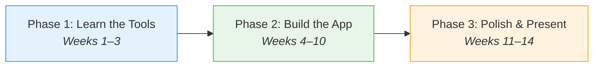
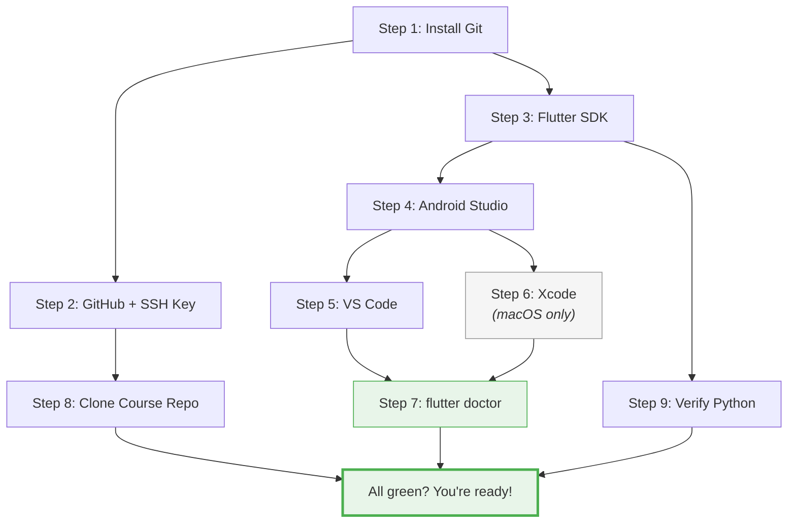

# Week 0 — Getting Ready

<div class="lab-meta" markdown>
<div class="lab-meta__row"><span class="lab-meta__label">Course</span> Mobile Apps for Healthcare</div>
<div class="lab-meta__row"><span class="lab-meta__label">Duration</span> ~2-3 hours (self-paced, at home)</div>
<div class="lab-meta__row"><span class="lab-meta__label">Prerequisites</span> Basic programming experience in any language</div>
</div>

<div class="grid cards" markdown>

- :material-target:{ .lg .middle } **Learning Objectives**

    ---

    By the end of this prep guide, you will be able to:

    - [ ] Assess your skill level against course prerequisites
    - [ ] Install and configure all required development tools
    - [ ] Verify your setup with `flutter doctor`
    - [ ] Understand the 14-week course structure and expectations

- :material-clock-outline:{ .lg .middle } **Time Estimate**

    ---

    | Section | Duration |
    |---------|----------|
    | Course overview | ~15 min |
    | Self-assessment & remediation | ~30 min – 6 hours |
    | Technical setup (Steps 1–9) | ~1–2 hours |
    | Verification & checklist | ~10 min |

</div>

!!! info "Read this before Week 1"
    This page is your starting point. It explains how the course works, helps you assess your skills, shows you exactly how to set up your tools, and tells you what to expect on day one. ==**Complete Steps 1–7 and 9 before the first lab session.**== Step 8 (cloning the course repo) can be done during Week 1 once the instructor shares the URL.

!!! abstract "TL;DR"
    Install Git, Flutter, Android Studio, and VS Code. Set up GitHub with SSH keys. Run `flutter doctor` until everything is green. Assess your programming skills — if you can write a Python class and navigate a terminal, you're ready.

!!! example "Think of it like... packing for a road trip"
    This prep guide is like **packing your car before a road trip** — you need the right gear (tools), a working GPS (GitHub), and enough fuel (prerequisite skills). Skipping this step means pulling over on day one to buy a map.

---

## How This Course Works

### The Big Picture

You will build a **real health-related mobile app** in a team of 3-4 students over 14 weeks. The first 3 weeks teach you individual skills (terminal, git, Dart). From Week 4, you form teams and start building.

~~This is a lecture-heavy theory course~~ — it's the opposite. You'll write code from day one, and the lectures *follow* the labs to clarify what you experienced hands-on.

### Lab Before Lecture

This course flips the traditional order: ==**lab comes first, lecture comes second**== each week. You'll wrestle with the material hands-on, then the lecture clarifies and deepens what you experienced. This is intentional — struggling first makes the explanations stick.

### Week-by-Week Roadmap

Here's the full journey so you know what's coming:

| Week | What You'll Do | What You'll Learn |
|------|---------------|-------------------|
| **0** | **You are here.** Set up tools, assess skills | — |
| **1** | Terminal exercises, first git commands | Command line, version control basics |
| **2** | Git branching, merge conflicts, API calls with curl | Collaborative git workflow, REST APIs |
| **3** | Dart programming exercises | Dart language: types, null safety, OOP, async |
| **4** | Build your first Flutter app + form teams | Widgets, StatelessWidget, StatefulWidget |
| **5** | Sprint planning workshop + verbal project pitch | User stories, agile workflow, state management preview |
| **6** | Team project skeleton + Riverpod state management lab | Centralized state, providers, reactive UI |
| **7** | **Sprint Review 1** — demo your progress | Local data storage, SQLite, offline-first |
| **8** | Connect your app to a backend API | HTTP, JSON serialization, GDPR |
| **9** | Add authentication to your app | JWT, OAuth2, secure storage, HIPAA |
| **10** | **Sprint Review 2** — demo your progress | Testing, CI, quality |
| **11** | Polish, animations, advanced features | Performance, animations, mHealth evidence |
| **12** | Final features, peer code review | Deployment, medical device regulations |
| **13** | **Sprint Review 3** — demo your progress | Technical debt, final polish |
| **14** | **Final presentation** (15 min per team) | Course wrap-up |

### Three Phases



| | Phase 1 | Phase 2 | Phase 3 |
|---|---------|---------|---------|
| **Work style** | Individual | Team project | Team project |
| **Focus** | Terminal, Git, Dart | Sprints 1 & 2 | Sprint 3, testing, polish |
| **Deliverables** | 3 graded assignments | 2 sprint reviews + proposal | 1 sprint review + final presentation |

> **Healthcare Context: Why Preparation Matters in mHealth Development**
>
> In real mHealth teams, a botched development environment wastes days, not hours:
> - **Regulatory audits** (IEC 62304, HIPAA) require that every developer's toolchain is documented and reproducible. A setup checklist like this one is a simplified version of an "environment qualification" document.
> - **Patient safety** starts with consistent builds. If your Flutter version differs from your teammate's, the app might behave differently on different machines — exactly the kind of inconsistency that causes bugs in medication dosing or vital-sign displays.
> - **Professional mHealth teams** at companies like Oura, Withings, and Apple Health spend their first sprint setting up CI/CD, linters, and shared toolchains. What you're doing now mirrors that process.

---

### Self-Check: Course Structure

Before continuing, make sure you understand:

- [ ] The course has three phases: individual skills, team project, and polish
- [ ] Labs come *before* lectures each week
- [ ] You will form teams in Week 4 and build a real mHealth app
- [ ] Sprint reviews happen in Weeks 7, 10, and 13

---

## What Happens in Week 1

So you know exactly what to expect on day one:

1. **Lab (first half):** You'll open a terminal, create directories, initialize a git repository, make commits, and push to GitHub. The lab workbook guides you step by step — no prior experience needed.
2. **Lecture (second half):** The instructor explains why version control matters, how professional teams work, and gives the course overview.

**What you need ready:** A working terminal, git installed, a GitHub account with SSH keys set up (see the setup checklist below).

~~You need Flutter experience to survive Week 1~~ — you don't. Week 1 is entirely terminal and git. Flutter doesn't appear until Week 4.

---

## Self-Assessment Checklist

Work through these three tiers honestly. Nobody expects you to check every box before day one — but knowing where you stand helps you prepare.

!!! example "Think of it like... a health check-up"
    This self-assessment is like a **pre-surgery health check** — the doctor doesn't expect you to be a triathlete, but they need to know your baseline so they can plan accordingly. Be honest; it helps *you*.

### Tier 1: Must-Have (prerequisite skills)

If you cannot answer "yes" to most of these, dedicate time before the course begins:

- [ ] **Can you write a Python class** with `__init__`, methods, and inheritance?
- [ ] **Do you understand what a function return type means?** (e.g., a function that returns an integer vs. one that returns nothing)
- [ ] **Can you open a terminal and navigate directories?** (`cd`, `ls`, `mkdir`, `pwd`)
- [ ] **Do you understand variables, loops, and conditionals** in at least one language?
- [ ] **Can you read and write simple data structures?** (lists, dictionaries/maps)

### Tier 2: Strongly Recommended

These topics come up from Week 3 onward. Prior exposure makes a big difference:

- [ ] **Have you used `async`/`await`** in any language? (Python, JavaScript, Dart, etc.)
- [ ] **Do you know what a generic type like `List<String>` means?**
- [ ] **Can you explain what an API endpoint is?** (e.g., `GET /api/patients` returns a list of patients)
- [ ] **Have you written code with error/exception handling?** (`try`/`catch` or equivalent)
- [ ] **Do you understand the difference between a class and an instance?**

### Tier 3: Helpful but Taught in the Course

Don't worry if these are new — we cover them explicitly:

- [ ] Have you used git before?
- [ ] Have you built a mobile app (any platform)?
- [ ] Do you know what Flutter or Dart is?
- [ ] Have you used a state management pattern (Provider, Redux, MobX, etc.)?
- [ ] Have you worked in an agile/scrum team?

**How to read your results:**

- **All Tier 1 checked:** You're ready. Tier 2 gaps will slow you down a bit in Week 3 but won't stop you.
- **Most Tier 1 checked, some gaps:** Spend a few hours on the remediation links below. You'll be fine.
- **Several Tier 1 unchecked:** Invest serious time (10-15 hours) before the semester. The course moves fast from Week 3.
- ==**Tier 3 all unchecked:** That's totally normal and expected. These are taught from scratch.==

!!! success "Checkpoint: Self-Assessment"
    You've identified your skill tier. If you're all-green on Tier 1, skip ahead
    to the [Technical Setup Checklist](#technical-setup-checklist). If you have
    gaps, the remediation section below has targeted resources for each skill.

---

## Skill Gap Remediation

For each Tier 1 and Tier 2 gap, here is **one recommended free resource**. You don't need to complete entire courses — focus on the specific skill you're missing.

??? protip "Pro tip"
    Don't try to learn everything. Pick the **one or two** Tier 1 skills you're weakest on and spend focused time there. Diminishing returns hit fast — 3 hours on your biggest gap beats 10 hours spread thin.

### Tier 1 Gaps

| Skill | Resource | Time |
|-------|----------|------|
| Function return types & signatures | [Real Python — Defining Your Own Python Function](https://realpython.com/defining-your-own-python-function/#argument-passing) | ~1 hour |
| Python OOP (classes, inheritance) | [Real Python — Object-Oriented Programming in Python](https://realpython.com/python3-object-oriented-programming/) | ~3 hours |
| Terminal / command line basics | [MDN — Command line crash course](https://developer.mozilla.org/en-US/docs/Learn_web_development/Getting_started/Environment_setup/Command_line) | ~2 hours |
| Variables, loops, conditionals | [Codecademy — Learn Python 3 (free tier)](https://www.codecademy.com/learn/learn-python-3) | ~4 hours |
| Data structures (lists, maps) | [Real Python — Lists and Tuples](https://realpython.com/python-lists-tuples/) + [Dictionaries](https://realpython.com/python-dicts/) | ~1 hour |

### Tier 2 Gaps

| Skill | Resource | Time |
|-------|----------|------|
| Async / `await` | [Real Python — Async IO in Python](https://realpython.com/async-io-python/) (concepts transfer to Dart) | ~2 hours |
| Generic types (`List<String>`) | [Oracle — Why Use Generics?](https://docs.oracle.com/javase/tutorial/java/generics/why.html) (concept applies to Dart) | ~1 hour |
| REST APIs | [freeCodeCamp — What is a REST API?](https://www.freecodecamp.org/news/what-is-a-rest-api/) | ~1 hour |
| Exception handling | [Real Python — Python Exceptions](https://realpython.com/python-exceptions/) | ~30 min |
| Classes vs instances | Covered in the Python OOP link above | — |

!!! tip "Time investment"
    If you have all Tier 1 skills, you're ready. Filling 2-3 Tier 2 gaps takes roughly **4-6 hours** of self-study. That investment pays off massively from Week 3 onward.

---

## What the Course Teaches (Don't Pre-Study)

These topics are covered step-by-step in the course. Pre-studying them is unnecessary and may cause confusion if you learn a different approach:

- **Git & GitHub** — Week 1 starts from zero with terminal and git
- **Dart programming language** — Week 3 teaches Dart from scratch (assuming you know OOP basics)
- **Flutter framework** — Weeks 4+ introduce Flutter progressively
- **Riverpod / state management** — Weeks 5-6 introduce this with guided exercises
- **REST API integration** — Week 8 covers this with hands-on labs
- **Project management / Scrum** — Week 5 teaches sprint planning as a workshop

~~You should watch Flutter tutorials on YouTube before the course~~ — don't. The course introduces Flutter with a specific progression. Jumping ahead often means learning patterns we deliberately avoid (like `setState()` for shared state).

If you already know some of these, great — you'll move faster through those weeks and can help your teammates.

---

## For CMS / Web Developers

If your background is in content management systems (WordPress, Strapi, headless CMS) or web development, here's what transfers and what's new.

### What Transfers Directly

| You Already Know | Course Equivalent |
|-----------------|-------------------|
| Templates / components | Flutter widgets (same idea — composable UI pieces) |
| REST API calls from a frontend | API integration in Week 8 (same concept, different syntax) |
| JSON data structures | Dart models and serialization |
| Admin panels / CRUD interfaces | Building screens with forms, lists, and detail views |
| Deployment workflows | CI/CD concepts (git-based, similar to Netlify/Vercel) |

### What's New

| New Concept | Why It Matters |
|-------------|---------------|
| **Strongly typed language (Dart)** | Unlike PHP/JavaScript, Dart requires explicit types. This catches bugs early but feels strict at first. |
| **Compiled mobile app** | Unlike a web page, your app compiles to native code. Changes require rebuilding (though Flutter's hot reload is fast). |
| **State management** | In a CMS, the server holds the state. In a mobile app, you manage state locally on the device. This is the biggest conceptual shift. |
| **Offline-first thinking** | Mobile apps must work without internet. CMS apps usually assume connectivity. |
| **Object-oriented architecture** | The course uses OOP patterns extensively. If you mainly write procedural PHP or JS, review the OOP section above. |

!!! note "You belong here"
    Non-traditional backgrounds bring valuable perspective — especially in mHealth, where understanding end-users matters as much as writing code. Your experience with content architecture, user flows, and API integration is directly applicable.

---

## Technical Setup Checklist

Complete **all** of this before the first lab session to avoid losing time on installation issues.

!!! warning "Disk space required"
    The Flutter SDK (~1.5 GB), Android Studio (~1 GB), and Android SDK + emulator images (~5-7 GB) require about **10 GB** of free disk space. macOS users who also install Xcode need an additional ~12 GB (**~22 GB total**). Make sure you have enough space before starting.

!!! info "Terminal note"
    All commands in this course use **bash** syntax. On **macOS** and **Linux**, use the built-in Terminal app. On **Windows**, use **Git Bash** (installed automatically with Git for Windows). Most commands are identical across all three operating systems — we use tabs only where they genuinely differ.

Here's an overview of the setup steps and how they connect:



### Step 1: Install Git

=== "macOS"

    ```bash
    xcode-select --install
    ```
    This installs git along with the Xcode Command Line Tools.

=== "Linux"

    ```bash
    # Ubuntu / Debian
    sudo apt install git

    # Fedora
    sudo dnf install git
    ```

=== "Windows"

    Download and install [Git for Windows](https://git-scm.com/download/win). This also installs **Git Bash**, which you will use as your terminal throughout the course.

Verify:
```bash
git --version
```

Configure your identity:
```bash
git config --global user.name "Your Name"
git config --global user.email "your.email@student.agh.edu.pl"
```

!!! success "Checkpoint: Git"
    Run `git --version` — you should see a version number (e.g., `git version 2.44.0`).
    If you see `command not found`, revisit the installation step for your OS.

### Step 2: Create a GitHub Account and SSH Key

1. **Sign up** at [github.com/join](https://github.com/join) (if you don't have an account)
2. **Set up SSH key** — follow the [GitHub SSH setup guide](https://docs.github.com/en/authentication/connecting-to-github-with-ssh)
3. **Verify** the connection:
   ```bash
   ssh -T git@github.com
   ```
   You should see: `Hi username! You've successfully authenticated...`

!!! warning "Why SSH matters"
    Without SSH keys, you'll be asked for a username and password on every git push. The Week 1 lab assumes SSH is configured. **Do this now.**

!!! warning "Common mistake"
    Copying the SSH key with extra spaces or newlines. Use `pbcopy < ~/.ssh/id_ed25519.pub` (macOS) or `clip < ~/.ssh/id_ed25519.pub` (Windows Git Bash) to copy the key cleanly. If `ssh -T git@github.com` returns `Permission denied`, the key wasn't added correctly.

!!! success "Checkpoint: GitHub + SSH"
    Run `ssh -T git@github.com` — you should see `Hi <username>! You've successfully authenticated`.
    If you see `Permission denied (publickey)`, re-do the SSH key setup.

### Step 3: Install Flutter SDK

Follow the official guide for your platform: [Install Flutter](https://docs.flutter.dev/get-started/install)

After installation, run:
```bash
flutter doctor
```

Resolve any issues it reports. Target: all checks pass (minor warnings for platforms you won't use are fine).

??? protip "Pro tip"
    Add Flutter to your shell PATH permanently. If you only set it for one terminal session, you'll have to re-export it every time. Add the `export PATH` line to your `~/.zshrc` (macOS) or `~/.bashrc` (Linux) so it's always available.

### Step 4: Install Android Studio

Download from [developer.android.com/studio](https://developer.android.com/studio).

Even if you prefer VS Code as your editor, you need Android Studio because it provides:
- The Android SDK
- The Android emulator (AVD Manager)

**Set up an emulator:**

1. Open Android Studio → More Actions → Virtual Device Manager
2. Create a new device (e.g., Pixel 7, API 34)
3. Launch it once to verify it works

!!! warning "Common mistake"
    Skipping the emulator setup. You *will* need an emulator from Week 4 onward, and downloading the system image (~1 GB) during class wastes lab time. Set it up now and verify it boots.

### Step 5: Install VS Code (Recommended IDE)

Download from [code.visualstudio.com](https://code.visualstudio.com/).

Install these extensions (search in the Extensions panel):

- **Flutter** (by Dart Code) — includes the Dart extension automatically
- **Dart** (if not auto-installed)

??? challenge "Stretch Goal: Power-user VS Code setup"
    Install these optional extensions for a smoother workflow in later weeks:

    - **GitLens** — enhanced git blame, history, and diff inline
    - **Error Lens** — shows errors and warnings inline next to the code
    - **Material Icon Theme** — better file icons for Flutter projects
    - **Pubspec Assist** — search and add Dart packages without leaving the editor

### Step 6: macOS Only — Install Xcode

!!! note "Windows and Linux users"
    Skip this step. iOS development requires macOS. You will use the Android emulator instead, which works on all platforms.

If you're on macOS and want to test on iOS:

1. Install Xcode from the Mac App Store
2. Open Xcode once to accept the license agreement
3. Point the command-line tools to the full Xcode installation:
   ```bash
   sudo xcode-select --switch /Applications/Xcode.app/Contents/Developer
   ```
4. Open the iOS Simulator: `open -a Simulator`

### Step 7: Final Verification

Run this command to confirm Flutter is set up correctly:

```bash
flutter doctor
```

You should see output similar to:

```
Doctor summary (to see all details, run flutter doctor -v):
[✓] Flutter (Channel stable, 3.x.x)
[✓] Android toolchain
[✓] Xcode (or [!] if not on macOS — that's fine)
[✓] Chrome
[✓] Android Studio
[✓] VS Code
[✓] Connected device (or set up an emulator)
```

!!! warning "Don't skip this"
    Every semester, students lose 30-60 minutes of the first lab session debugging installation issues. Doing this at home means you can start coding from minute one.

!!! success "Checkpoint: Flutter Doctor"
    All checks show `[✓]` (or only minor warnings for platforms you don't need).
    If you have `[✗]` errors, check the troubleshooting section below before asking
    for help.

### Step 8: Clone the Course Materials Repository

All lab exercises, starter projects, and templates are distributed through a single **course repository** on GitHub. Clone it now so you have everything ready:

```bash
cd ~
git clone <course-repo-url> mhealth-course-materials
```

!!! note "Repository URL"
    The instructor will share the course repository URL on the first day of class (or via the course page). If you don't have it yet, you can do this step during Week 1.

Once cloned, the repository contains:

```
mhealth-course-materials/
├── week-01-terminal-git/          # Week 1 exercises
├── week-02-git-apis-curl/         # Week 2 exercises + FastAPI starter
├── week-03-dart-fundamentals/     # Week 3 Dart exercises + assignment template
├── week-04-flutter-fundamentals/  # Week 4 Flutter exercise projects
├── week-05-layouts-forms-sprints/ # Week 5 sprint planning workshop
├── week-06-state-management/      # Week 6 lab + starter project
├── week-07-local-data/            # Week 7 lab + starter project
├── week-08-networking-api/        # Week 8 lab + starter project
├── week-09-authentication/        # Week 9 lab + starter project
├── mood-tracker-api/              # FastAPI reference backend (used in Weeks 8-9)
├── templates/                     # Proposal template, rubrics, forms
└── resources/                     # AI policy, accessibility guide, regulations
```

Each week's lab instructions will tell you exactly which files to use. You do **not** need to read ahead — just make sure the repository is cloned.

### Step 9: Verify Python (needed for Week 2)

Week 2 uses Python to build a simple API with FastAPI. Verify that Python is installed:

```bash
python3 --version
```

You should see `Python 3.8` or higher. If not:

=== "macOS"

    Python 3 comes pre-installed on recent macOS versions. If missing, install via Homebrew: `brew install python3`.

=== "Linux"

    ```bash
    sudo apt install python3 python3-venv python3-pip
    ```

=== "Windows"

    Download from [python.org](https://www.python.org/downloads/). During installation, check **"Add Python to PATH"**.

---

### Self-Check: Technical Setup

Before continuing, verify every tool:

- [ ] `git --version` prints a version number
- [ ] `ssh -T git@github.com` prints `Hi <username>!`
- [ ] `flutter doctor` shows all green checks (or only platform-irrelevant warnings)
- [ ] Android emulator launches and boots to the home screen
- [ ] VS Code opens and the Flutter extension is installed
- [ ] `python3 --version` prints a version number

---

### Common `flutter doctor` Issues

If `flutter doctor` reports problems, check these common fixes before asking for help:

??? question "Android SDK licenses not accepted"
    Run `flutter doctor --android-licenses` and accept all licenses by typing `y` at each prompt.

??? question "Android SDK not found / `ANDROID_HOME` not set"
    Open Android Studio → Settings → Appearance & Behavior → System Settings → Android SDK. Note the SDK location. Then add it to your shell profile:

    === "macOS / Linux"

        Add to `~/.zshrc` or `~/.bashrc`:
        ```bash
        export ANDROID_HOME=$HOME/Library/Android/sdk   # macOS
        # export ANDROID_HOME=$HOME/Android/Sdk         # Linux
        export PATH=$ANDROID_HOME/platform-tools:$PATH
        ```
        Then run `source ~/.zshrc` (or `~/.bashrc`).

    === "Windows"

        Add `ANDROID_HOME` as a system environment variable pointing to `C:\Users\YourName\AppData\Local\Android\Sdk`. Add `%ANDROID_HOME%\platform-tools` to your PATH.

??? question "Xcode command line tools not installed (macOS)"
    Run `sudo xcode-select --install`. If Xcode is installed but the CLI tools are not detected, run `sudo xcode-select --switch /Applications/Xcode.app/Contents/Developer`.

??? question "No connected devices"
    Make sure your Android emulator is running (launch from Android Studio → AVD Manager) or your physical device has USB debugging enabled. Run `flutter devices` to see what Flutter detects.

??? question "`flutter` command not found"
    The Flutter SDK is not on your PATH. Follow the [official PATH setup instructions](https://docs.flutter.dev/get-started/install) for your platform.

---

## Frequently Asked Questions

??? question "I've never used a terminal. Will I survive Week 1?"
    Yes. The Week 1 lab starts from `cd` and `ls`. It assumes zero terminal experience and walks you through every command. The only prerequisite is having a terminal open and git installed (see setup above).

??? question "I only know Python. Is that enough?"
    Python gives you everything you need for Tier 1. The course teaches Dart from scratch in Week 3 — if you understand Python OOP (classes, methods, inheritance), you'll pick up Dart quickly because the concepts are the same.

??? question "I'm a biomedical engineering student, not a CS student. Is this course too hard?"
    This course is designed for BME students. The instructor knows you're not computer scientists. Weeks 1-3 build your foundation step by step. The project work (Weeks 4-14) is done in teams, so you can lean on teammates with different strengths. The key is doing the Week 0 preparation and not falling behind in Weeks 1-3.

??? question "Do I need a Mac for this course?"
    No. Flutter works on macOS, Windows, and Linux. The only thing you can't do without a Mac is test on iOS. Android development works on all platforms, and that's sufficient for the course.

??? question "How much time should I expect to spend outside class?"
    Weeks 1-3: about **2-3 hours/week** on individual assignments. Weeks 4-14: about **4-6 hours/week** on team project work, depending on your role and sprint goals. Teams that communicate well and plan realistically spend less time than teams that don't.

??? question "What if I'm already experienced with Flutter/mobile dev?"
    Great — you'll move faster through the early weeks and can help your teammates. The course still offers value through the mHealth domain knowledge, project management skills, and the experience of building a real app in a team.

??? question "I come from a web/CMS background (WordPress, Strapi, etc.). Is that relevant?"
    Very much so. See the "For CMS / Web Developers" section above. Your experience with APIs, content structure, and user flows transfers directly. The main new things are the typed language (Dart) and managing state on the device instead of the server.

---

## Your Checklist — Complete Before Week 1

Print this or keep it open. Check off each item:

- [ ] Read the course roadmap above — I understand the three phases
- [ ] Completed the self-assessment — I know which tier I'm at
- [ ] Addressed Tier 1 skill gaps (if any) using the remediation links
- [ ] **Git** installed and configured (`git --version` works)
- [ ] **GitHub account** created with SSH key set up (`ssh -T git@github.com` works)
- [ ] **Python 3** installed (`python3 --version` works) — needed for Week 2
- [ ] **Flutter SDK** installed (`flutter doctor` passes)
- [ ] **Android Studio** installed with at least one emulator configured
- [ ] **VS Code** installed with Flutter and Dart extensions
- [ ] **Xcode** installed (macOS only, optional)
- [ ] **Course materials repository** cloned (or URL bookmarked for Week 1)
- [ ] `flutter doctor` shows all green checks (or only platform warnings I can ignore)

**All done?** You're ready for Week 1. See you in the lab.

---

## Quick Quiz

<quiz>
What is the recommended order of each weekly session?

- [ ] Lecture first, then lab
- [x] Lab first, then lecture
- [ ] Lecture only, no lab
- [ ] Lab only, no lecture
</quiz>

<quiz>
Which tier of the self-assessment covers skills taught from scratch in the course?

- [ ] Tier 1 — Must-Have
- [ ] Tier 2 — Strongly Recommended
- [x] Tier 3 — Helpful but Taught in the Course
- [ ] All tiers are prerequisites
</quiz>

<quiz>
What is the most critical command to run after completing the technical setup?

- [ ] `git status`
- [ ] `python3 --version`
- [x] `flutter doctor`
- [ ] `ssh -T git@github.com`
</quiz>

<quiz>
When do you form teams and start building the project?

- [ ] Week 1
- [ ] Week 3
- [x] Week 4
- [ ] Week 6
</quiz>

---

!!! question "End-of-Prep Reflection"
    Take 2 minutes to reflect before you close this page:

    1. **What is your biggest concern about this course?** Is it the tools, the programming, the teamwork, or something else?
    2. **What is your strongest skill going in?** How might you use it to help your future teammates?
    3. **What is one thing you will do this week to prepare?** (Fill a Tier 1 gap, install Flutter, set up SSH keys?)

    Write your answers somewhere you can revisit in Week 7 — you'll be surprised how far you've come.

---

## Questions?

If you have setup issues before the course starts, open a GitHub Issue in the course repository or email the instructor. We'd rather help you before Week 1 than during it.
