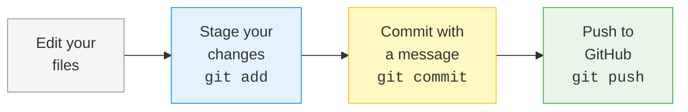

# Week 1 Cheatsheet: Terminal, Git & GitHub

## :material-console: Terminal Commands

| Command | Purpose | Example |
|---------|---------|---------|
| `pwd` | Print current directory | `pwd` |
| `ls` | List files | `ls -la` |
| `cd <path>` | Change directory | `cd ~/Documents` |
| `cd ..` | Go up one level | `cd ..` |
| `cd ~` | Go to home | `cd ~` |
| `mkdir` | Create folder | `mkdir -p a/b/c` |
| `touch` | Create empty file | `touch notes.txt` |
| `cat` | View file contents | `cat notes.txt` |
| `echo "x" > f` | Write to file | `echo "hi" > file.txt` |
| `echo "x" >> f` | Append to file | `echo "more" >> file.txt` |
| `rm` | Delete file | `rm old.txt` |
| `rm -r` | Delete folder | `rm -r old-folder/` |
| `which` | Find a command | `which git` |

---

## :material-git: Git Commands

| Command | Purpose |
|---------|---------|
| `git init` | Create new repo |
| `git status` | Show changes |
| `git add <file>` | Stage for commit |
| `git add .` | Stage all changes |
| `git commit -m "msg"` | Save snapshot |
| `git log --oneline` | View history |
| `git diff` | Show unstaged changes |
| `git remote add origin <url>` | Link to GitHub |
| `git push -u origin main` | Push (first time) |
| `git push` | Push (after first) |
| `git clone <url>` | Download repo |

---

## :material-key: SSH Setup (One-Time)

```bash
# 1. Generate key
ssh-keygen -t ed25519 -C "you@email.com"

# 2. Copy public key
cat ~/.ssh/id_ed25519.pub

# 3. Add to GitHub → Settings → SSH Keys

# 4. Test connection
ssh -T git@github.com
```

**Remember:** Never share `id_ed25519` (private). Only share `id_ed25519.pub` (public).

---

## :material-keyboard: Key Shortcuts

| Key | Action |
|-----|--------|
| ++tab++ | Autocomplete file/folder names |
| ++ctrl+c++ | Cancel / kill running command |
| ++ctrl+l++ | Clear terminal screen |
| ++up++ | Previous command |
| ++cmd+space++ | Spotlight search (macOS) |
| ++ctrl+alt+t++ | Open terminal (Linux) |

---

## The Git Workflow



---

## Git's Three Areas

| Area | What it is | Analogy |
|------|-----------|---------|
| Working Directory | Files you see and edit | Your room |
| Staging Area | Changes queued for next commit | Packed shipping box |
| Repository (.git) | Permanent history | Sealed boxes on shelf |

---

## Good Commit Messages

| Do | Don't |
|----|-------|
| `Add patient data model` | `asdf` |
| `Fix temperature conversion` | `changes` |
| `Update README with setup steps` | `commit 3` |
| Start with a verb (Add, Fix, Update, Remove) | Use vague words |
