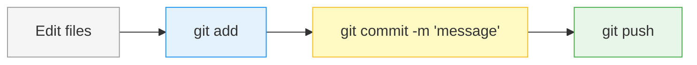
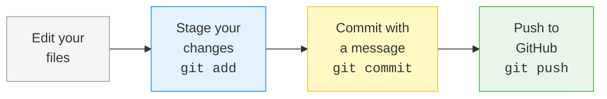

# Week 1 Lab: Terminal, Git & GitHub

<div class="lab-meta" markdown>
<div class="lab-meta__row"><span class="lab-meta__label">Course</span> Mobile Apps for Healthcare</div>
<div class="lab-meta__row"><span class="lab-meta__label">Duration</span> 90 min in-class + ~30 min at home</div>
<div class="lab-meta__row"><span class="lab-meta__label">Prerequisites</span> Basic programming experience (Python, C/C++, or similar). No terminal or git knowledge required.</div>
</div>

<div class="grid cards" markdown>

- :material-target:{ .lg .middle } **Learning Objectives**

    ---

    By the end of this lab, you will be able to:

    - [ ] Navigate your file system using the terminal (`pwd`, `ls`, `cd`)
    - [ ] Create and manage files and folders from the command line
    - [ ] Initialize a Git repository and track changes with `add` → `commit` → `push`
    - [ ] Set up SSH keys and connect securely to GitHub
    - [ ] Push a local repository to GitHub so others can see your work

- :material-clock-outline:{ .lg .middle } **Time Estimate**

    ---

    | Section | Duration | Priority |
    |---------|----------|----------|
    | Part 1: Terminal basics | ~25 min | Core |
    | Part 2: Git basics | ~35 min | Core |
    | Part 3: GitHub & SSH setup | ~20 min | Core |
    | Part 4: Push to GitHub & clone | ~10 min | Core |
    | Self-checks & reflection | at home | Review |

</div>

!!! warning "No AI tools in Weeks 1–3"
    AI tools (ChatGPT, Copilot, etc.) are **not allowed** in Weeks 1–3. The goal is to build genuine understanding of these foundational tools. You will rely on AI-assisted workflows later in the course — but first, learn the basics yourself.

!!! info "Terminal note"
    All commands in this course use **bash** syntax. On **macOS** and **Linux**, use the built-in Terminal app. On **Windows**, use **Git Bash** (installed with Git for Windows). Most commands — including all `git`, `cd`, `mkdir`, `ls`, and `cat` commands — work identically across all three.

!!! example "Healthcare context"
    In medical software development, version control isn't just good practice — it's a **regulatory requirement**. Standards like IEC 62304 (medical device software) mandate that every change to source code is tracked, reviewed, and traceable. The Git skills you learn today are directly applicable to building software that meets these standards. By Week 8, you will be pushing API code that handles patient mood data — and your Git history will be the audit trail proving every change was intentional.

---

## Before You Start

You will need:

- A computer with macOS, Windows, or Linux
- Git installed ([git-scm.com/downloads](https://git-scm.com/downloads))
- An internet connection
- About 90 minutes of in-class time (self-checks and reflection are for home)

**Which terminal should I open?**

| Operating System | What to open |
|---|---|
| **macOS** | Open **Terminal** (press ++cmd+space++, type "Terminal", hit ++enter++) |
| **Windows** | Install and open **Git Bash** (download from [git-scm.com](https://git-scm.com/downloads)). Alternatively, use **Windows PowerShell**, but note that some commands differ. This guide uses Git Bash / Unix-style commands. |
| **Linux** | Open your default **Terminal** emulator (usually ++ctrl+alt+t++) |

Once your terminal is open, you should see a blinking cursor waiting for input. It might look something like this:

```
username@computer ~ %
```

or

```
username@computer:~$
```

This is called the **prompt**. It means the terminal is ready for you to type a command. Do not be intimidated by it --- it is just a different way to talk to your computer.

**Verify Git is installed** by typing:

```bash
git --version
```

You should see something like `git version 2.43.0`. If you get "command not found", install Git from [git-scm.com](https://git-scm.com/downloads), restart your terminal, and try again.

---

## Part 1: Terminal Basics (~25 min)

<span class="progress-breadcrumb">:material-circle-outline: Part 1 · :material-circle-outline: Part 2 · :material-circle-outline: Part 3 · :material-circle-outline: Part 4 — **You're starting. 4 parts to go.**</span>

!!! abstract "TL;DR"
    Learn the 10 terminal commands that replace clicking through Finder/Explorer.

~~You need to memorize every terminal command~~ — you don't. The cheatsheet exists. What matters is knowing *when* to use each one.

### 1.1 Where Am I? --- `pwd`

The first thing to know: your terminal is always "standing" in some folder (directory) on your computer. To find out where you are, type:

```bash
pwd
```

Press **Enter**. You should see something like:

```
/Users/yourname
```

(on macOS/Linux) or:

```
/c/Users/yourname
```

(on Windows with Git Bash).

This is your **home directory** --- think of it as your starting location.

### 1.2 What Is Here? --- `ls`

To see what files and folders exist in your current location:

```bash
ls
```

Expected output (yours will differ):

```
Desktop    Documents  Downloads  Music  Pictures
```

Want more detail? Try:

```bash
ls -la
```

This shows **all** files (including hidden ones that start with `.`) and extra information like file sizes and dates.

> **Windows PowerShell note:** Use `dir` instead of `ls`. In Git Bash, `ls` works normally.

### 1.3 Moving Around --- `cd`

`cd` stands for "change directory." It moves you into a different folder.

```bash
cd Desktop
```

Now check where you are:

```bash
pwd
```

Expected output:

```
/Users/yourname/Desktop
```

To go **back up** one level (to the parent folder):

```bash
cd ..
```

To go directly to your home directory from anywhere:

```bash
cd ~
```

To go to an **absolute path** (a full path starting from the root):

```bash
cd /Users/yourname/Documents
```

??? protip "Pro tip"
    Press ++tab++ to autocomplete folder and file names. Start typing a name and press ++tab++ --- the terminal will finish it for you. This saves time and prevents typos. If multiple matches exist, press ++tab++ twice to see all options.

!!! warning "Common mistake"
    Typing `cd` with a folder name that does not exist. You will see:
    ```
    bash: cd: NoSuchFolder: No such file or directory
    ```
    This just means you misspelled the name or the folder is not in your current location. Use `ls` to check what folders are available.

<quiz>
You ran `cd ..` followed by `pwd`. What happened to your path?

- [ ] The path got longer — a new folder was added at the end
- [x] The path got shorter — you moved one folder up toward the root
- [ ] The path stayed the same — `cd ..` does nothing

---

**Checkpoint complete!** You just navigated a file system the way every professional developer does — without clicking a single folder icon. In healthcare software teams, engineers work on remote Linux servers (which have no graphical interface at all) to manage patient data pipelines and deploy applications. The terminal is the *only* way to interact with those machines.
</quiz>

### 1.4 Creating Folders --- `mkdir`

Let us create a workspace for this course. Go to your home directory first:

```bash
cd ~
```

Now create a folder:

```bash
mkdir mhealth-course
```

Verify it was created:

```bash
ls
```

You should see `mhealth-course` in the list. Now move into it:

```bash
cd mhealth-course
```

You can create nested folders in one command with the `-p` flag:

```bash
mkdir -p week-01/exercises
```

This creates `week-01` and `exercises` inside it, even if `week-01` did not exist yet.

### 1.5 Creating and Viewing Files --- `cat`, `touch`

Move into the exercises folder:

```bash
cd week-01/exercises
```

Create an empty file:

```bash
touch notes.txt
```

Verify it exists:

```bash
ls
```

```
notes.txt
```

Now let us put some text in it. We will use a simple redirect:

```bash
echo "Hello, this is my first terminal-created file!" > notes.txt
```

View the contents of the file:

```bash
cat notes.txt
```

Expected output:

```
Hello, this is my first terminal-created file!
```

To **append** text to a file (without overwriting), use `>>`:

```bash
echo "This is a second line." >> notes.txt
cat notes.txt
```

Expected output:

```
Hello, this is my first terminal-created file!
This is a second line.
```

!!! warning "Common mistake"
    Using `>` when you meant `>>`. ==A single `>` **overwrites** the entire file. Double `>>` **appends**.== Be careful — there is no undo for overwriting!

<quiz>
What is the difference between `>` and `>>`?

- [ ] `>` appends to a file, `>>` overwrites it
- [x] `>` overwrites the entire file, `>>` appends to the end
- [ ] They do the same thing — both write text to a file

---

**This will bite you if you get it wrong!** Running `echo "new data" > patient-records.csv` would destroy the entire file and replace it with one line. Using `>>` adds to the end safely. In data processing pipelines for clinical trials, this distinction has literally caused data loss. You will use both operators throughout this course — know which one you need.
</quiz>

### 1.6 Deleting Files and Folders --- `rm`

Remove a file:

```bash
rm notes.txt
```

Verify it is gone:

```bash
ls
```

To remove an **empty** folder:

```bash
rmdir foldername
```

To remove a folder **and everything inside it**:

```bash
rm -r foldername
```

Try it now — create a temporary folder, then delete it:

```bash
mkdir ~/mhealth-course/temp-folder
ls -d ~/mhealth-course/temp-folder    # prints the path — it exists
rm -r ~/mhealth-course/temp-folder
ls -d ~/mhealth-course/temp-folder    # "No such file or directory"
```

The folder is gone. No trash, no undo — just gone.

!!! warning "Common mistake"
    `rm` does NOT move files to the Trash. ==They are permanently deleted. There is no undo.== Always double-check before running `rm -r`.

??? question "Try to break it"
    Intentionally misspell a folder name in a `cd` command. What error do you get? Now try `ls` to see the correct name and fix your command. Reading error messages is a skill — the terminal is trying to help you.

### 1.7 Finding Programs --- `which`

When you type a command like `python` or `git`, how does the terminal know where that program lives on your computer? It searches through a list of directories called the **PATH**.

To see where a specific command lives:

```bash
which git
```

Expected output (example):

```
/usr/bin/git
```

If the command is not installed, you will see no output (or an error message).

Try these:

```bash
which python3
which ls
```

---

??? info "How does this actually work? — What happens when you type a command"
    When you type `git` and press Enter, your terminal does NOT magically know what to do.
    Here is what actually happens, step by step:

    ```mermaid
    graph TD
        A["You type: git status"] --> B["Shell reads command<br/>program = 'git'<br/>args = 'status'"]
        B --> C["Shell searches the PATH"]
        C --> D["/usr/local/bin — not here"]
        C --> E["/usr/bin — found! /usr/bin/git"]
        E --> F["Shell runs /usr/bin/git<br/>with argument 'status'"]
        F --> G["Git does its work and<br/>prints result to screen"]
        style E fill:#e8f5e9,stroke:#4caf50
        style G fill:#e3f2fd,stroke:#2196f3
    ```

    **The PATH** is a list of folders that your shell checks, one by one, when you type a command.
    If none of the folders contain a program with that name, you get **"command not found."**

    You do not need to memorize this. Just remember: if a command is "not found," it either is not
    installed, or its location is not in your PATH.

---

### 1.8 Exercise: Build a Project Structure

Now practice on your own. Starting from your home directory, do the following:

1. Navigate to `~/mhealth-course`
2. Create the following folder structure:

```
mhealth-course/
  week-01/
    exercises/     (already exists)
    notes/
  week-02/
    exercises/
    notes/
```

3. Inside `week-01/notes/`, create a file called `terminal-commands.txt` and write at least 5 commands you learned today (one per line)
4. Use `cat` to display its contents
5. Navigate back to `~/mhealth-course` and use `ls -R` to see the full tree

Expected output from `ls -R`:

```
.:
week-01  week-02

./week-01:
exercises  notes

./week-01/exercises:

./week-01/notes:
terminal-commands.txt

./week-02:
exercises  notes

./week-02/exercises:

./week-02/notes:
```

> **Tip:** If you make a mistake, do not panic. You can always remove what you created with `rm` or `rm -r` and start over.

!!! tip "Pair moment"
    Compare your folder structure with a neighbor. Did you both get the same `ls -R` output? If not, help each other figure out what's different.

---

### Self-Check: Terminal Basics

Before moving on, make sure you can answer these:

- [ ] What command shows your current directory?
- [ ] What is the difference between `>` and `>>`?
- [ ] How do you create a folder and all its parent folders in one command?
- [ ] Why is `rm` dangerous compared to dragging a file to the Trash?
- [ ] What does the ++tab++ key do in the terminal?

<quiz>
You just built a folder structure with `mkdir -p`. What does the `-p` flag do?

- [ ] It makes the folder read-only (protected)
- [ ] It prints the folder path after creation
- [x] It creates parent directories as needed — the entire path in one command
- [ ] It prompts you for confirmation before creating

---

**Part 1 complete — you have a new superpower!** The 10 commands you just learned (`pwd`, `ls`, `cd`, `mkdir`, `touch`, `cat`, `echo`, `rm`, `which`, and `ls -la`) are the same commands used daily by engineers at companies like EY, Google Health, Siemens Healthineers, and every hospital IT department. Medtech startups list "comfortable with the command line" in nearly every job posting — you now qualify.
</quiz>

!!! success "Checkpoint: Part 1 complete"
    You can navigate your file system, create files and folders, and use
    10 essential terminal commands. These are the same tools every developer
    uses daily — you'll rely on them for the rest of the course.

---

## Part 2: Git Basics (~35 min)

<span class="progress-breadcrumb">:material-check-circle: Part 1 · :material-circle-outline: Part 2 · :material-circle-outline: Part 3 · :material-circle-outline: Part 4 — **Part 1 done — you have terminal skills. 3 parts to go.**</span>

!!! abstract "TL;DR"
    Initialize a repository, make commits, and read your project's history. The core workflow is just three commands: `git add` → `git commit` → `git push`.

~~Git is only for professional developers~~ — it's not. Researchers, writers, and data scientists all use Git. Anyone who works with files that change over time benefits from version control.

### 2.1 What Is Git?

Git is a **version control system** --- it tracks every change you make to your files and lets you go back to any previous version. Think of it as an "unlimited undo" for your entire project, with the ability to see exactly what changed, when, and why.

### 2.2 Configuring Git (One-Time Setup)

Before using git for the first time, tell it who you are. Run these two commands, replacing the placeholder values with your actual name and email:

```bash
git config --global user.name "Your Full Name"
git config --global user.email "your.email@student.agh.edu.pl"
```

These will be attached to every commit you make. You only need to do this once per computer.

You can verify your settings:

```bash
git config --global user.name
git config --global user.email
```

### 2.3 Creating a Repository --- `git init`

!!! warning "Common mistake"
    Always `cd` into your project directory before running `git` commands.
    Running `git init` or `git status` in the wrong folder is one of the
    most common beginner mistakes — and it can be confusing to debug.

Navigate to your course folder and create a new project:

```bash
cd ~/mhealth-course
mkdir my-first-repo
cd my-first-repo
```

Now initialize a git repository:

```bash
git init
```

Expected output:

```
Initialized empty Git repository in /Users/yourname/mhealth-course/my-first-repo/.git/
```

This creates a hidden `.git` folder that stores all version history. You can verify:

```bash
ls -la
```

You will see a `.git` directory listed. ==**Never manually edit or delete the `.git` folder**== --- it contains your entire project history.

??? info "How does this actually work? — What's inside .git?"
    When you run `git init`, Git creates a hidden `.git` directory. This is where **all** of
    Git's data lives. Your project folder looks the same, but now it has a hidden brain:

    ```
    my-first-repo/
    ├── .git/                  <-- Git's brain (hidden)
    │   ├── objects/           <-- All your file contents and commits (stored efficiently)
    │   ├── refs/              <-- Pointers to commits (branches, tags)
    │   ├── HEAD               <-- Points to your current branch
    │   ├── config             <-- Repository-specific settings
    │   └── ...                <-- Other internal files
    └── (your project files)   <-- The files you actually work with
    ```

    **Key insight:** Git does not store your files somewhere else. Your files stay exactly where
    they are. The `.git` folder just keeps track of every version of every file you tell it to
    track. When you delete `.git`, you lose all history but keep your current files.

### 2.4 Checking the State --- `git status`

This is the command you will use most often. It tells you what has changed since your last commit:

```bash
git status
```

Expected output:

```
On branch main
No commits yet
nothing to commit (create/copy files and use "git add" to track)
```

> **Note:** If you see `master` instead of `main`, that is fine. Both are just names for the default branch. To set `main` as the default for future repositories, run:
> ```bash
> git config --global init.defaultBranch main
> ```

??? question "Try to break it"
    Run `git status` in a folder that is NOT a git repository (try `cd /tmp && git status`). What error do you get? This is one of the most common beginner mistakes — now you'll recognize it instantly. Navigate back with `cd ~/mhealth-course/my-first-repo`.

<quiz>
You ran `git status` inside your new repository. What did Git tell you?

- [ ] A list of all files on your computer
- [x] "No commits yet" and "nothing to commit" — the repo is empty and clean
- [ ] An error because the repository has no remote

---

**You can now read Git's mind!** `git status` is the command you will run more than any other — professional developers run it reflexively before every `add` and `commit`. In healthcare software teams, an unexpected `git status` output (e.g., untracked config files with database credentials) has prevented data breaches. This single command is your safety net.
</quiz>

### 2.5 Your First Commit

Let us create a file and commit it. This is a three-step process:

**Step 1: Create a file**

```bash
echo "# My First Repository" > README.md
echo "" >> README.md
echo "This is a practice project for the Mobile Apps for Healthcare course." >> README.md
```

**Step 2: Check what git sees**

```bash
git status
```

Expected output:

```
On branch main
No commits yet
Untracked files:
  (use "git add <file>..." to include in what will be committed)
        README.md

nothing added to commit but untracked files present (use "git add" to track)
```

Git sees the file but is **not tracking** it yet. The file is "untracked."

**Step 3: Stage the file**

```bash
git add README.md
```

Check status again:

```bash
git status
```

Expected output:

```
On branch main
No commits yet
Changes to be committed:
  (use "git rm --cached <file>..." to unstage)
        new file:   README.md
```

The file is now **staged** --- it is in the "waiting area" (called the staging area or index), ready to be committed.

**Step 4: Commit**

```bash
git commit -m "Add initial README with project description"
```

Expected output:

```
[main (root-commit) a1b2c3d] Add initial README with project description
 1 file changed, 3 insertions(+)
 create mode 100644 README.md
```

Congratulations --- you just made your first commit!

---

> ### How Does This Actually Work? --- The Three Areas of Git
>
> Git has three "areas" where your files can live. Understanding these is ==the single most
> important concept in Git==:
>
> ```mermaid
> graph LR
>     WD["Working Directory<br/><i>Files you see and edit</i>"] -->|"git add"| SA["Staging Area<br/><i>Shopping cart for<br/>next commit</i>"]
>     SA -->|"git commit"| REPO["Repository (.git)<br/><i>Permanent history</i>"]
>     style WD fill:#e3f2fd,stroke:#2196f3
>     style SA fill:#fff9c4,stroke:#fbc02d
>     style REPO fill:#e8f5e9,stroke:#4caf50
> ```
>
> **Analogy: Packing a shipping box**
>
> - **Working Directory** = your room. Stuff is scattered around.
> - **`git add`** = putting items into a shipping box. You choose what goes in.
> - **Staging Area** = the packed box, not yet sealed. You can still add or remove items.
> - **`git commit`** = sealing the box, labeling it, and putting it on the shelf. Done.
> - **Repository** = the shelf of sealed, labeled boxes. Permanent record.
>
> **Why does the staging area exist?**
> It lets you choose exactly what goes into each commit. Maybe you changed 5 files, but
> only 2 of them are related to the same task. You stage just those 2 and commit them
> together. The other 3 changes wait for a separate commit.

!!! question "Try it: What happens without `git add`?"
    Create a new file called `test.txt` with `echo "test" > test.txt`. Now try to commit it directly WITHOUT running `git add` first:
    ```bash
    git commit -m "Add test file"
    ```
    What happened? Git should say "nothing added to commit." The staging area is the gatekeeper — nothing gets committed unless you explicitly add it. Delete the file when done: `rm test.txt`.

??? tip "What makes a good commit message?"
    - Start with a verb: "Add", "Fix", "Update", "Remove", "Refactor"
    - Be specific: "Add README with project description" is better than "first commit"
    - Keep it short (under 72 characters)
    - Describe **what** you did and **why**, not **how**

    **Good examples:**

    - `Add patient data model with name and age fields`
    - `Fix temperature conversion from Fahrenheit to Celsius`
    - `Update README with installation instructions`

    **Bad examples:**

    - `asdfasdf`
    - `changes`
    - `fixed stuff`
    - `commit 3`

<quiz>
After running `git commit`, what does the staging area contain?

- [ ] The same files you staged — they stay there for next time
- [x] Nothing — the staging area is cleared after a successful commit
- [ ] A backup copy of the committed files

---

**You just created your first permanent record!** That commit is now an immutable snapshot with a unique hash, your name, and a timestamp. In regulated healthcare software (IEC 62304), every single commit is part of the legal audit trail. If a medical device is ever investigated by the FDA or a European Notified Body, they will look at the Git history to verify that every change was tracked and intentional. You just did exactly what a professional medical software engineer does.
</quiz>

!!! example "Think of it like... save points in a video game"
    Git commits are like **save points in a video game** — you can always reload from any checkpoint. `git log` is your save-point list.

### 2.6 Viewing History --- `git log`

```bash
git log
```

> **Tip:** If the output fills your screen and you see a `:` at the bottom, you are in a pager. Press ++q++ to exit and get back to the terminal prompt.

Expected output:

```
commit a1b2c3d4e5f6... (HEAD -> main)
Author: Your Full Name <your.email@student.agh.edu.pl>
Date:   Mon Feb 23 10:30:00 2026 +0100

    Add initial README with project description
```

For a compact view:

```bash
git log --oneline
```

```
a1b2c3d Add initial README with project description
```

??? protip "Pro tip"
    Try `git log --oneline --graph` to see a visual branch tree in your
    terminal — super useful once you start working with multiple branches
    in Week 2.

### 2.7 Seeing What Changed --- `git diff`

Let us modify our file:

```bash
echo "## Topics" >> README.md
echo "- ECG signal processing" >> README.md
```

Now see what changed:

```bash
git diff
```

Expected output:

```diff
diff --git a/README.md b/README.md
index abc1234..def5678 100644
--- a/README.md
+++ b/README.md
@@ -1,3 +1,5 @@
 # My First Repository

 This is a practice project for the Mobile Apps for Healthcare course.
+## Topics
+- ECG signal processing
```

Lines starting with `+` are additions. Lines starting with `-` are deletions. This is incredibly useful for reviewing your own changes before committing.

> **Key concept:** ==Always run `git diff` before `git add`, and `git status` before `git commit`.== This habit will save you from committing things you did not intend to.

### 2.8 Exercise: Build a Commit History

Now work through this guided exercise to practice the full workflow. You will make **5 commits** to a small project about biomedical engineering topics.

**Commit 1** (already done above): You already committed the README. Now stage and commit the changes you just made:

```bash
git add README.md
git commit -m "Add Topics section with ECG signal processing"
```

**Commit 2**: Create a new file about a biomedical topic:

```bash
echo "# ECG Signal Processing" > ecg-notes.txt
echo "" >> ecg-notes.txt
echo "ECG (electrocardiogram) measures the electrical activity of the heart." >> ecg-notes.txt
echo "It is one of the most common diagnostic tools in cardiology." >> ecg-notes.txt
git add ecg-notes.txt
git commit -m "Add ECG signal processing notes"
```

**Commit 3**: Add more content to the ECG file:

```bash
echo "" >> ecg-notes.txt
echo "## Key Components" >> ecg-notes.txt
echo "- P wave: atrial depolarization" >> ecg-notes.txt
echo "- QRS complex: ventricular depolarization" >> ecg-notes.txt
echo "- T wave: ventricular repolarization" >> ecg-notes.txt
git add ecg-notes.txt
git commit -m "Add key ECG wave components to notes"
```

**Commit 4**: Create another topic file:

```bash
echo "# Medical Imaging" > imaging-notes.txt
echo "" >> imaging-notes.txt
echo "Medical imaging allows non-invasive visualization of the body interior." >> imaging-notes.txt
echo "Common modalities: X-ray, CT, MRI, Ultrasound, PET." >> imaging-notes.txt
git add imaging-notes.txt
git commit -m "Add medical imaging overview notes"
```

**Commit 5**: Update the README to reflect all files:

```bash
echo "- Medical imaging" >> README.md
echo "" >> README.md
echo "## Files" >> README.md
echo "- ecg-notes.txt: Notes on ECG signal processing" >> README.md
echo "- imaging-notes.txt: Notes on medical imaging modalities" >> README.md
git add README.md
git commit -m "Update README with medical imaging topic and file listing"
```

**Commit 6 (on your own):** Create a new file about any biomedical topic that interests you. Write at least two lines of content. Stage it, compose your own commit message (start with a verb!), and commit. No copy-paste — this one is yours.

*Hint:* The commands are the same as Commits 2–5. You just choose the file name, content, and message.

Now view your history:

```bash
git log --oneline
```

Expected output:

```
f6e5d4c Update README with medical imaging topic and file listing
d3c2b1a Add medical imaging overview notes
b1a2c3d Add key ECG wave components to notes
e4d5f6a Add ECG signal processing notes
a1b2c3d Add initial README with project description
```

You should see at least 6 commits (possibly 7 if you included Commit 6 — your own topic). Well done!

!!! warning "Common mistake"
    **Forgetting `git add` before `git commit`:** If you skip `git add`, your changes will not be included in the commit. Always run `git status` before committing to make sure files are staged.

!!! warning "Common mistake"
    **Committing too many things at once:** Each commit should represent ==one logical change==. Do not dump all your work into a single commit at the end. Atomic commits make it easier to review, revert, and understand the history.

<quiz>
Run `git log --oneline`. How many commits do you see?

- [ ] 1
- [ ] 3
- [x] 5 or more
- [ ] I see an error

---

**Your project has a complete history!** Run `git log` (without `--oneline`) and look at the details — every entry has an author, date, and message. This is exactly the kind of traceability that ISO 13485 and IEC 62304 require for medical device software. Companies spend thousands on specialized tools to get this audit trail — you get it for free with Git. At EY Digital Health, the first thing we check in a client's software process is whether they have proper version control history.
</quiz>

!!! tip "Pair moment"
    Swap screens with a neighbor and read each other's `git log --oneline`. Are the commit messages clear enough that you understand what they did without seeing the code?

---

### Self-Check: Git Basics

Before moving on, make sure you can answer these:

- [ ] What are the three areas of Git? What moves files between them?
- [ ] What is the difference between `git add` and `git commit`?
- [ ] How do you see what changes you have made since the last commit?
- [ ] Why should each commit represent one logical change rather than "everything I did today"?
- [ ] What makes a good commit message?

??? question "Scenario: The accidental 50MB commit"
    Your teammate accidentally committed a 50MB dataset to the repository. What git command shows you the commit history so you can identify the problematic commit, and how would you discuss reverting it in a PR?

    ??? success "Answer"
        Use `git log --oneline` to find the commit hash where the dataset was added. You could also use `git log --stat` to see file sizes per commit. To fix it, create a new branch, use `git revert <commit-hash>` to undo the commit without rewriting history, and open a Pull Request for your team to review. Never force-push to `main` — always discuss large history changes as a team.

### 2.9 Ignoring Files --- `.gitignore`

Some files should **never** be committed: operating system junk (`.DS_Store`), dependency folders (`node_modules/`), logs, and secrets. Git has a built-in mechanism --- a file called `.gitignore`.

Create one now:

```bash
echo ".DS_Store" > .gitignore
echo "node_modules/" >> .gitignore
echo "*.log" >> .gitignore
git add .gitignore
git commit -m "Add .gitignore to exclude OS and dependency files"
```

Verify it works:

```bash
touch test.log
git status
```

You should see that `test.log` does NOT appear in `git status`. Git is ignoring it. Clean up with `rm test.log`.

> **Healthcare context:** Accidentally committing a `.env` file with database credentials to a public repository is a data breach. `.gitignore` is your first line of defense.

!!! success "Checkpoint: Part 2 complete"
    You've initialized a Git repository, made multiple commits, and can
    read your project's history. Your local version control is working —
    next you'll connect it to the cloud with GitHub.

---

## Part 3: GitHub & SSH Setup (~20 min)

<span class="progress-breadcrumb">:material-check-circle: Part 1 · :material-check-circle: Part 2 · :material-circle-outline: Part 3 · :material-circle-outline: Part 4 — **Parts 1–2 done — you have Git skills. 2 parts to go.**</span>

!!! abstract "TL;DR"
    Generate an SSH key pair, add the public key to GitHub, and verify the connection. This is a one-time setup that lets you push code securely without typing passwords.

~~GitHub is the same thing as Git~~ — it's not. Git is the version control tool that runs on your computer. GitHub is a website that hosts Git repositories in the cloud so you can share and collaborate.

### 3.1 Create a GitHub Account

If you do not already have one:

1. Go to [github.com](https://github.com)
2. Click **Sign up**
3. Use your student email (`@student.agh.edu.pl`) --- this will let you access the free GitHub Student Developer Pack later
4. Choose a professional username (you may use this on your CV someday)

### 3.2 Generate an SSH Key

SSH keys allow you to securely connect to GitHub without typing your password every time.

**Step 1:** Open your terminal and run (replace the email with your own):

```bash
ssh-keygen -t ed25519 -C "your.email@student.agh.edu.pl"
```

**Step 2:** When prompted, press **Enter** to accept the default file location:

```
Generating public/private ed25519 key pair.
Enter file in which to save the key (/Users/yourname/.ssh/id_ed25519):
```

Just press **Enter**.

**Step 3:** When prompted for a passphrase, you can either:
- Press **Enter** twice for no passphrase (simpler, but less secure)
- Type a passphrase (more secure --- you will need to type it occasionally)

For this course, no passphrase is fine.

Expected output:

```
Your identification has been saved in /Users/yourname/.ssh/id_ed25519
Your public key has been saved in /Users/yourname/.ssh/id_ed25519.pub
The key fingerprint is:
SHA256:xxxxxxxxxxxxxxxxxxxxxxxxxxxxxxxxxxxxxxxxxxx your.email@student.agh.edu.pl
The key's randomart image is:
+--[ED25519 256]--+
|       ...       |
|      o .        |
|     . + .       |
|      . o  .     |
+----[SHA256]-----+
```

**Step 4:** Copy your **public** key to clipboard.

=== "macOS"

    ```bash
    cat ~/.ssh/id_ed25519.pub | pbcopy
    ```

=== "Linux"

    ```bash
    cat ~/.ssh/id_ed25519.pub | xclip -selection clipboard
    ```

=== "Windows (Git Bash)"

    ```bash
    cat ~/.ssh/id_ed25519.pub | clip
    ```

If none of those work, just display it and copy manually:
```bash
cat ~/.ssh/id_ed25519.pub
```

It will look something like:

```
ssh-ed25519 AAAAC3NzaC1lZDI1NTE5AAAAIGxxxxxxxxxxxxxxxxxxxxxxxxxxxxxxxxxxxxxx your.email@student.agh.edu.pl
```

> **Important:** You have TWO key files:
> - `id_ed25519` --- this is your **private** key. ==NEVER share this with anyone.==
> - `id_ed25519.pub` --- this is your **public** key. This is what you give to GitHub.

### 3.3 Add the SSH Key to GitHub

1. Go to [github.com](https://github.com) and log in
2. Click your **profile picture** (top right) and choose **Settings**
3. In the left sidebar, click **SSH and GPG keys**
4. Click the green **New SSH key** button
5. Fill in:
   - **Title:** Something descriptive, like "My Laptop" or "AGH Lab Computer"
   - **Key type:** Leave as "Authentication Key"
   - **Key:** Paste your public key (the one you just copied)
6. Click **Add SSH key**

!!! warning "Common mistake"
    Copying the SSH key with extra spaces or newlines. Use the clipboard commands above (`pbcopy`, `clip`, `xclip`) to copy the key cleanly. If `ssh -T git@github.com` returns `Permission denied`, the key wasn't added correctly — re-copy and re-paste it on GitHub.

<quiz>
You just added your SSH key to GitHub. Which file did you copy?

- [ ] `id_ed25519` — the private key
- [x] `id_ed25519.pub` — the public key
- [ ] `config` — the SSH config file

---

**This distinction matters!** The private key (`id_ed25519`, no `.pub`) must never leave your machine. The public key is safe to share — it's like giving someone a padlock while keeping the only key in your pocket. In healthcare IT, leaking a private key is a reportable security incident.
</quiz>

### 3.4 Test the Connection

```bash
ssh -T git@github.com
```

You might see this warning the first time:

```
The authenticity of host 'github.com (...)' can't be established.
ED25519 key fingerprint is SHA256:+DiY3wvvV6TuJJhbpZisF/zLDA0zPMSvHdkr4UvCOqU.
Are you sure you want to continue connecting (yes/no/[fingerprint])?
```

Type `yes` and press **Enter**.

Expected success output:

```
Hi yourusername! You've successfully authenticated, but GitHub does not provide shell access.
```

If you see this message, your SSH setup is complete!

> **Troubleshooting:**
>
> - **"Permission denied (publickey)"**: Your SSH key is not set up correctly. Check that you copied the `.pub` file (not the private key) and that it was added to GitHub. You can also try running `ssh-add ~/.ssh/id_ed25519` to add the key to your SSH agent.
> - **"Connection timed out"**: You might be on a network that blocks SSH. Try the HTTPS method instead (ask the instructor for help).

<quiz>
After running `ssh -T git@github.com`, what did GitHub's response start with?

- [x] `Hi yourusername! You've successfully authenticated...`
- [ ] `Permission denied (publickey)`
- [ ] `Enter password:`

---

**You just set up cryptographic authentication!** Your computer proved its identity to GitHub without ever sending a password. The same asymmetric cryptography (public/private key pairs) secures hospital systems, medical device communications, and encrypted patient data. The ED25519 algorithm you used is the same class of cryptography that protects electronic health records in transit. Understanding these concepts makes you a more security-aware engineer — a critical skill in healthcare IT.
</quiz>

!!! success "Checkpoint: Part 3 complete"
    Your SSH key is set up and verified. You can now securely communicate
    with GitHub without typing passwords — this connection will be used
    every time you `push` or `clone`.

??? question "Try to break it"
    Your SSH key is added to GitHub — but what about other services? Try:
    ```bash
    ssh -T git@gitlab.com
    ```
    You should see `Permission denied (publickey)`. Your key only works where you've added it. Each service (GitHub, GitLab, Bitbucket) needs its own copy of your public key. This is exactly how hospital systems work — your badge opens your hospital's doors, not every hospital's.

??? info "Deep dive: How SSH keys actually work"
    SSH keys use **asymmetric cryptography** --- a system with TWO keys instead of one:

    ```mermaid
    graph LR
        subgraph "Your Computer"
            PK["Private Key<br/>(id_ed25519)<br/><i>Keep SECRET</i>"]
        end
        subgraph "GitHub Server"
            PUB["Public Key<br/>(id_ed25519.pub)<br/><i>Share freely</i>"]
        end
        PK -->|"Signs challenge"| PUB
        PUB -->|"Verifies signature"| PK
        style PK fill:#ffcdd2,stroke:#e53935
        style PUB fill:#c8e6c9,stroke:#43a047
    ```

    **Analogy: The Padlock and Key**

    Imagine you buy 100 identical padlocks, all opened by the same key.

    - You **keep the key** (private key) in your pocket. Never let anyone touch it.
    - You **give a padlock** (public key) to GitHub, to your university server, to anyone.
    - When GitHub wants to verify it is really you, it uses the padlock to create a challenge.
      Only your key can solve it. If the answer is correct, GitHub knows it is you.

    **This is why you NEVER share your private key.** Anyone with your private key can
    impersonate you --- it is like giving away the master key to your identity.

    ```mermaid
    sequenceDiagram
        participant You as Your Computer
        participant GH as GitHub Server
        You->>GH: "I'm user X"
        GH->>You: "Prove it. Sign this challenge."
        Note over You: Signs with private key
        You->>GH: Sends signature
        Note over GH: Verifies with public key
        GH->>You: "OK, you're in!"
    ```

---

### Self-Check: SSH Setup

Before moving on, make sure you can answer these:

- [ ] What is the difference between your public key and your private key?
- [ ] Which key file do you give to GitHub?
- [ ] Why should you NEVER share your private key?
- [ ] What command tests your SSH connection to GitHub?

---

## Part 4: Push to GitHub & Clone (~10 min)

<span class="progress-breadcrumb">:material-check-circle: Part 1 · :material-check-circle: Part 2 · :material-check-circle: Part 3 · :material-circle-outline: Part 4 — **Almost there — just connecting to GitHub.**</span>

!!! abstract "TL;DR"
    Connect your local repository to GitHub and push your commits. Then clone a repository to see how teams share code.

### 4.1 Push Your Repository to GitHub

**Step 1:** Create a new repository on GitHub:

1. Go to [github.com](https://github.com) and click the **+** icon (top right) then **New repository**
2. Name it `my-first-repo`
3. Leave it **Public**
4. Do **NOT** check "Add a README file" (you already have one locally)
5. Click **Create repository**

GitHub will show you instructions. We will use the "push an existing repository" option.

**Step 2:** In your terminal, make sure you are inside `my-first-repo`:

```bash
cd ~/mhealth-course/my-first-repo
```

**Step 3:** Connect your local repository to GitHub:

!!! warning "Common mistake"
    Use the ==SSH URL== (`git@github.com:...`) instead of HTTPS
    (`https://github.com/...`) for your remote. HTTPS requires typing
    credentials every time and no longer accepts passwords — SSH keys
    are simpler and more secure.

```bash
git remote add origin git@github.com:YOUR-USERNAME/my-first-repo.git
```

Replace `YOUR-USERNAME` with your actual GitHub username.

**Step 4:** Push your code:

```bash
git push -u origin main
```

> **Note:** If your default branch is called `master` instead of `main`, use:
> ```bash
> git push -u origin master
> ```

Expected output:

```
Enumerating objects: 15, done.
Counting objects: 100% (15/15), done.
Delta compression using up to 8 threads
Compressing objects: 100% (10/10), done.
Writing objects: 100% (15/15), 1.23 KiB | 1.23 MiB/s, done.
Total 15 (delta 2), reused 0 (delta 0)
remote: Resolving deltas: 100% (2/2), done.
To github.com:YOUR-USERNAME/my-first-repo.git
 * [new branch]      main -> main
branch 'main' set up to track 'origin/main'.
```

Now go to `https://github.com/YOUR-USERNAME/my-first-repo` in your browser --- you should see all your files and commit history there!

??? protip "Pro tip"
    The `-u` flag tells git to remember that `origin main` is the default place to push to. After using `-u` once, you can simply type `git push` in the future without specifying the remote and branch.

> **Troubleshooting:**
>
> - **"error: remote origin already exists"**: You already added a remote. To fix it:
>   ```bash
>   git remote remove origin
>   git remote add origin git@github.com:YOUR-USERNAME/my-first-repo.git
>   ```
> - **"error: src refspec main does not match any"**: You have not made any commits yet, or your branch is named differently. Run `git branch` to see your branch name.

<quiz>
Open your repository URL on GitHub. What can you see there?

- [ ] Only the latest version of my files
- [x] All my files AND the full commit history
- [ ] Just the README file

---

**Congratulations — your code is in the cloud!** You now have a distributed backup of your entire project with full history. If your laptop dies tomorrow, your work survives. More importantly, you just completed the exact workflow used by every professional software team: edit → add → commit → push. This cycle will become second nature. At EY, our teams push code to shared repositories dozens of times per day — code review, continuous integration, and deployment all start from this same `git push`. You're ready.
</quiz>

!!! tip "Pair moment"
    Exchange GitHub repository URLs with a neighbor. Visit their repo in your browser. Can you see their files and full commit history? This is exactly how code review works in professional teams.

---

> ### How Does This Actually Work? --- Local vs Remote
>
> Until you pushed, your repository existed only on your computer. Now there are TWO copies:
>
> ```mermaid
> graph LR
>     subgraph "Your Computer"
>         LOCAL["<div style='text-align:left;font-family:monospace'><b>my-first-repo/</b><br/>├── .git/<br/>├── .gitignore<br/>├── README.md<br/>├── ecg-notes.txt<br/>└── imaging-notes.txt<br/><i>(full history)</i></div>"]
>     end
>     subgraph "GitHub (Remote)"
>         REMOTE["<div style='text-align:left;font-family:monospace'><b>my-first-repo/</b><br/>├── .gitignore<br/>├── README.md<br/>├── ecg-notes.txt<br/>└── imaging-notes.txt<br/><i>(full history)</i></div>"]
>     end
>     LOCAL -->|"git push"| REMOTE
>     REMOTE -->|"git clone"| LOCAL
>     style LOCAL fill:#e3f2fd,stroke:#2196f3
>     style REMOTE fill:#f3e5f5,stroke:#9c27b0
> ```
>
> - **`git push`** sends your commits from your computer to GitHub (local → remote)
> - **`git clone`** downloads a repository from GitHub to your computer (remote → local)
> - **`git pull`** downloads new commits from GitHub that you don't have yet (we'll cover this in Week 2)
>
> Both copies are full repositories with complete history. Git is **distributed** --- there
> is no single "master" copy. Your local repo and the GitHub repo are equal partners.

---

### 4.2 What Is Cloning?

Cloning means downloading a copy of a repository from GitHub to your computer. It copies all files **and** the entire commit history.

### 4.3 Clone a Repository

Clone your own repository to a different location. This simulates what a teammate does when they join your project:

```bash
cd ~/mhealth-course
git clone git@github.com:YOUR-USERNAME/my-first-repo.git my-first-repo-clone
```

Replace `YOUR-USERNAME` with your actual GitHub username.

Expected output:

```
Cloning into 'my-first-repo-clone'...
remote: Enumerating objects: 10, done.
remote: Counting objects: 100% (10/10), done.
remote: Compressing objects: 100% (7/7), done.
remote: Total 10 (delta 1), reused 10 (delta 1), pack-reused 0
Receiving objects: 100% (10/10), done.
Resolving deltas: 100% (1/1), done.
```

Move into the cloned folder:

```bash
cd my-first-repo-clone
```

Look around:

```bash
ls
git log --oneline
```

You should see all the files and commits from your original repository — Git copied everything, including the full history.

!!! note
    Your instructor may also share a class repository for a group exercise.

### 4.4 Make Changes and Push

**Step 1:** Add a new file to the clone:

```bash
echo "Cloned from another location!" > clone-test.txt
```

**Step 2:** Stage and commit:

```bash
git add clone-test.txt
git commit -m "Add clone test file from second location"
```

**Step 3:** Push to GitHub:

```bash
git push
```

Now check your GitHub repository in the browser — you should see `clone-test.txt` appear, pushed from the clone.

<quiz>
Go back to your original repository and pull the changes:

```bash
cd ~/mhealth-course/my-first-repo
git pull
ls
```

What do you see?

- [x] `clone-test.txt` appeared — the file pushed from the clone arrived here
- [ ] Nothing changed — `git pull` had no effect
- [ ] An error about merge conflicts

---

**You just experienced distributed version control!** Two copies of the same repository, on the same computer, synced through GitHub. This is exactly how teams work: your teammate pushes code from their machine, and you `git pull` to get their changes. In a hospital's software team, a developer in Kraków pushes a bug fix, and a developer in Warsaw pulls it — same workflow, same commands you just used.
</quiz>

!!! info "Two copies, one remote"
    You now have **two** copies of `my-first-repo` on your computer: the original and the clone. They share the same remote on GitHub. Changes pushed from either one can be pulled into the other. This is how real teams work — just replace "two folders on your laptop" with "two developers on two continents."

### 4.5 The Full Cycle

Here is the workflow you just learned, summarized:



You will repeat this cycle hundreds of times throughout this course. It will become second nature.

---

### Self-Check: GitHub & Pushing

Before moving on, make sure you can answer these:

- [ ] What is the difference between a local repository and a remote repository?
- [ ] What does `git push` do?
- [ ] What does `git clone` do?
- [ ] After cloning a repository, do you need to run `git init`? Why or why not?
- [ ] What is the complete workflow from editing a file to getting it on GitHub?

??? question "Scenario: Two teammates push to the same branch"
    You and your teammate both cloned the same repository. You both push changes to `main`. What happens when the second person tries to push?

    ??? success "Answer"
        Git will reject the second push with an error like `rejected — non-fast-forward`. The remote has commits the second person doesn't have locally. The fix: `git pull` first to get the teammate's changes, resolve any conflicts, then push again. You'll practice this workflow in Week 2.

!!! success "Checkpoint: Part 4 complete"
    Your code is on GitHub and you've completed the full Git workflow:
    edit → add → commit → push. You can now collaborate with anyone in
    the world using these same tools.

> **Healthcare Context: What Comes Next**
>
> You now have a local repository, a remote backup on GitHub, and the workflow to keep them in sync. Starting in Week 2, you will use **branches** and **pull requests** to propose changes that teammates review before merging — the same code-review process used at medical device companies to satisfy IEC 62304. The Git skills you practiced today are the foundation; collaboration and review are the next layer.

### What You Should Have By Now

Before moving on, verify you have these artifacts:

- [ ] A `~/mhealth-course/` folder with `week-01/` and `week-02/` subdirectories (from Exercise 1.8)
- [ ] A `~/mhealth-course/my-first-repo/` Git repository with 6+ commits and a `.gitignore`
- [ ] That repository pushed to GitHub — visible at `https://github.com/YOUR-USERNAME/my-first-repo`
- [ ] `ssh -T git@github.com` returning `Hi yourusername! You've successfully authenticated...`

If any of these are missing, go back and complete the relevant section before starting the assignment.

---

## Individual Assignment

### Task: Create Your Biomedical Engineering Knowledge Repository

Create a personal GitHub repository that serves as a collection of notes about biomedical engineering topics that interest you.

### Requirements

1. **Create a new GitHub repository** named `bme-knowledge-base` (or a similar descriptive name)
2. **Work locally** --- create the project on your computer, use `git init`, and push to GitHub
3. **Make at least 5 meaningful commits**, each representing a distinct change. For example:
   - Commit 1: Add initial README describing the repository's purpose
   - Commit 2: Add notes on a first topic (e.g., ECG signal processing)
   - Commit 3: Add notes on a second topic (e.g., medical imaging)
   - Commit 4: Expand one of the existing topics with more detail
   - Commit 5: Update the README with a table of contents or list of all topics
4. **Each commit message must be meaningful** --- no "asdf" or "update" messages
5. **The repository must contain at least 3 files** (including the README)
6. **Push everything to GitHub** so the full commit history is visible

### Topic Ideas (Choose What Interests You)

- ECG / EEG signal processing
- Medical imaging (MRI, CT, ultrasound)
- Biomechanics and motion analysis
- Prosthetics and orthotics
- Telemedicine and remote monitoring
- Wearable health sensors
- Drug delivery systems
- Biomedical data standards (HL7, FHIR, DICOM)
- Rehabilitation engineering
- Neural interfaces and brain-computer interfaces

### Submission

Submit the URL of your GitHub repository (e.g., `https://github.com/your-username/bme-knowledge-base`) through the course submission system.

### Grading Criteria

| Criterion | Points |
|---|---|
| Repository exists on GitHub and is accessible | 1 |
| At least 5 meaningful commits with good messages | 2 |
| At least 3 files with actual content | 1 |
| README clearly describes the project | 1 |
| **Total** | **5** |

<quiz>
Before you start the assignment, quick check — which of these is **NOT** a good commit message?

- [ ] `Add initial README with project description`
- [ ] `Add notes on ECG signal processing basics`
- [x] `update`
- [ ] `Expand medical imaging section with MRI details`

---

**"update" says nothing about *what* changed or *why*.** A good commit message is a one-line summary that your future self (or a teammate) can scan in `git log --oneline` and immediately understand. Think of it like a subject line in an email — be specific.
</quiz>

### Deadline

Submit before the start of the Week 2 lab session.

---

## Cheat Sheet

Keep this reference handy. You will use these commands every week.

### Terminal Commands

| Command | What It Does | Example |
|---|---|---|
| `pwd` | Print current directory | `pwd` |
| `ls` | List files and folders | `ls -la` |
| `cd <path>` | Change directory | `cd ~/Documents` |
| `cd ..` | Go up one directory | `cd ..` |
| `cd ~` | Go to home directory | `cd ~` |
| `mkdir <name>` | Create a new folder | `mkdir my-project` |
| `mkdir -p <path>` | Create nested folders | `mkdir -p a/b/c` |
| `touch <file>` | Create an empty file | `touch notes.txt` |
| `cat <file>` | Display file contents | `cat notes.txt` |
| `echo "text" > file` | Write text to file (overwrites) | `echo "hello" > file.txt` |
| `echo "text" >> file` | Append text to file | `echo "world" >> file.txt` |
| `rm <file>` | Delete a file (permanent!) | `rm old-file.txt` |
| `rm -r <folder>` | Delete a folder and contents (permanent!) | `rm -r old-folder` |
| `which <command>` | Show where a command is installed | `which git` |

### Git Commands

| Command | What It Does | Example |
|---|---|---|
| `git init` | Create a new repository | `git init` |
| `git status` | Show what has changed | `git status` |
| `git add <file>` | Stage a file for commit | `git add README.md` |
| `git add .` | Stage all changed files | `git add .` |
| `git commit -m "msg"` | Save staged changes with a message | `git commit -m "Add README"` |
| `git log` | Show commit history | `git log --oneline` |
| `git diff` | Show unstaged changes | `git diff` |
| `git remote add origin <url>` | Connect to a GitHub repository | `git remote add origin git@github.com:user/repo.git` |
| `git push -u origin main` | Push to GitHub (first time) | `git push -u origin main` |
| `git push` | Push to GitHub (after first time) | `git push` |
| `git clone <url>` | Download a repository from GitHub | `git clone git@github.com:user/repo.git` |

### SSH Setup (One-Time)

```bash
# Generate SSH key
ssh-keygen -t ed25519 -C "your.email@student.agh.edu.pl"

# Display public key (copy this to GitHub)
cat ~/.ssh/id_ed25519.pub

# Test connection
ssh -T git@github.com
```

### Git Configuration (One-Time)

```bash
git config --global user.name "Your Full Name"
git config --global user.email "your.email@student.agh.edu.pl"
git config --global init.defaultBranch main
```

### The Full Git Workflow



---

## Troubleshooting FAQ

??? question "`git` command not found"
    Git is not installed. Download it from [git-scm.com](https://git-scm.com/downloads) and install it. Close and reopen your terminal after installing.

??? question "I accidentally initialized git in the wrong folder"
    Just delete the hidden `.git` folder: `rm -r .git`. This removes the git repository but keeps your files.

??? question "I committed something I did not want to commit"
    Do not panic. Git keeps history of everything. Ask the instructor for help --- we will cover how to undo things in a later session.

??? question "`git push` asks for a username and password"
    You are using HTTPS instead of SSH. Either set up SSH (see Part 3 above), or when it asks for a password, use a **Personal Access Token** (not your GitHub password). Create a token at GitHub → Settings → Developer settings → Personal access tokens.

??? question "I see 'fatal: not a git repository'"
    You are in a folder that is not a git repository. Either `cd` into the correct folder, or run `git init` to make the current folder a repository.

??? question "My terminal looks different from the examples"
    That is normal. Different systems and configurations make terminals look different. The commands and their outputs are what matter, not the appearance of the prompt.

??? question "I see 'error: failed to push some refs'"
    This usually means the remote has changes you do not have locally. For now, make sure you are pushing to an empty remote repository. We will cover resolving this in Week 2.

??? question "'Permission denied (publickey)' when pushing or testing SSH"
    Your SSH key is not configured correctly. Try these steps:

    1. Verify your key exists: `ls ~/.ssh/id_ed25519.pub`
    2. Verify it is added to GitHub: go to GitHub → Settings → SSH and GPG keys
    3. Try adding the key to your SSH agent: `ssh-add ~/.ssh/id_ed25519`
    4. Test again: `ssh -T git@github.com`

??? question "`ssh-keygen` says 'command not found' on Windows"
    Make sure you are using **Git Bash**, not Windows Command Prompt or PowerShell. Git Bash includes SSH tools. If you installed Git for Windows, Git Bash should be available.

??? question "I see `master` everywhere but the guide says `main`"
    Both are just names for the default branch. You can use either one. To change your default for new repositories, run `git config --global init.defaultBranch main`.

---


!!! question "End-of-Lab Reflection"
    Take 2 minutes to reflect on today's work:

    1. **What was the hardest concept today?** (Terminal commands? Git workflow? SSH keys?)
    2. **What would you explain differently to a classmate?** If you had to teach `git add` → `commit` → `push` to a friend who has never used a terminal, how would you explain it?
    3. **How does this connect to your project?** Why does a hospital's IT department care about version control?

    Write your answers in your lab notebook or discuss with your neighbor.

---

> **You made it!** You now know the basic tools that every software developer uses daily. These skills will be the foundation for everything we build in this course. See you in Week 2!
