# Week 1 Lecture: Terminal, Git & GitHub --- How It All Works

<div class="lab-meta" markdown>
<div class="lab-meta__row"><span class="lab-meta__label">Course</span> Mobile Apps for Healthcare</div>
<div class="lab-meta__row"><span class="lab-meta__label">Duration</span> ~2 hours (including Q&A)</div>
</div>

<div class="grid cards" markdown>

- :material-target:{ .lg .middle } **Lecture Objectives**

    ---

    By the end of this lecture, you will understand:

    - Why version control is essential (especially in healthcare)
    - How Git stores data internally (snapshots, hashing, branches)
    - How SSH and asymmetric cryptography secure your connection to GitHub
    - How professional software teams collaborate using branches and code review
    - The semester-long mood tracker project and tech stack

- :material-clock-outline:{ .lg .middle } **Time Estimate**

    ---

    | Section | Duration |
    |---------|----------|
    | 1. The Missing Semester | ~20 min |
    | 2. How Git Actually Works | ~30 min |
    | 3. How SSH and Cryptographic Keys Work | ~20 min |
    | 4. How Software Teams Actually Work | ~15 min |
    | 5. The Mood Tracker Vision | ~10 min |
    | 6. Course Overview | ~5 min |

</div>

---

## Table of Contents

1. [The Missing Semester](#1-the-missing-semester-20-min) (20 min)
2. [How Git Actually Works](#2-how-git-actually-works-30-min) (30 min)
3. [How SSH and Cryptographic Keys Work](#3-how-ssh-and-cryptographic-keys-work-20-min) (20 min)
4. [How Software Teams Actually Work](#4-how-software-teams-actually-work-15-min) (15 min)
5. [The Mood Tracker Vision](#5-the-mood-tracker-vision-10-min) (10 min)
6. [Course Overview](#6-course-overview-5-min) (5 min)

---

## 1. The Missing Semester (20 min)

!!! abstract "TL;DR"
    Professional developers spend most of their time with tools universities don't teach --- terminal, Git, code review, CI/CD. This course fills that gap. In healthcare, these aren't just nice-to-have --- they're ==regulatory requirements==.

### What You Don't Learn in Most CS/BME Programs

University courses teach you algorithms, data structures, signal processing, biomechanics. But they rarely teach you the ==tools== that professional developers use every single day:

- The terminal / command line
- Version control (Git)
- Collaboration workflows (GitHub, code review)
- Debugging and testing strategies
- Build systems and deployment

These are the =="missing semester"== --- the skills that everyone assumes you already know when you start your first job or research position.

~~You'll learn these tools on the job~~ --- healthcare employers expect them from day one. Version control, code review, and traceability are not optional in medical software.

### The Iceberg of Professional Software Development

What you see when you look at a finished app is just the tip of the iceberg:

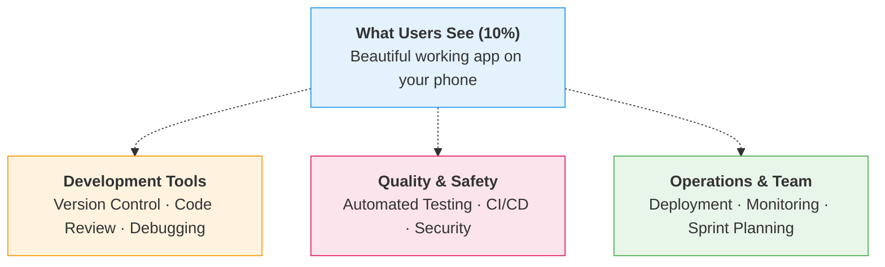

This course teaches you both halves: the visible app (Flutter, APIs) AND the ==invisible infrastructure== (Git, testing, CI/CD, team workflows).

| Iceberg layer | What you'll learn | When |
|---|---|---|
| **Development Tools** | Git, GitHub, code review, debugging | Weeks 1--2, ongoing |
| **Quality & Safety** | Testing, CI/CD, security, authentication | Weeks 9--12 |
| **Operations & Team** | Sprint planning, deployment, monitoring | Weeks 5, 12--14 |
| **The Visible App** | Flutter UI, state management, networking | Weeks 3--8 |

### Horror Stories: What Happens Without Version Control

#### The "Final Version" Problem

Everyone has done this:

```
report.docx
report_v2.docx
report_v2_final.docx
report_v2_final_REAL.docx
report_v2_final_REAL_submitted.docx
report_v2_final_REAL_submitted_fixed.docx
```

Which one is actually the latest? Which one was submitted? What changed between versions? Nobody knows.

#### The "Someone Overwrote My Work" Problem

Scenario: Two students are working on the same project. Both download the file from a shared drive, make changes independently, and upload their version. The second upload **overwrites** the first. The first student's work is gone.

With version control, ==this cannot happen==. Git detects conflicts and forces you to resolve them explicitly.

#### The "We Can't Reproduce the Results" Problem

This one is particularly relevant to **biomedical research**:

- A researcher publishes a paper with computational results
- Another lab tries to reproduce the results but gets different numbers
- The original researcher cannot figure out which version of their code produced the published results
- The paper's credibility is damaged

With Git, ==every version of the code is preserved==. You can always go back to the exact code that produced specific results. This is why an increasing number of journals now require code repositories.

### Why This Matters in Healthcare

!!! example "Healthcare Context: Why Version Control Is Non-Negotiable"
    Healthcare software has higher stakes than most software:

    - **Traceability:** Regulators need to know ==exactly what code== is running on a medical device. "Some version of the software" is not acceptable.
    - **Reproducibility:** Clinical trials involve software for data analysis. If you cannot reproduce the analysis, the trial results are questionable.
    - **Audit trails:** Who changed what, when, and why? Git provides this automatically.
    - **Patient safety:** A bug in a healthcare app can harm patients. Version control helps you track down when bugs were introduced and revert them quickly.

    You are not just learning tools for convenience. In healthcare, these practices are **regulatory requirements**.

??? question "Think about it: Why can't hospitals just use Google Docs?"
    Google Docs tracks changes --- so why not use it for code?

    1. **No branching** --- you can't work on two features in parallel and merge them
    2. **No atomic commits** --- you can't group related changes into a single, described unit
    3. **No offline support** --- Git works entirely offline; you push when ready
    4. **No CI/CD integration** --- you can't automatically run tests when code changes
    5. **No cryptographic integrity** --- Google Docs doesn't provide tamper-evident hashes

    Version control systems like Git are purpose-built for code. General-purpose tools simply cannot match their capabilities.

---

## 2. How Git Actually Works (30 min)

!!! abstract "TL;DR"
    Git stores ==complete snapshots==, not diffs. The ==staging area== gives you fine-grained control over what gets committed. ==Branches are lightweight pointers==, not copies. Every commit has a unique ==SHA-1 hash== that acts as a tamper-evident fingerprint.

In the lab, you learned the commands: `git add`, `git commit`, `git push`. Now let's understand what is actually happening behind the scenes.

### Snapshots, Not Diffs

~~Git stores the differences (diffs) between file versions~~ --- it actually stores ==complete snapshots== of your project at each commit.

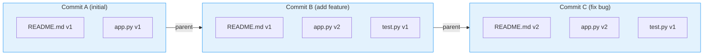

**Analogy:** Each commit is like a ==photograph== of your entire project at that moment. You are not recording "what changed" --- you are taking a full snapshot. To see what changed, Git compares two snapshots.

!!! note "Efficiency under the hood"
    In practice, Git is smart about storage. If a file did not change between commits, Git reuses the previous version instead of storing a duplicate copy. So it stores snapshots conceptually but is efficient about disk space.

### The Three Areas --- Revisited

You practiced this in the lab. Now let's go deeper:

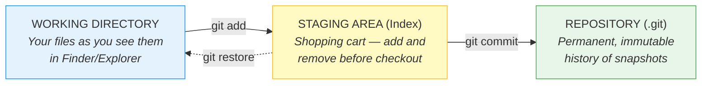

**Why does the ==staging area== exist?** It gives you fine-grained control. Real-world example:

You are fixing a bug, and while doing so, you notice a typo in a comment. You fix both. But these are ==two different logical changes==. With the staging area, you can:

1. `git add bug-fix-file.py` --- stage only the bug fix
2. `git commit -m "Fix temperature unit conversion bug"`
3. `git add comment-file.py` --- stage only the typo fix
4. `git commit -m "Fix typo in measurement module comment"`

Two clean, focused commits from one editing session.

??? protip "Pro tip: Why small, focused commits matter"
    A commit that says "Fix temperature bug and update docs and refactor utils" is hard to review, hard to revert, and hard to understand six months later. One commit = one logical change. Your future self (and your code reviewer) will thank you.

### Commit Hashing --- Every Commit Has a Fingerprint

Every commit in Git has a unique identifier called a ==SHA-1 hash==. It looks like this:

```
a1b2c3d4e5f6g7h8i9j0k1l2m3n4o5p6q7r8s9t0
```

Or in short form (first 7 characters):

```
a1b2c3d
```

This hash is computed from:
- The contents of all files in the snapshot
- The author name and email
- The timestamp
- The commit message
- The hash of the parent commit(s)

**Analogy: A fingerprint that verifies integrity**

Think of the hash like a fingerprint:
- It is ==unique== --- no two different commits will ever have the same hash
- It is ==deterministic== --- the same content always produces the same hash
- It is ==tamper-evident== --- if anyone changes even a single character in the commit, the hash completely changes

!!! example "Healthcare Context: Integrity Guarantees"
    Git's commit hashes provide a built-in ==integrity guarantee==. If someone tampers with the code history, the hashes will break, and everyone will know. This is crucial for regulated environments where you need to prove that your code has not been modified without authorization.

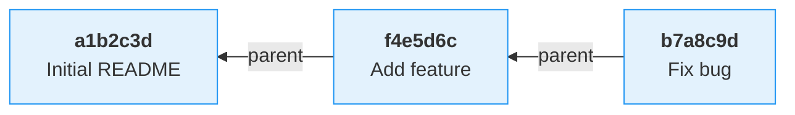

Each commit points back to its parent. The hash of each commit depends on its parent's hash, creating an ==unbreakable chain==. Change any commit, and all subsequent hashes change too.

### Branches Are Just Pointers

~~Creating a branch copies the entire project~~ --- a branch in Git is just a ==lightweight pointer== that points to a specific commit.

```
                        main
                          |
                          v
  [Commit A] <── [Commit B] <── [Commit C]
```

When you make a new commit on `main`, the pointer moves forward:

```
                                   main
                                     |
                                     v
  [Commit A] <── [Commit B] <── [Commit C] <── [Commit D]
```

Creating a new branch just creates a new pointer:

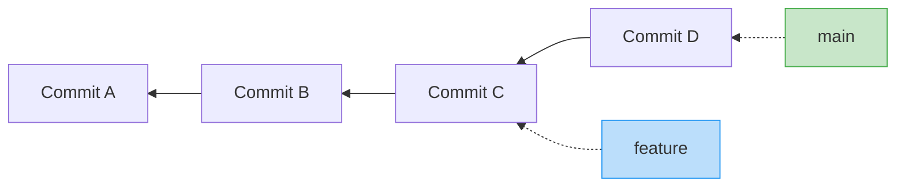

If you switch to `feature` and make a new commit:

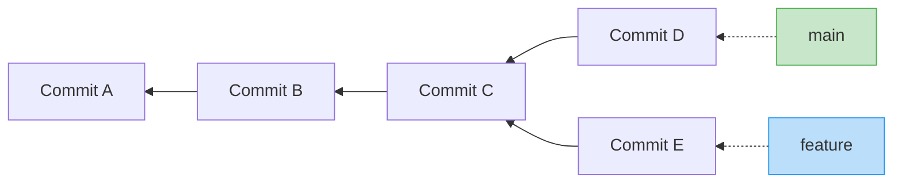

Now `main` and `feature` have diverged. We will learn how to merge them in Week 2.

> **Key insight:** Creating a branch is ==nearly free== in Git. It is just writing a 40-character
> hash to a file. This is why Git encourages branching --- unlike older version control
> systems where creating a branch meant copying the entire project.

### HEAD --- "You Are Here"

`HEAD` is a special pointer that tells Git which branch (and therefore which commit) you are currently working on. Think of it as the =="you are here" marker== on a map.

```
                                   HEAD
                                     |
                                     v
                                   main
                                     |
                                     v
  [Commit A] <── [Commit B] <── [Commit C]
```

When you switch branches with `git switch feature` (or the older `git checkout feature`), HEAD moves:

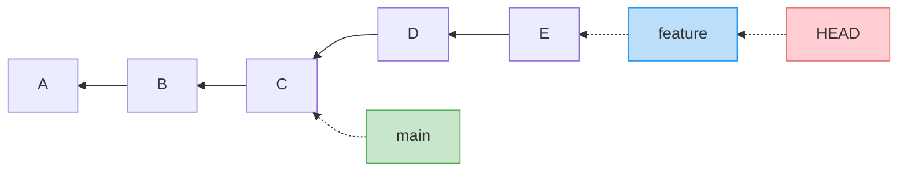

### Putting It All Together

Here is the complete mental model of how Git works:

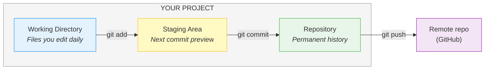

> **Branches** are lightweight pointers to commits. **HEAD** points to your current branch. **Commits** are snapshots with unique hash fingerprints.

??? question "Think about it: What happens if two people push to the same branch?"
    Git will ==reject the second push== if the remote has commits that the local repository doesn't have. The second person must first `git pull` to incorporate the remote changes, then push again. This is how Git prevents accidental overwrites --- unlike a shared drive where the last upload wins.

---

## 3. How SSH and Cryptographic Keys Work (20 min)

!!! abstract "TL;DR"
    SSH uses ==asymmetric cryptography== --- your public key is a padlock anyone can lock, your ==private key== is the only key that opens it. The private key ==never leaves your computer==. A random challenge-response protocol proves your identity without transmitting any secrets.

### The Problem

You want to push code to GitHub. GitHub needs to know that it is really **you** and not someone pretending to be you. But sending your password over the internet every time is:

1. **Annoying** --- you have to type it constantly
2. **Risky** --- passwords can be intercepted
3. **Weak** --- passwords can be guessed

SSH keys solve all three problems.

### Symmetric vs Asymmetric Encryption

Before we talk about SSH keys, we need to understand two types of encryption.

#### Symmetric Encryption: One Key for Everything

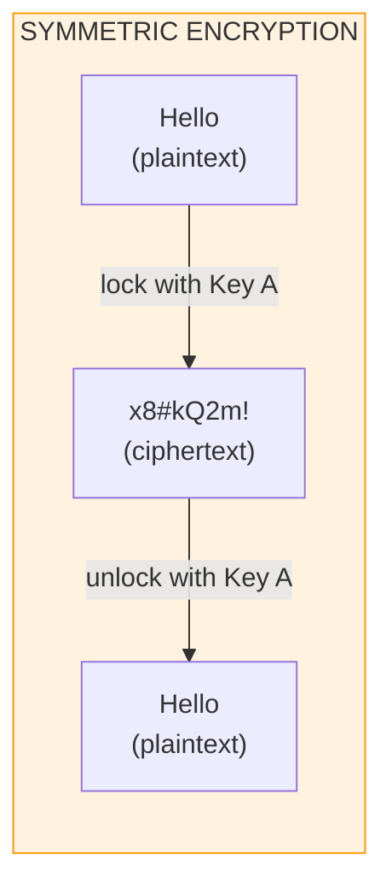

**Analogy:** A house key. The same key locks and unlocks the door. **Problem:** How do you safely give the key to someone far away?

==Symmetric encryption== is fast and simple, but it has a fundamental problem: you need to somehow share the secret key with the other person. If you send the key over the internet, someone could steal it.

#### Asymmetric Encryption: Two Keys Working Together

First, Bob generates a ==key pair== --- two mathematically linked keys:

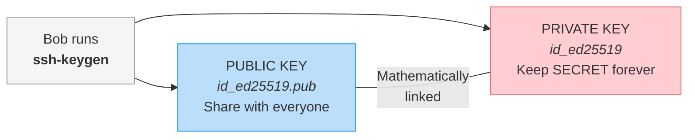

**Use case 1 — Encryption:** Anyone can lock a message for Bob, but only Bob can unlock it.

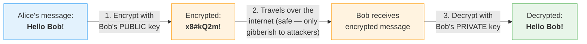

**Use case 2 — Signing:** Bob can prove his identity. This is ==what SSH actually uses==.

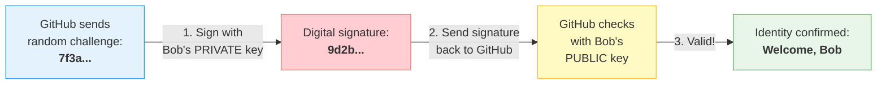

**Analogy:** You manufacture 100 identical **padlocks** and give them to anyone who wants one. Only **you** keep the key. Anyone can snap a padlock shut on a message for you, but only you can open it. And when you sign a document with your unique key, anyone with your padlock can verify it was really you.

==Asymmetric encryption== solves the key-sharing problem: you freely share your public key, and keep your private key secret. ==No secret needs to travel over the internet.==

### How SSH Authentication Actually Works

When you run `ssh -T git@github.com`, here is what happens step by step:

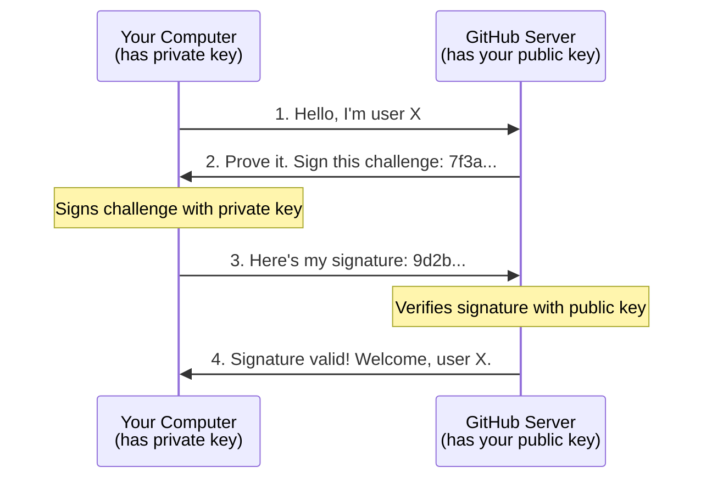

**Step by step:**

1. Your computer says: "I want to log in as user X"
2. GitHub generates a ==random challenge== (a string of random data) and sends it to your computer
3. Your computer ==signs== the challenge with your ==private key== and sends the signature back
4. GitHub uses your ==public key== (which you uploaded to GitHub Settings) to ==verify== the signature
5. If the signature is valid, GitHub knows you are who you claim to be --- only someone with the private key could have produced that signature

**Why is this secure?**

- The private key ==never leaves your computer==
- The challenge is random every time, so a recorded signature cannot be replayed
- Even if someone intercepts the signature, they cannot use it again (it only works for that specific challenge)

### ED25519 vs RSA

When you generated your SSH key, you used `ssh-keygen -t ed25519`. You might have seen RSA mentioned elsewhere. Here is the brief comparison:

| | ED25519 | RSA |
|---|---|---|
| Algorithm | Elliptic curve | Prime factorization |
| Key size | 256 bits | 2048--4096 bits |
| Speed | Faster | Slower |
| Security | Equally strong | Equally strong |
| Key length | Shorter, cleaner | Longer |
| Recommendation | **Use this** | Fine, but ED25519 is preferred |

Both are secure. ==ED25519== is newer, produces shorter keys, and is faster. That is why we used it.

~~A bigger key is always more secure~~ --- ED25519 at 256 bits is as secure as RSA at 3072 bits because elliptic curve math is harder to crack per bit.

### Why "Never Share Your Private Key"

Your private key is your ==digital identity==. Consider what happens if someone obtains it:

```
Scenario: Alice's private key is stolen by Eve

Eve (attacker):
  1. Connects to GitHub: "I'm Alice"
  2. Gets challenge from GitHub
  3. Signs with Alice's private key ← Eve has this now
  4. GitHub: "Welcome, Alice!"

Eve can now:
  - Push code to Alice's repositories
  - Delete Alice's repositories
  - Access Alice's private repositories
  - Impersonate Alice in any system that uses this key

Alice has NO way to know this is happening until she notices
unauthorized changes.
```

!!! warning "Protect your private key"
    **Protect your private key like a password --- actually, ==more than a password==.** A password can be changed. If your private key is compromised, you need to:

    1. Remove the public key from every service that has it
    2. Generate a brand new key pair
    3. Re-add the new public key everywhere

---

## 4. How Software Teams Actually Work (15 min)

!!! abstract "TL;DR"
    ==No one pushes directly to `main`==. Professional teams use a branch-based workflow: create a branch, write code, open a pull request, get a code review, merge. In healthcare, this workflow is a ==regulatory requirement==, not just a best practice.

### Solo vs Team Development

So far, you have been working alone:

```
Solo workflow:

  You ──> edit ──> add ──> commit ──> push ──> done
```

This is fine for homework. But real-world software is built by teams of 2 to 2,000 people working on the same codebase simultaneously.

What happens when multiple people edit the same file? How do you review each other's work? How do you ensure quality? This is where Git's features truly shine.

### The Branch-Based Workflow

In professional teams, ==no one pushes directly to `main`==. Instead:

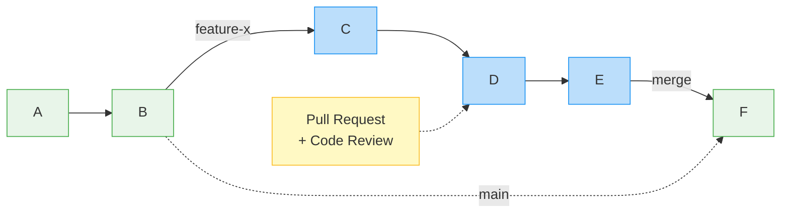

**The workflow:**

1. **Branch:** Create a new branch from `main` for your feature or bug fix
2. **Code:** Make your changes on the branch (multiple commits)
3. **Pull Request (PR):** When done, open a PR on GitHub --- "I'd like to merge my changes into main"
4. **Review:** Your teammates review your code, leave comments, suggest improvements
5. **Merge:** Once approved, the branch is merged into `main`

**Why this matters:**

- **Parallel work:** Multiple people can work on different features simultaneously without interfering with each other
- **Code review:** Every change is reviewed before it enters the main codebase --- catches bugs, enforces standards
- **Safe experimentation:** If a feature branch breaks things, `main` is unaffected
- **History:** Each feature/fix is a clear unit in the git history

### A Typical Day on a Software Team

Here is what a developer's day might look like:

```
Morning:
  1. git pull                      ← Get latest changes from team
  2. git switch -c fix-login       ← Start working on a task
  3. (write code, test it)
  4. git add + commit              ← Save progress locally
  5. git push                      ← Share with team
  6. Open PR on GitHub             ← Request review

Afternoon:
  7. Review a teammate's PR        ← Read their code, leave feedback
  8. Address review comments       ← Update your own PR based on feedback
  9. Merge PR                      ← Feature is now in main
  10. git switch main && git pull   ← Get the merged changes
  11. Start next task              ← Repeat
```

You will practice this workflow starting in Week 2.

### Why Healthcare Teams Need This Even More

!!! example "Healthcare Context: Regulatory Requirements for Version Control"
    Regular software teams use these practices for quality. Healthcare software teams use them because they are ==required by regulation==:

    | Regulatory Requirement | How Git/GitHub Helps |
    |---|---|
    | **Traceability** (IEC 62304) | Every change has a commit with author, date, and reason |
    | **Change control** | Pull requests require review before merging |
    | **Audit trails** | Git log provides a complete, tamper-evident history |
    | **Reproducibility** | Tags and branches mark exactly which code was released |
    | **Defect tracking** | GitHub Issues link directly to the code changes that fix them |

### Code Review: What Does It Look Like?

When someone opens a ==Pull Request==, reviewers can:

```
┌─────────────────────────────────────────────────────────┐
│  Pull Request #42: Fix heart rate calculation           │
│  Author: jan-kowalski    Reviewers: anna-nowak          │
│                                                         │
│  Files changed: 2    Commits: 3    Comments: 5          │
├─────────────────────────────────────────────────────────┤
│                                                         │
│  heart_rate.py                                          │
│                                                         │
│  - def calculate_bpm(intervals):                        │
│  -     return 60 / mean(intervals)                      │
│  + def calculate_bpm(rr_intervals_ms):                  │
│  +     rr_seconds = [i / 1000 for i in rr_intervals_ms]│
│  +     return 60 / mean(rr_seconds)                     │
│                                                         │
│  anna-nowak: "Good catch on the unit conversion!        │
│     But should we add a check for empty lists?"         │
│                                                         │
│  jan-kowalski: "Good point, added in next commit."      │
│                                                         │
└─────────────────────────────────────────────────────────┘
```

Code review catches bugs, improves code quality, and ==spreads knowledge across the team==. It is one of the most valuable practices in software engineering.

??? question "Think about it: What would happen without code review in a health app?"
    Imagine a developer pushes a change that accidentally converts medication doses from milligrams to grams --- a ==1000x error==. Without code review:

    - The change goes directly to production
    - Patients receive dangerously incorrect dosing information
    - The bug may not be caught until a patient is harmed

    With code review, a second pair of eyes catches the unit mismatch before it ever reaches patients. This is why IEC 62304 requires documented review of all code changes in medical device software.

---

## 5. The Mood Tracker Vision (10 min)

!!! abstract "TL;DR"
    Over 14 weeks, you'll build a complete ==mood tracking application== --- Flutter mobile frontend, FastAPI backend, SQLite local storage, REST API integration, authentication, and deployment. Every week builds on the previous one.

### What We're Building Over 14 Weeks

Over the next 14 weeks, you will build a complete **mood tracking application** --- from a mobile app (Flutter) to a backend API (FastAPI) to deployment.

### The Stack

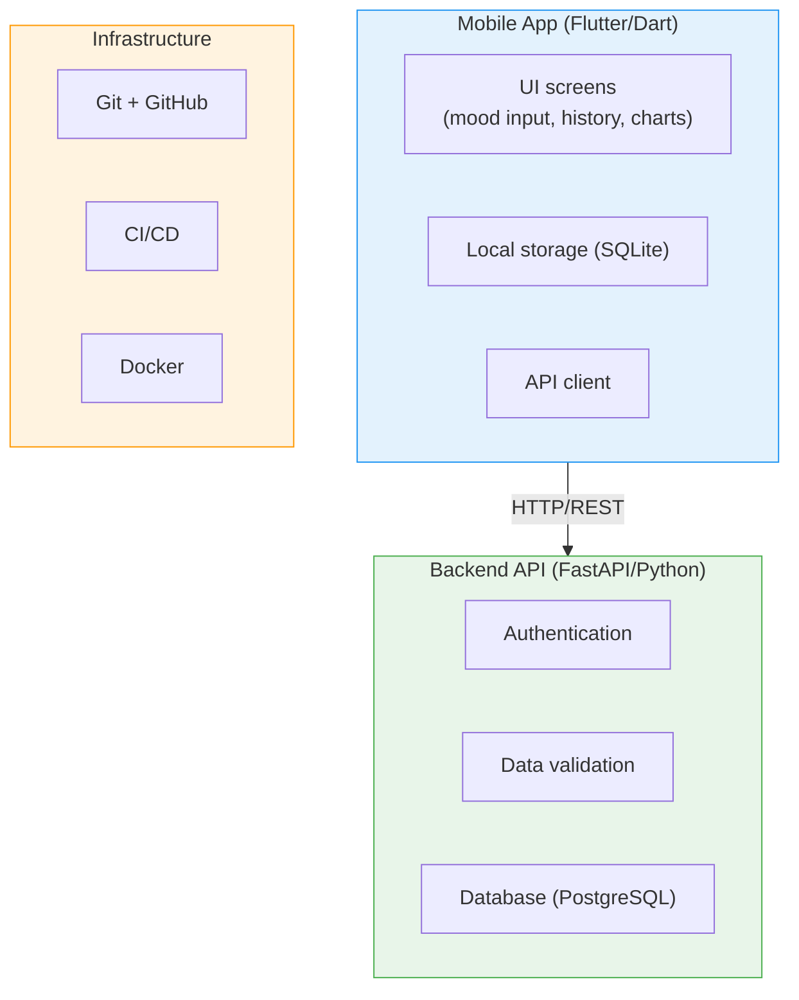

### From Zero to Shipped

| Week | Topic | What You Build |
|------|-------|----------------|
| **1** | **Terminal, Git, GitHub** | **You are here** |
| 2 | Git branching, REST APIs, curl | Branch workflows, API exploration |
| 3 | Dart language fundamentals | Dart programs with null safety |
| 4 | Flutter UI, widgets, navigation | First Flutter app with multiple screens |
| 5 | Sprint planning workshop | Project proposals, sprint boards |
| 6 | State management with Riverpod | Reactive UI with shared state |
| 7 | Local data persistence with SQLite | Offline-capable data storage |
| 8 | Networking, REST API integration | App connected to live backend |
| 9 | Authentication and security | Login, JWT tokens, secure storage |
| 10 | Testing strategies | Unit, widget, and integration tests |
| 11 | Advanced Flutter (charts, animations) | Data visualization and polish |
| 12 | CI/CD and deployment | Automated builds and releases |
| 13 | Polish and refactoring | Code quality and final features |
| 14 | Final presentations | Demo day |

==Every week builds on the previous ones.== The skills you learned today (terminal, Git, GitHub) will be used in **every** subsequent week.

---

## 6. Course Overview (5 min)

!!! abstract "TL;DR"
    Grading: weekly assignments (40%) + midterm (20%) + final project (30%) + participation (10%). No AI tools in Weeks 1--3 --- build genuine understanding first, then use AI effectively.

### Assessment Structure

| Component | Weight | Description |
|---|---|---|
| Weekly assignments | 40% | Hands-on exercises, submitted via GitHub |
| Midterm project | 20% | Checkpoint: working app with basic features |
| Final project | 30% | Complete mood tracker app with all features |
| Participation | 10% | Lab attendance, code reviews, contributions |

### AI Tools Policy

!!! warning "AI Tools Policy"
    - **Weeks 1--3:** AI tools are ==not allowed==. Build genuine understanding first.
    - **Weeks 4--14:** AI tools (ChatGPT, Copilot, etc.) are ==allowed and encouraged== --- but you must understand what the AI generates. "I don't know, the AI wrote it" is not an acceptable answer during code review.

The goal is not to avoid AI. The goal is to ==use it effectively==, which requires understanding the fundamentals.

### What's Next: Week 2

Next week you will learn:

- **Git branching and merging** --- working on features without breaking `main`
- **REST APIs** --- how apps talk to servers
- **curl** --- making HTTP requests from the terminal

Come to the lab with your SSH keys working and at least one repository on GitHub.

---

## Quick Quiz

<quiz>
Why is version control especially important in healthcare software?

- [ ] It makes code run faster
- [x] Regulators require traceability and audit trails for every code change
- [ ] It replaces the need for testing
- [ ] It is only important for large teams
</quiz>

<quiz>
How does Git store your project at each commit?

- [ ] As a list of changes (diffs) since the last commit
- [x] As a complete snapshot of all files at that moment
- [ ] As a compressed ZIP archive
- [ ] As a copy of only the changed files
</quiz>

<quiz>
What is the purpose of the staging area?

- [ ] To speed up Git operations
- [ ] To store backups of your files
- [x] To let you choose exactly which changes go into the next commit
- [ ] To share code with teammates before committing
</quiz>

<quiz>
In SSH authentication, what never leaves your computer?

- [ ] The public key
- [x] The private key
- [ ] The challenge string
- [ ] The commit hash
</quiz>

<quiz>
What is a branch in Git?

- [ ] A complete copy of the entire repository
- [ ] A separate folder on your hard drive
- [x] A lightweight pointer to a specific commit
- [ ] A backup of the main branch
</quiz>

<quiz>
Why do professional teams use Pull Requests?

- [ ] Because Git requires them for every push
- [ ] To slow down development on purpose
- [x] So every change is reviewed before it enters the main codebase
- [ ] To automatically fix bugs in the code
</quiz>

---

!!! question "End-of-Lecture Reflection"
    Take 2 minutes to reflect on today's lecture:

    1. **What concept was most surprising?** (Git storing snapshots? Asymmetric crypto? The regulatory angle?)
    2. **How would you explain Git's three areas** (working directory, staging, repository) to a friend who has never heard of version control?
    3. **Why should a biomedical engineer care about Git?** Think beyond "it's required for this course."

    Jot down your answers or discuss with your neighbor.

---

## Key Takeaways

1. **Version control is not optional** --- especially in healthcare software where ==traceability is a regulatory requirement==
2. **Git stores snapshots**, not diffs. Each commit is a ==complete picture== of your project.
3. **The three areas** (working directory, staging, repository) give you ==fine-grained control== over what you commit
4. **SSH keys use asymmetric cryptography** --- public key is a padlock, private key opens it. The ==private key never leaves your machine==.
5. **Professional teams** use branches, pull requests, and code review --- and so will you
6. **These tools are the foundation** for everything we build in the next 13 weeks

---

## Further Reading (Optional)

If you want to go deeper on any topic covered today:

- **Git internals:** [Pro Git Book, Chapter 10](https://git-scm.com/book/en/v2/Git-Internals-Plumbing-and-Porcelain) (free online)
- **SSH explained:** [SSH.com: How Does SSH Work](https://www.ssh.com/academy/ssh/protocol)
- **The Missing Semester of Your CS Education:** [MIT Course](https://missing.csail.mit.edu/) (the inspiration for this lecture's title)
- **Why version control matters in science:** [A Quick Introduction to Version Control with Git and GitHub](https://journals.plos.org/ploscompbiol/article?id=10.1371/journal.pcbi.1004668)
- **IEC 62304 overview:** [Wikipedia: IEC 62304](https://en.wikipedia.org/wiki/IEC_62304) --- the medical device software standard referenced throughout this lecture
