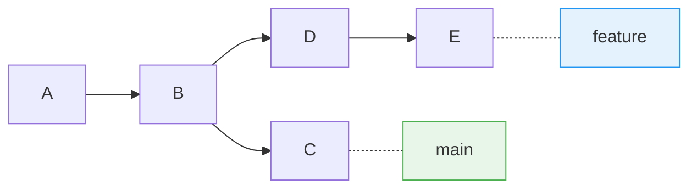
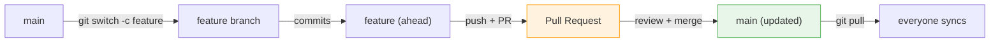
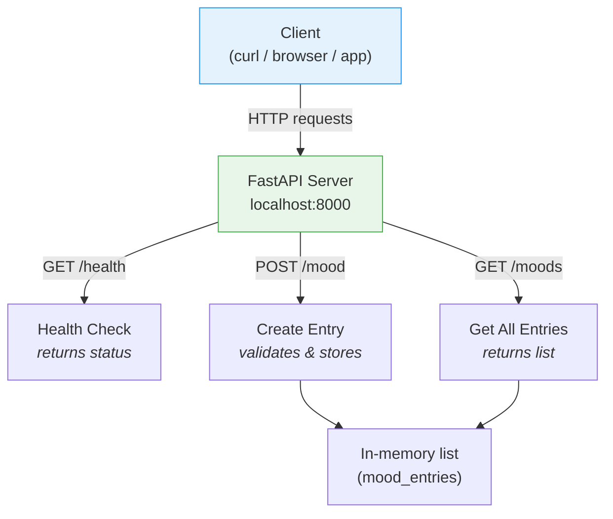

# Week 2 Lab: Git Branching, REST APIs & curl

<div class="lab-meta" markdown>
<div class="lab-meta__row"><span class="lab-meta__label">Course</span> Mobile Apps for Healthcare</div>
<div class="lab-meta__row"><span class="lab-meta__label">Duration</span> ~2 hours</div>
<div class="lab-meta__row"><span class="lab-meta__label">Prerequisites</span> Week 1 (terminal basics, `git init/add/commit/push`, GitHub account with SSH)</div>
</div>

<div class="grid cards" markdown>

- :material-target:{ .lg .middle } **Learning Objectives**

    ---

    By the end of this lab, you will be able to:

    - [ ] Create, switch, and merge Git branches
    - [ ] Resolve a merge conflict by hand
    - [ ] Open and merge a Pull Request on GitHub
    - [ ] Build a minimal REST API with FastAPI
    - [ ] Test API endpoints with `curl`

- :material-clock-outline:{ .lg .middle } **Time Estimate**

    ---

    | Section | Duration | Priority |
    |---------|----------|----------|
    | Part 1: Git branching & merging | ~35 min | Core |
    | Part 2: Pull Requests on GitHub | ~20 min | Core |
    | Part 3: Python venv & FastAPI | ~40 min | Core (finish at home if needed) |
    | Part 4: Testing with curl | ~15 min | Core |
    | Self-checks & reflection | at home | Review |

</div>

!!! warning "No AI tools in Weeks 1–3"
    AI tools (ChatGPT, Copilot, etc.) are **not allowed** in Weeks 1–3. Type every command yourself. If you get stuck, ask your instructor or a classmate.

!!! tip "Pacing"
    This lab covers a lot of ground. If you don't finish Part 4 (FastAPI) during the session, it can be completed as homework. Focus on mastering Parts 1-3 (git branching, REST concepts, curl) during the lab.

!!! example "Healthcare context"
    REST APIs are the backbone of modern health systems. When your phone syncs fitness data to the cloud, when a hospital system queries a patient's lab results, or when a telemedicine app connects to a video service — they all use HTTP APIs following the patterns you'll learn today. The HL7 FHIR standard (Fast Healthcare Interoperability Resources) is built entirely on RESTful API principles.

!!! example "Think of it like... a restaurant menu"
    A REST API is like a **restaurant menu** — you pick from a set list (endpoints), send your order (request), and get your dish back (response). The kitchen (server) decides how to make it.

---

## Before You Start

You will need:

- A computer with macOS, Windows, or Linux
- Git installed and configured (completed in Week 1)
- A GitHub account with SSH keys set up (completed in Week 1)
- Python 3.8+ installed ([python.org/downloads](https://www.python.org/downloads/))
- A local Git repository (you can use the one from Week 1 or create a new one)
- About 2 hours (Parts 1–3 in class, Part 4 can be homework if needed)

**Verify your tools are ready:**

```bash
git --version      # Should print git version 2.x.x
python3 --version  # Should print Python 3.8+ (on Windows, try: python --version)
ssh -T git@github.com  # Should print "Hi username! You've successfully authenticated..."
```

If any of these fail, revisit the Week 1 lab setup instructions before continuing.

---

## Part 1: Git Branching & Merging (~35 min)

<span class="progress-breadcrumb">:material-circle-outline: Part 1 · :material-circle-outline: Part 2 · :material-circle-outline: Part 3 · :material-circle-outline: Part 4 — **You're starting. 4 parts to go.**</span>

!!! abstract "TL;DR"
    Branches let multiple people work on different features without stepping on each other's code.

!!! tip "Remember from Week 1?"
    In Week 1, you learned `git add` → `commit` → `push` on a single branch. Today you'll create **parallel branches** — the same workflow, but now multiple versions of your project can exist simultaneously. This is how real teams work without overwriting each other's code.

### 1.1 Why branches?

Branches let you work on a feature or experiment without touching the main codebase. When the work is ready, you merge it back. This is a core workflow in every professional team.

~~You should commit directly to `main`~~ — in professional teams, no one does. Every change goes through a branch and a Pull Request. This protects `main` from broken code.



### 1.2 Creating and switching branches

Open your terminal and navigate to any local Git repository (you can use the one from Week 1).

```bash
# See which branch you are on
git branch

# Create a new branch called "feature-greeting"
git branch feature-greeting

# List branches again — the new one appears, but you are still on main
git branch

# Switch to the new branch (pick ONE of the methods below)
git checkout feature-greeting
# OR (newer syntax, recommended)
git switch feature-greeting
```

You can also create **and** switch in one step:

```bash
git checkout -b feature-greeting
# OR
git switch -c feature-greeting
```

### 1.3 Making changes on a branch

While on `feature-greeting`, create a file:

```bash
echo "Hello from feature branch!" > greeting.txt
git add greeting.txt
git commit -m "Add greeting.txt on feature branch"
```

Switch back to `main` and notice that `greeting.txt` does not exist there:

```bash
git switch main
ls greeting.txt    # file not found — it only exists on the feature branch
```

<quiz>
You created a file on `feature-greeting` and switched back to `main`. What happened to the file?

- [ ] The file was deleted permanently
- [x] The file is still on the `feature-greeting` branch — it just doesn't exist on `main`
- [ ] The file was moved to a hidden `.git` folder

---

**Branches are parallel universes for your code!** Each branch has its own version of the project. When you switch branches, Git swaps out the files in your working directory to match that branch's state. Nothing is lost — it is all stored safely in `.git`. In healthcare software teams, developers routinely work on 3–4 branches simultaneously: a bug fix branch, a feature branch, and a hotfix for a production issue. Each branch keeps its changes isolated until they are reviewed and merged.
</quiz>

??? question "Try to break it"
    While on `main`, try to switch to a branch that does not exist:
    ```bash
    git switch nonexistent-branch
    ```
    What error do you get? Now run `git branch` to see which branches actually exist. Reading error messages is a skill — Git is trying to help you, not confuse you.

### 1.4 Merging a branch

To bring the feature branch changes into `main`:

```bash
# Make sure you are on the branch you want to merge INTO
git switch main

# Merge the feature branch
git merge feature-greeting
```

Now `greeting.txt` exists on `main` as well. You can delete the branch if you no longer need it:

```bash
git branch -d feature-greeting
```

> ### How Does This Actually Work? --- Fast-Forward Merge
>
> When you merged `feature-greeting` into `main`, Git performed a ==fast-forward merge==. This
> happens when `main` has no new commits since you branched off. Git simply moves the `main` pointer
> forward to point to the same commit as the feature branch:
>
> ```mermaid
> graph LR
>     A["A"] --> B["B"]
>     B --> C["C<br/>(feature-greeting)"]
>     main_before["main (before)"] -.-> B
>     main_after["main (after)"] -.-> C
>     style main_before fill:#ffcdd2,stroke:#e57373
>     style main_after fill:#c8e6c9,stroke:#4caf50
> ```
>
> No new commit is created --- Git just moves a pointer. This is why branches in Git are so
> lightweight. In a **three-way merge** (which you will see in the conflict exercise), both branches
> have diverged, so Git creates a new ==merge commit== that ties them together.

!!! example "Think of it like... merging highway lanes"
    Merging a branch is like a highway on-ramp. If the main highway has no traffic (no new commits on `main`), you can slide right in — that is a fast-forward merge. If there is traffic (both branches have new commits), you need to carefully merge — that is a three-way merge. And if two cars try to occupy the same spot — that is a merge conflict.

### 1.5 Merge Conflict Exercise

A **merge conflict** happens when two branches change the ==**same lines** in the **same file**== and Git cannot decide which version to keep. You must resolve it manually.

#### Setup

You will create a merge conflict yourself by simulating two branches that edit the same file differently.

```bash
# Create a new practice repo
mkdir conflict-exercise && cd conflict-exercise
git init

# Create a patient file on main
cat > patient_info.txt << 'EOF'
Patient: Jane Doe
Age: 45
Blood pressure: 118/76 mmHg
Heart rate: 72 bpm
Notes: Regular checkup
EOF

git add patient_info.txt
git commit -m "Add patient info file"
```

Now create two branches that change the **same line** differently:

```bash
# Branch A: doctor updates blood pressure
git switch -c branch-a
```

Open `patient_info.txt` in your text editor and change the blood pressure line to:

```
Blood pressure: 120/80 mmHg
```

Save the file, then commit:

```bash
git add patient_info.txt
git commit -m "Update BP reading (branch-a)"
```

Now go back to main, create branch B, and make a **different** change to the same line:

```bash
git switch main
git switch -c branch-b
```

Open `patient_info.txt` again and change the blood pressure line to:

```
Blood pressure: 130/85 mmHg
```

Save the file, then commit:

```bash
git add patient_info.txt
git commit -m "Update BP reading (branch-b)"
```

!!! tip "Automation shortcut (optional)"
    If you prefer the command line, you can use `sed` instead of a text editor:
    ```bash
    sed -i.bak 's/Blood pressure: 118\/76 mmHg/Blood pressure: 120\/80 mmHg/' patient_info.txt && rm -f patient_info.txt.bak
    ```
    But learning to edit files manually is more important at this stage — you'll need that skill for resolving real conflicts.

#### Steps

1. **Explore branch-a:**

```bash
git switch branch-a
cat patient_info.txt
# Shows: Blood pressure: 120/80 mmHg
```

2. **Explore branch-b:**

```bash
git switch branch-b
cat patient_info.txt
# Shows: Blood pressure: 130/85 mmHg
```

3. **Merge branch-a into branch-b** (you are currently on `branch-b`):

```bash
git merge branch-a
```

Git will print something like:

```
Auto-merging patient_info.txt
CONFLICT (content): Merge conflict in patient_info.txt
Automatic merge failed; fix conflicts and then commit the result.
```

4. **Open the conflicted file** in your editor. You will see conflict markers:

```
<<<<<<< HEAD
Blood pressure: 130/85 mmHg
=======
Blood pressure: 120/80 mmHg
>>>>>>> branch-a
```

What do these markers mean?

| Marker | Meaning |
|--------|---------|
| `<<<<<<< HEAD` | Start of YOUR current branch's version (branch-b) |
| `=======` | Separator between the two versions |
| `>>>>>>> branch-a` | End of the INCOMING branch's version (branch-a) |

5. **Resolve the conflict** by editing the file. Remove all three marker lines and keep the content you want. For example, you might decide the correct value is:

```
Blood pressure: 125/82 mmHg
```

6. **Stage and commit the resolution:**

```bash
git add patient_info.txt
git commit -m "Resolve merge conflict in patient_info.txt"
```

7. Verify with `git log --oneline --graph` to see the merge commit.

#### Key takeaways

- Conflicts are normal. They are not errors.
- Always read both versions carefully before deciding what to keep.
- ==Never leave conflict markers== (`<<<<<<<`, `=======`, `>>>>>>>`) in committed files.

~~Merge conflicts mean someone messed up~~ — they're a normal, healthy part of collaboration. Git just needs you to choose which version wins.

!!! warning "Common mistake"
    Committing a file that still has conflict markers in it. Your code will break, and your teammates will be confused. After resolving, always search the file for `<<<<<<<` before committing.

<quiz>
You just resolved a merge conflict. What was the correct order of steps?

- [ ] Delete the file, recreate it, then commit
- [ ] Run `git merge --force` to pick one version automatically
- [x] Edit the file to remove conflict markers, choose the right content, then `git add` and `git commit`
- [ ] Run `git reset` to undo the merge entirely

---

**You just handled something that trips up even experienced developers!** Merge conflicts are inevitable in team projects — especially in healthcare, where multiple engineers might update the same patient data model or API endpoint simultaneously. At hospitals running Epic or Cerner EHR systems, merge conflicts in clinical decision support rules must be resolved carefully because the wrong resolution could cause incorrect alerts for dangerous drug interactions. The skill you just practiced — reading both versions carefully and making a deliberate choice — is exactly what matters in safety-critical software.
</quiz>

!!! tip "Pair moment"
    Compare your resolved `patient_info.txt` with a neighbor. Did you pick the same blood pressure value? In a real team, you would discuss which reading is correct before resolving. This is why code review exists — resolving conflicts alone is risky when the code affects patient safety.

---

### Self-Check: Part 1

Before continuing, make sure you can answer these:

- [ ] You can create a new branch and switch to it
- [ ] You understand that changes on a branch are isolated from `main` until merged
- [ ] You have resolved a merge conflict by editing a file and removing the conflict markers
- [ ] You can explain what `<<<<<<<`, `=======`, and `>>>>>>>` mean in a conflict file

??? question "Scenario: The conflict markers"
    Two teammates edited the same function on different branches. Git shows a merge conflict. Walk through exactly what the conflict markers `<<<<<<<`, `=======`, `>>>>>>>` mean and how you'd resolve it.

    ??? success "Answer"
        `<<<<<<< HEAD` marks the start of **your** branch's version. `=======` separates the two versions. `>>>>>>> other-branch` marks the end of the **incoming** branch's version. To resolve: (1) Read both versions carefully. (2) Decide which code to keep — maybe one version, the other, or a combination. (3) Delete all three marker lines. (4) `git add` the file and `git commit`. The key insight: Git isn't broken — it just doesn't know which version you prefer.

!!! success "Checkpoint: Part 1 complete"
    You can create branches, merge them, and resolve conflicts. These are
    the collaboration skills you'll use every day in your team project
    starting Week 4.

---

## Part 2: Pull Requests on GitHub (~20 min)

<span class="progress-breadcrumb">:material-check-circle: Part 1 · :material-circle-outline: Part 2 · :material-circle-outline: Part 3 · :material-circle-outline: Part 4 — **Part 1 done — you have branching skills. 3 parts to go.**</span>

!!! abstract "TL;DR"
    A Pull Request (PR) is a request to merge your branch on GitHub — with code review from teammates before it lands in `main`.

~~You merge code by emailing zip files to your teammates~~ — definitely not. Pull Requests on GitHub are how modern teams review and merge code.

A **Pull Request** (PR) is a request to merge your branch into another branch on a remote repository. It is the standard way teams review and discuss code before merging.

### 2.1 Push a branch to GitHub

Start from your local repository (the one from Part 1 or a fresh one):

```bash
# Create and switch to a new branch
git switch -c feature-health-tip

# Make a change
echo "Drink at least 2 liters of water daily." > health_tip.txt
git add health_tip.txt
git commit -m "Add daily health tip"

# Push the branch to GitHub
# The -u flag sets up tracking so future pushes are simpler
git push -u origin feature-health-tip
```

### 2.2 Create a Pull Request on GitHub

1. Open your repository on **github.com** in a browser.
2. GitHub will usually show a yellow banner saying _"feature-health-tip had recent pushes"_ with a green **"Compare & pull request"** button. Click it.
   - If you do not see the banner, click the **"Branch"** dropdown, select `feature-health-tip`, then click **"Contribute" > "Open pull request"**.
3. On the **"Open a pull request"** page:
   - **Base branch:** `main` (the branch you want to merge into).
   - **Compare branch:** `feature-health-tip` (your feature branch).
   - **Title:** Write a short, descriptive title, e.g., _"Add daily health tip file"_.
   - **Description:** Explain what the PR does and why. Example: _"Adds a health_tip.txt file with a hydration reminder."_
4. Click the green **"Create pull request"** button.

<quiz>
You just created a Pull Request. What is its purpose?

- [ ] To automatically merge code without anyone looking at it
- [ ] To create a backup of your branch on GitHub
- [x] To request that your branch be reviewed and merged into `main`
- [ ] To delete your local branch after pushing

---

**You just opened your first Pull Request — the cornerstone of professional software development!** Every feature, bug fix, and improvement at companies like Google Health, Apple Health, and Medtronic goes through a Pull Request. In healthcare software under IEC 62304, ==every code change must be reviewed before it enters the main codebase==. A PR is the documented proof that a review happened. When the FDA audits medical device software, they look for exactly this: a traceable chain from requirement → code change → review → approval → merge. You are practicing the exact workflow that regulated software teams use daily.
</quiz>

### 2.3 Review a Pull Request

Pull Requests allow teammates to review your code before it is merged.

1. On the PR page, click the **"Files changed"** tab to see the diff.
2. You can click the **"+"** icon next to any line to leave a comment.
3. After reviewing, click **"Review changes"** in the top-right corner of the "Files changed" tab. You have three options:
   - **Comment** — general feedback, does not approve or block.
   - **Approve** — you are satisfied with the changes.
   - **Request changes** — something needs to be fixed before merging.
4. Click **"Submit review"**.

> **Exercise:** Pair up with a classmate. Push a branch to your own repo, create a PR, and then review each other's PR. Leave at least one line comment and approve.

### 2.4 Merge a Pull Request on GitHub

1. Go back to the **"Conversation"** tab of the PR.
2. If all checks pass and the PR is approved, click the green **"Merge pull request"** button.
3. Click **"Confirm merge"**.
4. Optionally, click **"Delete branch"** to clean up the remote feature branch.

### 2.5 Update your local repository

After merging on GitHub, your local `main` is behind. Update it:

```bash
git switch main
git pull origin main
```

Now your local `main` contains the merged changes.

!!! tip "Pair moment"
    Exchange GitHub repository URLs with a classmate. Visit their repo, find their Pull Request (even if already merged), and read the PR description and diff. Can you understand what they changed just from reading the PR? Good PRs are self-explanatory — this is a skill you will develop throughout the course.

> ### How Does This Actually Work? --- Local Merge vs GitHub Merge
>
> You now know two ways to merge branches:
>
> | | Local merge (`git merge`) | GitHub merge (Pull Request) |
> |---|---|---|
> | Where it happens | On your computer | On GitHub's servers |
> | Review step | None (you trust yourself) | Code review by teammates |
> | Audit trail | Just a merge commit | PR with comments, approvals, and discussion |
> | When to use | Solo work, quick experiments | Team projects, anything going to `main` |
>
> In professional teams, ==local merges to `main` are usually forbidden==. All changes go through
> Pull Requests so there is a review record. In healthcare software, this is not a preference — it
> is a regulatory requirement under IEC 62304 for change control.

---

### Self-Check: Part 2

- [ ] You have pushed a branch to GitHub and opened a Pull Request
- [ ] You have reviewed a classmate's PR (or at least know how to: Files changed tab → line comments → Submit review)
- [ ] You have merged a PR and pulled the updated `main` locally
- [ ] You can explain the difference between merging locally (`git merge`) and merging on GitHub (via a PR)

The full branch → PR → merge → sync workflow:



??? question "Scenario: The rejected PR"
    You open a Pull Request but your teammate requests changes. What do you do?

    ??? success "Answer"
        You stay on the same branch, make the requested changes, commit them, and `git push`. The Pull Request automatically updates with the new commits — you do **not** need to create a new PR. Your teammate reviews again and approves. This back-and-forth is normal and expected — code review is a conversation, not a rubber stamp.

!!! success "Checkpoint: Part 2 complete"
    You can create branches, open Pull Requests, and review code on
    GitHub. This is the workflow you'll use for every team project feature
    from now on.

---

## Part 3: Python Virtual Environment & FastAPI (~40 min)

<span class="progress-breadcrumb">:material-check-circle: Part 1 · :material-check-circle: Part 2 · :material-circle-outline: Part 3 · :material-circle-outline: Part 4 — **Parts 1–2 done — you have Git collaboration skills. 2 parts to go.**</span>

!!! abstract "TL;DR"
    Set up an isolated Python environment and build a 3-endpoint REST API. This is the backend your Flutter app will talk to in Week 8.

### 3.1 What is a virtual environment?

A **virtual environment** is an isolated Python installation. Packages you install inside it do not affect your system Python or other projects. This prevents version conflicts between projects.

!!! example "Think of it like... separate toolboxes for each project"
    Imagine you are working on two different medical devices. Device A needs a specific version of a signal processing library, and Device B needs a different, incompatible version. If you have one shared toolbox, you cannot have both versions at once. A virtual environment gives each project its **own toolbox** — the tools in one do not affect the other.

!!! warning "Common mistake"
    Installing Python packages with `pip install` **without** activating a virtual environment first. This installs packages globally, which can break other projects or your system Python. ==Always activate your venv before `pip install`.==

### 3.2 Create and activate a virtual environment

```bash
# Navigate to a new project folder
mkdir mood-api && cd mood-api
```

Create a virtual environment:

=== "macOS / Linux"

    ```bash
    python3 -m venv venv
    ```

=== "Windows (Git Bash)"

    ```bash
    python -m venv venv
    ```

Activate it:

=== "macOS / Linux"

    ```bash
    source venv/bin/activate
    ```

=== "Windows (Git Bash)"

    ```bash
    source venv/Scripts/activate
    ```

When activated, you will see `(venv)` at the beginning of your terminal prompt. To deactivate later, simply type `deactivate`.

<quiz>
After activating the virtual environment, what do you see in your terminal prompt?

- [ ] A green checkmark
- [x] `(venv)` at the beginning of the prompt
- [ ] The Python version number
- [ ] Nothing changes — activation is silent

---

**You just created an isolated environment — the same practice used in every serious Python project!** In healthcare data science, researchers routinely run multiple analysis pipelines that require different library versions. Without virtual environments, upgrading `pandas` for one study could break the analysis scripts for another study — potentially invalidating published results. Pharmaceutical companies mandate virtual environments in their standard operating procedures (SOPs) for exactly this reason. The `(venv)` in your prompt is your visual confirmation that you are working in a safe, isolated space.
</quiz>

??? question "Try to break it"
    Deactivate your virtual environment with `deactivate`, then try running `pip list`. You will see your system Python's packages (or possibly an error). Now reactivate with `source venv/bin/activate` (or `source venv/Scripts/activate` on Windows) and run `pip list` again — you should see a much shorter list. This demonstrates the isolation: packages installed in the venv do not leak out, and system packages do not leak in.

### 3.3 Install FastAPI and Uvicorn

```bash
pip install fastapi uvicorn
```

- **FastAPI** is a modern Python web framework for building APIs.
- **Uvicorn** is an ASGI server that runs your FastAPI application.

You can verify the installation:

```bash
pip list
```

### 3.4 Build the Mood Tracking API (step by step)

We will build a simple API that tracks mood entries. Create a file called `main.py`. You can start from the starter template provided in `fastapi-starter/main.py`, or build from scratch by following the steps below.

Here's an overview of the API architecture you're building:



#### Step 1: Imports and app setup

Create `main.py` and add:

```python
from fastapi import FastAPI

app = FastAPI(title="Mood API", description="A simple mood tracking API")
```

#### Step 2: In-memory storage

We will store mood entries in a plain Python list (no database needed for now):

```python
mood_entries = []
```

#### Step 3: Define a data model

FastAPI uses **Pydantic** models to validate incoming data. Add this import at the top and then define the model:

```python
from pydantic import BaseModel

class MoodEntry(BaseModel):
    score: int
    note: str
```

#### Step 4: `GET /health` endpoint

This is a simple endpoint to check if the API is running:

```python
@app.get("/health")
def health_check():
    """Check if the API is running."""
    return {"status": "healthy"}
```

#### Step 5: `POST /mood` endpoint

This endpoint accepts a mood entry and stores it:

```python
@app.post("/mood")
def create_mood(entry: MoodEntry):
    """Record a new mood entry."""
    mood_entries.append(entry)
    return entry
```

FastAPI will automatically:
- Parse the JSON request body.
- Validate that `score` is an integer and `note` is a string.
- Return a `422 Unprocessable Entity` error if the data is invalid.

??? info "How does this actually work? --- Decorators and routing"
    The `@app.post("/mood")` syntax is a Python **decorator**. It tells FastAPI: "When an HTTP
    POST request arrives at the `/mood` path, call this function to handle it." Here is the flow:

    ```mermaid
    graph LR
        REQ["POST /mood<br/>{score: 7, note: 'good'}"] --> FASTAPI["FastAPI Router<br/><i>matches path + method</i>"]
        FASTAPI --> PYDANTIC["Pydantic Validation<br/><i>checks types + constraints</i>"]
        PYDANTIC -->|"Valid"| FN["Your function:<br/><b>create_mood()</b>"]
        PYDANTIC -->|"Invalid"| ERR["422 Error Response<br/><i>details what's wrong</i>"]
        FN --> RESP["JSON Response<br/>{score: 7, note: 'good'}"]
        style PYDANTIC fill:#fff9c4,stroke:#fbc02d
        style ERR fill:#ffcdd2,stroke:#e57373
    ```

    Your code only handles the happy path — FastAPI and Pydantic handle validation, serialization,
    and error responses for you. This is why modern frameworks are so powerful: you write the
    business logic, the framework handles the plumbing.

#### Step 6: `GET /moods` endpoint

This endpoint returns all stored mood entries:

```python
@app.get("/moods")
def get_moods():
    """Retrieve all mood entries."""
    return mood_entries
```

#### Step 7: Run the application

```bash
uvicorn main:app --reload
```

- `main` refers to the file `main.py`.
- `app` refers to the `app = FastAPI(...)` object inside it.
- `--reload` automatically restarts the server when you edit `main.py`.

You should see output like:

```
INFO:     Uvicorn running on http://127.0.0.1:8000 (Press ++ctrl+c++ to quit)
INFO:     Started reloader process
```

### 3.5 Explore Swagger UI

Open your browser and go to:

```
http://localhost:8000/docs
```

FastAPI automatically generates an **interactive API documentation** page (Swagger UI). You can:

- See all your endpoints.
- Click **"Try it out"** to send requests directly from the browser.
- See request/response schemas.

There is also an alternative documentation page at `http://localhost:8000/redoc`.

??? protip "Pro tip"
    Bookmark `http://localhost:8000/docs` — the Swagger UI is the fastest way to
    test your API during development. It auto-generates forms for every endpoint,
    including POST requests with JSON bodies. No curl required.

<quiz>
What does `@app.get("/health")` do in your FastAPI code?

- [ ] It creates a new HTML page at `/health`
- [ ] It downloads health data from the internet
- [x] It registers a function to handle HTTP GET requests at the `/health` path
- [ ] It checks if the Python installation is healthy

---

**You just built a working REST API — the same technology that powers every health app on the planet!** The `@app.get` and `@app.post` decorators you used follow the exact same pattern as production APIs at companies like Teladoc (telemedicine), Fitbit (wearable data), and Epic (electronic health records). The Swagger UI at `/docs` is not a toy — it is the same auto-generated documentation format used by real healthcare APIs. FHIR servers like HAPI FHIR provide Swagger docs that look almost identical to yours, just with patient resources instead of mood entries.
</quiz>

!!! tip "Pair moment"
    Show your Swagger UI (`localhost:8000/docs`) to a neighbor. Click "Try it out" on the POST `/mood` endpoint and create a mood entry through the browser. Compare: is the experience different from using `curl`? The answer is no — Swagger UI is sending the same HTTP request that `curl` would.

!!! success "Checkpoint: Part 3 complete"
    Your FastAPI server is running and you can see all three endpoints in
    the Swagger UI. You've built a working REST API — the same technology
    that powers every health app's backend.

---

### Self-Check: Part 3

- [ ] You created and activated a Python virtual environment (you see `(venv)` in your prompt)
- [ ] Your FastAPI server is running — `http://localhost:8000/docs` shows the Swagger UI in your browser
- [ ] You can explain what `@app.get("/health")` does
- [ ] You understand that Pydantic validates request data and returns `422` for invalid input

---

## Part 4: Testing with curl (~15 min)

<span class="progress-breadcrumb">:material-check-circle: Part 1 · :material-check-circle: Part 2 · :material-check-circle: Part 3 · :material-circle-outline: Part 4 — **Almost there — just testing the API you built.**</span>

!!! abstract "TL;DR"
    APIs are how apps talk to servers — and `curl` lets you talk to APIs from the terminal.

### 4.1 What is curl?

`curl` (short for "Client URL") is a command-line tool for making HTTP requests. It is installed by default on macOS, Linux, and modern Windows. It lets you test APIs without a browser or GUI tool.

!!! info "Two terminals needed"
    Your FastAPI server must stay running while you test with `curl`. Open a **second terminal window** (or tab) for the `curl` commands below. Keep the server terminal visible so you can see incoming request logs.

    - **Terminal 1:** Running `uvicorn main:app --reload` (do not close this)
    - **Terminal 2:** Where you type `curl` commands

### 4.2 Test the health endpoint

```bash
curl http://localhost:8000/health
```

Expected response:

```json
{"status":"healthy"}
```

To get nicely formatted (pretty-printed) output, pipe through `python3 -m json.tool`:

```bash
curl -s http://localhost:8000/health | python3 -m json.tool
```

??? protip "Pro tip"
    Pipe any JSON API response through `curl -s URL | python3 -m json.tool`
    to pretty-print it instantly — much easier to read than a single-line blob.

<quiz>
You just ran `curl http://localhost:8000/health`. What HTTP method did curl use?

- [x] GET — curl uses GET by default when no `-X` flag is specified
- [ ] POST — curl always sends data
- [ ] HEAD — curl only fetches headers by default
- [ ] PUT — curl uses PUT for simple requests

---

**You just talked to a server using the same protocol your browser uses!** When you type a URL into your browser and press Enter, the browser sends a GET request — exactly what `curl` just did. The difference? `curl` shows you the raw response, while a browser renders HTML into a pretty page. For API development, seeing the raw JSON is exactly what you want. Healthcare API developers at companies like Cerner and Allscripts use `curl` daily to test and debug FHIR endpoints. It is the universal tool for "is this server working?"
</quiz>

### 4.3 Create a mood entry

!!! warning "Common mistake"
    When sending JSON data with `curl -X POST`, always include the
    `-H "Content-Type: application/json"` header. Without it, the server
    doesn't know the body is JSON and may return a `422` error.

=== "macOS / Linux / Git Bash"

    ```bash
    curl -X POST http://localhost:8000/mood \
      -H "Content-Type: application/json" \
      -d '{"score": 7, "note": "good day"}'
    ```

=== "Windows (PowerShell)"

    ```powershell
    curl -X POST http://localhost:8000/mood `
      -H "Content-Type: application/json" `
      -d '{"score": 7, "note": "good day"}'
    ```

Let us break this command down:

| Part | Meaning |
|------|---------|
| `-X POST` | Use the HTTP POST method (instead of the default GET) |
| `-H "Content-Type: application/json"` | Set a **header** telling the server the body is JSON |
| `-d '{"score": 7, "note": "good day"}'` | The request **body** (the data you are sending) |

Expected response:

```json
{"score":7,"note":"good day"}
```

Add a few more entries:

=== "macOS / Linux / Git Bash"

    ```bash
    curl -X POST http://localhost:8000/mood \
      -H "Content-Type: application/json" \
      -d '{"score": 4, "note": "stressful morning"}'

    curl -X POST http://localhost:8000/mood \
      -H "Content-Type: application/json" \
      -d '{"score": 9, "note": "great workout"}'
    ```

=== "Windows (PowerShell)"

    ```powershell
    curl -X POST http://localhost:8000/mood `
      -H "Content-Type: application/json" `
      -d '{"score": 4, "note": "stressful morning"}'

    curl -X POST http://localhost:8000/mood `
      -H "Content-Type: application/json" `
      -d '{"score": 9, "note": "great workout"}'
    ```

### 4.4 Retrieve all mood entries

```bash
curl http://localhost:8000/moods
```

Expected response:

```json
[{"score":7,"note":"good day"},{"score":4,"note":"stressful morning"},{"score":9,"note":"great workout"}]
```

Pretty-printed:

```bash
curl -s http://localhost:8000/moods | python3 -m json.tool
```

### 4.5 What happens with invalid data?

Try sending an entry with a missing field:

=== "macOS / Linux / Git Bash"

    ```bash
    curl -X POST http://localhost:8000/mood \
      -H "Content-Type: application/json" \
      -d '{"score": 5}'
    ```

=== "Windows (PowerShell)"

    ```powershell
    curl -X POST http://localhost:8000/mood `
      -H "Content-Type: application/json" `
      -d '{"score": 5}'
    ```

FastAPI will return a ==`422 Unprocessable Entity`== error with details about what went wrong. This automatic validation is one of FastAPI's key strengths.

??? question "Try to break it"
    Try sending completely invalid data to see how FastAPI responds:
    ```bash
    # Send a string where an integer is expected
    curl -X POST http://localhost:8000/mood \
      -H "Content-Type: application/json" \
      -d '{"score": "not-a-number", "note": "test"}'

    # Send an empty body
    curl -X POST http://localhost:8000/mood \
      -H "Content-Type: application/json" \
      -d '{}'

    # Try a GET request to an endpoint that doesn't exist
    curl http://localhost:8000/nonexistent
    ```
    Read the error responses carefully. FastAPI tells you ==exactly== what went wrong — the field name, the type expected, and what it received. This is dramatically better than a generic "Bad Request" message. In production healthcare APIs, clear error messages help developers integrate faster and reduce support tickets.

<quiz>
What happens when you send `{"score": 5}` (missing the `note` field) to `POST /mood`?

- [ ] FastAPI creates the entry with `note` set to `null`
- [ ] FastAPI crashes with a 500 error
- [x] FastAPI returns a 422 error explaining that the `note` field is required
- [ ] FastAPI ignores the request silently

---

**Pydantic just protected your API from bad data!** The automatic validation you saw is the same principle used in production healthcare APIs. FHIR servers validate every incoming resource against strict schemas — a `Patient` resource must have a name, an `Observation` must have a value and a code. In healthcare, ==bad data in means bad decisions out==. A missing field in a lab result could mean a doctor never sees a critical value. Pydantic catches these issues at the API boundary before they propagate through the system. You did not write a single line of validation code — the framework did it all from your type hints.
</quiz>

### 4.6 Quick curl reference

| Flag | Purpose | Example |
|------|---------|---------|
| `-X` | Set HTTP method | `-X POST`, `-X DELETE` |
| `-H` | Add a header | `-H "Content-Type: application/json"` |
| `-d` | Send data in the request body | `-d '{"key": "value"}'` |
| `-s` | Silent mode (hide progress bar) | `curl -s http://...` |
| `-v` | Verbose (show full request/response headers) | `curl -v http://...` |
| `-i` | Include response headers in output | `curl -i http://...` |

---

### Self-Check: Part 4

- [ ] You successfully posted a mood entry with `curl` and received a JSON response
- [ ] You retrieved all entries with `GET /moods` and saw the entries you created
- [ ] You triggered a `422` error by sending invalid data and can explain why it happened
- [ ] You can explain what the `-X`, `-H`, and `-d` flags do in a curl command

??? question "Scenario: The mobile app connection"
    In Week 8, your Flutter app will replace `curl` as the API client. What stays the same and what changes?

    ??? success "Answer"
        The **HTTP verbs** (GET, POST, DELETE), the **JSON format**, the **headers**, and the **URL structure** all stay the same — those are the REST API contract. What changes is the client: instead of typing `curl -X POST`, your Dart code will call `http.post(url, body: jsonEncode(data))`. The server doesn't care who's sending the request — curl, a browser, or a Flutter app look identical to FastAPI.

!!! tip "Pair moment"
    With a neighbor, try sending a mood entry to each other's running servers (if you are on the same network). Replace `localhost` with your neighbor's IP address (find it with `ifconfig` on macOS/Linux or `ipconfig` on Windows). If it works, you just experienced client-server communication across two real machines — exactly how a mobile app talks to a backend server.

!!! success "Checkpoint: Part 4 complete"
    You've built a REST API, tested it with `curl`, and understand
    GET vs POST requests. Next week you'll learn the language (Dart)
    that powers the mobile app side of this architecture.

> **Healthcare Context: APIs in Real Health Systems**
>
> The API you just built follows the exact same pattern used in production health platforms:
> - **HL7 FHIR** (the global standard for health data exchange) uses REST APIs with JSON — `GET /Patient`, `POST /Observation`, `DELETE /MedicationRequest` are real FHIR endpoints.
> - **Apple HealthKit** and **Google Health Connect** expose their data through similar request/response patterns that mobile apps consume.
> - **EHR systems** (Epic, Cerner) offer FHIR APIs so third-party apps can read patient records with proper authorization.
> - The `422` validation you saw with Pydantic mirrors how FHIR servers reject malformed clinical data — ==bad data in healthcare is not just a bug, it's a safety risk==.

---

## Individual Assignment

**Deadline:** Before the start of Week 3 lab.

### Task

1. **Accept** the GitHub Classroom assignment (link on the course page or shared by the instructor during the lab).
    - This creates your own private repository with the Mood Tracking API already set up.
2. **Clone** your repository locally:
    ```bash
    git clone <your-repo-url>
    cd <your-repo-name>
    ```
3. **Set up** the project and verify it runs:
    ```bash
    python -m venv venv
    source venv/bin/activate   # macOS / Linux
    pip install -r requirements.txt
    uvicorn main:app --reload
    ```
4. Create a **new branch** for your feature (e.g., `feature-average-endpoint`).
5. **Add a new endpoint** to `main.py`. Choose one:
   - `GET /moods/average` — returns the average mood score, e.g., `{"average": 6.67}`.
   - `DELETE /moods/{index}` — deletes the mood entry at a given index and returns the deleted entry.
   - `GET /moods/best` — returns the mood entry with the highest score.
   - Or propose your own endpoint (clear it with your instructor first).
6. **Test** your endpoint with `curl` and make sure it works.
7. **Commit** your changes with a clear commit message.
8. **Push** your branch to GitHub:
    ```bash
    git push -u origin feature-average-endpoint
    ```
9. Open a **Pull Request** from your feature branch to your own `main` branch.
   - In the PR description, include:
     - What the new endpoint does.
     - An example `curl` command to test it.
     - The expected response.

!!! warning "PR target"
    Your Pull Request should go from your feature branch to **your own `main`** branch — not to anyone else's repository. The instructor will review it through GitHub Classroom.

### Grading criteria

| Criterion | Points |
|-----------|--------|
| Branch created and named properly | 1 |
| New endpoint works correctly | 3 |
| Endpoint tested with curl (example in PR description) | 1 |
| Clean commit message(s) | 1 |
| Pull Request is well-described | 2 |
| Code quality (type hints, clear variable names) | 2 |
| **Total** | **10** |

---

## Recap

| Topic | Key commands / concepts |
|-------|------------------------|
| Branching | `git branch`, `git switch -c`, `git merge` |
| Conflicts | `<<<<<<<`, `=======`, `>>>>>>>` markers; manual resolution |
| Pull Requests | Push branch, open PR on GitHub, review, merge, `git pull` |
| Virtual env | `python -m venv venv`, `source venv/bin/activate` |
| FastAPI | `FastAPI()`, `@app.get()`, `@app.post()`, Pydantic models |
| Running | `uvicorn main:app --reload`, Swagger at `/docs` |
| curl | `-X`, `-H`, `-d` flags; GET, POST methods |

---

## Troubleshooting

??? question "`python: command not found` or `python3: command not found`"
    Python may not be installed or not on your PATH. On macOS/Linux, try `python3` instead of `python`. On Windows, install Python from [python.org](https://www.python.org/downloads/) and make sure to check **"Add Python to PATH"** during installation.

??? question "`pip install` fails with a permissions error"
    Make sure your virtual environment is activated (you should see `(venv)` in your prompt). If you see `Permission denied`, you are probably installing into the system Python instead of the venv. Run `deactivate`, then re-activate with `source venv/bin/activate` (macOS/Linux) or `source venv/Scripts/activate` (Windows Git Bash).

??? question "Port 8000 is already in use"
    Another process is using port 8000. Either stop it, or run uvicorn on a different port: `uvicorn main:app --reload --port 8001`. Update your curl commands to use the new port number.

??? question "`curl: (7) Failed to connect to localhost port 8000: Connection refused`"
    Your FastAPI server is not running. Open a **separate terminal**, navigate to the `mood-api` folder, activate the venv, and run `uvicorn main:app --reload`. Keep this terminal open while testing with curl in another terminal.

??? question "Merge conflict markers are still in the file after I edited it"
    Make sure you removed **all three marker lines** (`<<<<<<<`, `=======`, `>>>>>>>`). The file should contain only the content you want to keep, with no conflict markers remaining. After editing, run `git add patient_info.txt && git commit -m "Resolve conflict"`.

??? question "`git push` asks for a username and password"
    You are using HTTPS instead of SSH. Either set up SSH keys (see Week 1 lab) or switch the remote URL: `git remote set-url origin git@github.com:username/repo.git`.

---

??? challenge "Stretch Goal: Fetch a random dog"
    Use `curl` to fetch a random dog image from `https://dog.ceo/api/breeds/image/random` and extract just the image URL using `python3 -m json.tool`.

    *Hint:* `curl -s https://dog.ceo/api/breeds/image/random | python3 -m json.tool` — look for the `"message"` field.

??? challenge "Stretch Goal: Add a DELETE endpoint"
    If you chose the `GET /moods/average` endpoint for your assignment, try also implementing `DELETE /moods/{index}` on a separate branch. Handle the case where the index is out of range (return a `404 Not Found`). Push both branches and create two separate PRs.

---

## Quick Quiz

<quiz>
What does `git switch -c feature-x` do?

- [ ] Switches to an existing branch called `feature-x`
- [x] Creates a new branch called `feature-x` and switches to it
- [ ] Deletes the branch called `feature-x`
- [ ] Merges `feature-x` into main

---

The `-c` flag means "create." This is the command you will use dozens of times per week in your team project. Professional healthcare developers create a new branch for every bug fix, every feature, and every experiment — keeping `main` clean and deployable at all times.
</quiz>

<quiz>
What happens during a merge conflict?

- [ ] Git automatically picks the newer version
- [ ] Git deletes both versions to be safe
- [x] Git marks both versions in the file and asks you to resolve manually
- [ ] Git refuses to merge and cancels the operation

---

Git never silently picks a winner — it always asks you to decide. This design choice is intentional: in safety-critical software, an automated "best guess" merge could introduce dangerous bugs. Imagine two developers updating a medication dosage calculation differently — Git forces a human to look at both versions and make an explicit choice. This is exactly the behavior regulators want.
</quiz>

<quiz>
Which HTTP method is used to fetch data from a server?

- [x] GET
- [ ] POST
- [ ] PUT
- [ ] DELETE

---

GET is the most common HTTP method — your browser sends a GET request every time you visit a URL. In healthcare, `GET /Patient/123` is how a mobile app retrieves patient demographics from a FHIR server. GET requests should never modify data — they are read-only, which makes them safe to retry and cache.
</quiz>

<quiz>
What does the `-d` flag in curl do?

- [ ] Deletes a resource
- [ ] Enables debug mode
- [x] Sends data in the request body
- [ ] Downloads a file

---

The `-d` flag sends data (the request body). Combined with `-X POST` and `-H "Content-Type: application/json"`, it is the complete recipe for creating resources via a REST API. In Week 8, your Flutter app will do the same thing programmatically with Dart's `http.post()` method.
</quiz>

<quiz>
What HTTP status code does FastAPI return for invalid request data?

- [ ] 200 OK
- [ ] 404 Not Found
- [x] 422 Unprocessable Entity
- [ ] 500 Internal Server Error

---

422 means "I understood your request format, but the content is invalid." FastAPI and Pydantic generate detailed error messages explaining exactly which field failed validation and why. In FHIR servers, the same pattern applies: submitting a `Patient` resource without a required `name` field returns a structured error response called an `OperationOutcome` — the healthcare equivalent of Pydantic's 422 errors.
</quiz>

---

!!! question "End-of-Lab Reflection"
    Take 2 minutes to reflect on today's work:

    1. **What was the hardest concept today?** (Branching? Merge conflicts? curl? REST APIs?)
    2. **What would you explain differently to a classmate?** What is the relationship between a curl command and what your browser does when you visit a website?
    3. **How does this connect to your project?** How could a health app use the REST API pattern you built today?

    Write your answers in your lab notebook or discuss with your neighbor.

---

## Further Reading

- [Git Branching — official documentation](https://git-scm.com/book/en/v2/Git-Branching-Branches-in-a-Nutshell)
- [GitHub Pull Requests documentation](https://docs.github.com/en/pull-requests)
- [FastAPI official tutorial](https://fastapi.tiangolo.com/tutorial/)
- [curl manual](https://curl.se/docs/manual.html)
