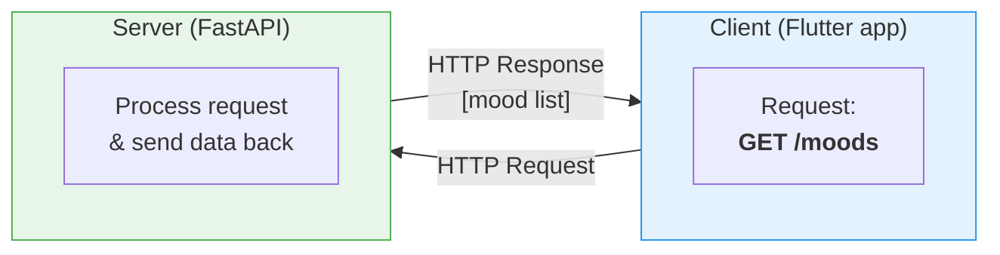
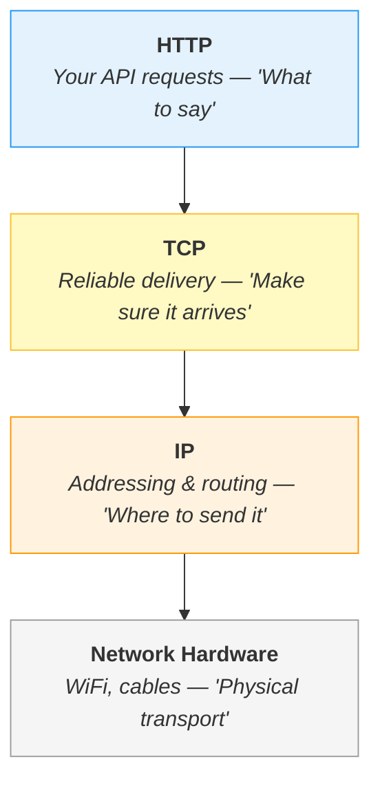
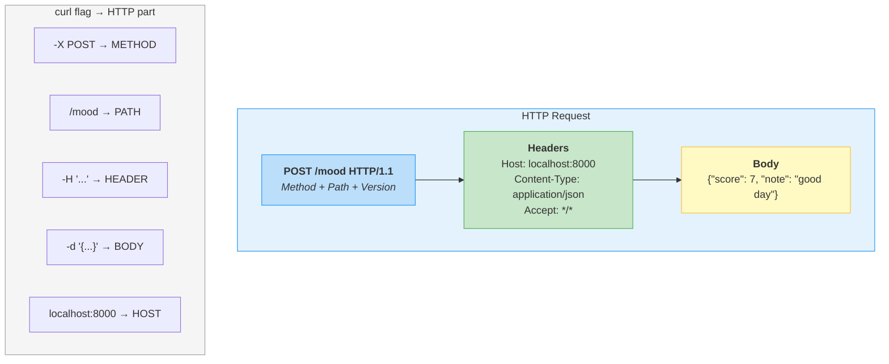
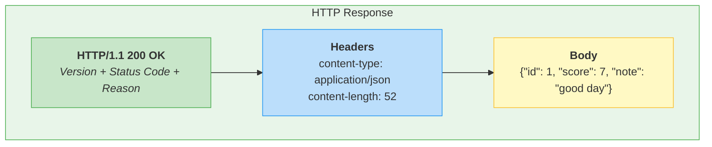

# Week 2 Lecture: HTTP Deep Dive, REST Architecture and API Design

<div class="lab-meta" markdown>
<div class="lab-meta__row"><span class="lab-meta__label">Course</span> Mobile Apps for Healthcare</div>
<div class="lab-meta__row"><span class="lab-meta__label">Duration</span> ~2 hours (including Q&A)</div>
<div class="lab-meta__row"><span class="lab-meta__label">Format</span> Student-facing notes with presenter cues</div>
</div>

<div class="grid cards" markdown>

- :material-target:{ .lg .middle } **Lecture Objectives**

    ---

    By the end of this lecture, you will understand:

    - How clients and servers communicate over the internet (DNS, TCP/IP, ports)
    - The anatomy of HTTP requests and responses
    - REST architecture and why it dominates modern API design
    - Practical API design principles (naming, versioning, pagination, errors)
    - Security fundamentals: HTTPS, authentication, authorization
    - How FHIR applies REST principles to healthcare data exchange

- :material-clock-outline:{ .lg .middle } **Time Estimate**

    ---

    | Section | Duration |
    |---------|----------|
    | 1. How the Internet Works | ~20 min |
    | 2. HTTP Deep Dive | ~25 min |
    | 3. REST Architecture | ~20 min |
    | 4. API Design Principles | ~15 min |
    | 5. Security Considerations | ~10 min |
    | 6. Key Takeaways | ~5 min |

</div>

> Lines marked with `> PRESENTER NOTE:` are for the instructor only. Students can
> ignore these or treat them as bonus context.

!!! tip "Remember from Week 1?"
    Last week you used `git push` to send code to GitHub over SSH. That connection used **HTTP's cousin** (the SSH protocol) running on top of TCP/IP --- the exact same networking stack you'll study today. The difference? SSH is optimized for secure shell access; HTTP is optimized for transferring web content and API data. Same foundation, different purpose.

---

## Table of Contents

1. [How the Internet Works](#1-how-the-internet-works-20-min) (20 min)
2. [HTTP Deep Dive](#2-http-deep-dive-25-min) (25 min)
3. [REST Architecture](#3-rest-architecture-20-min) (20 min)
4. [API Design Principles](#4-api-design-principles-15-min) (15 min)
5. [Security Considerations](#5-security-considerations-10-min) (10 min)
6. [Key Takeaways](#6-key-takeaways-5-min) (5 min)

---

## 1. How the Internet Works (20 min)

!!! abstract "TL;DR"
    The web is built on a ==client-server model== --- one machine asks, another responds. ==DNS== translates domain names to IP addresses. ==TCP/IP== ensures reliable delivery. ==Ports== distinguish between services on the same machine. These "abstract" protocols power every telemedicine call and health data exchange on the planet.

### The Big Picture

In the lab, you ran a server on `localhost:8000` and sent it requests with `curl`. Everything worked on your own machine. But the real world is more interesting -- your Flutter app will run on a phone in a patient's pocket, and the server will run on a machine in a data center thousands of kilometers away. How do they find each other?

Let's trace the journey of a single request.

### Client-Server Model

The web runs on a simple idea: one machine **asks** for something (the ==client==) and another machine **responds** (the ==server==). That is it. Every app on your phone, every website you visit, every API call you make -- it all comes down to this pattern.



In the lab, you played **both roles** on one machine -- `curl` was the client and FastAPI was the server. In production, these two live on ==completely different computers==, connected over the internet.

> PRESENTER NOTE: Ask students: "When you typed `curl localhost:8000/moods` in the
> lab, which part was the client and which was the server?" Make sure this is crystal
> clear before moving on.

### DNS: The Phone Book of the Internet

When you type `google.com` into a browser, your computer does not know where Google's server actually lives. It needs an ==IP address== -- a numerical address like `142.250.185.14`. ==DNS== (Domain Name System) translates human-readable names into these addresses.

**Analogy:** DNS is like a phone book. You know the name you want to reach ("google.com"), but you need the phone number (IP address) to actually make the call. Your computer asks a DNS server: "What is the IP address for google.com?" and gets back the number.

In the lab, you used `localhost`, which is a special name that always resolves to `127.0.0.1` -- ==your own machine==. No DNS lookup needed.

> PRESENTER NOTE: Demo DNS lookup live in the terminal:
> ```bash
> nslookup google.com
> ```
> Show students that a real domain name resolves to an IP address. Then try:
> ```bash
> nslookup localhost
> ```
> to show that localhost resolves to 127.0.0.1.

### TCP/IP: The Postal System of the Internet

We are not going to go deep into networking protocols -- that is an entire course of its own. But you need a ==mental model==.

The internet uses a ==layered system== of protocols. Think of it like sending a package through the postal system:

- **IP (Internet Protocol)** handles ==addressing== -- it makes sure your data packet knows where to go, like writing an address on an envelope.
- **TCP (Transmission Control Protocol)** handles ==reliable delivery== -- it breaks your message into packets, numbers them, sends them, and reassembles them at the other end. If a packet gets lost, TCP re-sends it.

HTTP -- the protocol you used in the lab -- runs **on top of** TCP. HTTP does not worry about how bytes get from point A to point B. It trusts TCP to handle that.



Each layer relies on the one below it. HTTP does not care about packets or routing -- it just sends a request and gets a response.

### Ports: Apartment Numbers for Your Computer

When you ran `localhost:8000`, the `8000` is a ==port number==. A single computer can run dozens of servers simultaneously. How does the operating system know which one should receive an incoming request? Ports.

**Analogy:** If an IP address is a building's street address, a port is the ==apartment number==. Mail addressed to "142.250.185.14:443" means: "Go to this building (IP), then deliver to apartment 443 (port)."

Common ports you will encounter:

| Port | Service |
|------|---------|
| 80   | HTTP (unencrypted web) |
| 443  | HTTPS (encrypted web) |
| 8000 | Common development port (FastAPI default) |
| 5432 | PostgreSQL database |
| 3000 | Common for Node.js/React development |

FastAPI defaults to port 8000 so it does not conflict with anything else running on your machine. You could change it to any available port.

### Healthcare Connection: These Protocols Power Telemedicine

!!! example "Healthcare Context: The Internet Beneath Every Health App"
    Every telemedicine video call, every remote patient monitoring device, every electronic health record system -- they all rely on ==these same protocols==:

    - **TCP/IP** carries heart rate data from a bedside monitor to a hospital dashboard
    - **DNS** routes requests from a patient's phone to their healthcare provider's servers
    - **Ports** let a single hospital server handle web traffic (443), API calls (8000), and database connections (5432) simultaneously
    - **HL7 FHIR** (Fast Healthcare Interoperability Resources) -- the dominant standard for health data exchange -- is built ==directly on top of HTTP and REST==

    The concepts you are learning today are exactly what power real healthcare systems worldwide.

> PRESENTER NOTE: Don't spend too much time on FHIR here -- we'll revisit it in
> Section 3. Just plant the seed that these "abstract" internet concepts have direct,
> life-and-death applications.

---

## 2. HTTP Deep Dive (25 min)

!!! abstract "TL;DR"
    HTTP is a ==request-response protocol==: the client sends a request (method + URL + headers + body), the server sends back a response (status code + headers + body). ==Methods== map to CRUD operations (GET=Read, POST=Create, PUT/PATCH=Update, DELETE=Delete). ==Status codes== tell you what happened (2xx=success, 4xx=your fault, 5xx=server's fault). ==JSON== is the universal data format for APIs.

### What HTTP Actually Is

HTTP stands for ==HyperText Transfer Protocol==. It is the language that clients and servers use to talk to each other. Every time your browser loads a page, every time your app fetches data, every time you ran `curl` in the lab -- HTTP was the conversation format.

HTTP is a ==request-response== protocol. The client sends a request, the server sends back a response. That is the entire conversation. The server never initiates contact -- it just waits for requests and responds to them.

~~HTTP is complicated and you need years of experience to understand it~~ --- it is actually just a structured text format with a method, URL, headers, and optional body. You used it in the lab on day one.

### Anatomy of an HTTP Request

In the lab, when you ran:

```bash
curl -X POST -H "Content-Type: application/json" -d '{"score": 7, "note": "good day"}' http://localhost:8000/mood
```

Each flag was setting a different part of the HTTP request. Let's break it apart:



An HTTP request has four key parts:

1. **Method** -- ==what action== you want to perform (GET, POST, PUT, DELETE, etc.)
2. **URL/Path** -- ==which resource== you are targeting (`/mood`, `/moods`, `/patients/123`)
3. **Headers** -- ==metadata== about the request (content type, authentication, etc.)
4. **Body** -- the ==actual data== you are sending (not all requests have a body)

> PRESENTER NOTE: Open a browser, go to any website, and open DevTools (F12) ->
> Network tab. Reload the page and click on any request. Walk through the request
> headers, response headers, and response body. Students should see that every
> page load involves dozens of HTTP requests. "Even loading Google's homepage
> sends 20+ HTTP requests."

### Anatomy of an HTTP Response

When the server responded to your `curl` request, it sent back something like this:



A response also has key parts:

1. **Status code** -- a number indicating ==what happened== (200 = success, 404 = not found, etc.)
2. **Headers** -- ==metadata== about the response
3. **Body** -- the ==data== the server is sending back

### HTTP Methods: The Verbs of the Web

HTTP defines several methods, each with a specific meaning:

| Method | Purpose | Has Body? | Lab Example |
|--------|---------|-----------|-------------|
| **GET** | Retrieve data | No | `curl localhost:8000/moods` |
| **POST** | Create new data | Yes | `curl -X POST -d '{...}' localhost:8000/mood` |
| **PUT** | Replace existing data entirely | Yes | Replace a full mood entry |
| **PATCH** | Update part of existing data | Yes | Update just the note on a mood |
| **DELETE** | Remove data | Usually no | Delete a mood entry |

These map directly to ==CRUD== operations -- a concept you will see everywhere:

| CRUD Operation | HTTP Method |
|---------------|-------------|
| **C**reate | POST |
| **R**ead | GET |
| **U**pdate | PUT / PATCH |
| **D**elete | DELETE |

In the lab, you used GET to read moods and POST to create them. You were doing ==CRUD without even knowing it==.

### Status Codes: What Happened?

Status codes are three-digit numbers grouped into categories. You do not need to memorize every code, but you need to know the ==categories==:

| Range | Meaning | Common Codes |
|-------|---------|-------------|
| 1xx | Informational | Rarely used directly |
| **2xx** | ==Success== | 200 OK, 201 Created |
| 3xx | Redirection | 301 Moved Permanently |
| **4xx** | ==Client error (YOUR fault)== | 400 Bad Request, 401 Unauthorized, 404 Not Found, 422 Unprocessable Entity |
| **5xx** | ==Server error (SERVER's fault)== | 500 Internal Server Error |

**Key codes to remember:**

- **200 OK** -- everything worked, here is your data
- **201 Created** -- your POST request succeeded, a new resource was created
- **400 Bad Request** -- the server could not understand your request (malformed data)
- **401 Unauthorized** -- you need to authenticate (log in)
- **403 Forbidden** -- you are authenticated but do not have permission
- **404 Not Found** -- the resource does not exist (you probably have the wrong URL)
- **422 Unprocessable Entity** -- the data format is right but the content is invalid
- **500 Internal Server Error** -- something broke on the server

~~A 4xx error means the server is broken~~ --- no, it means ==your request== was wrong. Check your URL, headers, and body first. The server is working fine; it just can't process what you sent.

> PRESENTER NOTE: Ask students: "Remember when you got a 422 error in the lab? That
> was FastAPI telling you that your JSON was structurally correct but failed validation
> -- maybe the mood score was out of range or a required field was missing. Pydantic
> caught it before your code even ran."

### Headers: The Metadata

Headers carry extra information about the request or response. The most important ones:

- **Content-Type** -- tells the server ==what format== the body is in (`application/json`, `text/html`, etc.)
- **Accept** -- tells the server ==what format== you want the response in
- **Authorization** -- carries your ==authentication credentials== (we will cover this in Week 9)
- **Content-Length** -- size of the body in bytes

When you used `-H "Content-Type: application/json"` in the lab, you were telling the server: "The data I'm sending is JSON. Please parse it as JSON."

??? protip "Pro tip: Always set Content-Type"
    If you forget to set `Content-Type: application/json`, the server might try to parse your JSON body as plain text or form data --- and fail with a confusing error. FastAPI usually catches this and returns a 422, but other servers might give you a cryptic 400 or 500. Always declare your content type explicitly.

### JSON: The Lingua Franca of APIs

==JSON== (JavaScript Object Notation) has become the standard format for API communication. It is human-readable, machine-parseable, and supported by every programming language.

```json
{
    "patient_id": 123,
    "name": "Jan Kowalski",
    "vitals": {
        "heart_rate": 72,
        "blood_pressure": "120/80",
        "temperature": 36.6
    },
    "medications": ["aspirin", "metformin"],
    "last_visit": "2026-02-15"
}
```

JSON supports: strings, numbers, booleans, arrays, nested objects, and null. That is enough to represent ==almost any data structure==.

In the lab, you sent and received JSON. FastAPI automatically converts between Python objects and JSON -- when you defined a Pydantic model, FastAPI ==serialized== it to JSON for the response and ==deserialized== incoming JSON into your model.

??? question "Think about it: Why JSON and not XML?"
    XML was the dominant data format before JSON. Compare:

    ```xml
    <patient>
        <name>Jan Kowalski</name>
        <heart_rate>72</heart_rate>
    </patient>
    ```

    vs.

    ```json
    {"name": "Jan Kowalski", "heart_rate": 72}
    ```

    JSON won because it is **shorter** (less bandwidth), **easier to read** (less visual noise), and **natively supported** by JavaScript (the language of the web). Many healthcare systems still use XML (especially older HL7 v2 messages), but FHIR uses JSON as its primary format. The industry is clearly moving toward JSON.

---

## 3. REST Architecture (20 min)

!!! abstract "TL;DR"
    REST is a set of ==architectural constraints==, not a protocol or library. The key idea: ==resources are nouns== (patient, mood, medication) and ==HTTP methods are verbs== (GET, POST, PUT, DELETE). This "uniform interface" means once you learn one REST API, every REST API feels familiar. ==FHIR== applies these exact principles to healthcare data.

### What REST Actually Means

REST stands for ==Representational State Transfer==. It was described by Roy Fielding in his PhD dissertation in 2000 and has become the dominant architecture for web APIs.

~~REST is a protocol you install or a library you import~~ --- it is actually a set of ==design rules==. Any API that follows these rules is "RESTful." Your FastAPI server from the lab was RESTful (mostly).

In the lab, your `/mood` and `/moods` endpoints followed REST principles without you necessarily knowing it. You used a noun (mood) as the resource and HTTP verbs (GET, POST) as the actions. That is REST in a nutshell.

> PRESENTER NOTE: Don't let students think REST is something you "install" or "turn on."
> It's a set of conventions. An API is RESTful if it follows the conventions.

### The REST Constraints

REST defines six constraints. You do not need to memorize them, but understanding the first four will make you a better API designer:

**1. Client-Server:** The client and server are ==separate and independent==. The client does not know how the server stores data. The server does not know what the client's UI looks like. They communicate only through the API.

**2. Stateless:** Each request from client to server must contain ==all the information== needed to understand the request. The server does not remember previous requests. Every request is independent.

**Analogy:** Think of a stateless server like a customer service line. Every time you call, you talk to a different person, and you have to explain your situation from scratch. Annoying for you, but it means the call center can ==scale to millions of customers== -- any representative can handle any call.

**3. Cacheable:** Responses can be marked as cacheable or non-cacheable. If a response is cacheable, the client can reuse it for subsequent identical requests instead of asking the server again.

**4. Uniform Interface:** All resources are accessed through a ==consistent, standardized interface==. This is the heart of REST design and what we will spend the most time on.

**5. Layered System:** The client does not need to know whether it is connected directly to the server or to an intermediary (load balancer, cache, proxy). This enables scaling.

**6. Code on Demand (optional):** The server can send executable code to the client (like JavaScript). This is the only optional constraint.

> PRESENTER NOTE: Don't spend too long on the theoretical constraints. Students need
> to understand statelessness (because it affects how they design their app) and uniform
> interface (because that is what API design is about). The rest can be briefly mentioned.

### Resources and URIs

In REST, everything is a ==resource==. A resource is any concept that can be named and addressed -- a patient, a mood entry, a list of medications, a lab result.

Each resource has a ==URI== (Uniform Resource Identifier) -- its address:

```
/patients              --> Collection of all patients
/patients/123          --> A specific patient (ID 123)
/patients/123/vitals   --> Vitals for patient 123
/patients/123/vitals/latest  --> Most recent vitals for patient 123

/moods                 --> Collection of all mood entries
/moods/42              --> A specific mood entry (ID 42)
```

Notice the pattern: resources are ==nouns==, arranged hierarchically. You never see verbs in the URL like `/getPatient` or `/deleteVitals` -- the ==HTTP method provides the verb==.

### The Uniform Interface in Practice

The power of REST is that once you know the pattern, you can ==guess how any REST API works==:

```
Resource: /patients/123

GET    /patients/123    --> Read patient 123
PUT    /patients/123    --> Replace patient 123's data entirely
PATCH  /patients/123    --> Update specific fields of patient 123
DELETE /patients/123    --> Delete patient 123

Resource: /patients (collection)

GET    /patients        --> List all patients
POST   /patients        --> Create a new patient
```

**==Nouns (resources) + Verbs (HTTP methods) = Uniform Interface==**

This is exactly what you built in the lab. Your endpoints:
- `GET /moods` -- read the collection of mood entries
- `POST /mood` -- create a new mood entry

You were following the uniform interface pattern.

> PRESENTER NOTE: Point out that the lab used `/mood` (singular) for POST and `/moods`
> (plural) for GET. In strict REST, you would typically use the plural form for
> everything: `POST /moods` to create, `GET /moods` to list, `GET /moods/42` to read
> one. We will refine the API design as the course progresses.

### FHIR: REST for Healthcare

!!! example "Healthcare Context: FHIR --- The Language Hospitals Speak"
    **FHIR** (Fast Healthcare Interoperability Resources) is the modern standard for healthcare data exchange. It is built ==directly on REST principles==. If you understand REST, you understand the foundation of FHIR.

    FHIR defines standard resources for healthcare:

    ```
    GET /Patient/123
    --> Returns patient demographics (name, DOB, address)

    GET /Observation?patient=123&code=heart-rate
    --> Returns heart rate observations for patient 123

    POST /MedicationRequest
    --> Creates a new medication order

    GET /Condition?patient=123
    --> Returns diagnoses/conditions for patient 123
    ```

    Notice how familiar this looks? It is the ==same pattern== -- nouns for resources, HTTP methods for actions, JSON for data. FHIR adds standardized resource definitions and terminologies on top, but the REST foundation is identical to what you built in the lab.

    Hospitals, insurance companies, and health apps use FHIR to exchange data. When your Apple Watch sends health data to your doctor's EHR (Electronic Health Record) system, FHIR is often the protocol in the middle.

> PRESENTER NOTE: If time allows, open https://hapi.fhir.org/ (a public FHIR test
> server) and show a live query. For example:
> ```bash
> curl https://hapi.fhir.org/baseR4/Patient?_count=2
> ```
> This returns real (synthetic) patient data in FHIR JSON format. Students can see
> that it follows the exact same request/response pattern they used in the lab.

??? question "Think about it: Why does healthcare need a standard like FHIR?"
    Imagine Hospital A uses `GET /patients/123` with fields `{first_name, last_name, dob}` and Hospital B uses `GET /people/123` with fields `{given_name, family_name, birth_date}`. Same data, completely different APIs. A patient transferring from A to B requires custom translation code.

    Now multiply this by ==thousands of hospitals, labs, pharmacies, and apps== --- all with their own formats. FHIR solves this by defining ==one universal format== that everyone agrees on. The same `Patient` resource structure works everywhere, reducing integration from months to days.

---

## 4. API Design Principles (15 min)

!!! abstract "TL;DR"
    Good API design uses ==plural nouns== for resources, ==HTTP methods== for actions, ==consistent casing==, and ==nested paths== for relationships. Always plan for ==versioning==, ==pagination==, and ==meaningful error responses== from day one. In healthcare, bad API design isn't just annoying --- it's ==dangerous==.

### Why API Design Matters

A well-designed API is a joy to use. A poorly designed API wastes hours of developer time, causes bugs, and makes systems fragile. Since APIs are the ==contracts== between systems, getting the design right matters enormously.

!!! example "Healthcare Context: When Bad API Design Harms Patients"
    In healthcare, bad API design can lead to ==data misinterpretation==. If an API returns temperature values but does not specify the unit (Celsius vs Fahrenheit), a downstream system might administer the wrong treatment. If a medication dosage field accepts free text instead of structured data with units, a "5 mg" vs "5 mL" confusion could be life-threatening.

    Standardized, well-documented APIs are not just a convenience -- they are a ==safety measure==.

### Naming Conventions

**Use plural nouns for collections:**

```
Good:                        Bad:
GET /moods                   GET /getMoods
GET /patients                GET /fetchAllPatients
POST /moods                  POST /createMood
DELETE /moods/42             POST /deleteMood?id=42
```

The resource name is a ==noun==. The HTTP method is the ==verb==. You do not need verbs in the URL.

**Use consistent casing:**

```
Good:                        Bad:
/blood-pressure-readings     /BloodPressureReadings
/blood_pressure_readings     /blood.pressure.readings
```

Pick one convention (kebab-case or snake_case) and ==stick with it== across your entire API.

**Nest resources to show relationships:**

```
/patients/123/moods          --> Moods belonging to patient 123
/patients/123/medications    --> Medications for patient 123
/hospitals/5/departments     --> Departments in hospital 5
```

### Versioning

APIs change over time. You add fields, remove endpoints, change response formats. But existing clients depend on the old format. How do you evolve the API without breaking everyone?

**API versioning:**

```
/api/v1/moods    --> Version 1 of the moods API
/api/v2/moods    --> Version 2 (maybe different response format)
```

Version 1 keeps working for existing clients. New clients use version 2. You eventually deprecate and remove old versions.

In the lab, your API had no versioning because it was a simple exercise. In production, you ==always version your API from day one==. Adding it later is painful.

### Pagination

What happens when you have 10,000 mood entries and the client requests `GET /moods`? Sending all 10,000 in one response is slow and wasteful.

==Pagination== breaks large responses into pages:

```
GET /moods?page=1&per_page=20    --> First 20 moods
GET /moods?page=2&per_page=20    --> Next 20 moods

Response:
{
    "data": [...],
    "page": 1,
    "per_page": 20,
    "total": 10000,
    "total_pages": 500
}
```

In healthcare, patient records can be enormous. A patient with a chronic condition might have ==thousands of observations== over years. Pagination is essential.

### Error Responses

When something goes wrong, the API should tell the client ==what== went wrong and ==why==:

```json
// Bad error response:
{
    "error": true
}

// Good error response:
{
    "detail": "Mood score must be between 1 and 10",
    "field": "score",
    "value_received": 15,
    "status_code": 422
}
```

A good error message tells the client ==exactly what to fix==. FastAPI and Pydantic do this automatically -- remember the detailed 422 responses you saw in the lab? That is good API design built into the framework.

??? protip "Pro tip: Error messages are user interface too"
    Think of API error messages as part of your app's user experience. When a developer (or a downstream system) gets an error, they need to understand ==what went wrong== and ==how to fix it== without reading your source code. Include the field name, the invalid value, and what was expected. "Mood score must be between 1 and 10, received 15" is infinitely more useful than "Bad Request."

### Documentation: OpenAPI and Swagger

In the lab, you visited `http://localhost:8000/docs` and saw an interactive API documentation page. That was ==Swagger UI==, automatically generated from your code by FastAPI using the ==OpenAPI specification==.

OpenAPI is a standard format for describing REST APIs. It defines:
- What endpoints exist
- What methods each endpoint accepts
- What parameters and request bodies are expected
- What responses are returned
- What data types and validation rules apply

FastAPI generates this ==automatically== from your Python type hints and Pydantic models. This is one of the reasons we chose FastAPI for this course -- you get ==production-quality documentation for free==.

> PRESENTER NOTE: Open the lab's FastAPI server and navigate to `/docs`. Walk through
> the Swagger UI. Show students how they can test endpoints directly from the browser.
> Then navigate to `/openapi.json` and show the raw OpenAPI specification. "This JSON
> file fully describes your API. Tools can read it to generate client code automatically
> -- you write the server, and the Flutter client code can be partially auto-generated."

### Idempotency

An operation is ==idempotent== if performing it multiple times has the same effect as performing it once.

- `GET /moods` -- ==idempotent==. Calling it 10 times returns the same data (assuming no changes in between). It does not modify anything.
- `DELETE /moods/42` -- ==idempotent==. Deleting the same resource twice has the same result: the resource is gone.
- `POST /moods` -- ==NOT idempotent==. Calling it 10 times creates 10 mood entries.

Why does this matter? Network requests can fail and be retried. If your app sends a POST request and the network drops before the response arrives, did the server process it or not? If you retry, you might create a duplicate entry.

!!! example "Healthcare Context: When Duplicate Requests Harm Patients"
    Imagine a system that submits a medication order via `POST /MedicationRequest`. The network hiccups. The system retries. Now the patient has ==two identical medication orders== --- potentially a ==double dose==.

    Designing for idempotency -- or handling duplicates gracefully (e.g., using idempotency keys) -- is critical in healthcare. This is not a theoretical concern; it is a real class of bugs that has caused patient harm.

---

## 5. Security Considerations (10 min)

!!! abstract "TL;DR"
    ==HTTPS== encrypts data in transit --- without it, patient data travels as plain text anyone can read. ==Authentication== verifies who you are (JWT tokens). ==Authorization== controls what you can do. ==Rate limiting== prevents abuse. ==Input validation== rejects malformed data before it causes harm. In healthcare, all of these are ==regulatory requirements== (HIPAA, GDPR), not optional features.

### HTTPS: Encryption in Transit

HTTP sends data in ==plain text==. Anyone between your device and the server (your WiFi router, your ISP, a hacker on the same network) can read every byte.

==HTTPS== adds **TLS encryption** on top of HTTP. The data is encrypted before it leaves your device and decrypted only at the server. Anyone intercepting the traffic sees only gibberish.

```mermaid
graph LR
    subgraph http["HTTP (unencrypted)"]
        c1["Client"] -->|'{"patient": "Jan",<br/>"diagnosis": "..."}' | s1["Server"]
        warn["Anyone on the network<br/>can read this!"]
    end
    subgraph https["HTTPS (encrypted)"]
        c2["Client"] -->|"a7#kQ!x9&mP2..."| s2["Server"]
        safe["Encrypted — unreadable<br/>without the key"]
    end
    style http fill:#ffcdd2,stroke:#e57373
    style https fill:#c8e6c9,stroke:#4caf50
    style warn fill:#f44336,stroke:#d32f2f,color:#fff
    style safe fill:#4caf50,stroke:#388e3c,color:#fff
```

In the lab, you used `http://localhost:8000` (no encryption) because you were talking to your own machine. Nobody else was on the network path. In production, you ==always use HTTPS==.

~~HTTPS slows down your app significantly~~ --- modern TLS is so optimized that the performance difference is negligible. There is ==no valid reason== to use plain HTTP in production, especially for health data.

### Authentication: Who Are You?

==Authentication== answers the question: **"Who is making this request?"**

Common approaches:

- **API Keys** -- a secret string sent with each request (simple but limited)
- **Username/Password** -- traditional but not ideal for APIs
- **JWT (JSON Web Tokens)** -- a token issued after login that proves your identity without sending credentials every time
- **OAuth 2.0** -- a protocol that lets users grant limited access without sharing passwords (e.g., "Log in with Google")

We will implement ==JWT-based authentication== in **Week 9**. For now, just understand the concept: the server needs some way to verify who is sending each request.

### Authorization: What Are You Allowed to Do?

Authentication is "==who are you?==" Authorization is "==what can you do?=="

A doctor might be authorized to view patient records. A patient might be authorized to view only their own records. An admin might be authorized to manage all users. Same system, different permissions.

```
Doctor's request:
  GET /patients/123/records  --> 200 OK (authorized)

Patient 456's request:
  GET /patients/123/records  --> 403 Forbidden (not your records)

Patient 123's request:
  GET /patients/123/records  --> 200 OK (your own records)
```

### Rate Limiting

==Rate limiting== prevents abuse by restricting how many requests a client can make in a given time period:

```
Client makes 100 requests in 1 minute...

Request 1-60:   200 OK       (within limit)
Request 61-100: 429 Too Many Requests (rate limited)
```

This protects the server from being overwhelmed -- whether by a buggy client, a denial-of-service attack, or simply too many users at once.

### Input Validation

==Never trust data from the client==. Always validate:

- Is the mood score within the expected range (1-10)?
- Is the patient ID a valid integer?
- Does the date field contain an actual date?
- Is the request body valid JSON?

In the lab, FastAPI and Pydantic handled this automatically. When you defined a Pydantic model with field types and constraints, FastAPI validated every incoming request against that model. Invalid data ==never reached your endpoint code== -- it was rejected with a 422 error.

Remember when you sent malformed data and got that detailed error response? That was ==Pydantic protecting your server==.

### Healthcare: Security Is Not Optional

!!! example "Healthcare Context: Regulatory Requirements for API Security"
    Patient health data is among the most sensitive data that exists. Regulations like **HIPAA** (United States) and **GDPR** (European Union) impose strict requirements:

    | Requirement | What it means |
    |---|---|
    | **Encryption in transit** | All data must be transmitted over ==HTTPS== (or equivalent) |
    | **Encryption at rest** | Stored data must be ==encrypted on disk== |
    | **Access controls** | Only ==authorized users== can access patient data |
    | **Audit logging** | Every access to patient data must be ==logged== (who, when, what) |
    | **Minimum necessary** | Systems should only request and share the ==minimum data needed== |

    Violating these regulations can result in massive fines and, more importantly, ==real harm to patients== whose data is exposed.

> PRESENTER NOTE: Briefly acknowledge the elephant in the room: "The API you built
> in the lab has absolutely zero security. Anyone who can reach the server can read
> and write all the data. No authentication, no encryption, no access controls. This
> is completely fine for learning -- we needed to start simple. But if this were a
> real healthcare app, it would be a compliance nightmare and a danger to patients.
> We will add authentication in Week 9 and discuss deployment security later."

### Preview: What's Coming in Week 9

We are going to implement proper authentication for our mood tracker API. You will:

- Add JWT-based login to FastAPI
- Protect endpoints so only authenticated users can access them
- Connect the Flutter app's login screen to the API
- Ensure each user can only access their own mood data

For now, focus on understanding the concepts. The implementation is coming.

---

## 6. Key Takeaways (5 min)

1. **HTTP is the foundation of web communication** -- every app you build will use it. Understanding ==request methods, status codes, and headers== gives you a mental model for debugging any API issue.

2. **REST provides a standardized way to design APIs** using ==resources (nouns)== and ==HTTP methods (verbs)==. Once you know the pattern, any REST API feels familiar.

3. **Status codes tell clients what happened** -- learn the major categories: ==2xx means success==, ==4xx means the client made a mistake==, ==5xx means the server broke==.

4. **Good API design uses nouns for resources, verbs for actions, and clear error messages.** ==Versioning, pagination, and documentation== are not afterthoughts -- plan for them from the start.

5. **Healthcare APIs follow the same REST principles** but with ==stricter security requirements==. FHIR is the standard, and it is built on everything you learned today.

6. **FastAPI gives you automatic validation, documentation, and type checking** -- a modern API framework that handles the tedious parts so you can ==focus on logic==.

---

## Quick Quiz

<quiz>
What does DNS do?

- [ ] Encrypts your internet traffic
- [x] Translates domain names (like google.com) into IP addresses
- [ ] Breaks data into packets for transmission
- [ ] Assigns port numbers to applications
</quiz>

<quiz>
Which HTTP method would you use to create a new mood entry?

- [ ] GET
- [x] POST
- [ ] PUT
- [ ] DELETE
</quiz>

<quiz>
What does a 404 status code mean?

- [ ] The server crashed
- [ ] Your request was malformed
- [x] The resource you requested does not exist
- [ ] You need to log in first
</quiz>

<quiz>
In REST, what should URLs contain?

- [ ] Verbs describing the action (e.g., /getMoods, /deleteMood)
- [x] Nouns representing resources (e.g., /moods, /patients/123)
- [ ] The database table name
- [ ] The programming language used on the server
</quiz>

<quiz>
Why is HTTPS essential for healthcare APIs?

- [ ] It makes the API faster
- [ ] It is required by the HTTP specification
- [x] It encrypts data in transit, preventing unauthorized reading of patient information
- [ ] It automatically validates JSON request bodies
</quiz>

<quiz>
What is idempotency?

- [ ] A method that always returns the same response format
- [ ] A request that requires authentication
- [x] An operation that produces the same result whether performed once or multiple times
- [ ] A way to paginate large API responses
</quiz>

---

!!! question "End-of-Lecture Reflection"
    Take 2 minutes to reflect on today's lecture:

    1. **What was the most surprising thing you learned?** (How DNS works? Status code categories? The FHIR standard? Idempotency risks in healthcare?)
    2. **If you had to explain REST to a classmate in one sentence**, what would you say?
    3. **How does the API you built in the lab connect to real healthcare systems?** Think about the gap between your unprotected `localhost:8000` server and a production FHIR endpoint at a hospital.

    Jot down your answers or discuss with your neighbor.

---

## Further Reading (Optional)

If you want to go deeper on any topic covered today:

- **HTTP overview:** [MDN Web Docs -- HTTP](https://developer.mozilla.org/en-US/docs/Web/HTTP/Overview) -- the best reference for all things HTTP
- **RESTful API design:** [RESTful API Best Practices](https://restfulapi.net/) -- practical guide to designing REST APIs
- **FHIR standard:** [HL7 FHIR](https://www.hl7.org/fhir/) -- the healthcare interoperability standard built on REST
- **FastAPI documentation:** [FastAPI](https://fastapi.tiangolo.com/) -- the framework you used in the lab, with excellent tutorials
- **HTTP status codes:** [HTTP Statuses](https://httpstatuses.com/) -- quick reference for every status code
- **OpenAPI specification:** [Swagger/OpenAPI](https://swagger.io/specification/) -- the standard behind FastAPI's auto-generated docs
