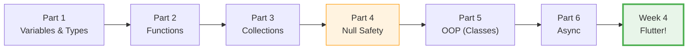
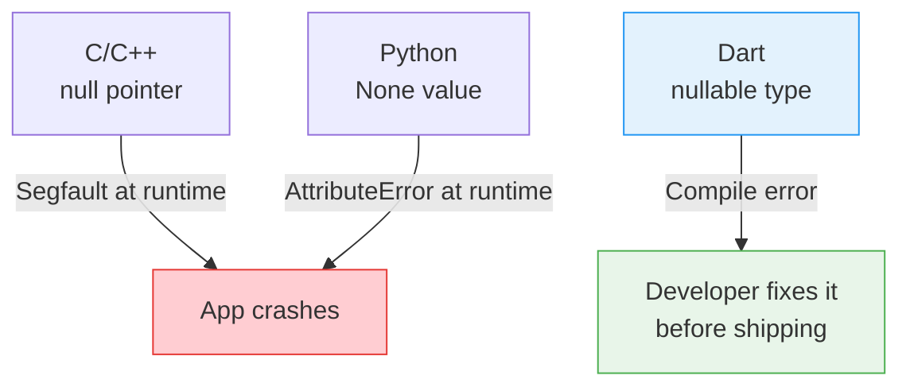
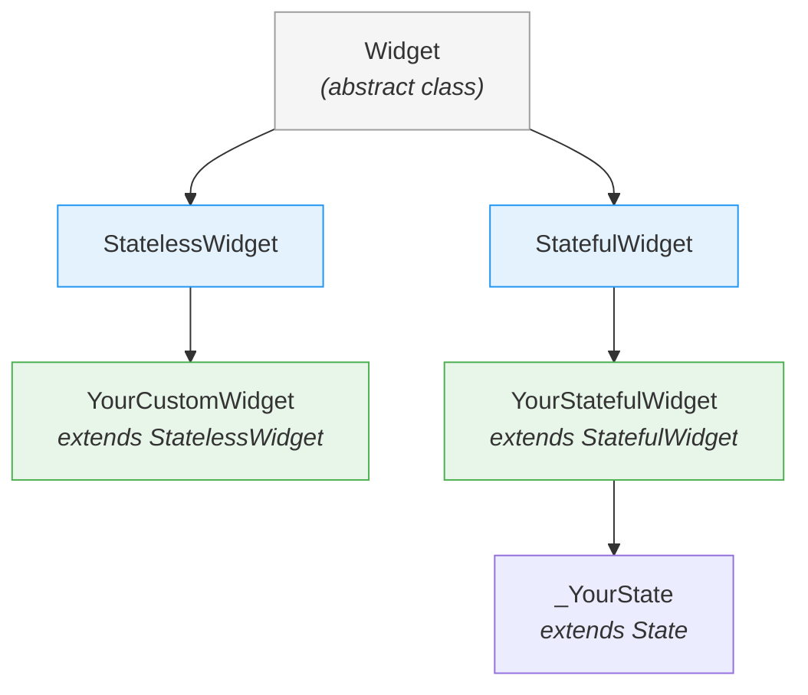
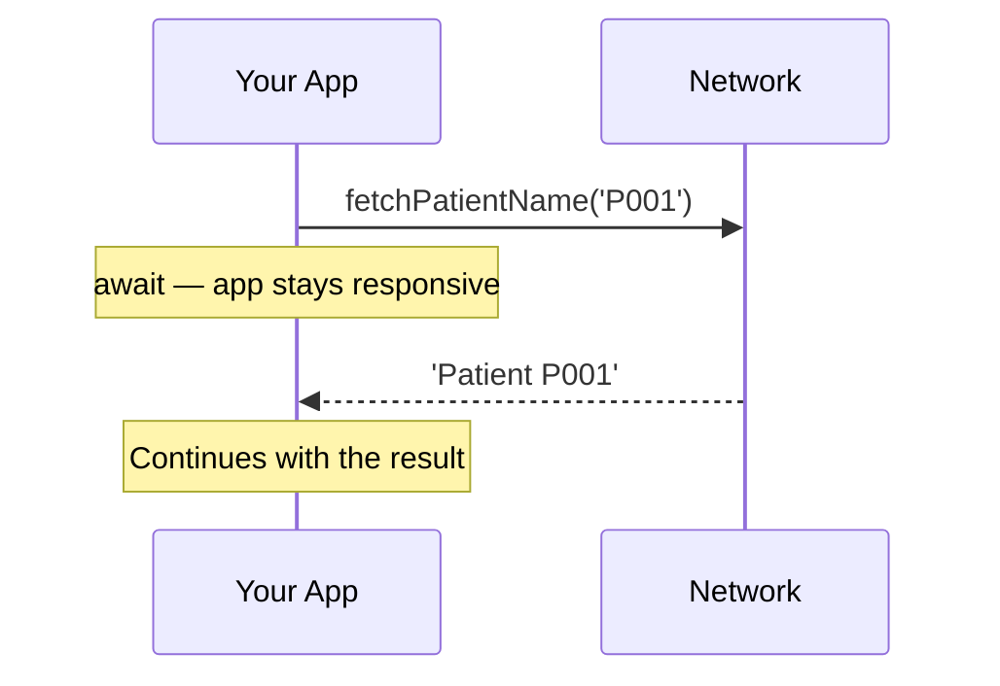

# Week 3 Lab -- Dart Fundamentals

<div class="lab-meta" markdown>
<div class="lab-meta__row"><span class="lab-meta__label">Course</span> Mobile Apps for Healthcare</div>
<div class="lab-meta__row"><span class="lab-meta__label">Duration</span> ~2 hours</div>
<div class="lab-meta__row"><span class="lab-meta__label">Prerequisites</span> Basic programming experience (Python, C/C++, or similar), basic terminal skills</div>
</div>

<div class="grid cards" markdown>

- :material-target:{ .lg .middle } **Learning Objectives**

    ---

    By the end of this lab, you will be able to:

    - [ ] Declare variables with Dart's type system (`var`, `final`, `const`)
    - [ ] Write functions with named parameters and arrow syntax
    - [ ] Use `List`, `Map`, and `Set` with functional-style methods
    - [ ] Handle nullable types safely with `?`, `??`, and `?.`
    - [ ] Build classes with constructors, inheritance, and mixins
    - [ ] Write async code with `Future`, `async`, and `await`

- :material-clock-outline:{ .lg .middle } **Time Estimate**

    ---

    | Section | Duration |
    |---------|----------|
    | Part 1: Variables & types | ~20 min |
    | Part 2: Functions | ~15 min |
    | Part 3: Collections | ~15 min |
    | Part 4: Null safety | ~20 min |
    | Part 5: OOP | ~25 min |
    | Part 6: Async | ~15 min |
    | Self-check & quiz | ~10 min |

</div>

!!! warning "No AI tools in Weeks 1–3"
    AI tools (ChatGPT, Copilot, etc.) are **not allowed** in Weeks 1–3. Write all code yourself.

!!! example "Healthcare context"
    Dart's strong type system and null safety are particularly valuable in healthcare apps. When processing a blood glucose reading, you want the compiler to guarantee that a `double glucoseValue` is never accidentally `null` or confused with a `String`. Type safety catches bugs at compile time that could otherwise lead to incorrect health data being displayed to patients.

!!! example "Think of it like... a phone's low-battery warning"
    Dart's null safety is like a **phone's low-battery warning** — it forces you to handle the 'what if there's nothing here?' case *before* your app crashes, not after.

---

## Environment Setup

Before you begin, make sure you have the Dart SDK installed and available in your terminal.

!!! note "Already installed Flutter?"
    If you installed the Flutter SDK in Week 0, **Dart is already included** — you can skip the installation below. Verify by running `dart --version`. If it works, jump straight to "Running Dart files."

### Install Dart SDK

=== "macOS"

    ```bash
    brew tap dart-lang/dart
    brew install dart
    ```

=== "Linux"

    ```bash
    sudo apt-get update
    sudo apt-get install apt-transport-https
    sudo sh -c 'wget -qO- https://dl-ssl.google.com/linux/linux_signing_key.pub | apt-key add -'
    sudo sh -c 'wget -qO- https://storage.googleapis.com/download.dartlang.org/linux/debian/dart_stable.list > /etc/apt/sources.list.d/dart_stable.list'
    sudo apt-get update
    sudo apt-get install dart
    ```

=== "Windows"

    ```powershell
    choco install dart-sdk
    ```

    If you don't have Chocolatey, you can install Dart via the [official installer](https://dart.dev/get-dart) or use `winget install Dart.Dart-SDK`.

**Verify installation:**

```bash
dart --version
```

You should see output like `Dart SDK version: 3.x.x`. Any 3.x version is fine.

### Running Dart files

```bash
dart run my_file.dart
```

> **Note:** You can also use the shorthand `dart my_file.dart` (without `run`), which works identically. This course uses `dart run` for clarity.

### Lab files

The exercise files are provided in the course materials at:

```
week-03-dart-fundamentals/lab/
├── exercises.dart              # All exercises for Parts 1-6
└── mood_logger_template.dart   # Starter template for the assignment
```

These files are in the course materials repository you cloned in Week 0 (see [Getting Ready](../../resources/GETTING_READY.md#step-8-clone-the-course-materials-repository)). Open `exercises.dart` in your editor. Each exercise is a function stub with a `// TODO` marker. Implement the function body, then run the file to test your solutions. The `main()` function at the bottom calls each exercise so you can see the output.

Here's an overview of what you'll learn today and how it connects to Flutter:



---

## Part 1: Variables, Types & Basics (~20 min)

!!! abstract "TL;DR"
    Dart is the language Flutter runs on. If you know Python or C++, you already know 70% of Dart.

!!! tip "Remember from Week 2?"
    In Week 2, you used Python with FastAPI to build a REST API. Dart is similar in many ways — both have `async`/`await`, both support classes, and both use type annotations. The biggest difference: ==Dart's types are enforced at compile time==, not just at runtime.

~~Dart is just Java with different syntax~~ — Dart has null safety, pattern matching, records, and extension methods that Java still doesn't have.

Dart is a statically typed language, similar to C++ but with modern conveniences like type inference (similar to `auto` in C++11 or Python's dynamic typing, except the type is still checked at compile time).

### Core types

| Dart type  | C/C++ equivalent    | Python equivalent | Example                |
|------------|----------------------|-------------------|------------------------|
| `int`      | `int` / `long`       | `int`             | `int age = 25;`        |
| `double`   | `double`             | `float`           | `double temp = 36.6;`  |
| `String`   | `std::string`        | `str`             | `String name = 'Ada';` |
| `bool`     | `bool`               | `bool`            | `bool alive = true;`   |
| `var`      | `auto`               | _(default)_       | `var x = 42;`          |

### Type inference with `var`

```dart
var patientName = 'John';   // Dart infers String
var heartRate = 72;          // Dart infers int
// patientName = 42;         // ERROR: patientName is locked to String
```

This is like `auto` in C++, not like Python where you can reassign any type to a variable.

### `final` vs `const`

Both prevent reassignment, but they differ in **when** the value is determined:

| Keyword | When resolved | C++ analogy | Example |
|---------|---------------|-------------|---------|
| `final` | At **runtime** | `const` on a variable you set once at runtime | `final now = DateTime.now();` |
| `const` | At **compile time** | `constexpr` | `const pi = 3.14159;` |

Think of `final` as "set once, never change" and `const` as "known before the program even runs."

```dart
final timestamp = DateTime.now();  // OK: computed at runtime
// const timestamp = DateTime.now();  // ERROR: DateTime.now() is not a compile-time constant

const maxHeartRate = 220;  // OK: literal value, known at compile time
```

!!! tip "Remember from Week 1?"
    In Week 1, you used `git commit -m` to save snapshots. Dart's `final` keyword is the same idea — once set, it can't change. Both protect against accidental modifications.

### String interpolation

Dart uses `$variable` and `${expression}` inside strings -- similar to Python f-strings but with a `$` instead of `{}`:

```dart
String name = 'Alice';
int age = 23;

// Simple variable:
print('Hello, $name!');

// Expression:
print('Next year you will be ${age + 1}.');

// Multi-line strings (like Python triple quotes):
String report = '''
Patient: $name
Age: $age
Status: stable
''';
```

### Exercises

Complete **Exercises 1 and 2** in `exercises.dart`.

---

### Self-Check: Part 1

- [ ] You can declare variables with explicit types (`int`, `String`) and with `var`
- [ ] You can explain the difference between `final` (runtime) and `const` (compile-time)
- [ ] You can use string interpolation with `$variable` and `${expression}`
- [ ] Exercises 1 and 2 produce the expected output when you run the file

!!! success "Checkpoint: Part 1 complete"
    You know Dart's type system — explicit types, `var` inference, `final`,
    and `const`. Every Flutter widget you write will use these declarations.

---

## Part 2: Functions (~15 min)

!!! abstract "TL;DR"
    Dart functions support arrow syntax (`=>`), named parameters (`{required String name}`), and optional parameters — everything you need for clean Flutter widget constructors.

Dart functions will feel familiar coming from both C++ and Python, but with some unique features.

### Basic functions (like C++)

```dart
double calculateBMI(double weightKg, double heightM) {
  return weightKg / (heightM * heightM);
}
```

### Arrow syntax (for one-expression bodies)

```dart
double calculateBMI(double weightKg, double heightM) => weightKg / (heightM * heightM);
```

This is similar to Python lambdas but can be used for named functions too.

### Named parameters (like Python keyword arguments)

```dart
void logVitals({required String patientId, required int heartRate, double? temperature}) {
  print('Patient $patientId: HR=$heartRate, Temp=${temperature ?? "N/A"}');
}

// Calling:
logVitals(patientId: 'P001', heartRate: 72, temperature: 36.6);
logVitals(patientId: 'P002', heartRate: 80);  // temperature is optional
```

Key differences from Python:

- Named parameters go inside `{}` in the function signature.
- You must mark each required named parameter with `required`.
- Optional named parameters can have default values: `{int heartRate = 60}`.

### Positional optional parameters

```dart
String formatName(String first, String last, [String? title]) {
  if (title != null) return '$title $first $last';
  return '$first $last';
}

print(formatName('Marie', 'Curie'));            // Marie Curie
print(formatName('Marie', 'Curie', 'Dr.'));     // Dr. Marie Curie
```

??? protip "Pro tip"
    In Flutter, almost every widget uses named parameters: `Text('Hello', style: TextStyle(fontSize: 16))`.
    Learning named parameters now means widget constructors will feel natural next week.

### Exercises

Complete **Exercises 3 and 4** in `exercises.dart`.

---

### Self-Check: Part 2

- [ ] You can write functions with explicit return types and arrow syntax (`=>`)
- [ ] You understand the difference between named parameters (`{required String name}`) and positional parameters
- [ ] Exercises 3 and 4 produce the expected output

!!! success "Checkpoint: Part 2 complete"
    You can write Dart functions with explicit types, arrow syntax,
    and named parameters. These patterns appear in every Flutter widget
    you'll build starting next week.

---

## Part 3: Collections (~15 min)

!!! abstract "TL;DR"
    `List`, `Map`, and `Set` — plus functional methods like `.where()`, `.map()`, and `.fold()` that replace loops for filtering and transforming data.

Dart has three core collection types. If you know Python lists, dicts, and sets, these map directly.

### List (like Python `list` / C++ `std::vector`)

```dart
List<int> heartRates = [72, 78, 65, 80, 91];

heartRates.add(85);                             // append
heartRates.length;                              // 6

// Functional-style operations (similar to Python list comprehensions):
var elevated = heartRates.where((hr) => hr > 80).toList();   // filter
var doubled  = heartRates.map((hr) => hr * 2).toList();      // transform
var total    = heartRates.fold(0, (sum, hr) => sum + hr);    // reduce/aggregate
```

The `=>` inside `.where()` and `.map()` is an anonymous function (like a C++ lambda or Python lambda).

### Map (like Python `dict` / C++ `std::map`)

```dart
Map<String, int> vitalSigns = {
  'heartRate': 72,
  'systolic': 120,
  'diastolic': 80,
};

vitalSigns['heartRate'];           // 72
vitalSigns['spO2'] = 98;           // add a new entry

// Iterate:
vitalSigns.forEach((key, value) {
  print('$key: $value');
});
```

### Set (like Python `set` / C++ `std::set`)

```dart
Set<String> allergies1 = {'penicillin', 'aspirin'};
Set<String> allergies2 = {'aspirin', 'ibuprofen'};

var common = allergies1.intersection(allergies2);  // {'aspirin'}
var all    = allergies1.union(allergies2);          // {'penicillin', 'aspirin', 'ibuprofen'}
```

!!! warning "Common mistake"
    Forgetting `.toList()` after `.where()` or `.map()`. These methods return
    lazy iterables, not lists. If you need a `List`, call `.toList()` at the end.
    Without it, you'll get type errors when passing the result to a function
    expecting `List<T>`.

!!! example "Try it live: Collection methods"
    Copy this code into [DartPad](https://dartpad.dev/) and experiment with `.where()`, `.map()`, and `.reduce()` on patient records. Try adding a new patient or changing the glucose threshold.

    ```dart
    class PatientRecord {
      final String name;
      final int age;
      final double glucoseLevel;

      PatientRecord(this.name, this.age, this.glucoseLevel);

      @override
      String toString() => '$name (age $age, glucose: $glucoseLevel)';
    }

    void main() {
      final patients = [
        PatientRecord('Alice', 34, 95.2),
        PatientRecord('Bob', 67, 142.8),
        PatientRecord('Carol', 45, 88.1),
        PatientRecord('Dave', 72, 198.5),
        PatientRecord('Eve', 29, 102.3),
      ];

      // .where() — filter patients with elevated glucose (>100)
      final elevated = patients.where((p) => p.glucoseLevel > 100).toList();
      print('Elevated glucose:');
      elevated.forEach(print);

      // .map() — extract just the names
      final names = patients.map((p) => p.name).toList();
      print('\nAll patients: $names');

      // .reduce() — find the highest glucose reading
      final highest = patients.reduce(
        (a, b) => a.glucoseLevel > b.glucoseLevel ? a : b,
      );
      print('\nHighest glucose: $highest');

      // Challenge: compute the average glucose level
      final avg = patients
          .map((p) => p.glucoseLevel)
          .reduce((a, b) => a + b) / patients.length;
      print('Average glucose: ${avg.toStringAsFixed(1)}');
    }
    ```

    <!-- TODO: Replace code block with iframe once Gist is created:
    <iframe src="https://dartpad.dev/embed-inline.html?id=GIST_ID&theme=dark&run=true&split=60"
      style="width:100%; height:400px; border:1px solid var(--md-default-fg-color--lightest); border-radius:8px;">
    </iframe>
    -->

### Exercises

Complete **Exercises 5 and 6** in `exercises.dart`.

---

### Self-Check: Part 3

- [ ] You can create and manipulate `List`, `Map`, and `Set` collections
- [ ] You can use `.where()`, `.map()`, and `.fold()` for functional-style operations
- [ ] You understand that `List<int>` means a list that can only contain integers (generic types)

!!! success "Checkpoint: Part 3 complete"
    You can work with Dart's collection types and functional methods.
    In Flutter, you'll use `.map()` constantly to turn lists of data
    into lists of widgets.

---

## Part 4: Null Safety (~20 min)

!!! abstract "TL;DR"
    Null safety means Dart won't let you accidentally use a value that doesn't exist. Add `?` to make a type nullable, use `??` for defaults.

This is one of Dart's most important features and one of the biggest differences from C++ and Python. Dart's type system ==**guarantees** that a non-nullable variable can never be `null`== -- this eliminates an entire class of bugs.

### The problem (from your experience)

- **C/C++:** Dereferencing a null pointer causes a segfault. The compiler does not prevent it.
- **Python:** Accessing an attribute on `None` causes `AttributeError` at runtime. No static check.
- **Dart:** The compiler **refuses to compile** code that might use a null value unsafely.



### Non-nullable by default

```dart
String name = 'Alice';  // Can NEVER be null
// name = null;          // COMPILE ERROR
```

### Nullable types with `?`

```dart
String? middleName;       // Can be null (defaults to null)
print(middleName);        // prints: null

// You CANNOT call methods on a nullable type without checking first:
// print(middleName.length);  // COMPILE ERROR
```

### Null-aware operators

| Operator | Name | Example | Meaning |
|----------|------|---------|---------|
| `??` | If-null | `name ?? 'Unknown'` | Use `name` if non-null, otherwise `'Unknown'` |
| `?.` | Conditional access | `name?.length` | Access `length` only if `name` is non-null, otherwise `null` |
| `!` | Null assertion | `name!` | "I promise this is not null" (throws if it is) |
| `??=` | If-null assignment | `name ??= 'Default'` | Assign only if currently null |

```dart
String? diagnosis;

// Safe: use ?? to provide a default
String label = diagnosis ?? 'No diagnosis';

// Safe: use ?. for conditional access
int? length = diagnosis?.length;  // null (no crash)

// Dangerous: use ! only when you are CERTAIN it is not null
// String sure = diagnosis!;  // Would throw at runtime!
```

!!! example "Try it live: Null safety playground"
    Copy this code into [DartPad](https://dartpad.dev/) and experiment. Try removing the `?` from `String?` and watch the compiler error appear.

    ```dart
    void main() {
      // Try removing the ? from String? — what happens?
      String? diagnosis;

      // ?? (if-null) — provides a safe fallback
      String label = diagnosis ?? 'No diagnosis';
      print('Label: $label');

      // ?. (conditional access) — safe property access
      int? length = diagnosis?.length;
      print('Length: $length'); // null, no crash!

      // Now assign a value and try again
      diagnosis = 'Hypertension';
      label = diagnosis ?? 'No diagnosis';
      print('Label: $label');
      print('Length: ${diagnosis?.length}');

      // ??= assigns ONLY if currently null
      String? medication;
      medication ??= 'Aspirin';
      print('Medication: $medication');
      medication ??= 'Ibuprofen'; // Does NOT reassign
      print('Still: $medication');

      // Challenge: uncomment the line below — what happens?
      // String sure = null!;
    }
    ```

    <!-- TODO: Replace code block with iframe once Gist is created:
    <iframe src="https://dartpad.dev/embed-inline.html?id=GIST_ID&theme=dark&run=true&split=60"
      style="width:100%; height:400px; border:1px solid var(--md-default-fg-color--lightest); border-radius:8px;">
    </iframe>
    -->

!!! warning "Common mistake"
    ==Prefer `??` (fallback) over `!` (null assertion).== Using `!` tells Dart
    "I promise this is not null" — but if you're wrong, the app crashes at
    runtime. Use `??` to provide a safe default value instead.

### The `late` keyword

Use `late` when you know a variable will be initialized before it is used, but you cannot initialize it at declaration time:

```dart
late String patientId;

void loadPatient() {
  patientId = 'P-12345';  // Initialized later
}

void printPatient() {
  print(patientId);  // OK if loadPatient() was called first
}
```

Use `late` sparingly -- if you get it wrong, you get a runtime error instead of a compile-time error.

### Exercises

Complete **Exercises 7 and 8** in `exercises.dart`.

---

### Self-Check: Part 4

- [ ] You can explain why `String` cannot be `null` but `String?` can
- [ ] You know when to use `??` (default), `?.` (conditional access), and `!` (assertion) — and why `!` is dangerous
- [ ] You understand that Dart catches null errors **at compile time**, unlike C++ (segfault) or Python (runtime AttributeError)

??? question "Scenario: The disconnected sensor"
    A medical device sends you a JSON payload where the `heartRate` field is sometimes `null` (sensor disconnected). Write a Dart function signature that handles this safely without crashing.

    ??? success "Answer"
        ```dart
        int getHeartRate(Map<String, dynamic> json) {
          final heartRate = json['heartRate'] as int?;
          return heartRate ?? 0; // Default to 0 if null
        }
        ```
        The `int?` type annotation tells Dart this value might be null. The `??` operator provides a fallback value. This is null safety in action — you *must* handle the null case before using the value.

!!! success "Checkpoint: Part 4 complete"
    You understand Dart's null safety system — nullable types, `??`,
    `?.`, and `!`. This is the #1 feature that prevents crashes in
    production Flutter apps.

??? protip "Pro tip"
    Run `dart fix --apply` in your project directory to auto-fix common null
    safety warnings — it handles most mechanical migrations for you.

---

## Part 5: Object-Oriented Programming (~25 min)

!!! abstract "TL;DR"
    Classes in Dart are like C++ classes but shorter — `this.fieldName` constructors, `@override`, and mixins for shared behavior.

~~You need to understand OOP perfectly before using Flutter~~ — you need the basics (classes, constructors, inheritance). Flutter's widget system will teach you the rest through practice.

Dart is a fully object-oriented language. If you know C++ classes, you will find Dart familiar but more concise.

### Basic class

```dart
class Patient {
  String name;
  int age;
  String? diagnosis;  // nullable -- patient may not have a diagnosis yet

  // Constructor (shorthand -- Dart assigns fields automatically)
  Patient(this.name, this.age, {this.diagnosis});

  // Method
  String summary() => '$name, age $age, diagnosis: ${diagnosis ?? "pending"}';
}

// Usage:
var p = Patient('Alice', 30, diagnosis: 'Hypertension');
print(p.summary());
```

Compare to C++: no header file, no `new` keyword needed, `this.name` in the constructor parameter list auto-assigns the field.

### Named constructors

```dart
class Temperature {
  double celsius;

  Temperature(this.celsius);

  // Named constructor
  Temperature.fromFahrenheit(double f) : celsius = (f - 32) * 5 / 9;

  // Factory constructor (can return cached instances, subtypes, etc.)
  factory Temperature.normal() => Temperature(36.6);
}

var t1 = Temperature(37.0);
var t2 = Temperature.fromFahrenheit(98.6);
var t3 = Temperature.normal();
```

### Getters and setters

```dart
class BloodPressure {
  int systolic;
  int diastolic;

  BloodPressure(this.systolic, this.diastolic);

  // Getter (computed property)
  String get category {
    if (systolic < 120 && diastolic < 80) return 'Normal';
    if (systolic < 130 && diastolic < 80) return 'Elevated';
    return 'High';
  }
}
```

### Inheritance

```dart
class Person {
  String name;
  int age;

  Person(this.name, this.age);

  String introduce() => 'I am $name, age $age.';
}

class Doctor extends Person {
  String specialization;

  Doctor(super.name, super.age, this.specialization);

  @override
  String introduce() => '${super.introduce()} Specialization: $specialization.';
}
```

### Abstract classes

```dart
abstract class Shape {
  double area();      // No body -- subclasses MUST implement this
  String describe();  // Same
}

class Circle extends Shape {
  double radius;
  Circle(this.radius);

  @override
  double area() => 3.14159 * radius * radius;

  @override
  String describe() => 'Circle with radius $radius';
}
```

### Mixins

Mixins are Dart's way of sharing behavior across unrelated classes -- something C++ achieves with multiple inheritance and Python with mixins/multiple inheritance. In Dart, you use the `with` keyword:

```dart
mixin Loggable {
  void log(String message) {
    print('[${DateTime.now()}] $message');
  }
}

mixin Serializable {
  Map<String, dynamic> toJson();
}

class Patient extends Person with Loggable, Serializable {
  String? diagnosis;

  Patient(super.name, super.age, {this.diagnosis});

  @override
  Map<String, dynamic> toJson() => {
    'name': name,
    'age': age,
    'diagnosis': diagnosis,
  };
}

// Usage:
var p = Patient('Bob', 45, diagnosis: 'Flu');
p.log('Patient created');   // from Loggable mixin
print(p.toJson());          // from Serializable mixin
```

Mixins solve the diamond problem of multiple inheritance by applying a linear ordering. Think of them as "plug-in behaviors" you can attach to any class.

Here's how the OOP hierarchy you just learned maps to Flutter:



### Exercises

Complete **Exercises 9 and 10** in `exercises.dart`.

---

### Self-Check: Part 5

- [ ] You can create a Dart class with a constructor using `this.fieldName` shorthand
- [ ] You understand inheritance (`extends`) and method overriding (`@override`)
- [ ] You can explain what an abstract class is and why you cannot instantiate one
- [ ] You know that mixins (`with`) add behavior to a class without inheritance

??? question "Scenario: Modeling a patient record"
    Design a `Patient` class with `name`, `age`, and an optional `diagnosis`. Include a `toJson()` method. What type should `diagnosis` be and why?

    ??? success "Answer"
        `diagnosis` should be `String?` (nullable) because a patient may not have a diagnosis yet. Using `String` would force you to invent a placeholder value like `'N/A'`, which pollutes your data. With `String?`, the absence of a diagnosis is represented by `null` — and Dart's null safety forces every caller to handle that case explicitly.

??? challenge "Stretch Goal: Implement an interface"
    Create a `Measurable` abstract class with an `double measure()` method. Implement it in `HeartRate`, `BloodPressure`, and `Temperature` classes. Then write a function that takes a `List<Measurable>` and prints all readings.

    *Hint:* In Dart, every class implicitly defines an interface. You can use `extends` or `implements`.

!!! success "Checkpoint: Part 5 complete"
    You can build Dart classes with constructors, inheritance, abstract
    classes, and mixins. Next week, every Flutter widget you write will
    be a class that extends `StatelessWidget` or `StatefulWidget`.

---

## Part 6: Async Programming (~15 min)

!!! abstract "TL;DR"
    `async`/`await` lets your app stay responsive while waiting for slow operations like network calls or database queries.

~~Async means multithreading~~ — it doesn't. Dart is single-threaded. `async`/`await` is cooperative multitasking: your code voluntarily pauses at `await` points, letting other work run. No thread locks, no race conditions.

Healthcare apps frequently make network calls (fetching patient data, sending readings to a server). These operations are slow compared to local computation. Async programming lets your app stay responsive while waiting.

### The problem

```
fetchPatientData();   // Takes 2 seconds (network call)
print('Done!');       // Should this wait or run immediately?
```

### `Future<T>` -- a promise of a value

A `Future` is Dart's version of:
- C++: `std::future<T>` / `std::async`
- Python: `asyncio.Future` / a coroutine

It represents a value that will be available **sometime in the future**.

```dart
Future<String> fetchPatientName(String id) async {
  // Simulate a network delay
  await Future.delayed(Duration(seconds: 2));
  return 'Patient $id';
}
```

### `async` / `await`

Mark a function `async` to use `await` inside it. `await` pauses execution until the `Future` completes.

```dart
Future<void> main() async {
  print('Fetching...');
  String name = await fetchPatientName('P001');
  print('Got: $name');
  print('Done!');
}
// Output:
// Fetching...
// (2-second pause)
// Got: Patient P001
// Done!
```

This is almost identical to Python's `async`/`await`. The key difference: in Dart, `async` functions always return a `Future`, and you must declare the return type accordingly.



### Error handling

```dart
Future<void> loadData() async {
  try {
    var data = await fetchPatientName('P001');
    print(data);
  } catch (e) {
    print('Error: $e');
  }
}
```

!!! warning "Common mistake"
    Forgetting `await` before an async call. Without `await`, the function returns
    a `Future` object instead of the actual value, and your code continues before
    the operation finishes. If you see `Instance of 'Future<String>'` printed,
    you forgot `await`.

### Exercises

Complete **Exercises 11 and 12** in `exercises.dart`.

---

### Self-Check: Part 6

- [ ] You can explain what `Future<String>` means — a value that will be a String sometime later
- [ ] You know that `async` marks a function as asynchronous and `await` pauses until a Future completes
- [ ] You can use `try`/`catch` to handle errors in async code
- [ ] You see the connection to Python's `async`/`await` — the concept is the same, just different syntax

??? challenge "Stretch Goal: Friendly Duration"
    Write a `Duration` extension method called `toFriendly()` that returns strings like `'2h 30m'` or `'45s'`. Handle edge cases (0 duration, negative values).

    *Hint:* Access `.inHours`, `.inMinutes`, and `.inSeconds` on the `Duration` object.

!!! success "Checkpoint: Part 6 complete"
    You can write async Dart code with `Future`, `async`, and `await`.
    Every network call and database query in your Flutter app will use
    these patterns.

> **Healthcare Context: Why Dart's Type Safety Matters in mHealth**
>
> The language features you learned today are not just academic — they directly prevent real bugs in health software:
> - **Null safety** prevents the #1 runtime crash in mobile apps. In a medication reminder app, a null dose value could mean a patient sees no reminder at all.
> - **Strong typing** catches unit confusions at compile time. A function expecting `double bloodGlucoseMmol` won't accidentally accept `int bloodGlucoseMgDl` — the kind of conversion error that has caused real patient harm.
> - **Async/await** ensures your app stays responsive while syncing health data. A frozen UI during a vital-signs upload makes clinicians think the app crashed.
> - **IEC 62304** (medical device software) recommends using languages with strong type systems to reduce defect density. ==Dart's compile-time guarantees are a regulatory advantage.==

---

## Reading User Input

The assignment below requires reading input from the terminal. Dart provides `stdin.readLineSync()` from the `dart:io` library:

```dart
import 'dart:io';

void main() {
  stdout.write('Enter your name: ');  // print without a newline
  String? name = stdin.readLineSync();
  print('Hello, $name!');

  stdout.write('Enter your age: ');
  int age = int.parse(stdin.readLineSync()!);  // ! because we expect non-null input
  print('Next year you will be ${age + 1}.');
}
```

Key points:

- `stdin.readLineSync()` returns `String?` (nullable) because the user might press Ctrl+D (end of input).
- Use `int.parse()` or `double.parse()` to convert string input to numbers.
- Use `stdout.write()` instead of `print()` when you want the cursor to stay on the same line (for a prompt).

---

## Individual Assignment: CLI Mood Logger

Build a command-line mood tracking application in Dart. A starter template is provided in `mood_logger_template.dart`.

### Requirements

1. **MoodEntry class** with:
   - `DateTime timestamp`
   - `int score` (1--10)
   - `String note`
   - A method to return a formatted string representation

2. **MoodLogger class** with:
   - A list to store `MoodEntry` objects
   - `addEntry(int score, String note)` -- adds a new entry with the current timestamp
   - `getAllEntries()` -- returns all entries
   - `getAverageScore()` -- computes and returns the average mood score
   - `getEntriesAbove(int threshold)` -- returns entries with score above the threshold

3. **Interactive CLI** (`main` function):
   - Display a menu: (1) Add entry, (2) View all entries, (3) View average, (4) Filter by score, (5) Quit
   - Read user input and execute the chosen action
   - Loop until the user quits

### Sample interaction

```
=== Mood Logger ===
1. Add mood entry
2. View all entries
3. View average mood
4. Filter by minimum score
5. Quit

Choose an option: 1
Enter mood score (1-10): 7
Enter a note: Productive day at the lab
Entry added!

Choose an option: 1
Enter mood score (1-10): 4
Enter a note: Tired after exams
Entry added!

Choose an option: 3
Average mood score: 5.5

Choose an option: 2
[2026-02-22 10:30] Score: 7/10 - Productive day at the lab
[2026-02-22 11:15] Score: 4/10 - Tired after exams

Choose an option: 5
Goodbye!
```

### Submission

- Push your completed `mood_logger.dart` file to your personal GitHub repository.
- Deadline: before the start of the Week 4 lab session.

### Grading criteria

| Criterion | Points |
|-----------|--------|
| `MoodEntry` class with proper fields and formatting | 2 |
| `MoodLogger` class with all required methods | 3 |
| Interactive CLI with menu loop and input handling | 3 |
| Code quality (naming, structure, null safety) | 2 |
| **Total** | **10** |

---

## Quick Quiz

<quiz>
What is the difference between `final` and `const` in Dart?

- [ ] They are identical — just different names
- [x] `final` is set once at runtime, `const` is set at compile time
- [ ] `final` is for strings, `const` is for numbers
- [ ] `const` can be changed later, `final` cannot
</quiz>

<quiz>
What does the `?` mean in `String? name`?

- [ ] The variable is required
- [x] The variable can be null
- [ ] The variable is private
- [ ] The variable is a Future
</quiz>

<quiz>
What does `??` do in Dart?

- [ ] Checks if two values are equal
- [ ] Throws an error if null
- [x] Provides a fallback value if the left side is null
- [ ] Converts null to an empty string
</quiz>

<quiz>
Which keyword makes a function asynchronous?

- [ ] `Future`
- [x] `async`
- [ ] `await`
- [ ] `yield`
</quiz>

<quiz>
What does `await` do?

- [ ] Makes the function synchronous
- [ ] Skips the function if it takes too long
- [x] Pauses execution until the Future completes and returns its value
- [ ] Runs the function in a separate thread
</quiz>

---

!!! question "End-of-Lab Reflection"
    Take 2 minutes to reflect on today's work:

    1. **What was the hardest concept today?** (Null safety? Collections? Async?)
    2. **What would you explain differently to a classmate?** How is Dart's null safety different from how Python or C++ handles missing values?
    3. **How does this connect to your project?** Pick one Dart feature you learned today — how will it help in your team project?

    Write your answers in your lab notebook or discuss with your neighbor.

---

## Troubleshooting

??? question "`dart: command not found`"
    The Dart SDK is not on your PATH. If you installed Flutter, Dart is bundled inside it — run `flutter doctor` to verify Flutter works, then find the Dart binary at `<flutter-sdk>/bin/cache/dart-sdk/bin/dart`. Alternatively, install Dart separately using the instructions at the top of this lab.

??? question "Type error: `The argument type 'String?' can't be assigned to 'String'`"
    You are assigning a nullable value (`String?`) to a non-nullable variable (`String`). This commonly happens with `stdin.readLineSync()` which returns `String?`. Use the null assertion operator: `stdin.readLineSync()!` — or provide a default: `stdin.readLineSync() ?? ''`.

??? question "`FormatException: Invalid number` when parsing user input"
    The user entered text that cannot be converted to a number. Wrap `int.parse()` in a try-catch block, or use `int.tryParse()` which returns `null` on failure instead of throwing an exception.

??? question "My program runs but produces no output"
    Make sure you are calling the exercise functions from `main()`. Check the bottom of `exercises.dart` — the `main()` function should call each exercise. Also verify you are running the correct file: `dart run exercises.dart`.
