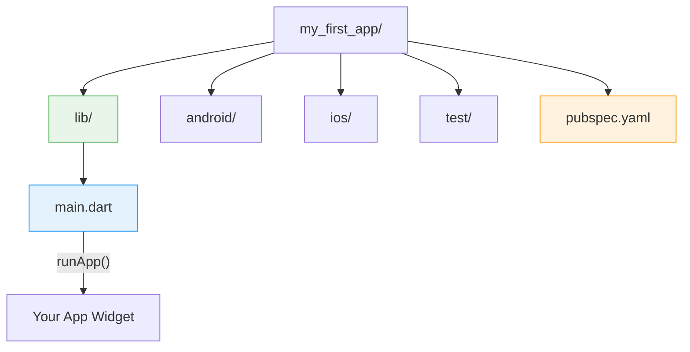
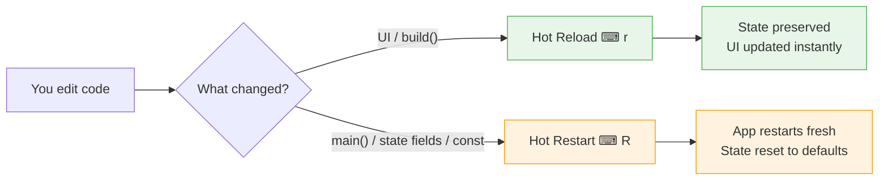
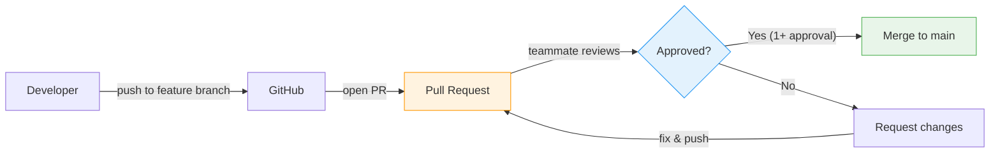

# Week 4 Lab: Flutter Fundamentals

<div class="lab-meta" markdown>
| | |
|---|---|
| **Course** | Mobile Apps for Healthcare |
| **Duration** | 2 hours |
| **Prerequisites** | Dart fundamentals (Week 3) |
</div>

<div class="grid cards" markdown>

- :material-target:{ .lg .middle } **Learning Objectives**

    ---

    - Create a new Flutter project and understand its folder structure
    - Explain the ==widget tree== and how Flutter renders UI
    - Build custom `StatelessWidget` and `StatefulWidget` classes
    - Use `setState()` to update the UI in response to user actions
    - Combine multiple widgets into a simple healthcare-themed screen

- :material-clock-outline:{ .lg .middle } **Time Estimate**

    ---

    | Part | Duration |
    |------|----------|
    | Part 1 — First Flutter App | ~15 min |
    | Part 2 — Understanding Widgets | ~25 min |
    | Part 3 — StatelessWidget | ~20 min |
    | Part 4 — StatefulWidget | ~30 min |
    | Part 5 — Hot Reload vs Restart | ~10 min |
    | Part 6 — Building a Screen | ~20 min |
    | Part 7 — Team Setup (Homework) | ~30 min |

</div>

!!! success "AI tools now allowed"
    Starting this week, you may use AI tools (ChatGPT, Copilot, etc.) to assist your work. However, you must **understand every line of code you submit**. AI is a productivity tool, not a replacement for learning. If you cannot explain what a piece of code does, rewrite it yourself.

!!! example "Think of it like... LEGO bricks"
    Flutter widgets are like **LEGO bricks** — each one does one thing (a button, a text field, a row), and you snap them together to build screens. `build()` is the instruction manual that tells Flutter how to assemble your bricks.

---

## Prerequisites

Before you begin, make sure you have the following set up on your machine:

- **Flutter SDK** installed and on your PATH. Verify by running:
  ```bash
  flutter doctor
  ```
  All checks should pass (or show only minor warnings unrelated to your target platform).
- **An IDE** — one of:
  - VS Code with the **Flutter** and **Dart** extensions (recommended), or
  - Android Studio with the **Flutter** plugin.
- **A device to run apps on** — one of:
  - An Android emulator (via Android Studio AVD Manager),
  - An iOS simulator (macOS only, via Xcode), or
  - A physical device connected via USB with developer mode enabled.

!!! tip "Pro tip"
    If `flutter doctor` reports issues, resolve them now. Ask the instructor for help if needed; do not skip this step.

---

## Part 1: Create Your First Flutter App (~15 min)

!!! abstract "TL;DR"
    ==Everything in Flutter is a widget.== Screens are widgets. Buttons are widgets. Even the app itself is a widget. You build UIs by composing widgets into a tree.

### 1.1 Generate the project

Open a terminal and run:

```bash
flutter create my_first_app
cd my_first_app
```

### 1.2 Explore the project structure

Take a minute to look at the generated files:

| Path | Purpose |
|------|---------|
| `lib/main.dart` | Your app's entry point and main source code |
| `pubspec.yaml` | Project metadata and dependency declarations (like `package.json` in Node or `build.gradle` in Android) |
| `android/` | Android-specific configuration and native code |
| `ios/` | iOS-specific configuration and native code |
| `test/` | Unit and widget tests |



### 1.3 Run the app

```bash
flutter run
```

Once the app launches on your emulator or device:

- Press ++r++ in the terminal for ==hot reload== (applies code changes instantly while preserving state).
- Press ++shift+r++ for ==hot restart== (restarts the app from scratch, resetting all state).
- Press ++q++ to quit.

### 1.4 Understand the entry point

Open `lib/main.dart`. Notice the two key pieces:

```dart
void main() {
  runApp(const MyApp());
}
```

- **`main()`** — the Dart entry point, just like in any Dart program.
- **`runApp()`** — takes a widget and makes it the ==root of the widget tree==. Flutter then renders this tree on screen.

> **Key insight:** In Flutter, **everything on screen is a widget** — text, buttons, layout containers, even the entire app itself.

~~You need to learn both Android and iOS development~~ — Flutter compiles to both platforms from a single Dart codebase.

~~Flutter apps are slow because they aren't native~~ — Flutter compiles to native ARM code, not a web view. Performance is comparable to native apps.

!!! success "Checkpoint: Part 1 complete"
    You have a running Flutter app on your emulator or device. You can explain what `runApp()` does, you've explored the project structure, and you've tested hot reload with ++r++. This is your development loop for the rest of the course.

---

## Part 2: Understanding Widgets (~25 min)

!!! abstract "TL;DR"
    Flutter UIs are ==widget trees== — small, reusable pieces composed together. Think of it like HTML's DOM but every element is a Dart object with a `build()` method.

!!! tip "Remember from Week 3?"
    You wrote classes with `this.fieldName` constructor shorthand. Every Flutter widget is just a Dart class — `StatelessWidget` and `StatefulWidget` are abstract classes you extend, using the exact same syntax.

### 2.1 Everything is a widget

Flutter UIs are built by composing small, reusable widgets into a **widget tree**. The default counter app has a tree that looks roughly like this:

```mermaid
graph TD
    A["MaterialApp"] --> B["Scaffold"]
    B --> C["AppBar"]
    B --> D["Body: Center"]
    B --> E["FloatingActionButton"]
    C --> F["Text<br/>'Flutter Demo Home Page'"]
    D --> G["Column"]
    G --> H["Text<br/>'You have pushed...'"]
    G --> I["Text<br/>'&#36;_counter'"]
    E --> J["Icon<br/>Icons.add"]
    style A fill:#e8f5e9,stroke:#4caf50
    style B fill:#e3f2fd,stroke:#2196f3
    style E fill:#fff3e0,stroke:#ff9800
```



Every box in this diagram is a ==widget object==. Flutter reads the tree top-to-bottom to decide what to paint on screen.

??? protip "Pro tip: Flutter DevTools"
    Run `flutter pub global activate devtools` and then `dart devtools` to
    launch Flutter DevTools — a widget inspector that lets you visualize
    and debug your widget tree in a browser. This is the equivalent of Chrome's
    "Inspect Element" for Flutter.

> **Healthcare Context: Why Widget Composition Matters in mHealth**
>
> In real mobile health applications, widget composition directly affects usability and patient safety:
>
> - **Reusable vital-sign cards** (heart rate, blood pressure, SpO2) built as StatelessWidgets can be composed into dashboards, alerts, and history views without duplicating code.
> - **Consistent UI components** reduce cognitive load for patients who may be elderly, stressed, or in pain — a medication reminder should look the same everywhere in the app.
> - **Accessibility-first widgets** (large touch targets, semantic labels) are not optional in health apps — patients with motor impairments or low vision depend on them.
> - **The widget tree IS your information architecture.** A poorly structured tree leads to a confusing app, which in healthcare means missed medications, incorrect readings, or abandoned treatment plans.

### 2.2 Common basic widgets

| Widget | Purpose | Example |
|--------|---------|---------|
| `Text` | Display a string of text | `Text('Hello')` |
| `Icon` | Display a Material Design icon | `Icon(Icons.favorite)` |
| `Image` | Display an image from assets or network | `Image.network('https://...')` |
| `Container` | A convenience widget for padding, margins, decoration | `Container(color: Colors.blue, child: ...)` |
| `ElevatedButton` | A Material Design raised button | `ElevatedButton(onPressed: ..., child: Text('Tap'))` |

~~You have to memorize all the widgets~~ — Flutter has hundreds of widgets but you'll use the same 15-20 for 90% of your work. The rest you look up in the [Widget Catalog](https://docs.flutter.dev/ui/widgets) when you need them.

### 2.3 Exercise files

The exercise projects are provided in the course materials at:

```
week-04-flutter-fundamentals/lab/exercises/
├── exercise_1_hello_flutter/    # Exercise 1: Modify the counter app
├── exercise_2_patient_card/     # Exercise 2: PatientInfoCard
├── exercise_3_mood_selector/    # Exercise 3: Mood Selector
└── exercise_4_health_checkin/   # Exercise 4: Health Check-In Screen
```

Each exercise is a complete Flutter project. Find them in the course materials repository you cloned in Week 0 (see [Getting Ready](../../resources/GETTING_READY.md#step-8-clone-the-course-materials-repository)). Copy the exercise folder to a working directory, open it in your IDE, and run `flutter pub get` before starting.

### 2.4 Exercise 1: Modify the Default Counter App

Open the starter code in **`exercises/exercise_1_hello_flutter/lib/main.dart`**.

Follow the `TODO` comments in the code to:

1. Change the app title to something healthcare-related.
2. Change the primary color theme.
3. Add an icon next to the counter text.
4. Change the floating action button so it **decrements** the counter.

> **Time:** ~10 minutes. Run the app and use hot reload (++r++) after each change to see the results immediately.

!!! warning "Common mistake"
    Running `flutter pub get` is required before running any exercise project
    for the first time. If you see "package not found" errors, this is almost
    always the cause. Run it once, and you're good.

### Self-Check: Parts 1–2

- [ ] You created a Flutter project with `flutter create` and can run it on an emulator or device.
- [ ] You can explain what `runApp()` does and why `main()` is the entry point.
- [ ] You understand that **everything on screen is a widget** arranged in a tree.
- [ ] You modified the default counter app and saw changes via hot reload.

!!! success "Checkpoint: Part 2 complete"
    You understand widget trees — the fundamental mental model for all Flutter development. You've explored the counter app, identified its widget hierarchy, and customized it. Every screen you build from now on is just a different arrangement of this same tree structure.

---

## Part 3: StatelessWidget (~20 min)

!!! abstract "TL;DR"
    ==StatelessWidget = no memory.== It receives data via the constructor, displays it, and never changes on its own. Like a printed label — once printed, the text is fixed.

### 3.1 What is a StatelessWidget?

A `StatelessWidget` is a widget that **does not change over time**. Once built, its appearance is fixed unless the parent rebuilds it with different data.

Use a `StatelessWidget` when:

- The widget only displays data that is passed in from outside.
- The widget does not need to track any internal changing values.

### 3.2 Anatomy of a StatelessWidget

```dart
class GreetingCard extends StatelessWidget {
  final String name;

  const GreetingCard({super.key, required this.name});

  @override
  Widget build(BuildContext context) {
    return Card(
      child: Padding(
        padding: const EdgeInsets.all(16.0),
        child: Text('Hello, $name!', style: const TextStyle(fontSize: 20)),
      ),
    );
  }
}
```

Key points:

- ==Properties are passed via the constructor== and stored as `final` fields.
- The **`build()` method** returns a widget tree describing this widget's appearance.
- Every time Flutter needs to display this widget, it calls `build()`.

!!! warning "Common mistake"
    Forgetting the `const` keyword on widget constructors is a missed
    optimization. If all fields are `final` and compile-time constants,
    add `const` to the constructor — Flutter can then skip rebuilding
    that widget entirely.

~~StatelessWidget means the screen never updates~~ — the *widget* doesn't have internal state, but its *parent* can rebuild it with new data at any time. A patient name card is stateless, but if the parent passes a new name, the card updates.

### 3.3 Exercise 2: PatientInfoCard

Open the starter code in **`exercises/exercise_2_patient_card/lib/main.dart`**.

Your task: create a `PatientInfoCard` StatelessWidget that displays:

- Patient name
- Age
- Diagnosis

Follow the `TODO` comments in the file. When done, the app should display a card with patient information styled in a clean, readable format.

> **Time:** ~15 minutes.

??? question "Scenario: Reusable patient card"
    You're building a patient list screen. Each row shows a patient's name, age, and last visit date. Should `PatientRow` be a StatelessWidget or StatefulWidget? What parameters would you pass to the constructor?

    ??? success "Answer"
        `PatientRow` should be a **StatelessWidget** — it only displays data passed in from outside. The constructor would take `final String name`, `final int age`, and `final DateTime lastVisit`. The parent widget (the list) is responsible for fetching the data; `PatientRow` just renders it. This makes the widget reusable — the same `PatientRow` works in search results, favorites, and reports.

### Self-Check: Part 3

- [ ] You created a `StatelessWidget` with `final` fields passed via the constructor.
- [ ] You can explain why StatelessWidget properties must be `final`.
- [ ] Your PatientInfoCard displays patient data in a Card widget.

!!! success "Checkpoint: Part 3 complete"
    You've built a custom `StatelessWidget` with `final` properties and a
    `build()` method. This is the building block for ==all static UI== in
    Flutter — the pattern repeats everywhere.

---

## Part 4: StatefulWidget (~30 min)

!!! abstract "TL;DR"
    ==StatefulWidget = widget with memory.== It can change over time, like a counter that goes up when you tap. You call `setState()` to tell Flutter "something changed, rebuild me."

!!! warning "Common mistake"
    Never call `setState()` inside the `build()` method — it creates an
    ==infinite rebuild loop==. `setState()` triggers `build()`, which calls
    `setState()` again, which triggers `build()`, forever. Only call
    `setState()` from event handlers like `onPressed` or `onChanged`.

### 4.1 What is a StatefulWidget?

A `StatefulWidget` is a widget that **can change over time**. It maintains mutable state in a separate `State` object that persists across rebuilds.

Use a `StatefulWidget` when:

- The widget needs to react to ==user input== (taps, typing, sliders).
- The widget displays data that changes dynamically.

### 4.2 The two-class pattern

Every `StatefulWidget` consists of ==two classes==:

```dart
// 1. The widget class — immutable, creates the state
class MoodSelector extends StatefulWidget {
  const MoodSelector({super.key});

  @override
  State<MoodSelector> createState() => _MoodSelectorState();
}

// 2. The state class — mutable, holds changing data
class _MoodSelectorState extends State<MoodSelector> {
  String _selectedMood = 'None';

  @override
  Widget build(BuildContext context) {
    return Text('Current mood: $_selectedMood');
  }
}
```



```mermaid
graph TD
    A["StatefulWidget created"] -->|"createState()"| B["State object created"]
    B -->|"initState()"| C["State initialized"]
    C -->|"build()"| D["Widget tree rendered"]
    D -->|"user taps button"| E["setState&#40;&#41; called"]
    E -->|"build() again"| D
    D -->|"widget removed"| F["dispose()"]
    style E fill:#e3f2fd,stroke:#2196f3
    style D fill:#e8f5e9,stroke:#4caf50
    style F fill:#fce4ec,stroke:#e91e63
```

??? protip "Pro tip: The underscore naming convention"
    The `_MoodSelectorState` class starts with an underscore (`_`), making it ==private to the file==. This is a Dart convention — the state class is an implementation detail that no one outside the file should access. The public API is the `MoodSelector` widget itself.

### 4.3 setState() — triggering a rebuild

To update the UI, you **must** wrap state changes in `setState()`:

```dart
void _selectMood(String mood) {
  setState(() {
    _selectedMood = mood;
  });
}
```

Calling `setState()` tells Flutter: "the state has changed, please call `build()` again so the UI reflects the new data."

!!! warning "Common mistake"
    Changing a variable **without** `setState()` will update the variable in
    memory but the ==screen will NOT reflect the change==. This is one of the
    most common beginner mistakes. If your UI isn't updating, check that you
    wrapped the change in `setState()`.

~~`setState()` is slow and should be avoided~~ — `setState()` only rebuilds the subtree of the widget that called it, not the entire app. Flutter's diffing algorithm makes this efficient. Use it freely for local state.

!!! example "Try it live: StatefulWidget counter"
    Copy this code into [DartPad](https://dartpad.dev/) (select **New Pad > Flutter**) to see `setState()` in action. Try adding a **Reset** button that sets the counter back to zero.

    ```dart
    import 'package:flutter/material.dart';

    void main() => runApp(const MaterialApp(home: CounterApp()));

    class CounterApp extends StatefulWidget {
      const CounterApp({super.key});
      @override
      State<CounterApp> createState() => _CounterAppState();
    }

    class _CounterAppState extends State<CounterApp> {
      int _count = 0;

      @override
      Widget build(BuildContext context) {
        return Scaffold(
          appBar: AppBar(title: const Text('Counter Demo')),
          body: Center(
            child: Column(
              mainAxisAlignment: MainAxisAlignment.center,
              children: [
                Text('Count: $_count',
                    style: const TextStyle(fontSize: 48)),
                const SizedBox(height: 20),
                Row(
                  mainAxisAlignment: MainAxisAlignment.center,
                  children: [
                    ElevatedButton(
                      onPressed: () => setState(() => _count--),
                      child: const Text('-'),
                    ),
                    const SizedBox(width: 20),
                    ElevatedButton(
                      onPressed: () => setState(() => _count++),
                      child: const Text('+'),
                    ),
                  ],
                ),
                // Challenge: Add a Reset button here!
              ],
            ),
          ),
        );
      }
    }
    ```

    <!-- TODO: Replace code block with iframe once Gist is created:
    <iframe src="https://dartpad.dev/embed-flutter.html?id=GIST_ID&theme=dark&run=true&split=60"
      style="width:100%; height:500px; border:1px solid var(--md-default-fg-color--lightest); border-radius:8px;">
    </iframe>
    -->

### 4.4 Exercise 3: Mood Selector

Open the starter code in **`exercises/exercise_3_mood_selector/lib/main.dart`**.

Your task: build a mood selector with buttons for different moods and a display showing which mood is currently selected. Follow the `TODO` comments.

> **Time:** ~15 minutes.

### Self-Check: Part 4

- [ ] You created a `StatefulWidget` with the two-class pattern (widget + state).
- [ ] You used `setState()` to update the UI and can explain why it's necessary.
- [ ] You understand that changing a variable **without** `setState()` updates memory but NOT the screen.

??? question "Scenario: Stateless vs Stateful"
    Your health app shows a patient's name in the app bar and their vitals in the body. The name never changes, but vitals update every 5 seconds. Which widget should be Stateless and which Stateful? Why?

    ??? success "Answer"
        The **app bar with the patient name** should be a `StatelessWidget` — it receives the name once via the constructor and never changes. The **vitals display** should be a `StatefulWidget` — it needs `setState()` to trigger rebuilds every 5 seconds when new data arrives. Using StatefulWidget only where needed keeps the app efficient because Flutter only rebuilds what actually changed.

??? question "Scenario: Widget decomposition"
    You're designing a medication reminder screen. It has a static header ("Today's Medications"), a scrollable list of medications where each can be marked as "taken", and a summary bar showing "3 of 5 taken". How many widgets would you create? Which are Stateful and which Stateless?

    ??? success "Answer"
        At least **4 widgets**: (1) `MedicationReminderScreen` — **StatefulWidget** (owns the list state and "taken" counts), (2) `MedicationHeader` — **StatelessWidget** (static title), (3) `MedicationTile` — **StatelessWidget** (receives medication data + a callback from parent), (4) `SummaryBar` — **StatelessWidget** (receives the count from parent). The key insight: only the screen-level widget needs to be Stateful. The children receive data as constructor parameters and callbacks for interactions — this is called "lifting state up."

!!! success "Checkpoint: Part 4 complete"
    You can build interactive widgets with `StatefulWidget` and `setState()`.
    You know the ==two-class pattern== and why `setState()` is needed to
    trigger UI rebuilds. This is the foundation for all dynamic UIs.

### 4.5 Bonus: Counter with Increment and Decrement

If you finish early, add decrement functionality to your mood selector file or modify the Exercise 1 counter to support both increment and decrement buttons.

---

## Part 5: Hot Reload vs Hot Restart (~10 min)

!!! abstract "TL;DR"
    ==Hot reload (++r++) preserves state==, hot restart (++shift+r++) resets it. Use reload for UI tweaks, restart when you change state definitions or `main()`.

### 5.1 Quick comparison

| | Hot Reload (++r++) | Hot Restart (++shift+r++) |
|---|---|---|
| **Speed** | Sub-second | A few seconds |
| **State** | ==Preserved== | ==Reset== |
| **Use when** | Changing UI code, tweaking styles | Changing `main()`, adding new state fields, changing initializers |



### 5.2 When does hot reload NOT work?

Hot reload will not apply changes when you:

- Modify the `main()` function.
- Add or remove state fields in a `State` class.
- Change initializer expressions for fields.
- Change `const` constructors.

In these cases, use **hot restart** (++shift+r++) instead.

~~Hot reload always works~~ — it handles most UI changes, but modifications to `main()`, state field declarations, and `const` constructors require a full hot restart. When in doubt, press ++shift+r++.

### 5.3 Practice

Try the following in any of your exercise files:

1. Change a `Text` widget's string and press ++r++. Observe the ==instant update==.
2. Change the initial value of a state variable and press ++r++. Notice it does **NOT** take effect.
3. Press ++shift+r++ and observe the state variable now uses the new initial value.

### Self-Check: Part 5

- [ ] You know when to use hot reload (++r++) vs hot restart (++shift+r++).
- [ ] You tested: changing a Text string → hot reload works; changing a state variable's initial value → requires hot restart.

!!! success "Checkpoint: Part 5 complete"
    You understand Flutter's hot reload and hot restart. This ==sub-second feedback loop== is one of Flutter's biggest productivity advantages — native Android/iOS development requires a full rebuild (30-60 seconds) for every change.

---

## Part 6: Building a Simple Screen (~20 min)

!!! abstract "TL;DR"
    `Column` stacks widgets vertically, `Padding` adds space around them, `SizedBox` adds space between them. Combine these three with input widgets to build any form.

### 6.1 Layout essentials

Before starting the final exercise, you need three layout concepts:

| Widget | Purpose | Example |
|--------|---------|---------|
| `Column` | Arrange children ==vertically== | `Column(children: [Text('A'), Text('B')])` |
| `Padding` | Add space around a widget | `Padding(padding: EdgeInsets.all(16), child: ...)` |
| `SizedBox` | Fixed-size empty space between widgets | `SizedBox(height: 16)` |

You will also use:

- **`TextField`** — a text input field.
- **`Slider`** — a slider for selecting a numeric value.
- **`ElevatedButton`** — a tappable button.

??? protip "Pro tip: EdgeInsets shorthand"
    Instead of writing `EdgeInsets.only(left: 16, right: 16, top: 8, bottom: 8)`, use the shorthands:

    - `EdgeInsets.all(16)` — same padding on all sides
    - `EdgeInsets.symmetric(horizontal: 16, vertical: 8)` — symmetric pairs
    - `EdgeInsets.fromLTRB(16, 8, 16, 8)` — left, top, right, bottom

    These save typing and are easier to read at a glance.

### 6.2 Exercise 4: Health Check-In Screen

Open the starter code in **`exercises/exercise_4_health_checkin/lib/main.dart`**.

Build a "Health Check-In" screen that combines everything you have learned:

- An `AppBar` with the title "Health Check-In".
- A `TextField` for the patient's name.
- A `Slider` for pain level (1 to 10).
- A `Text` widget that displays the current pain level.
- An `ElevatedButton` that prints the collected data to the console.

This exercise uses both `StatelessWidget` (the overall app shell) and `StatefulWidget` (the form with changing state).

Follow the `TODO` comments in the starter file.

> **Time:** ~20 minutes.

!!! warning "Common mistake"
    `Slider` requires `onChanged` to call `setState()` with the new value.
    If the slider doesn't move when you drag it, you forgot to update the
    state variable inside `setState()`. The pattern is:
    ```dart
    Slider(
      value: _painLevel,
      onChanged: (val) => setState(() => _painLevel = val),
    )
    ```

??? question "Scenario: Expanding the Health Check-In"
    A clinician asks you to add a "notes" text field and a "Submit" button that validates the form (name cannot be empty, pain level must be > 0). What widgets would you add? Where would the validation logic live?

    ??? success "Answer"
        Add a second `TextField` for notes and use a `Form` widget wrapping the entire column with `TextFormField` instead of `TextField`. Validation logic lives in the `validator` parameter of each `TextFormField`. The submit button calls `_formKey.currentState!.validate()` before proceeding. The form key and all state variables (`_name`, `_painLevel`, `_notes`) live in the `State` class. This is exactly the pattern you'll use in Week 5 for real form layouts.

### Self-Check: Part 6

- [ ] Your Health Check-In screen has a `TextField`, a `Slider`, and an `ElevatedButton`.
- [ ] You used `Column`, `Padding`, and `SizedBox` for layout.
- [ ] Tapping the button prints collected data to the console.
- [ ] You can combine `StatelessWidget` and `StatefulWidget` in the same app.

??? challenge "Stretch Goal: Dark mode toggle"
    Add a dark mode toggle to the app bar. Use `StatefulWidget` to switch between `ThemeData.light()` and `ThemeData.dark()`.

    *Hint:* Store a `bool _isDark = false` in your State class and toggle it with `setState()`.

??? challenge "Stretch Goal: Pain level color indicator"
    Make the pain level text change color based on the value: green (1-3), orange (4-6), red (7-10). This reinforces how `setState()` + `build()` makes the UI reactive.

    *Hint:* Write a helper method `Color _painColor()` that returns a color based on `_painLevel`, and use it in the `TextStyle`.

!!! success "Checkpoint: Part 6 complete"
    You've built a complete health check-in screen that combines ==StatelessWidget, StatefulWidget, layout widgets, and user input==. This is the same architecture used in real mHealth apps — a form screen with input validation and data collection.

---

## Team Formation

At the end of this lab session, form teams of **3-4 students** for the semester project.

### Steps

1. **Find your teammates.** Look for complementary skills (someone comfortable with UI, someone interested in backend/APIs, someone who likes testing).
2. **Exchange GitHub usernames.** Every team member must have a GitHub account.
3. **Create a team communication channel.** Use whatever platform your team prefers (Discord, Slack, MS Teams, WhatsApp, etc.).
4. **Review the AI tools policy.** A handout is available at [`resources/ai-tools-policy.md`](../../resources/ai-tools-policy.md). Read it together as a team and make sure everyone understands the rules. AI tools are allowed in this course, but specific guidelines apply.

> **Reminder:** Your project proposal is due at the end of Week 5. Start discussing project ideas with your team this week so you arrive at the sprint planning workshop with a clear direction.

---

## Part 7: Team Setup (Homework)

!!! abstract "TL;DR"
    Before Week 5: create a GitHub repo, add collaborators, set up ==branch protection rules== (require PR + 1 approval), create a project board, and make sure everyone can push and PR.

!!! warning "Complete before the Week 5 lab session"
    The following tasks must be done **before** next week's sprint planning workshop. They take ~30 minutes and require all team members to participate.

### 7.1 Create Your Team Repository

One team member creates the repository on GitHub:

1. Click **"New repository"** on GitHub
2. Name it something descriptive (e.g., `mhealth-diabetes-tracker`)
3. Set visibility to **Public** (so the instructor can see it)
4. Initialize with a README
5. Select **Flutter** from the `.gitignore` dropdown

### 7.2 Add Team Members as Collaborators

```
GitHub repo → Settings → Collaborators → Add people
```

Add all team members with **"Write"** access.

### 7.3 Set Up Branch Protection Rules

This is ==critical== — it enforces the PR workflow you'll use all semester:

```
GitHub repo → Settings → Branches → Add branch protection rule
```

Configure:

- **Branch name pattern:** `main`
- **Require a pull request before merging:** ✅
- **Require approvals:** 1
- **Do not allow bypassing the above settings:** ✅



### 7.4 Everyone Clones the Repo

Every team member clones and verifies access:

```bash
git clone git@github.com:your-team/your-repo.git
cd your-repo
git remote -v
```

### 7.5 Create a GitHub Projects Board

```
GitHub repo → Projects → New project → Board
```

Create these 5 columns:

1. **Backlog** — all planned work
2. **Sprint Backlog** — work selected for current sprint
3. **In Progress** — actively being worked on
4. **In Review** — PR submitted, waiting for review
5. **Done** — merged to main

!!! success "Checkpoint: Part 7 complete"
    Your team has a GitHub repository with branch protection, a project board with 5 columns, and every member can clone, push branches, and open PRs. You are ready for the Week 5 sprint planning workshop.

> **Verification:** Before Week 5, every team member should be able to push a branch, open a PR, and see the project board. If something doesn't work, fix it now — not during the workshop.

---

## Quick Quiz

<quiz>
What is the difference between `StatelessWidget` and `StatefulWidget`?

- [ ] StatelessWidget is faster, StatefulWidget is slower
- [x] StatelessWidget has no mutable state, StatefulWidget can change over time
- [ ] StatelessWidget is for text, StatefulWidget is for images
- [ ] There is no difference — they are interchangeable
</quiz>

<quiz>
What does the `build()` method return?

- [ ] A string of HTML
- [ ] A list of variables
- [x] A widget tree that Flutter renders on screen
- [ ] The app's state
</quiz>

<quiz>
When should you call `setState()`?

- [ ] In the constructor
- [ ] In the `build()` method
- [x] When you want to update the UI after changing a variable
- [ ] Every frame (60 times per second)
</quiz>

<quiz>
What is "hot reload"?

- [ ] Restarting the entire app from scratch
- [x] Injecting updated code into the running app while preserving state
- [ ] Clearing the app's cache
- [ ] Recompiling the app for a different platform
</quiz>

<quiz>
What does the `const` keyword do when applied to a widget?

- [ ] Makes the widget invisible
- [ ] Prevents the widget from having children
- [x] Tells Flutter this widget never changes, enabling compile-time optimization
- [ ] Makes the widget take up no space
</quiz>

<quiz>
A widget needs to track how many times a button was pressed and display the count. Which type should it be?

- [ ] StatelessWidget — it just displays a number
- [x] StatefulWidget — the count changes over time and requires setState()
- [ ] Either one works equally well
- [ ] Neither — you need a separate counter library
</quiz>

<quiz>
What happens if you change a state variable WITHOUT calling `setState()`?

- [ ] Flutter automatically detects the change and rebuilds
- [ ] The app crashes immediately
- [x] The variable changes in memory but the UI does not update
- [ ] The widget converts itself to StatelessWidget
</quiz>

---

## Summary

Today you learned:

| Concept | Key Takeaway |
|---------|--------------|
| Project structure | `lib/main.dart` is the entry point; `pubspec.yaml` manages dependencies |
| Widget tree | Flutter UI = a tree of composable widgets |
| `StatelessWidget` | Immutable UI — receives data via constructor, no internal state |
| `StatefulWidget` | Mutable UI — uses `setState()` to trigger rebuilds when state changes |
| Hot reload / restart | ++r++ for quick UI tweaks; ++shift+r++ when state definitions change |
| Basic layout | `Column`, `Padding`, `SizedBox` for vertical arrangement and spacing |
| Team setup | GitHub repo + branch protection + project board = ready for sprints |

---

## Troubleshooting

??? question "`flutter run` says 'No connected devices'"
    Make sure your emulator is running (launch from Android Studio → AVD Manager) or your physical device has USB debugging enabled. Run `flutter devices` to see what Flutter detects. On macOS, you can also try `open -a Simulator` for the iOS simulator.

??? question "The app builds but shows a blank white screen"
    This usually means there is an error in your widget tree. Check the terminal for error messages (red text). Common causes: missing `const` keyword, incorrect constructor parameters, or a `null` value where a widget is expected.

??? question "`setState()` is called but the UI doesn't update"
    Make sure you are modifying the state variable **inside** the `setState()` callback, not outside it. Also verify you are modifying the correct variable — the one used in the `build()` method.

??? question "Hot reload doesn't apply my changes"
    Some changes require a **hot restart** (++shift+r++) instead of hot reload (++r++). This includes: changes to `main()`, adding/removing state variables, changing initializers, or modifying `const` constructors. When in doubt, press ++shift+r++.

??? question "`The method 'setState' isn't defined for the type...`"
    You are calling `setState()` inside a `StatelessWidget`. Only `StatefulWidget` (specifically its `State` class) has `setState()`. Convert your widget to a `StatefulWidget` using the two-class pattern from Part 4.

??? question "`flutter pub get` hangs or fails"
    Check your internet connection. If you're behind a university proxy, you may need to configure it: `export HTTP_PROXY=http://proxy:port` and `export HTTPS_PROXY=http://proxy:port`. Also try `flutter clean` followed by `flutter pub get`.

---

!!! question "End-of-Lab Reflection"
    Take 2 minutes to reflect on today's work:

    1. **What was the hardest concept today?** (Widget tree? StatefulWidget? setState? Hot reload?)
    2. **What would you explain differently to a classmate?** When would you choose StatelessWidget vs StatefulWidget for a health app screen?
    3. **How does this connect to your project?** Sketch one screen from your team project — which widgets would you use?

    Write your answers in your lab notebook or discuss with your neighbor.

---

## Further Reading

- [Flutter official documentation — Introduction to widgets](https://docs.flutter.dev/development/ui/widgets-intro)
- [Flutter cookbook — Basic widgets](https://docs.flutter.dev/cookbook)
- [StatefulWidget lifecycle](https://api.flutter.dev/flutter/widgets/StatefulWidget-class.html)
- [Flutter Widget of the Week (YouTube playlist)](https://www.youtube.com/playlist?list=PLjxrf2q8roU23XGwz3Km7sQZFTdB996iG)
