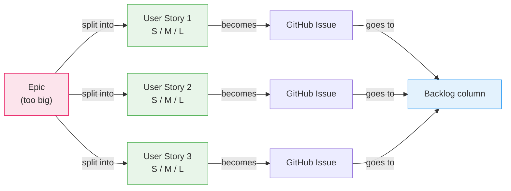
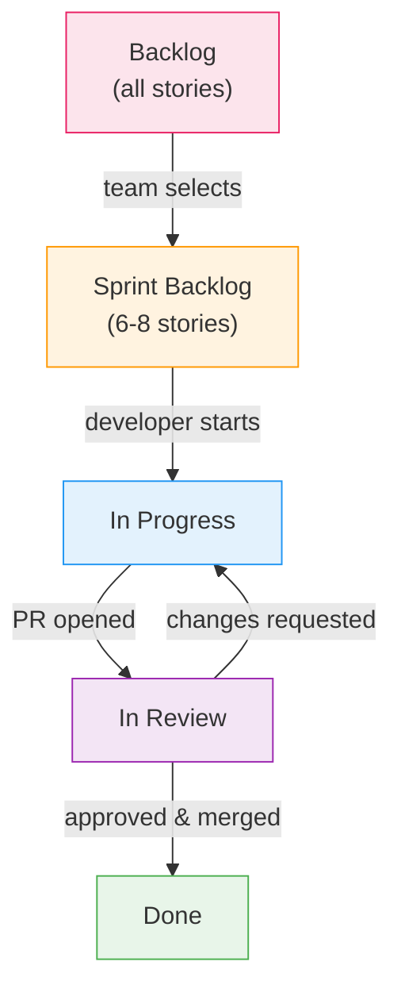
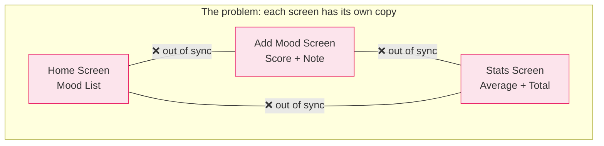
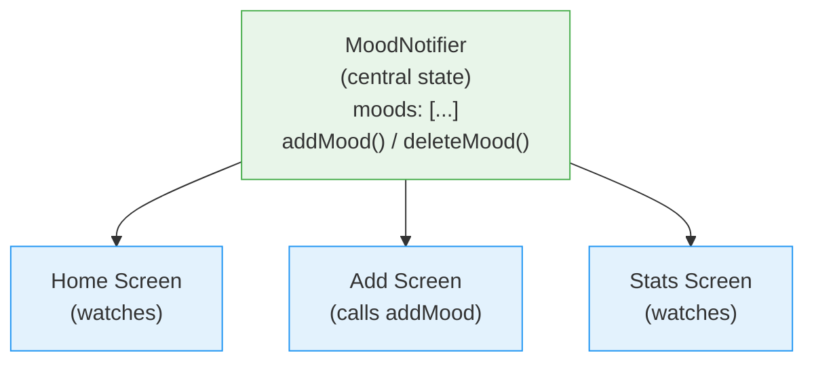

# Week 5 Lab: Sprint Planning Workshop

<div class="lab-meta" markdown>
| | |
|---|---|
| **Course** | Mobile Apps for Healthcare |
| **Duration** | ~2 hours (workshop format) |
| **Prerequisites** | Flutter fundamentals (Week 4), team formation completed |
</div>

<div class="grid cards" markdown>

- :material-target:{ .lg .middle } **Learning Objectives**

    ---

    - Write ==user stories== in the "As a [user], I want to…" format
    - Estimate effort using story points (S / M / L)
    - Plan a 2-week sprint with realistic scope
    - Set up a GitHub Projects board for agile workflow
    - Understand state management vocabulary for Week 6

- :material-clock-outline:{ .lg .middle } **Time Estimate**

    ---

    | Part | Duration |
    |------|----------|
    | Part 1 — Writing User Stories | ~25 min |
    | Part 2 — Sprint 1 Planning | ~20 min |
    | Part 3 — State Management Preview | ~20 min |
    | Verbal Pitch | ~5 min per team |
    | **Total** | **~2 hours** |

</div>

## Overview

!!! abstract "TL;DR"
    You'll scope your team project into 2-week sprints, write ==user stories==, and estimate effort. This is how real dev teams at Spotify and Google plan their work.

This lab is different from previous weeks — it's a **workshop** where you transition from individual learners to a ==development team==. By the end of this session, your team will have a sprint plan, user stories, and a clear picture of what you're building.

!!! example "Think of it like... a road trip playlist"
    Sprint planning is like planning a **road trip playlist** — you can't fit every song (feature) in one playlist (sprint), so you pick the bangers first and save the deep cuts for later.

> **Verbal pitch + written proposal due this week.** Before leaving, your team will pitch your project idea to the instructor in 2 minutes (see checklist at the bottom). The **full written proposal** is also due at the end of this week (Week 5) so that Sprint 1 can begin in Week 6 with an approved scope.

!!! note "Repository and project board already set up"
    You should have completed the **Team Setup homework** from Week 4 (Part 7). If your team hasn't done this yet, do it now — but be aware you're starting behind.

    Verify before proceeding:

    - [ ] Team repository exists on GitHub with branch protection enabled
    - [ ] All team members can clone the repo and push to branches
    - [ ] GitHub Projects board exists with 5 columns (Backlog, Sprint Backlog, In Progress, In Review, Done)

---

## Part 1: Writing User Stories (~25 min)

!!! abstract "TL;DR"
    A user story is a ==one-sentence feature description== from the user's perspective: "As a [user], I want to [action] so that [benefit]." Each story becomes a GitHub Issue with acceptance criteria and an effort estimate.

!!! tip "Remember from Week 2?"
    You created branches and pull requests on GitHub. Your sprint board uses the same system — each user story becomes an Issue, work happens on branches, and PRs are how code moves to `main`.

### 1.1 What is a User Story?

A user story describes a feature from the ==user's perspective==:

```
As a [type of user],
I want to [do something],
so that [I get some benefit].
```

**Examples for a mood tracker:**

- "As a patient, I want to log my mood with a score so that I can track how I feel over time."
- "As a patient, I want to see a history of my mood entries so that I can identify patterns."
- "As a clinician, I want to view a patient's mood trends so that I can adjust treatment."

~~User stories are just a fancy way to say "feature"~~ — a feature describes *what* the system does; a user story describes *who* benefits and *why*. The "so that" clause forces you to think about value, not just functionality. "Add a login page" is a feature. "As a patient, I want to log in so that my health data is private" is a story that explains the *purpose*.



### 1.2 Create GitHub Issues

For each user story, create a GitHub Issue:

```
Title: [Short description]
Body:
  **User Story:**
  As a [user], I want to [action] so that [benefit].

  **Acceptance Criteria:**
  - [ ] Criterion 1
  - [ ] Criterion 2
  - [ ] Criterion 3

  **Estimate:** S / M / L
```

**Story Point Estimates:**

| Size | Meaning | Example |
|------|---------|---------|
| **S** (Small) | Less than 2 hours of work | Add a text field to a form |
| **M** (Medium) | 2-4 hours of work | Build a complete screen with navigation |
| **L** (Large) | 4-8 hours of work | Implement API connection with error handling |

> If something is **XL** (more than 8 hours), ==break it into smaller stories==!

!!! warning "Common mistake"
    Don't write entire features as a single user story (an "epic"). If a
    story is **XL** (more than 8 hours), break it into smaller stories
    that each deliver ==independently testable value==. "Build authentication"
    is an epic — "Display a login form" is a story.

!!! warning "Common mistake"
    Writing acceptance criteria that are too vague — "It should work well" is
    not testable. Good acceptance criteria use concrete, verifiable conditions:
    "The form shows an error when the email field is empty", "The list displays
    at least the 5 most recent entries." If you can't demo it, it's not a
    criterion.

### 1.3 Exercise: Write Your Stories

As a team, write **at least 10-15 user stories** covering:

- Core features of your app
- Authentication (login/register)
- Navigation between screens
- Data entry and display
- Any mHealth-specific features

Add all stories as GitHub Issues. Add them to your Project Board in the **Backlog** column.

!!! tip
    Teams can start drafting user stories as homework between Weeks 4-5. Use your team chat to brainstorm before the workshop — you'll move faster in class if you arrive with ideas.

??? challenge "Stretch Goal: The Sprint 2 pitch"
    Write a user story for a feature NOT in your first sprint. Include acceptance criteria and a story point estimate. Convince your team it should be in Sprint 2.

    *Hint:* Frame it in terms of user value: "Without this feature, users will have to..."

??? protip "Pro tip: Issue templates"
    Create a `.github/ISSUE_TEMPLATE/user-story.md` file in your repo to
    enforce a consistent user story format. Every new issue will auto-fill
    with the "As a [user], I want to [action]..." template. This saves time
    and ensures every story has acceptance criteria.

??? question "Scenario: Breaking down an epic"
    Your team wants to build a "Patient Dashboard." You've written one giant issue: "As a clinician, I want to see all patient data on one screen." This is an XL epic. How would you break it down?

    ??? success "Answer"
        Split it into independently deliverable stories: (1) "As a clinician, I want to see a patient's name and basic info" — **S**, (2) "As a clinician, I want to see today's vital signs" — **M**, (3) "As a clinician, I want to see a chart of vitals over time" — **L**, (4) "As a clinician, I want to filter vitals by date range" — **M**. Each story delivers testable value on its own. Story 1 can ship without stories 2-4.

### 1.4 Add Labels

Create and apply labels to categorize your issues:

- `feature` — new functionality
- `bug` — something broken (you'll use this later!)
- `ui` — visual/interface work
- `backend` — API/data related
- `auth` — authentication related
- `documentation` — docs and README

### Self-Check: Part 1

- [ ] Your team has at least 10 user stories as GitHub Issues.
- [ ] Each story follows the "As a [user], I want to [action] so that [benefit]" format.
- [ ] Each story has acceptance criteria (testable checkboxes).
- [ ] Each story has an effort estimate (S / M / L).
- [ ] Stories are labeled and placed in the Backlog column.

!!! success "Checkpoint: Part 1 complete"
    Your team has 10+ user stories written as GitHub Issues with estimates
    and labels. This backlog is the ==single source of truth== for what your
    app will do. Every feature request, every bug fix, every improvement
    starts as an issue on this board.

---

## Part 2: Sprint 1 Planning (~20 min)

!!! abstract "TL;DR"
    Pick 6-8 stories for Sprint 1 (Weeks 6-7). Focus on the ==app skeleton== first — navigation, core screen, basic data model. Assign each story to a team member. Write a 1-sentence sprint goal.

~~Agile means no planning~~ — Agile means *adaptive* planning. You plan in short cycles so you can adjust, not skip planning entirely.

~~We should build the hardest feature first~~ — build the ==skeleton first== (navigation, basic screens, data model). If you start with the hardest feature, you have nothing to demo at the sprint review. If you start with the skeleton, every subsequent feature plugs into a working app.

### 2.1 Select Sprint 1 Work

Sprint 1 covers **weeks 6-7** (about 2 weeks of work). Each team member can realistically complete ==2-3 medium stories== in a sprint.

As a team, select stories for Sprint 1. Focus on:

1. **App skeleton** — basic navigation between 2-3 screens
2. **Core screen UI** — the main screen of your app
3. **Basic data model** — classes/models for your data

Move selected issues from **Backlog** to **Sprint Backlog**.



### 2.2 Assign Work

- Assign each issue to a team member
- No one should have more than ==2 issues assigned at a time==
- Start with the most important stories

!!! warning "Common mistake"
    Assigning all stories to the "best coder" on the team. Every member must
    contribute code. Sprint planning is also a ==learning distribution==
    exercise — pair a less experienced developer with a harder story, and
    let them ask for help. This is how real teams work.

??? protip "Pro tip: The 70% rule"
    Only plan for ==70% of your available time==. The remaining 30% will be
    consumed by code reviews, debugging, meetings, and unexpected issues.
    A team of 3 with 2 weeks has about 30 usable hours per person — plan
    for ~20 hours of story work per person, not 30.

### 2.3 Sprint Goal

Write a 1-sentence sprint goal as a pinned issue:

> **Sprint 1 Goal:** "Build the app skeleton with navigation between the home, entry, and history screens, with basic mood/health data entry working locally."

!!! info "Grading"
    For detailed sprint review rubrics and grading criteria, see the [Project Grading Guide](../../resources/PROJECT_GRADING.md).

> **Healthcare Context: Why Sprint Planning Matters in mHealth**
>
> In healthcare software development, disciplined sprint planning is not just a best practice — it can be a regulatory requirement:
>
> - **IEC 62304** (medical device software standard) requires documented development plans with ==traceable requirements==. Your GitHub Issues and sprint board are the foundation of this traceability.
> - **Clinical validation** depends on incremental, testable builds. A sprint that delivers a working login screen can be shown to clinicians for feedback — a half-finished "everything" cannot.
> - **Patient safety** starts with scope management. Feature creep in health apps leads to untested edge cases, which lead to bugs in critical workflows (medication dosing, alert thresholds).
> - **Real mHealth teams** at companies like Oura, Withings, and Apple Health use 2-week sprints with exactly the ceremonies you practiced today.

??? question "Scenario: Sprint scope negotiation"
    Your team planned 8 stories for Sprint 1, but after 3 days, you realize the navigation framework took longer than expected and you've only finished 2 stories. What do you do?

    ??? success "Answer"
        Move the lowest-priority stories back to the Backlog — don't try to cram them in. This is called **scope negotiation** and it's a core Agile practice. The sprint goal was "build the app skeleton with navigation" — if that's working, the sprint is a success even with fewer stories completed. In the sprint review, honestly report what happened and adjust your estimates for Sprint 2.

### Self-Check: Part 2

- [ ] Your team selected 6-8 stories for Sprint 1.
- [ ] Each story is assigned to a team member.
- [ ] A sprint goal is written and pinned as an issue.
- [ ] Stories are moved to the Sprint Backlog column on your board.

!!! success "Checkpoint: Part 2 complete"
    Sprint 1 is planned — stories are selected, assigned, and your team
    has a sprint goal. You have a ==clear plan for the next two weeks== of
    development. When Week 6 starts, everyone knows exactly what to build.

---

## Part 3: Preview — State Management (~20 min)

!!! abstract "TL;DR"
    `setState()` works for one screen but breaks down when ==multiple screens need the same data==. Riverpod puts state in a central place that any widget can access. You'll implement this in Week 6 — today is just vocabulary.

!!! info "Why this section exists"
    Next week (Week 6), you'll implement state management with Riverpod. This preview introduces the **vocabulary and concepts** so you arrive prepared. **No coding here** — just understanding.

### 3.1 Why `setState()` Doesn't Scale

!!! tip "Remember from Week 4?"
    You used `setState()` to update a single screen — the counter, the mood selector, the health check-in. It worked perfectly because ==one widget owned all the state==. But what happens when multiple screens need the same data?

Consider a mood tracker app:



When the user saves a new mood on the Add screen:

- The Home Screen list needs to update
- The Stats Screen averages need to recalculate
- The Add Screen needs to clear the form

With `setState()`, each screen manages its own state independently. To keep them in sync, you'd need to pass callbacks up and down the widget tree — this is called ==**prop drilling**==, and it becomes unmanageable quickly.

### 3.2 The Solution: Centralized State

Instead of each screen holding its own copy of the data, we put the data in a ==central place== that all screens can access:



When `addMood()` is called, ==every screen watching the state automatically updates==. No callbacks, no prop drilling.

### 3.3 Key Vocabulary for Next Week

You'll encounter these terms in Week 6. Don't memorize definitions — just ==recognize them==:

| Term | What It Is | Analogy |
|------|-----------|---------|
| **Provider** | A container that holds a piece of state and makes it accessible to any widget | Like a global variable, but safe and reactive |
| **StateNotifier** | A class that holds state and exposes methods to modify it | Like a controller — it owns the data and the rules for changing it |
| **`ref.watch()`** | Subscribe to a provider — rebuild when it changes | Like a spreadsheet cell that updates when its formula inputs change |
| **`ref.read()`** | Read a provider's value once (in event handlers) | Like checking a value at a specific moment, without subscribing |
| **ProviderScope** | The root widget that stores all provider state | The "container" that makes everything work |

~~State management is too complicated for beginners~~ — you already understand the core idea. `setState()` is state management for one widget. Riverpod is `setState()` for your entire app. The concepts are the same — you're just moving the state to a shared location.

### 3.4 What You'll Build Next Week

In Week 6, you'll take the Mood Tracker starter project and replace its hardcoded data with Riverpod state management. You'll implement:

1. A `MoodNotifier` that holds the list of mood entries
2. Providers that expose the state to the UI
3. Reactive screens that automatically update when data changes

The concepts above are all you need to understand before walking in. The lab will guide you through the code step by step.

### Self-Check: Part 3

- [ ] You can explain why `setState()` doesn't work well across multiple screens (prop drilling).
- [ ] You understand that centralized state lets multiple screens share data.
- [ ] You recognize the terms: Provider, StateNotifier, `ref.watch()`, `ref.read()`.
- [ ] You're not trying to memorize — just familiarize.

!!! success "Checkpoint: Part 3 complete"
    You understand ==why state management matters== and you can recognize the
    key vocabulary. You don't need to write any Riverpod code yet — that's
    Week 6's job. You just need to walk in knowing *why* we need it and
    *what* it replaces.

---

## Verbal Pitch (~5 min per team)

Before leaving today, **pitch your project to the instructor**. This is informal — no slides needed.

### What to Cover (2 minutes max)

1. **The problem:** What health-related problem does your app address?
2. **Target users:** Who will use it? (patients, clinicians, caregivers?)
3. **3 key features:** What are the most important things the app will do?

### Why a Pitch?

The verbal pitch gives you early feedback before you invest time writing the full proposal. The instructor can flag scope issues, suggest features, or point out regulatory considerations you haven't thought of.

??? protip "Pro tip: The elevator test"
    If you can't explain your app in ==30 seconds== to someone who has never
    heard of it, your scope is too broad. Try: "We're building a [type of app]
    for [target user] that helps them [key benefit]." Example: "We're building
    a medication reminder app for elderly patients that helps them take the
    right dose at the right time."

> **Full written proposal** is due at the end of **this week (Week 5)**. Use the template at `templates/project-proposal/PROPOSAL_TEMPLATE.md`. Submitting it now ensures Sprint 1 (Weeks 6–7) can start with a clear, approved scope.

---

## Checklist Before Leaving

- [ ] At least 10 user stories written as GitHub Issues on your project board
- [ ] Sprint 1 planned: stories selected, assigned, sprint goal written
- [ ] **Verbal pitch delivered** to the instructor
- [ ] Team understands the state management vocabulary (Provider, StateNotifier, `ref.watch`, `ref.read`)
- [ ] Everyone knows: full proposal due end of this week (Week 5), Flutter project setup happens in Week 6 lab

---

## Quick Quiz

<quiz>
What is the correct format for a user story?

- [ ] "Build a login page with email and password fields"
- [x] "As a [user], I want to [action] so that [benefit]"
- [ ] "The app shall support authentication via OAuth 2.0"
- [ ] "Login feature — 3 story points"
</quiz>

<quiz>
What do story points measure?

- [ ] Hours of work needed
- [ ] Lines of code to write
- [x] Relative effort and complexity compared to other stories
- [ ] The number of developers needed
</quiz>

<quiz>
What should happen if a sprint has too many story points?

- [ ] Work overtime to finish everything
- [ ] Skip testing to save time
- [x] Move lower-priority stories to the next sprint
- [ ] Cancel the sprint and start over
</quiz>

<quiz>
Why does `setState()` not scale across multiple screens?

- [ ] It is too slow for complex apps
- [ ] Flutter disables it after 3 screens
- [x] Each screen manages its own state copy, leading to sync issues and prop drilling
- [ ] It can only be used in StatelessWidgets
</quiz>

<quiz>
What does `ref.watch()` do in Riverpod?

- [ ] Pauses the app until the provider loads
- [x] Subscribes to a provider and rebuilds the widget when the value changes
- [ ] Deletes the provider after reading it once
- [ ] Watches for errors in the provider
</quiz>

<quiz>
A story is estimated as XL (more than 8 hours). What should you do?

- [ ] Assign it to the best developer on the team
- [ ] Increase the sprint length to fit it
- [x] Break it into smaller stories that each deliver independently testable value
- [ ] Remove it from the backlog entirely
</quiz>

---

## Summary

Today you learned:

| Concept | Key Takeaway |
|---------|--------------|
| User stories | "As a [user], I want to [action] so that [benefit]" — describes features from the user's perspective |
| Story points | S / M / L estimates of relative effort, not hours |
| Sprint planning | Select 6-8 stories for a 2-week sprint, assign to team members, write a sprint goal |
| GitHub Issues | Each story = one Issue with acceptance criteria, estimate, and labels |
| Project board | 5 columns: Backlog → Sprint Backlog → In Progress → In Review → Done |
| State management | `setState()` works for one screen; Riverpod works for the whole app |

---

## Troubleshooting

??? question "Our team can't agree on which stories go in Sprint 1"
    Focus on the ==sprint goal==, not individual preferences. The goal should be "build the working skeleton" — pick the stories that contribute to that goal. If two stories seem equally important, pick the one that unblocks other work. If you're still stuck, ask the instructor to help prioritize.

??? question "We have too many stories and can't estimate them"
    Start with the 5 most important stories and estimate those. Use T-shirt sizing (S/M/L) — don't overthink exact hours. If a story feels bigger than L, it's an epic that needs splitting. You can estimate the remaining stories later.

??? question "A team member hasn't set up their GitHub access"
    Go back to the [Week 4 Team Setup](../../week-04-flutter-fundamentals/lab/README.md#part-7-team-setup-homework) and complete steps 7.2-7.4. The member needs to be added as a collaborator with "Write" access, clone the repo, and verify they can push to a branch. Do this now — not during Week 6.

??? question "We don't know what app to build"
    Think about a health problem you or someone you know faces: medication reminders, symptom tracking, mental health journaling, exercise logging, hydration tracking, or sleep monitoring. Pick something you're personally interested in — you'll be more motivated to build it. The instructor can help narrow your scope during the verbal pitch.

??? question "Can we change our stories after today?"
    Yes! The backlog is a ==living document==. You'll refine, add, and remove stories throughout the semester. Today's plan is your best guess — sprint reviews and retrospectives exist precisely because plans change. What matters is that you *have* a plan to adjust from.

---

!!! question "End-of-Lab Reflection"
    Take 2 minutes to reflect on today's work:

    1. **What surprised you about the estimation process?** Were your initial guesses too large or too small?
    2. **What would you explain differently to a classmate?** How did breaking an epic into user stories change your understanding of the feature?
    3. **How does this connect to your project?** What is your personal sprint goal for the next two weeks?

    Write your answers in your lab notebook or discuss with your neighbor.

---

## Tips for Good Sprint Planning

1. **Be realistic** — it's better to finish fewer stories well than to leave many half-done
2. **Start with the skeleton** — navigation and basic screens first, features later
3. **Communicate daily** — even a quick message in your team chat about what you're working on
4. **Use the board** — move cards as you work, it helps the whole team see progress
5. **Ask for help early** — if you're stuck for more than 30 minutes, ask a teammate or the teacher

---

## Further Reading

- [Atlassian — User Stories with Examples](https://www.atlassian.com/agile/project-management/user-stories)
- [Mountain Goat Software — Story Points](https://www.mountaingoatsoftware.com/blog/what-are-story-points)
- [GitHub Docs — About Projects](https://docs.github.com/en/issues/planning-and-tracking-with-projects/learning-about-projects/about-projects)
- [Riverpod official documentation (preview for Week 6)](https://riverpod.dev/)
