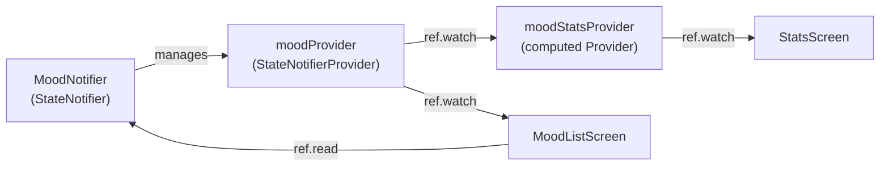
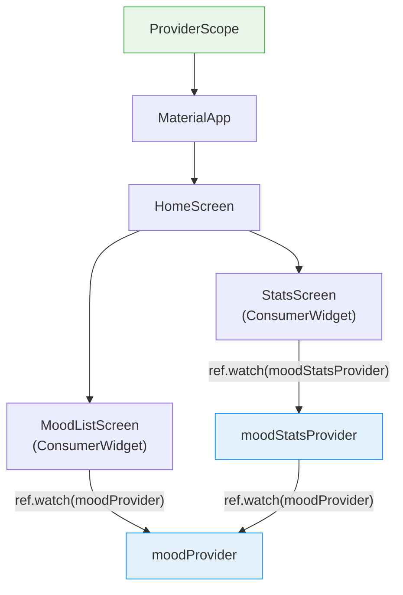
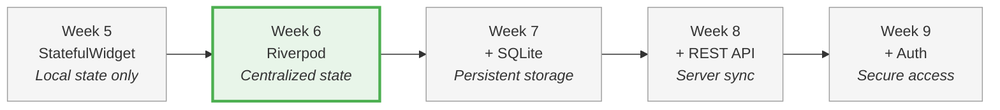

# Week 6 Lab: State Management with Riverpod

<div class="lab-meta" markdown>
<div class="lab-meta__row"><span class="lab-meta__label">Course</span> Mobile Apps for Healthcare</div>
<div class="lab-meta__row"><span class="lab-meta__label">Duration</span> ~2 hours</div>
<div class="lab-meta__row"><span class="lab-meta__label">Prerequisites</span> Week 4 Flutter fundamentals (widgets, StatefulWidget, setState)</div>
</div>

<div class="grid cards" markdown>

- :material-target:{ .lg .middle } **Learning Objectives**

    ---

    By the end of this lab, you will be able to:

    - [ ] Manage app-wide state that multiple screens share
    - [ ] Build reactive UIs that update automatically when data changes
    - [ ] Apply the provider pattern used in production Flutter apps
    - [ ] Choose the right data access pattern (`watch` vs `read`) for each situation

- :material-clock-outline:{ .lg .middle } **Time Estimate**

    ---

    | Section | Duration |
    |---------|----------|
    | Part 1-2: Model & Providers | ~25 min |
    | Part 3: ProviderScope setup | ~10 min |
    | Part 4-6: ConsumerWidgets | ~35 min |
    | Part 7: Stats screen | ~15 min |
    | Self-check & reflection | ~10 min |

</div>

!!! warning "Proposal check"
    Your **full written project proposal** should have been submitted at the end of Week 5. If your team has not yet submitted it, do so immediately using the template at `templates/project-proposal/PROPOSAL_TEMPLATE.md`. Sprint 1 starts this week — you need an approved scope.

!!! abstract "What you already know"
    **From Week 4-5:** You built Flutter UIs with `StatelessWidget` and `StatefulWidget`, used `setState()` for local state, and created layouts with `Column`, `Row`, and `ListView`. **This week's leap:** Instead of each widget managing its own state with `setState()`, you'll learn to centralize state in providers that any widget can access — making your app scalable and testable.

---

## Detailed Learning Objectives

By the end of this lab you will be able to:

1. Set up a Flutter project skeleton for your team project.
2. Explain why `setState()` alone is insufficient for apps with shared state across multiple screens.
3. Implement a `StateNotifier` with immutable state updates (add, delete, update).
4. Define providers (`StateNotifierProvider`, computed `Provider`) to expose and derive state.
5. Wire a Flutter app to Riverpod using `ProviderScope` and `ConsumerWidget`.
6. Use `ref.watch()` for reactive UI rebuilds and `ref.read()` for one-time actions in event handlers.
7. Build a computed/derived provider that automatically recalculates when its dependencies change.

---

## Prerequisites

Before you begin, make sure you have the following ready:

- **Flutter SDK** installed and on your PATH. Verify by running:
  ```bash
  flutter doctor
  ```
  All checks should pass (or show only minor warnings unrelated to your target platform).
- **An IDE** with Flutter support (VS Code recommended, or Android Studio).
- **A running device** -- emulator, simulator, or physical device.
- **The starter project** loaded in your IDE. Download it from the course materials:
  ```
  week-06-state-management/lab/starter/mood_tracker/
  ```
  Copy the entire `mood_tracker` folder to your local machine, open it in your IDE, and run:
  ```bash
  cd mood_tracker
  flutter pub get
  flutter run
  ```
  Verify the app builds and launches before starting the exercises.

> **Tip:** If the starter project does not compile, check that `flutter_riverpod` and `uuid` appear in `pubspec.yaml` and that `flutter pub get` completed without errors. Ask the instructor for help if needed.

---

## Part 0: Project Skeleton Setup (~20 min)

!!! tip "This part can be done as homework"
    Part 0 sets up your team project and does not depend on the Mood Tracker starter. If you are short on time during the lab session, you may complete it before or after class.

In the sprint planning workshop (Week 5), you learned *why* `setState()` doesn't scale and how centralized state management solves the prop drilling problem. Now you'll start by setting up your team's Flutter project, then implement the solution hands-on.

### 0.1 Create the Flutter Project

One team member creates the project on a feature branch:

```bash
git switch -c setup/flutter-project
flutter create --org com.yourteam your_app_name
cd your_app_name
```

### 0.2 Clean Up the Default App

Replace the default counter app with a minimal skeleton:

**`lib/main.dart`:**
```dart
import 'package:flutter/material.dart';
import 'screens/home_screen.dart';

void main() {
  runApp(const MyApp());
}

class MyApp extends StatelessWidget {
  const MyApp({super.key});

  @override
  Widget build(BuildContext context) {
    return MaterialApp(
      title: 'Your App Name',
      theme: ThemeData(
        colorScheme: ColorScheme.fromSeed(seedColor: Colors.teal),
        useMaterial3: true,
      ),
      home: const HomeScreen(),
    );
  }
}
```

**`lib/screens/home_screen.dart`:**
```dart
import 'package:flutter/material.dart';

class HomeScreen extends StatelessWidget {
  const HomeScreen({super.key});

  @override
  Widget build(BuildContext context) {
    return Scaffold(
      appBar: AppBar(
        title: const Text('Home'),
      ),
      body: const Center(
        child: Text('Welcome to Your App!'),
      ),
    );
  }
}
```

### 0.3 Create Additional Screen Stubs

Create placeholder screens for your app (at least 2-3):

```
lib/
├── main.dart
├── screens/
│   ├── home_screen.dart
│   ├── entry_screen.dart      # Where users enter data
│   └── history_screen.dart    # Where users view past entries
└── models/
    └── (to be added later)
```

### 0.4 Add Basic Navigation

Flutter provides `Navigator.push` to move between screens and `Navigator.pop` to go back. Think of it like a stack of cards — `push` adds a new card on top, `pop` removes it to reveal the one underneath.

Add navigation between screens using `Navigator.push`:

```dart
ElevatedButton(
  onPressed: () {
    Navigator.push(
      context,
      MaterialPageRoute(builder: (context) => const EntryScreen()),
    );
  },
  child: const Text('New Entry'),
),
```

### 0.5 Commit and Create PR

```bash
git add .
git commit -m "Set up Flutter project with basic navigation"
git push -u origin setup/flutter-project
```

Create a PR on GitHub. Have a teammate review and merge it.

Then everyone pulls:
```bash
git switch main
git pull
```

> **Time check:** This should take about 20 minutes. Once your team project is set up, switch to the **Mood Tracker starter project** for the rest of this lab.

!!! info "Grading"
    For detailed sprint review rubrics and grading criteria, see the [Project Grading Guide](../../resources/PROJECT_GRADING.md).

!!! info "Two projects this week"
    **Part 0** sets up **your team's project** — the app you will build all semester. **Parts 1–7** use the **Mood Tracker starter project** provided in `week-06-state-management/lab/starter/mood_tracker/`. The Mood Tracker is a guided exercise that teaches you the state management patterns you will then apply to your own project.

---

## About the Starter Project

You are working on a **Mood Tracker** app that will be developed incrementally over Weeks 6--9. The starter project already provides:

- A `MoodEntry` model with `id`, `score`, `note`, and `createdAt` fields (plus `copyWith`)
- Four screens: Home, Add Mood, Mood Detail, and Statistics
- Reusable widgets: `MoodCard` and `MoodScoreIndicator`

The app currently uses **hardcoded data** and placeholder logic. Your job in this lab is to replace those with proper **Riverpod state management** by completing 7 TODOs across 5 files.

### Project structure

| File | Purpose |
|------|---------|
| `lib/models/mood_entry.dart` | Data model (provided -- do not edit) |
| `lib/providers/mood_provider.dart` | TODOs 1--2: State notifier and provider definitions |
| `lib/main.dart` | TODO 3: ProviderScope setup |
| `lib/screens/home_screen.dart` | TODO 4: Reactive mood list |
| `lib/screens/add_mood_screen.dart` | TODO 5: Adding new moods |
| `lib/screens/mood_detail_screen.dart` | TODO 6: Deleting moods |
| `lib/screens/stats_screen.dart` | TODO 7: Derived statistics |
| `lib/widgets/` | Reusable UI components (provided -- do not edit) |

---

> **Healthcare Context: Why State Management Matters in mHealth**
>
> In real mobile health applications, state management is critical. Consider:
> - **Real-time vital signs** from wearable sensors must update across multiple screens simultaneously.
> - **Medication reminders** need consistent state so a dismissal on one screen is reflected everywhere.
> - **Patient mood tracking** (exactly what you are building) requires that adding, editing, or deleting an entry immediately propagates to lists, detail views, and statistical dashboards.
> - **Data integrity** -- in healthcare, showing stale or inconsistent data is not just a bug, it is a safety risk.
>
> The patterns you learn today -- centralized state, immutable updates, and reactive UI -- are the same patterns used in production mHealth apps.

!!! example "Think of it like... a group chat"
    Riverpod providers are like a **group chat** — when someone sends a message (state changes), everyone in the chat (widgets using `ref.watch`) sees it instantly. `ref.read()` is like checking the chat once without turning on notifications.

---

## Part 1: Understanding State Management (~15 min)

!!! tip "Remember from Week 4?"
    In Week 4, you used `setState()` to update a single screen. Today you'll replace it with Riverpod — same idea (notify Flutter to rebuild), but now the state lives outside any single widget so every screen can access it.

!!! abstract "TL;DR"
    You'll replace `setState()` with a centralized `StateNotifier` so every screen
    shares the same data without passing it through constructors.

### 1.1 The problem with setState()

In Weeks 4--5, you used `setState()` to update the UI. This works well for **local state** within a single widget, but breaks down when:

- **Multiple screens need the same data.** If the Home screen and Stats screen both display mood entries, how do you keep them in sync?
- **A child widget modifies data that a parent or sibling needs.** You would have to pass callbacks up and down the widget tree.
- **The app grows.** With 10+ screens, passing state through constructors and callbacks becomes unmanageable.

~~`setState()` works fine for apps with multiple screens~~ — it doesn't. Each widget holds its own copy, so the home screen and stats screen show different data.

### 1.2 What is Riverpod?

Riverpod is a state management library for Flutter that solves these problems:

| Concept | What it does |
|---------|-------------|
| **Provider** | A container that holds a piece of state and makes it accessible to any widget in the tree. |
| **StateNotifier** | A class that holds state and exposes methods to modify it using immutable updates. |
| **ConsumerWidget** | A widget that can read providers using `ref.watch()` and `ref.read()`. |
| **ProviderScope** | The root widget that stores all provider state. |

### 1.3 ref.watch() vs ref.read()

This distinction is fundamental:

| Method | When to use | Behavior |
|--------|------------|----------|
| `ref.watch(provider)` | In `build()` methods | Rebuilds the widget whenever the provider's state changes. |
| `ref.read(provider)` | In event handlers (onPressed, onSubmitted) | Reads the current value once, does not listen for changes. |

> **Rule of thumb:** ==Use `ref.watch()` in `build()` methods, use `ref.read()` in callbacks and event handlers==

!!! warning "Common mistake"
    Using `ref.read()` in the `build()` method reads the value once but
    does NOT subscribe to changes — your widget won't rebuild when the
    data updates. Always use `ref.watch()` in `build()` for reactive UIs.

??? protip "Pro tip"
    `ref.invalidate(provider)` forces a provider to recompute immediately —
    useful for pull-to-refresh patterns where you want to force-fetch fresh
    data from the source.

### 1.4 Immutable state updates

==Never mutate state directly — always create a new list/object.== Riverpod's `StateNotifier` requires that you **replace** the state rather than **mutate** it:

```dart
// WRONG -- mutating the existing list (StateNotifier will not detect the change)
state.add(newEntry);

// RIGHT -- creating a new list (StateNotifier detects the reassignment)
state = [newEntry, ...state];
```

This is because Riverpod compares object identity (`==`) to decide whether to rebuild widgets. If you mutate the same list in place, the identity does not change, and the UI will not update.

!!! example "Try it live: Why immutable updates matter"
    Copy this code into [DartPad](https://dartpad.dev/) to see why `state.add()` silently fails while `state = [...state, item]` works. This is the core of how Riverpod detects changes.

    ```dart
    // Simplified StateNotifier pattern (pure Dart, no Flutter needed)
    class SimpleStateNotifier<T> {
      T _state;
      final List<void Function(T)> _listeners = [];

      SimpleStateNotifier(this._state);

      T get state => _state;
      set state(T newState) {
        if (!identical(_state, newState)) {
          _state = newState;
          for (final listener in _listeners) {
            listener(_state);
          }
        }
      }

      void addListener(void Function(T) listener) {
        _listeners.add(listener);
      }
    }

    void main() {
      final notifier = SimpleStateNotifier<List<String>>(['Morning jog']);

      // Simulating a widget that "watches" the state
      notifier.addListener((moods) {
        print('UI rebuilt! Moods: $moods');
      });

      print('--- Immutable update (new list) ---');
      notifier.state = [...notifier.state, 'Lunch break'];

      print('\n--- Mutable update (same list) ---');
      final sameList = notifier.state;
      sameList.add('Evening walk');
      notifier.state = sameList; // Same object identity!

      print('(No rebuild! identical() returned true)');

      print('\n--- Fix: always create a new list ---');
      notifier.state = [...notifier.state, 'Night reading'];
    }
    ```

    <!-- TODO: Replace code block with iframe once Gist is created:
    <iframe src="https://dartpad.dev/embed-inline.html?id=GIST_ID&theme=dark&run=true&split=60"
      style="width:100%; height:400px; border:1px solid var(--md-default-fg-color--lightest); border-radius:8px;">
    </iframe>
    -->

---

### Self-Check: Part 1

Before continuing, make sure you can answer these questions:

- [ ] Why does `setState()` not work well for state shared across screens?
- [ ] What is the difference between `ref.watch()` and `ref.read()`?
- [ ] Why must state updates in `StateNotifier` be immutable?

---

!!! warning "Common mistake"
    Don't mutate state in place with `state.add(mood)` — Riverpod compares
    object identity to detect changes. Create a new list instead:
    `state = [...state, mood]`. In-place mutation silently fails to update
    the UI.

## Part 2: Building the MoodNotifier (~20 min)

!!! abstract "TL;DR"
    Build a `StateNotifier` — a single source of truth that any screen can read from and write to.

Open `lib/providers/mood_provider.dart`. This file will contain all your state management logic.

Here is an overview of how the providers and screens will connect once you complete all the TODOs:



!!! example "Real-world mHealth: How Apple Health uses this pattern"
    Apple Health aggregates data from multiple sources (Apple Watch, third-party apps, manual entries) into a centralized health store — conceptually similar to a `StateNotifier` holding a list of health records. Each data source writes to the store, and multiple screens (Heart, Activity, Sleep) reactively display derived statistics. Your `moodStatsProvider` computing averages from `moodProvider` mirrors exactly how Apple Health computes weekly step averages from daily data.

### 2.1 TODO 1: Implement the MoodNotifier class

Find the `TODO 1` comment block. Your task is to uncomment and complete the `MoodNotifier` class that extends `StateNotifier<List<MoodEntry>>`.

You need to implement:

1. **Constructor** -- Initialize with 2--3 sample `MoodEntry` objects passed to `super([...])`. Use the sample data from the hardcoded list in `home_screen.dart` as reference.

2. **`addMood(int score, String? note)`** -- Create a new `MoodEntry` and prepend it to the list.

3. **`deleteMood(String id)`** -- Remove the entry with the matching id.

4. **`updateMood(String id, int score, String? note)`** -- Replace the matching entry using `copyWith`.

??? tip "Solution"
    ```dart
    class MoodNotifier extends StateNotifier<List<MoodEntry>> { // (1)!
      // constructor with super([...sample entries...])

      // addMood
      state = [newEntry, ...state]; // (2)!

      // deleteMood
      state = state.where((e) => e.id != id).toList(); // (3)!

      // updateMood
      state = state.map((e) => e.id == id ? e.copyWith(score: score, note: note) : e).toList();
    }
    ```

    1. `StateNotifier<List<MoodEntry>>` means this class holds and manages a `List<MoodEntry>` as its state. StateNotifier provides the `state` getter/setter and notifies listeners on reassignment.
    2. Immutable state update pattern: we create a **new list** by spreading the old one, rather than calling `state.add()`. Riverpod detects the reassignment and notifies all listening widgets.
    3. `where()` creates a **new list** containing only entries whose `id` does not match — effectively removing the target entry without mutating the original list.

??? warning "Common mistake: Mutating state directly"
    ```dart
    // WRONG — mutating the existing list
    void addMood(MoodEntry entry) {
      state.add(entry);  // This does NOT trigger a rebuild!
    }

    // CORRECT — creating a new list
    void addMood(MoodEntry entry) {
      state = [...state, entry];  // New list = notifies listeners
    }
    ```
    StateNotifier only notifies listeners when `state` is reassigned to a **new object**. Calling `.add()` on the existing list mutates it in place — Riverpod has no way to detect the change. Always use `state = [newList]`.

### 2.2 TODO 2: Define the providers

Find the `TODO 2` comment block in the same file. Uncomment and complete two providers:

1. **`moodProvider`** -- A `StateNotifierProvider` that creates and exposes the `MoodNotifier`.

2. **`moodStatsProvider`** -- A computed `Provider` that derives statistics from the mood list. It should return a `Map<String, dynamic>` with four keys: `totalEntries`, `averageScore`, `highestScore`, `lowestScore`.

Use `ref.watch(moodProvider)` inside this provider to access the current mood list. This creates a dependency: whenever `moodProvider` changes, `moodStatsProvider` automatically recalculates.

Handle the empty-list edge case by returning zeros.

??? tip "Solution"
    ```dart
    final moodProvider = StateNotifierProvider<MoodNotifier, List<MoodEntry>>((ref) { // (1)!
      return MoodNotifier();
    });

    final moodStatsProvider = Provider<Map<String, dynamic>>((ref) {
      final moods = ref.watch(moodProvider); // (2)!
      if (moods.isEmpty) {
        return {'totalEntries': 0, 'averageScore': 0.0, 'highestScore': 0, 'lowestScore': 0};
      }
      final scores = moods.map((m) => m.score).toList();
      return {
        'totalEntries': moods.length,
        'averageScore': scores.reduce((a, b) => a + b) / scores.length,
        'highestScore': scores.reduce((a, b) => a > b ? a : b),
        'lowestScore': scores.reduce((a, b) => a < b ? a : b),
      };
    });
    ```

    1. `StateNotifierProvider` takes two type parameters: the **notifier class** (`MoodNotifier`) and the **state type** it manages (`List<MoodEntry>`). These must match the `extends StateNotifier<List<MoodEntry>>` declaration.
    2. `ref.watch(moodProvider)` creates a **reactive dependency**: whenever the mood list changes (add, delete, update), this `moodStatsProvider` automatically recalculates its statistics. No manual synchronization needed.

??? warning "Common mistake: Using ref.watch in the wrong place"
    ```dart
    // WRONG — ref.watch outside build() causes unexpected rebuilds
    void _onButtonPressed() {
      final moods = ref.watch(moodProvider);  // BUG!
    }

    // CORRECT — use ref.read for one-time access
    void _onButtonPressed() {
      final moods = ref.read(moodProvider);
    }
    ```
    `ref.watch()` subscribes to changes and is designed for `build()` methods only. Using it in callbacks creates hidden subscriptions that trigger unnecessary rebuilds and can cause hard-to-debug performance issues.

> **Tip:** The app will not compile after completing TODOs 1--2 alone because the providers are referenced in other files. That is expected. Continue to TODO 3 to make the app compilable.

---

### Self-Check: Part 2

- [ ] Your `MoodNotifier` class extends `StateNotifier<List<MoodEntry>>`.
- [ ] The constructor initializes with 2--3 sample entries.
- [ ] All three methods (`addMood`, `deleteMood`, `updateMood`) use immutable state updates.
- [ ] `moodStatsProvider` uses `ref.watch(moodProvider)` to derive its data.

??? question "Quick check: ref.watch vs ref.read"
    When should you use `ref.watch()` vs `ref.read()`?

    ??? success "Answer"
        - **`ref.watch()`**: Inside `build()` methods — subscribes to changes and triggers rebuilds
        - **`ref.read()`**: Inside callbacks, event handlers, `onPressed` — reads the current value once without subscribing
        - **Rule of thumb**: If the code runs once (button press), use `read()`. If it should react to changes (display data), use `watch()`.

??? question "Scenario: The patient's mood log"
    A patient logs their mood on the entry screen, then immediately swipes to the stats dashboard. Without Riverpod, what would the dashboard show? With Riverpod, why is it different?

    ??? success "Answer"
        Without Riverpod, the stats dashboard would show stale data — it has its own copy of the mood list that wasn't updated when the entry screen added a new mood. With Riverpod, both screens use `ref.watch(moodProvider)` to subscribe to the **same** centralized state. The moment `MoodNotifier` adds an entry, `moodStatsProvider` recalculates, and the stats screen rebuilds with accurate numbers. No manual refresh needed.

??? challenge "Stretch Goal: Add a sort method"
    Add a `sortByDate()` method to `MoodNotifier` that toggles between newest-first and oldest-first ordering.

    *Hint:* Add a `bool _newestFirst = true` field and use `state = [...state]..sort(...)`.

!!! success "Checkpoint: Part 2 complete"
    You have a working `MoodNotifier` with add, delete, and update methods
    using immutable state updates. Your app doesn't use it yet — that's
    next in Part 3.

---

## Part 3: Wiring Up Riverpod (~10 min)

### 3.1 TODO 3: Wrap the app with ProviderScope

Open `lib/main.dart`. Find the `TODO 3` comments.

You need to make two changes:

1. **Add the import** at the top of the file.

2. **Wrap `runApp()` with `ProviderScope`**.

`ProviderScope` is the container that stores all your provider state. Without it, any call to `ref.watch()` or `ref.read()` will throw a runtime error.

??? tip "Solution"
    ```dart
    // Add at the top of the file
    import 'package:flutter_riverpod/flutter_riverpod.dart';

    // In main(), wrap with ProviderScope
    runApp(const ProviderScope(child: MoodTrackerApp())); // (1)!
    ```

    1. `ProviderScope` acts as a **container** that stores all provider state for the entire app. It must be an ancestor of every widget that uses providers — placing it at `runApp()` ensures every widget in the tree can use `ref.watch()` and `ref.read()`.

??? warning "Common mistake: Forgetting ProviderScope"
    If you see `ProviderNotFoundException` or `Bad state: No ProviderScope found`, it means `ProviderScope` is missing from the widget tree. It must wrap `MaterialApp` — not just an individual screen. Think of it as the "battery" that powers all providers.

After this change, try running the app. It should compile and display the same hardcoded data as before (because the screens have not been updated yet).

---

### Self-Check: Part 3

- [ ] The app compiles and runs.
- [ ] `ProviderScope` wraps the entire `MoodTrackerApp`.

---

## Part 4: Reactive UI with ConsumerWidget (~25 min)

!!! abstract "TL;DR"
    Swap `StatelessWidget` for `ConsumerWidget` to give your screens access to the provider system.

Now you will connect the UI to your providers. This is where the app starts feeling reactive.

The diagram below shows how `ProviderScope` sits at the root and how each `ConsumerWidget` connects to the provider layer:



Here is the transformation you are about to make — from constructor-based prop drilling to reactive provider access:

=== "Before: StatelessWidget (Week 5)"

    ```dart
    class MoodListScreen extends StatelessWidget {
      final List<MoodEntry> moods;  // Passed via constructor
      final Function(int) onDelete;

      const MoodListScreen({
        required this.moods,
        required this.onDelete,
      });

      @override
      Widget build(BuildContext context) {
        return ListView.builder(
          itemCount: moods.length,
          itemBuilder: (context, index) => MoodTile(
            mood: moods[index],
            onDelete: () => onDelete(index),
          ),
        );
      }
    }
    ```

=== "After: ConsumerWidget (Week 6)"

    ```dart
    class MoodListScreen extends ConsumerWidget {
      // No constructor parameters needed!

      @override
      Widget build(BuildContext context, WidgetRef ref) {
        final moods = ref.watch(moodProvider);  // Reactive!
        return ListView.builder(
          itemCount: moods.length,
          itemBuilder: (context, index) => MoodTile(
            mood: moods[index],
            onDelete: () => ref.read(moodProvider.notifier)
                .removeMood(moods[index].id),
          ),
        );
      }
    }
    ```

### 4.1 TODO 4: Make HomeScreen reactive

Open `lib/screens/home_screen.dart`. Find the `TODO 4` comments.

Make these changes:

1. **Add imports** for `flutter_riverpod` and `mood_provider.dart`.
2. **Change `StatelessWidget` to `ConsumerWidget`.**
3. **Add `WidgetRef ref`** as the second parameter to the `build` method.
4. **Replace the hardcoded list** with a provider read.
5. **Remove the `_hardcodedMoods` variable** at the bottom of the file (it is no longer needed).

??? tip "Solution"
    ```dart
    Widget build(BuildContext context, WidgetRef ref) {
    ```

    ```dart
    final moods = ref.watch(moodProvider);
    ```

Run the app (press ++r++ in the terminal to **hot reload** after each change). The home screen should now display the sample data from your `MoodNotifier` constructor. It looks the same, but the data is now coming from Riverpod.

### 4.2 TODO 5: Wire the Add Mood form

Here is the key transformation for event handlers — from local `setState()` to centralized provider calls:

=== "Before (setState)"

    ```dart
    void _submitMood() {
      setState(() {
        _moods.add(MoodEntry(score: _score, note: _note));
      });
      Navigator.pop(context);
    }
    ```

=== "After (Riverpod)"

    ```dart
    void _submitMood() {
      ref.read(moodProvider.notifier).addMood(
        _score,
        _noteController.text.isEmpty ? null : _noteController.text,
      );
      Navigator.pop(context);
    }
    ```

Open `lib/screens/add_mood_screen.dart`. Find the `TODO 5` comments.

This screen uses `StatefulWidget` because it has local form state (the slider value and text field). Riverpod provides a variant for this: `ConsumerStatefulWidget`.

Make these changes:

1. **Add imports** for `flutter_riverpod` and `mood_provider.dart`.
2. **Change `StatefulWidget` to `ConsumerStatefulWidget`.**
3. **Change `State<AddMoodScreen>` to `ConsumerState<AddMoodScreen>`.**
4. **In `_submitMood()`**, replace the SnackBar placeholder with the actual provider call.

??? tip "Solution"
    ```dart
    ref.read(moodProvider.notifier).addMood( // (1)!
      _score,
      _noteController.text.isEmpty ? null : _noteController.text,
    );
    ```

    1. `ref.read(moodProvider.notifier)` performs a **one-time read** to get the `MoodNotifier` instance and call its method. Use `ref.read()` in callbacks and event handlers (like `onPressed`); use `ref.watch()` in `build()` methods for continuous subscriptions. Reading `.notifier` gives you the `StateNotifier` itself so you can call its methods.

    **Notice:** We use `ref.read()` here, not `ref.watch()`. The submit handler is a one-time action triggered by a button press, not a continuous subscription. Using `ref.watch()` inside a callback would be incorrect.

??? warning "Common mistake: Using ref.watch in onPressed"
    ```dart
    // WRONG — watch in callback creates hidden subscription
    onPressed: () {
      ref.watch(moodProvider.notifier).addMood(...);
    }

    // CORRECT — read for one-time action
    onPressed: () {
      ref.read(moodProvider.notifier).addMood(...);
    }
    ```
    In an `onPressed` callback, the code runs once when the button is pressed. Using `ref.watch()` here is wasteful and can cause subtle bugs. Reserve `watch()` for `build()` where you need reactive updates.

Run the app and try adding a mood entry. Navigate back to the home screen -- the new entry should appear at the top of the list automatically. This is the power of reactive state management: you did not write any code to refresh the list, Riverpod handled it.

---

### Self-Check: Part 4

- [ ] The home screen displays mood entries from the provider, not hardcoded data.
- [ ] Adding a new mood entry works and the home screen updates automatically.
- [ ] You understand why `ConsumerWidget` is used for HomeScreen and `ConsumerStatefulWidget` for AddMoodScreen.
- [ ] You understand why `ref.watch()` is used in `build()` but `ref.read()` is used in `_submitMood()`.

??? question "Quick check: Why ConsumerWidget?"
    What would happen if you used a regular `StatelessWidget` instead of `ConsumerWidget`?

    ??? success "Answer"
        You wouldn't have access to the `ref` parameter in your `build()` method, so you couldn't call `ref.watch()` or `ref.read()` to access providers. `ConsumerWidget` is Riverpod's way of connecting the widget tree to the provider system.

!!! success "Checkpoint: Part 4 complete"
    Your home screen is reactive — it reads mood entries from the provider
    and updates automatically when data changes. Adding a mood works
    end-to-end through the provider system.

---

## Part 5: State Mutations from Detail Views (~15 min)

### 5.1 TODO 6: Wire the delete button

Open `lib/screens/mood_detail_screen.dart`. Find the `TODO 6` comments.

Make these changes:

1. **Add imports** for `flutter_riverpod` and `mood_provider.dart`.
2. **Change `StatelessWidget` to `ConsumerWidget`.**
3. **Add `WidgetRef ref`** to the `build` method signature.
4. **In the delete confirmation dialog**, replace the placeholder with the actual provider call and navigation.

??? tip "Solution"
    ```dart
    ref.read(moodProvider.notifier).deleteMood(entry.id);
    Navigator.pop(context); // close dialog
    Navigator.pop(context); // go back to list
    ```

    **Two Navigator.pop() calls:** The first closes the confirmation dialog. The second navigates back from the detail screen to the home screen. Without both, the user would be stuck on the detail screen of a deleted entry.

Run the app. Tap a mood entry to open the detail screen, then tap the delete icon. Confirm the deletion. You should be taken back to the home screen with the entry removed.

---

### Self-Check: Part 5

- [ ] Deleting a mood entry from the detail screen works.
- [ ] After deletion, the app navigates back to the home screen.
- [ ] The home screen no longer shows the deleted entry.

---

## Part 6: Derived/Computed State (~15 min)

### 6.1 TODO 7: Wire the statistics screen

Open `lib/screens/stats_screen.dart`. Find the `TODO 7` comments.

Make these changes:

1. **Add imports** for `flutter_riverpod` and `mood_provider.dart`.
2. **Change `StatelessWidget` to `ConsumerWidget`.**
3. **Add `WidgetRef ref`** to the `build` method signature.
4. **Replace the hardcoded stats map** with a provider read.

??? tip "Solution"
    ```dart
    final stats = ref.watch(moodStatsProvider); // (1)!

    // Then access computed values in the UI:
    stats['averageScore'] // (2)!
    stats['totalEntries']
    stats['highestScore']
    stats['lowestScore']
    ```

    1. `ref.watch(moodStatsProvider)` **subscribes** this widget to the stats provider. Whenever the underlying mood list changes, `moodStatsProvider` recalculates, and this widget automatically rebuilds with the new statistics.
    2. These are **computed values from the derived provider** — you defined them in `moodStatsProvider` (TODO 2). The stats screen does not calculate anything itself; it simply displays the precomputed map values.

Run the app and navigate to the statistics screen (bar chart icon in the app bar). The stats should reflect the actual mood entries. Now try adding or deleting entries and revisiting the stats screen -- the numbers update automatically.

### 6.2 How derived state works

The `moodStatsProvider` you defined in TODO 2 uses `ref.watch(moodProvider)` internally. This creates a dependency chain:

```
User action (add/delete)
  --> MoodNotifier updates state
    --> moodProvider notifies listeners
      --> moodStatsProvider recalculates
        --> StatsScreen rebuilds with new values
```

You wrote zero synchronization code. Riverpod handles all of it through the provider dependency graph. This is one of the most powerful patterns in state management: **derived state that stays in sync automatically**.

---

### Self-Check: Part 6

- [ ] The statistics screen displays live data from the provider.
- [ ] Adding or deleting entries causes the statistics to update.
- [ ] You can explain how `moodStatsProvider` depends on `moodProvider`.

??? challenge "Stretch Goal: Mood trend provider"
    Add a `moodTrendProvider` that returns `'improving'`, `'declining'`, or `'stable'` based on the last 5 entries' scores.

    *Hint:* Compare the average of the first 3 entries with the average of the last 3. Use `ref.watch(moodProvider)` to get the list.

!!! success "Checkpoint: Part 6 complete"
    The statistics screen displays live computed data from a derived
    provider. Adding or deleting entries recalculates stats automatically.
    The full Riverpod data flow is working end-to-end.

---

## Part 7: Self-Check and Summary (~10 min)

### 7.1 End-to-end verification

Walk through this complete flow to verify everything works:

1. Launch the app. You should see the sample mood entries on the home screen.
2. Tap the **+** button. Set a score, type a note, and tap **Save Entry**.
3. Verify the new entry appears at the top of the home screen list.
4. Tap the **bar chart** icon to view statistics. Verify the numbers are correct (total entries, average, highest, lowest).
5. Go back and tap a mood entry to view its details.
6. Tap the **delete** icon, confirm deletion.
7. Verify the entry is gone from the home screen.
8. Check the statistics screen again -- the numbers should have updated.

If all 8 steps work correctly, you have completed the lab.

### 7.2 Summary

| TODO | File | What you did |
|------|------|-------------|
| 1 | `providers/mood_provider.dart` | Implemented `MoodNotifier` with `StateNotifier`, sample data, and immutable state update methods. |
| 2 | `providers/mood_provider.dart` | Defined `moodProvider` (StateNotifierProvider) and `moodStatsProvider` (computed Provider). |
| 3 | `main.dart` | Wrapped the app in `ProviderScope` to enable Riverpod. |
| 4 | `screens/home_screen.dart` | Changed to `ConsumerWidget`, replaced hardcoded list with `ref.watch(moodProvider)`. |
| 5 | `screens/add_mood_screen.dart` | Changed to `ConsumerStatefulWidget`, wired submit to `ref.read(moodProvider.notifier).addMood()`. |
| 6 | `screens/mood_detail_screen.dart` | Changed to `ConsumerWidget`, wired delete to `ref.read(moodProvider.notifier).deleteMood()`. |
| 7 | `screens/stats_screen.dart` | Changed to `ConsumerWidget`, replaced hardcoded stats with `ref.watch(moodStatsProvider)`. |

### 7.3 Key concepts learned

| Concept | Key Takeaway |
|---------|--------------|
| State management | Centralized state solves the problem of keeping multiple screens in sync. |
| `StateNotifier` | Holds state and exposes methods for immutable updates via `state = ...`. |
| `StateNotifierProvider` | Makes a `StateNotifier` accessible to any widget via `ref`. |
| Computed `Provider` | Derives new state from existing providers; recalculates automatically. |
| `ConsumerWidget` | Replaces `StatelessWidget` when you need to access providers. |
| `ConsumerStatefulWidget` | Replaces `StatefulWidget` when you need both local state and provider access. |
| `ref.watch()` | Subscribes to a provider in `build()` -- rebuilds widget on changes. |
| `ref.read()` | Reads a provider once in event handlers -- no subscription. |
| `ProviderScope` | Root widget that stores all provider state; required for Riverpod to work. |

---

## Part 8: Accessibility Quick-Win (Bonus, ~15 min)

!!! info "Why this matters"
    The final project rubric awards up to **15 points for mHealth Awareness**, which includes accessibility. This short exercise teaches you the highest-impact accessibility improvements you can apply to any Flutter app. Apply these patterns to your team project as you build it.

### 8.1 Add Semantic Labels

Screen readers (TalkBack on Android, VoiceOver on iOS) read semantic labels to visually impaired users. Without labels, icons and images are invisible to these users.

Open any screen in the Mood Tracker (e.g., `home_screen.dart`). Find an `Icon` or `IconButton` and add a semantic label:

```dart
// Before: screen reader says nothing
IconButton(
  icon: const Icon(Icons.add),
  onPressed: () { /* ... */ },
)

// After: screen reader says "Add new mood entry"
IconButton(
  icon: const Icon(Icons.add),
  tooltip: 'Add new mood entry',  // also serves as semantic label
  onPressed: () { /* ... */ },
)
```

Add `tooltip` or `Semantics` wrappers to at least 3 interactive elements in the app.

### 8.2 Check Text Scaling

Patients with reduced vision use larger text sizes in their device settings. Verify your app handles this:

1. On your emulator/device, go to **Settings → Accessibility → Font size** and set it to the **largest** option.
2. Reopen the Mood Tracker. Do any text elements overflow or get cut off?
3. If so, wrap the problematic widget in a `Flexible` or use `overflow: TextOverflow.ellipsis` on the `Text` widget.

### 8.3 Verify Touch Targets

Material Design recommends a **minimum touch target of 48x48 dp**. Flutter's `IconButton` and `ElevatedButton` already meet this. But custom `GestureDetector` or `InkWell` widgets may not. Check that all tappable areas are at least 48x48.

### 8.4 Test with a Screen Reader (optional but recommended)

If you have a physical Android device:

1. Go to **Settings → Accessibility → TalkBack** and turn it on.
2. Navigate through the Mood Tracker by swiping.
3. Listen to what the screen reader announces. Can a blind user understand the app?
4. Turn TalkBack off when done (swipe down with two fingers, then double-tap "OK").

!!! tip "Reference"
    For the full accessibility checklist with before/after code examples, see the [Accessibility Guide](../../resources/ACCESSIBILITY_GUIDE.md) in the course resources.

---

## Applying This to Your Team Project

Now that you understand Riverpod state management, consider how to apply it in your team project:

- **Identify your app's state:** What data is shared across multiple screens? (e.g., user profile, measurement history, settings)
- **Design your providers:** Each distinct data domain should have its own `StateNotifier` and provider.
- **Choose wisely between `ref.watch()` and `ref.read()`:** Use `watch()` in `build()` methods for reactive updates, and `read()` in event handlers for one-time actions.

!!! question "Discussion: Your app's state architecture"
    Sketch (on paper or whiteboard) which screens in your team app share data. Draw arrows showing which providers each screen will consume. Discuss with your team — are there circular dependencies? Can any state be derived (like `moodStatsProvider`)?

### Where You Are: Course Architecture Journey



## What Comes Next

In the following weeks, you will extend this Mood Tracker app:

- **Week 7:** Local persistence with SQLite -- mood entries survive app restarts.
- **Week 8:** Networking and API integration -- the app syncs mood data with a remote server.
- **Week 9:** Authentication and security -- login, secure token storage, and route guarding.

The Riverpod foundation you built today will remain at the core of the app throughout.

---

## Troubleshooting

??? question "`ProviderScope` not found / `flutter_riverpod` not recognized"
    Run `flutter pub get` to install dependencies. Check that `flutter_riverpod` appears in the `dependencies` section of `pubspec.yaml` (not `dev_dependencies`). If it is missing, add it: `flutter pub add flutter_riverpod`.

??? question "The app compiles but nothing updates when I add a mood"
    Check two things: (1) Your `MoodNotifier` methods must reassign `state` (e.g., `state = [newEntry, ...state]`), not mutate it (e.g., `state.add(newEntry)`). (2) Your screen must use `ref.watch(moodProvider)` in the `build()` method, not `ref.read()`.

??? question "`StateNotifierProvider` type arguments don't match"
    The generic types must be `StateNotifierProvider<MoodNotifier, List<MoodEntry>>`. The first type is your notifier class, the second is the state type it manages. These must match the `extends StateNotifier<List<MoodEntry>>` declaration.

??? question "`ConsumerWidget` / `ConsumerStatefulWidget` not found"
    These classes come from `flutter_riverpod`. Add `import 'package:flutter_riverpod/flutter_riverpod.dart';` at the top of your file.

??? question "Adding a mood works but the statistics screen shows wrong numbers"
    Check that your `moodStatsProvider` uses `ref.watch(moodProvider)` to access the mood list. If it uses `ref.read()`, it will not update when moods change.

---

## Quick Quiz

Test your understanding before wrapping up.

<quiz>
What does `ref.watch()` do inside a `build()` method?

- [ ] Reads the value once and never updates
- [x] Subscribes to changes and rebuilds the widget when state changes
- [ ] Writes a new value to the provider
- [ ] Triggers a network request
</quiz>

<quiz>
Why must StateNotifier updates be immutable?

- [ ] Dart doesn't support mutable lists
- [x] Riverpod compares object identity to detect changes — mutating in place doesn't change identity
- [ ] It's a convention with no technical reason
- [ ] Immutable updates are faster than mutable ones
</quiz>

<quiz>
Which widget type should you use when you need both local form state AND provider access?

- [ ] StatelessWidget
- [ ] ConsumerWidget
- [x] ConsumerStatefulWidget
- [ ] StatefulWidget
</quiz>

<quiz>
What happens if you forget to wrap your app with `ProviderScope`?

- [ ] The app compiles but providers return null
- [ ] Providers work but only on the first screen
- [x] You get a runtime error (ProviderNotFoundException)
- [ ] The app compiles and works fine
</quiz>

<quiz>
Where should you use `ref.read()` instead of `ref.watch()`?

- [ ] In the `build()` method for reactive updates
- [x] In event handlers like `onPressed` for one-time actions
- [ ] In the widget constructor
- [ ] In the `initState()` method
</quiz>

---

## DartPad: Immutable vs Mutable State

Try this interactive example to see why `state.add()` fails with StateNotifier but `state = [...state, item]` works:

<iframe src="https://dartpad.dev/embed-dart.html?id=c0c5e1d10fa0b91b49e7932f1d81f5b9&theme=dark"
  style="width:100%; height:400px; border:1px solid #ccc; border-radius:8px;">
</iframe>

---

## End-of-Lab Reflection

!!! question "Reflect on today's work"
    Take 2 minutes to reflect:

    1. **What was the hardest concept today?** (State immutability? Provider dependencies? ref.watch vs ref.read?)
    2. **What would you explain differently to a classmate?** Teaching something is the best way to solidify your understanding.
    3. **How does this change your team project?** Sketch one provider you'll need in your team app and what state it will hold.

    Write your answers in your lab notebook or discuss with your neighbor.

---

## Further Reading

- [Riverpod official documentation](https://riverpod.dev/)
- [Flutter Riverpod package on pub.dev](https://pub.dev/packages/flutter_riverpod)
- [StateNotifier documentation](https://pub.dev/packages/state_notifier)
- [Flutter state management overview](https://docs.flutter.dev/data-and-backend/state-mgmt/intro)
- [Immutable data patterns in Dart](https://dart.dev/effective-dart/design#prefer-making-declarations-using-top-level-variables)
