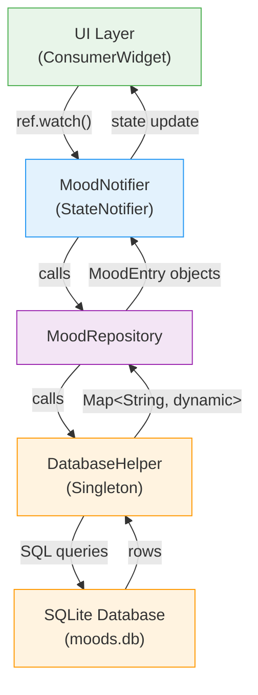
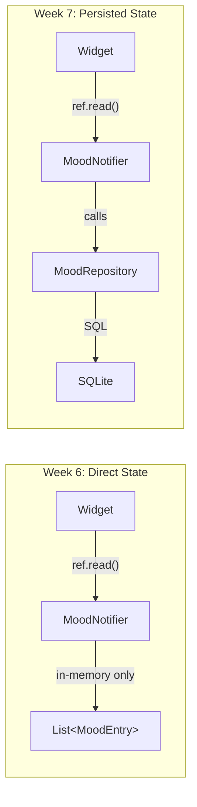
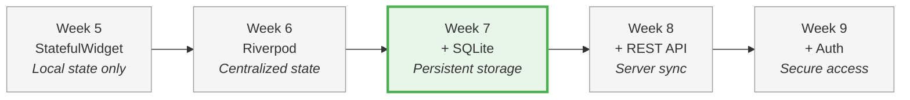

# Week 7 Lab: Local Data with SQLite

<div class="lab-meta" markdown>
| | |
|---|---|
| **Course** | Mobile Apps for Healthcare |
| **Duration** | ~2 hours |
| **Prerequisites** | Week 6 State Management (working Mood Tracker with Riverpod) |
</div>

<div class="grid cards" markdown>

- :material-target:{ .lg .middle } **Learning Objectives**

    ---

    - Persist user data locally so it ==survives app restarts==
    - Design a database schema and run CRUD operations with SQLite
    - Apply the ==repository pattern== to decouple storage from business logic
    - Evolve an in-memory state manager into a persistence-backed one
    - Practice raw SQL in an interactive console before implementing in Dart

- :material-clock-outline:{ .lg .middle } **Time Estimate**

    ---

    | Section | Duration |
    |---------|----------|
    | Part 0: SQL Console | ~20 min |
    | Part 1: Understanding persistence | ~10 min |
    | Part 2: Data serialization | ~15 min |
    | Part 3: Database setup & CRUD | ~30 min |
    | Part 4: Repository pattern | ~15 min |
    | Part 5: StateNotifier update | ~20 min |
    | Part 6: Startup loading | ~15 min |
    | Part 7: Self-check & reflection | ~10 min |

</div>

!!! abstract "What you already know"
    **From Week 6:** You built a Riverpod-powered mood tracker with `StateNotifier`, providers, and `ConsumerWidget`. State lives in memory and updates reactively. **The problem:** Close the app and all your mood entries vanish. **This week's solution:** Add a ==SQLite persistence layer== underneath your existing providers — the UI code barely changes, but data now survives app restarts.

!!! example "Think of it like... the Notes app on your phone"
    SQLite is like a **Notes app on your phone** — the data lives right on your device, no internet needed. `SharedPreferences` is a sticky note (key-value); SQLite is a full spreadsheet (rows and columns).

---

## Prerequisites

Before you begin, make sure you have the following ready:

- **Flutter SDK** installed and on your PATH. Verify by running:
  ```bash
  flutter doctor
  ```
  All checks should pass (or show only minor warnings unrelated to your target platform).
- **An IDE** with Flutter support (VS Code recommended, or Android Studio).
- **A running device** -- emulator, simulator, or physical device.
- **sqlite3** command-line tool (for Part 0). Install if needed:

    === "macOS"

        Pre-installed on macOS. Verify with:
        ```bash
        sqlite3 --version
        ```

    === "Linux"

        ```bash
        sudo apt install sqlite3
        ```

    === "Windows"

        ```bash
        winget install SQLite.SQLite
        ```
        Alternatively, download from [sqlite.org/download.html](https://www.sqlite.org/download.html) and add the folder to your PATH.

- **The starter project** loaded in your IDE. Download it from the course materials:
  ```
  week-07-local-data/lab/starter/mood_tracker/
  ```
  Copy the entire `mood_tracker` folder to your local machine, open it in your IDE, and run:
  ```bash
  cd mood_tracker
  flutter pub get
  flutter run
  ```
  Verify the app builds and launches before starting the exercises.

!!! tip "Pro tip"
    If the starter project does not compile, check that `sqflite`, `path`, `flutter_riverpod`, and `uuid` appear in `pubspec.yaml` and that `flutter pub get` completed without errors. Ask the instructor for help if needed.

---

## About the Starter Project

You are continuing the **Mood Tracker** app from Week 6. The starter project is the finished Week 6 code (Riverpod state management working) plus new stub files and TODOs for persistence. It already provides:

- A working Riverpod setup with `ProviderScope`, `MoodNotifier`, and reactive UI
- Four screens: Home, Add Mood, Mood Detail, and Statistics
- Reusable widgets: `MoodCard` and `MoodScoreIndicator`

The app currently stores mood entries ==only in memory== -- they are lost every time the app restarts. Your job in this lab is to add **SQLite persistence** so that mood data survives app restarts by completing 7 TODOs across 5 files.

### Project structure

| File | Purpose |
|------|---------|
| `lib/models/mood_entry.dart` | TODO 1: SQLite serialization (toMap/fromMap) |
| `lib/data/database_helper.dart` | TODOs 2--4: SQLite database operations |
| `lib/data/mood_repository.dart` | TODO 5: Repository pattern |
| `lib/providers/mood_provider.dart` | TODO 6: Persistence-aware state management |
| `lib/screens/home_screen.dart` | TODO 7: Load data on startup |
| `lib/screens/` | Screens from Week 6 (no changes needed) |
| `lib/widgets/` | Reusable UI components (no changes needed) |

---

> **Healthcare Context: Why Data Persistence Matters in mHealth**
>
> In real mobile health applications, persistent local storage is not optional. Consider:
>
> - **Patient mood data MUST persist between sessions.** A patient who logs their mood in the morning expects that entry to still be there in the evening. Losing entries erodes trust and makes the app clinically useless.
> - **Clinical trials depend on reliable data collection.** If a research study uses your app to gather mood data over 8 weeks, a single lost session of data can ==compromise the entire dataset==.
> - **Lost data means lost clinical insights.** Patterns in mood over time are only visible if every entry is reliably stored. Gaps in the data lead to incorrect conclusions.
> - **HIPAA requires data integrity.** The Health Insurance Portability and Accountability Act mandates that electronic health information be accurately preserved and retrievable. Your persistence layer is the foundation of that guarantee.
>
> The patterns you learn today -- SQLite storage, the repository pattern, and async initialization -- are the same patterns used in production mHealth apps to ensure reliable local data storage.

---

## Part 0: Hands-on SQL Console (~20 min)

!!! abstract "TL;DR"
    Practice SQL in a terminal before touching Flutter. You'll `CREATE TABLE`, `INSERT`, `SELECT`, `UPDATE`, and `DELETE` — the ==same 5 operations== your Flutter app will perform through the `sqflite` API.

!!! tip "This part can be done as homework"
    Part 0 is a standalone SQL refresher that does not depend on the starter project. If you are short on time during the lab session, you may complete it before or after class. Parts 1–7 implement the same SQL concepts in Flutter.

Before touching Flutter or Dart, you will practice SQL in an interactive terminal. This SQL refresher ensures you understand the database operations that your Flutter app will perform behind the scenes. Parts 1–7 then implement these same operations in Dart using the `sqflite` package.

### 0.1 Open sqlite3

Open a terminal and create a practice database:

```bash
sqlite3 mood_practice.db
```

This creates a file called `mood_practice.db` in your current directory. That file ==**is** the database== -- no server, no configuration, no setup. This is what makes SQLite perfect for mobile: your Flutter app will do exactly the same thing, just with a Dart API instead of a terminal.

You should see the `sqlite>` prompt. First, configure the output to be readable:

```sql
.mode column
.headers on
```

### 0.2 Create a Table and Insert Data

Create the same `mood_entries` table you will use in the Flutter app:

```sql
CREATE TABLE mood_entries (
  id TEXT PRIMARY KEY,
  score INTEGER NOT NULL,
  note TEXT,
  created_at TEXT NOT NULL
);
```

Verify the table was created:

```sql
.tables
.schema mood_entries
```

Now insert six sample mood entries:

```sql
INSERT INTO mood_entries (id, score, note, created_at)
VALUES ('entry-1', 3, 'Woke up tired', '2026-02-22T07:30:00');

INSERT INTO mood_entries (id, score, note, created_at)
VALUES ('entry-2', 8, 'Great morning run', '2026-02-22T08:15:00');

INSERT INTO mood_entries (id, score, note, created_at)
VALUES ('entry-3', 2, 'Anxiety before exam', '2026-02-22T14:00:00');

INSERT INTO mood_entries (id, score, note, created_at)
VALUES ('entry-4', 6, NULL, '2026-02-22T18:45:00');

INSERT INTO mood_entries (id, score, note, created_at)
VALUES ('entry-5', 1, 'Could not sleep last night', '2026-02-23T06:00:00');

INSERT INTO mood_entries (id, score, note, created_at)
VALUES ('entry-6', 9, 'Passed the midterm!', '2026-02-23T16:30:00');
```

### 0.3 Query the Data

Try each of these queries and observe the output:

**See everything:**

```sql
SELECT * FROM mood_entries;
```

**Sort by date (newest first)** -- this is what your Flutter app's `getMoods()` will do:

```sql
SELECT * FROM mood_entries ORDER BY created_at DESC;
```

**Filter: only happy moods (score >= 7):**

```sql
SELECT * FROM mood_entries WHERE score >= 7;
```

**Filter: only entries that have a note:**

```sql
SELECT * FROM mood_entries WHERE note IS NOT NULL;
```

**Aggregation: count and average:**

```sql
SELECT COUNT(*) as total_entries FROM mood_entries;
SELECT AVG(score) as average_score FROM mood_entries;
```

**Group by score:**

```sql
SELECT score, COUNT(*) as count FROM mood_entries GROUP BY score;
```

**Challenge: find the highest and lowest scores:**

```sql
SELECT MAX(score) as highest, MIN(score) as lowest FROM mood_entries;
```

### 0.4 Update and Delete

**Update a single entry** (change the score for entry-3):

```sql
UPDATE mood_entries SET score = 3, note = 'Exam went OK actually'
WHERE id = 'entry-3';
```

Verify the change:

```sql
SELECT * FROM mood_entries WHERE id = 'entry-3';
```

**Delete a single entry:**

```sql
DELETE FROM mood_entries WHERE id = 'entry-5';
```

Verify it is gone:

```sql
SELECT COUNT(*) FROM mood_entries;
SELECT * FROM mood_entries;
```

### 0.5 (Optional) DB Browser for SQLite

If you have [DB Browser for SQLite](https://sqlitebrowser.org/) installed, try opening the same `mood_practice.db` file. Click the "Browse Data" tab -- you will see the same data you just created, in a visual table. This tool is useful for inspecting your database during development.

### 0.6 Bridge to Flutter

Every SQL command you just typed has a ==direct equivalent== in the `sqflite` Dart API:

| Terminal (sqlite3) | Flutter (sqflite) |
|---------------------|-------------------|
| `sqlite3 mood_practice.db` | `openDatabase('mood_tracker.db', ...)` |
| `CREATE TABLE mood_entries (...)` | `db.execute('CREATE TABLE mood_entries (...)')` |
| `INSERT INTO mood_entries ...` | `db.insert('mood_entries', map)` |
| `SELECT * ... ORDER BY created_at DESC` | `db.query('mood_entries', orderBy: 'created_at DESC')` |
| `UPDATE ... WHERE id = 'entry-3'` | `db.update(..., where: 'id = ?', whereArgs: ['entry-3'])` |
| `DELETE ... WHERE id = 'entry-5'` | `db.delete(..., where: 'id = ?', whereArgs: ['entry-5'])` |

**The SQL is identical. The delivery mechanism is different.** In the terminal, you typed SQL directly. In Flutter, you pass the same SQL through Dart method calls. Exit the sqlite3 console:

```sql
.quit
```

Type `.quit` or `.exit` to leave the sqlite3 shell. Press ++ctrl+c++ to cancel a running query.

---

### Self-Check: Part 0

- [ ] You created a table, inserted rows, queried, updated, and deleted data using raw SQL.
- [ ] You understand that SQLite is a ==single file on disk== with no server.
- [ ] You can explain what `WHERE`, `ORDER BY`, `GROUP BY`, `COUNT`, and `AVG` do.

!!! success "Checkpoint: Part 0 complete"
    You've practiced every SQL operation you'll use in Flutter — `CREATE TABLE`, `INSERT`, `SELECT`, `UPDATE`, `DELETE`. The sqlite3 console is also a powerful debugging tool: if your Flutter app's data looks wrong, you can open the `.db` file directly and inspect it.

---

## Part 1: Understanding Local Data Persistence (~10 min)

!!! abstract "TL;DR"
    In-memory state (Week 6) vanishes when the app closes. ==SQLite== is a file-based database that lives on the device — no server, no internet required. The ==repository pattern== puts a clean wall between your data source and your business logic.

### 1.1 The problem with in-memory state

In Week 6, you implemented Riverpod state management. The `MoodNotifier` holds a `List<MoodEntry>` in memory. This works perfectly for a single session, but has a critical limitation:

- **Data is lost on restart.** Close the app and reopen it -- all mood entries are gone.
- **No offline support.** Without local storage, the app is useless without a network connection (and you have not added networking yet).
- **No data history.** Patients cannot review past entries because they simply do not exist after a restart.

~~Mobile apps always need internet~~ — most mHealth apps must work ==offline==. A nurse in an elevator with no Wi-Fi still needs to record vitals.

~~SharedPreferences is enough for any data~~ — `SharedPreferences` stores key-value pairs (settings, flags, simple strings). For structured data with relationships, queries, and sorting, you need a ==relational database== like SQLite.

### 1.2 What is SQLite?

You already used SQLite in Part 0. It is a lightweight, file-based relational database that runs directly on the device -- no separate server needed. Your `mood_practice.db` file was a complete database.

### 1.3 The sqflite package

Flutter does not include SQLite support out of the box. The `sqflite` package provides a Dart API for SQLite:

| Class/Method | What it does |
|-------------|-------------|
| `openDatabase()` | Opens (or creates) a database file and returns a `Database` instance |
| `db.execute()` | Runs a raw SQL statement (e.g., `CREATE TABLE`) |
| `db.insert()` | Inserts a row from a `Map<String, dynamic>` |
| `db.query()` | Queries a table and returns a `List<Map<String, dynamic>>` |
| `db.update()` | Updates rows matching a `WHERE` clause |
| `db.delete()` | Deletes rows matching a `WHERE` clause |

### 1.4 The repository pattern

The ==repository pattern== places an abstraction layer between your data source (SQLite) and your business logic (Riverpod notifier):



This separation means your `MoodNotifier` ==never touches SQL directly==. If you later switch from SQLite to a REST API or Hive or another storage solution, you only change the repository implementation -- the notifier and UI remain untouched.

---

### Self-Check: Part 1

Before continuing, make sure you can answer these questions:

- [ ] Why is in-memory state insufficient for a health tracking app?
- [ ] What is SQLite and why is it a good fit for mobile apps?
- [ ] What role does the repository pattern play between the database and the state notifier?

!!! success "Checkpoint: Part 1 complete"
    You understand the problem (in-memory state is lost on restart), the solution (SQLite persistence), and the architecture (repository pattern between database and notifier). Now let's implement it.

---

## Part 2: Data Serialization (~15 min)

!!! abstract "TL;DR"
    SQLite stores rows and columns, not Dart objects. ==`toMap()` converts Dart → SQLite==, `fromMap()` converts SQLite → Dart. Always store `DateTime` as ISO 8601 strings.

!!! tip "Remember from Week 3?"
    In Week 3, you wrote `toJson()` methods on Dart classes. `toMap()` is the same pattern — converting a Dart object to a key-value structure. The only difference is the target: JSON goes to an API, maps go to SQLite.

SQLite stores data in rows and columns, not Dart objects. You need to convert between the two representations.

### 2.1 TODO 1: Implement toMap() and fromMap()

Open `lib/models/mood_entry.dart`. Find the `TODO 1` comment block.

You need to implement two methods:

1. **`toMap()`** -- Converts a `MoodEntry` instance to a `Map<String, dynamic>` for SQLite insertion.

2. **`factory MoodEntry.fromMap(Map<String, dynamic> map)`** -- Creates a `MoodEntry` from a database row.

??? tip "Solution"
    ```dart
    Map<String, dynamic> toMap() { // (1)!
      return {
        'id': id,
        'score': score,
        'note': note,
        'created_at': createdAt.toIso8601String(), // (2)!
      };
    }

    factory MoodEntry.fromMap(Map<String, dynamic> map) { // (3)!
      return MoodEntry(
        id: map['id'] as String,
        score: map['score'] as int,
        note: map['note'] as String?,
        createdAt: DateTime.parse(map['created_at'] as String),
      );
    }
    ```

    1. `toMap()` converts a Dart object into a `Map<String, dynamic>` — the only format SQLite accepts for insertion. Each key must match a column name in the database table.
    2. ==SQLite has no DateTime type — always store dates as ISO 8601 strings==. `toIso8601String()` produces a standardized format like `2026-02-22T07:30:00.000` that sorts correctly as text and can be parsed back reliably.
    3. The `fromMap` factory constructor does the reverse: it takes a raw database row (`Map<String, dynamic>`) and reconstructs a type-safe `MoodEntry` Dart object, parsing each field to its correct type.

    **Key insight:** `DateTime` cannot be stored directly in SQLite. You must serialize it to an ISO 8601 string (`toIso8601String()`) and parse it back (`DateTime.parse()`). This is a common pattern for date/time fields in database-backed apps.

??? warning "Common mistake: DateTime serialization"
    ```dart
    // WRONG — storing DateTime directly
    'created_at': entry.createdAt,  // SQLite can't store DateTime!

    // CORRECT — convert to ISO 8601 string
    'created_at': entry.createdAt.toIso8601String(),
    ```
    SQLite has no DateTime column type. Always convert to ISO 8601 strings (`toIso8601String()`) when writing and parse back (`DateTime.parse()`) when reading. This is the #1 source of "type 'String' is not a subtype of type 'DateTime'" errors.

~~You can store any Dart type directly in SQLite~~ — SQLite only supports 5 types: `NULL`, `INTEGER`, `REAL`, `TEXT`, and `BLOB`. Everything else (`DateTime`, `bool`, `enum`, custom objects) must be serialized to one of these types first.

---

### Self-Check: Part 2

- [ ] `toMap()` returns a map with keys matching the database column names (`created_at`, not `createdAt`).
- [ ] `fromMap()` correctly parses each field, including `DateTime` from a string.
- [ ] You understand why serialization is necessary for SQLite storage.

!!! success "Checkpoint: Part 2 complete"
    Your `MoodEntry` model can serialize to and from SQLite-compatible
    maps. This ==bridge between Dart objects and database rows== is the
    foundation of all persistence.

---

## Part 3: Database Setup and CRUD Operations (~30 min)

!!! abstract "TL;DR"
    `DatabaseHelper` is a ==singleton== — one database connection for the entire app. You'll implement `CREATE TABLE`, then the four CRUD methods: `insert`, `query`, `update`, `delete`. Always use ==parameterized queries== (`?` placeholders) to prevent SQL injection.

!!! warning "Common mistake"
    Don't create a new `DatabaseHelper` instance every time you need
    the database — use the ==singleton pattern==. Multiple connections to
    the same SQLite file cause locking errors and data corruption.

Open `lib/data/database_helper.dart`. This file contains the `DatabaseHelper` class that manages all direct SQLite interactions.

### 3.1 TODO 2: Initialize the database

Find the `TODO 2` comment block. Your task is to implement `_initDatabase()` and `_onCreate()`.

1. **`_initDatabase()`** -- Get the database path and open the database.

2. **`_onCreate()`** -- Create the mood_entries table.

??? tip "Solution"
    ```dart
    Future<Database> _initDatabase() async {
      final dbPath = await getDatabasesPath();
      final path = join(dbPath, 'mood_tracker.db');
      return await openDatabase( // (1)!
        path,
        version: 1,
        onCreate: _onCreate,
      );
    }

    Future<void> _onCreate(Database db, int version) async {
      await db.execute(''' // (2)!
        CREATE TABLE mood_entries(
          id TEXT PRIMARY KEY,
          score INTEGER NOT NULL,
          note TEXT,
          created_at TEXT NOT NULL
        )
      ''');
    }
    ```

    1. `openDatabase` opens an existing database or creates a new one at `path`. The `version: 1` parameter enables schema migration tracking — when you later bump it to `2`, SQLite calls `onUpgrade` so you can `ALTER TABLE` without losing data.
    2. The `CREATE TABLE` statement defines the schema. `TEXT PRIMARY KEY` makes `id` the unique row identifier (no autoincrement since we use UUIDs). `INTEGER NOT NULL` enforces that `score` always has a value. `TEXT` without `NOT NULL` allows `note` to be nullable.

    **Singleton pattern:** Notice that `DatabaseHelper` uses a private constructor and a static `instance` getter. This ensures only one instance of the helper (and one database connection) exists throughout the app. Multiple simultaneous connections to the same SQLite file can cause corruption.

??? warning "Common mistake: Multiple database instances"
    ```dart
    // WRONG — creates a new connection each time
    final db = await openDatabase('moods.db');

    // CORRECT — use singleton
    final db = await DatabaseHelper.instance.database;
    ```
    Opening multiple connections to the same SQLite file causes locking issues and "database is locked" errors. Always use the singleton pattern to ensure ==one connection is shared== across the entire app.

??? protip "Pro tip: DB Browser for SQLite"
    Download [DB Browser for SQLite](https://sqlitebrowser.org/) — a free
    GUI that lets you visually inspect your `.db` file, run queries, and
    browse rows. It's the fastest way to debug database issues during
    development.

### 3.2 TODO 3: Implement insertMood()

Find the `TODO 3` comment block. Implement the method to insert a mood entry.

The `conflictAlgorithm: ConflictAlgorithm.replace` ensures that if an entry with the same `id` already exists, it is overwritten rather than causing an error.

??? tip "Solution"
    ```dart
    Future<void> insertMood(MoodEntry mood) async {
      final db = await database;
      await db.insert( // (1)!
        'mood_entries',
        mood.toMap(),
        conflictAlgorithm: ConflictAlgorithm.replace, // (2)!
      );
    }
    ```

    1. `db.insert()` takes the table name and a `Map<String, dynamic>`, generates an `INSERT INTO` SQL statement, and returns the auto-generated row ID (though we use UUIDs here, so we ignore the return value).
    2. `ConflictAlgorithm.replace` tells SQLite what to do if a row with the same primary key already exists: replace the old row entirely with the new data instead of throwing an error. This makes `insert` also work as an "upsert" (insert-or-update).

### 3.3 TODO 4: Implement getMoods(), deleteMood(), and updateMood()

Find the `TODO 4` comment block. Implement the remaining three CRUD operations:

1. **`getMoods()`** -- Query all moods, ordered by creation date (newest first).

2. **`deleteMood(String id)`** -- Delete a single mood by id.

3. **`updateMood(MoodEntry mood)`** -- Update an existing mood entry.

??? tip "Solution"
    ```dart
    Future<List<MoodEntry>> getMoods() async {
      final db = await database;
      final maps = await db.query('mood_entries', orderBy: 'created_at DESC');
      return maps.map((map) => MoodEntry.fromMap(map)).toList();
    }

    Future<void> deleteMood(String id) async {
      final db = await database;
      await db.delete('mood_entries', where: 'id = ?', whereArgs: [id]);
    }

    Future<void> updateMood(MoodEntry mood) async {
      final db = await database;
      await db.update(
        'mood_entries',
        mood.toMap(),
        where: 'id = ?',
        whereArgs: [mood.id],
      );
    }
    ```

    **Parameterized queries:** Notice the `where: 'id = ?', whereArgs: [id]` pattern. The `?` is a placeholder that `sqflite` fills in with the value from `whereArgs`. This ==prevents SQL injection attacks== -- never concatenate user input directly into SQL strings.

---

### Self-Check: Part 3

- [ ] `_initDatabase()` creates a database file called `mood_tracker.db`.
- [ ] `_onCreate()` runs a `CREATE TABLE` statement with the correct column types.
- [ ] `insertMood()` converts the entry to a map and inserts it.
- [ ] `getMoods()` returns entries sorted by `created_at DESC`.
- [ ] `deleteMood()` and `updateMood()` use parameterized queries with `whereArgs`.

!!! example "Real-world mHealth: Offline-first in clinical settings"
    Consider a nurse on hospital rounds using a tablet to record patient vitals. Hospital Wi-Fi is spotty — dead zones near elevators, congested during shift changes. If the app requires an internet connection, the nurse must remember readings and enter them later (error-prone and delays care). With SQLite local storage, vitals are captured instantly and synced when connectivity returns. This ==offline-first pattern== is a **regulatory expectation** for clinical-grade mHealth apps (IEC 62304 requires documented data integrity measures).

??? question "Scenario: Why a singleton?"
    Why does `DatabaseHelper` use the singleton pattern instead of creating a new instance each time?

    ??? success "Answer"
        Opening a database connection is expensive. The singleton pattern ensures all parts of the app ==share one connection==, preventing resource waste and potential file locking issues. It also guarantees the `onCreate` migration runs exactly once.

??? question "Scenario: Why parameterized queries?"
    Why do we use `where: 'id = ?', whereArgs: [id]` instead of `where: 'id = $id'`?

    ??? success "Answer"
        **SQL injection prevention.** String interpolation (`'id = $id'`) lets malicious input modify the query. Parameterized queries (`?` placeholders) ensure values are always treated as data, never as SQL commands. This is critical in healthcare apps handling patient data.

!!! success "Checkpoint: Part 3 complete"
    Your `DatabaseHelper` can create the database, insert rows, query all entries, update existing entries, and delete by ID. These are the ==four CRUD operations== that every data-backed app needs. The raw SQL you practiced in Part 0 is now running through Dart method calls.

---

## Part 4: Repository Pattern (~15 min)

!!! abstract "TL;DR"
    The repository is a ==thin wrapper== around `DatabaseHelper` that hides SQL details from the rest of the app. Today it delegates to SQLite; in Week 8, you'll add an API layer behind the same interface.

Before adding the repository, compare the architecture from last week with what you are building now:



Compare calling the database directly versus going through the repository:

=== "Before: Direct Database Access"

    ```dart
    // Notifier must know about SQL and database internals
    final db = await DatabaseHelper.instance.database;
    final maps = await db.query('mood_entries',
        orderBy: 'created_at DESC');
    final moods = maps.map((m) => MoodEntry.fromMap(m)).toList();
    ```

=== "After: Repository Pattern"

    ```dart
    // Notifier only knows the repository interface — no SQL
    final moods = await moodRepository.getAllMoods();
    ```

~~The repository is just unnecessary boilerplate~~ — it seems like extra code now, but when you add a REST API in Week 8, you'll swap the implementation inside the repository *without touching any UI or notifier code*. That one-line change is worth the abstraction.

### 4.1 TODO 5: Implement the MoodRepository

Open `lib/data/mood_repository.dart`. Find the `TODO 5` comment block.

The repository acts as a ==clean interface== between the database layer and the state management layer. Implement the four methods:

1. **`getAllMoods()`** -- Delegates to `DatabaseHelper`.

2. **`addMood(MoodEntry mood)`** -- Inserts via the helper.

3. **`deleteMood(String id)`** -- Deletes via the helper.

4. **`updateMood(MoodEntry mood)`** -- Updates via the helper.

??? tip "Solution"
    ```dart
    Future<List<MoodEntry>> getAllMoods() async { // (1)!
      return await DatabaseHelper.instance.getMoods();
    }

    Future<void> addMood(MoodEntry mood) async {
      await DatabaseHelper.instance.insertMood(mood); // (2)!
    }

    Future<void> deleteMood(String id) async {
      await DatabaseHelper.instance.deleteMood(id);
    }

    Future<void> updateMood(MoodEntry mood) async {
      await DatabaseHelper.instance.updateMood(mood);
    }
    ```

    1. The repository wraps `DatabaseHelper`, hiding all SQLite implementation details behind clean method names. The rest of the app only sees `getAllMoods()`, never raw SQL queries or database maps.
    2. This thin abstraction layer is the key benefit: you can swap `DatabaseHelper.instance.insertMood(mood)` for a REST API call, a Hive box write, or a shared preferences update — and nothing outside this file changes.

    **Why not call DatabaseHelper directly from the notifier?** ==The repository pattern separates "what data to store" from "how to store it"==. Today it delegates to SQLite. Tomorrow you might add caching, logging, data validation, or switch to a different storage backend. The notifier does not need to know or care about these implementation details.

??? warning "Common mistake: Calling DatabaseHelper directly from widgets"
    ```dart
    // WRONG — widget directly depends on database implementation
    final moods = await DatabaseHelper.instance.getMoods();

    // CORRECT — go through the repository
    final moods = await moodRepository.getAllMoods();
    ```
    Accessing the database directly from widgets creates ==tight coupling==. When you add an API layer in Week 8, you'd have to change every widget. With the repository pattern, you only change the repository — widgets don't know or care where data comes from.

---

### Self-Check: Part 4

- [ ] All four repository methods delegate to `DatabaseHelper.instance`.
- [ ] The repository does not contain SQL or direct database references -- it only calls helper methods.
- [ ] You can explain why the repository layer exists between the notifier and the database.

!!! success "Checkpoint: Part 4 complete"
    The repository pattern is in place — your `MoodNotifier` no longer
    touches the database directly. ==Swapping SQLite for a REST API later
    (Week 8) will be a one-file change.==

---

## Part 5: Integrating Persistence with State Management (~20 min)

!!! abstract "TL;DR"
    Update `MoodNotifier` to call the repository for every state change. Pattern: ==update in-memory state first== (instant UI), then persist to SQLite (background). Add a `loadMoods()` method for startup.

=== "Before: In-Memory Only (Week 6)"

    ```dart
    class MoodNotifier extends StateNotifier<List<MoodEntry>> {
      MoodNotifier() : super([]);

      void addMood(MoodEntry entry) {
        state = [entry, ...state];  // Gone when app closes!
      }

      void removeMood(String id) {
        state = state.where((e) => e.id != id).toList();
      }
    }
    ```

=== "After: Persisted with Repository (Week 7)"

    ```dart
    class MoodNotifier extends StateNotifier<List<MoodEntry>> {
      final MoodRepository _repository;
      MoodNotifier(this._repository) : super([]);

      Future<void> loadMoods() async {
        state = await _repository.getAllMoods();
      }

      Future<void> addMood(MoodEntry entry) async {
        await _repository.insertMood(entry);  // Persist first
        state = [entry, ...state];             // Then update UI
      }

      Future<void> removeMood(String id) async {
        await _repository.deleteMood(id);
        state = state.where((e) => e.id != id).toList();
      }
    }
    ```

!!! warning "Common mistake"
    Don't forget `await` on async database operations. Without `await`,
    your code continues before the database write completes — the ==UI
    updates but the data may never actually get saved==.

### 5.1 TODO 6: Update MoodNotifier to use the repository

Open `lib/providers/mood_provider.dart`. Find the `TODO 6` comment block.

The `MoodNotifier` already has `addMood`, `deleteMood`, and `updateMood` methods from Week 6. Now you need to make them persist data through the repository. You also need to add a new `loadMoods()` method.

Make these changes:

1. **`loadMoods()`** -- Fetch all moods from the repository and update state.

2. **`addMood(int score, String? note)`** -- After creating the entry and updating state, persist it.

3. **`deleteMood(String id)`** -- After updating state, delete from storage.

4. **`updateMood(String id, int score, String? note)`** -- After updating state, persist the change.

??? tip "Solution"
    ```dart
    Future<void> loadMoods() async {
      final moods = await _repository.getAllMoods();
      state = moods;
    }

    void addMood(int score, String? note) {
      final entry = MoodEntry(
        id: const Uuid().v4(),
        score: score,
        note: note,
        createdAt: DateTime.now(),
      );
      state = [entry, ...state]; // (1)!
      _repository.addMood(entry); // (2)!
    }

    void deleteMood(String id) {
      state = state.where((e) => e.id != id).toList();
      _repository.deleteMood(id);
    }

    void updateMood(String id, int score, String? note) {
      state = state.map((e) =>
        e.id == id ? e.copyWith(score: score, note: note) : e
      ).toList();
      final updated = state.firstWhere((e) => e.id == id);
      _repository.updateMood(updated);
    }
    ```

    1. Assigning a new list to `state` triggers Riverpod to notify all listeners (widgets calling `ref.watch`), causing an immediate UI rebuild. The spread operator `...state` creates a new list, which is essential — mutating the existing list would not trigger a rebuild.
    2. The persist-then-update pattern: `_repository.addMood(entry)` writes to SQLite in the background. The `await` is intentionally omitted here so the UI does not freeze while the database write completes. If persistence fails, the user still sees the entry in memory (optimistic update).

    **State-first, persist-second:** Notice that each method updates the in-memory state immediately and then calls the repository. This keeps the UI responsive -- the user sees the change instantly while the database write happens in the background. This is sometimes called an ==optimistic update pattern==.

??? warning "Common mistake: Forgetting to await database operations"
    ```dart
    // WRONG — fire and forget, may lose data
    void addMood(MoodEntry entry) {
      _repository.insertMood(entry);  // Not awaited!
      state = [...state, entry];
    }

    // CORRECT — await to ensure persistence
    Future<void> addMood(MoodEntry entry) async {
      await _repository.insertMood(entry);  // Wait for DB write
      state = [...state, entry];
    }
    ```
    If you don't `await` the database insert, the state updates immediately but the write might fail silently. The user sees the entry, closes the app, and it's gone. Always await persistence operations before updating in-memory state.

??? protip "Pro tip: Optimistic vs pessimistic updates"
    The ==optimistic update== pattern (update UI first, persist second) gives a snappy feel but risks showing data that failed to save. The ==pessimistic== pattern (persist first, update UI second) is safer but slower. For local SQLite writes that almost never fail, optimistic is fine. For network requests that can time out (Week 8), you'll want pessimistic updates with error handling.

---

### Self-Check: Part 5

- [ ] `loadMoods()` fetches from the repository and assigns the result to `state`.
- [ ] `addMood()`, `deleteMood()`, and `updateMood()` all update `state` first, then call the repository.
- [ ] The notifier no longer starts with hardcoded sample data -- it starts with an empty list.
- [ ] You understand why state is updated before the database write.

!!! success "Checkpoint: Part 5 complete"
    Your `MoodNotifier` now persists every state change through the repository. The UI stays reactive (instant updates via Riverpod), and data survives app restarts (SQLite writes in the background). ==The architecture is now: UI → Notifier → Repository → SQLite.==

??? challenge "Stretch Goal: Add search"
    Add a `searchMoods(String query)` method to the repository that uses SQL `LIKE` to find entries matching a keyword in the note field.

    *Hint:* `SELECT * FROM moods WHERE note LIKE '%$query%'` — but use parameterized queries to avoid SQL injection!

---

## Part 6: Loading Data on Startup (~15 min)

!!! abstract "TL;DR"
    Change `HomeScreen` from `ConsumerWidget` to ==`ConsumerStatefulWidget`== so you can call `loadMoods()` in `initState()`. Use `Future.microtask()` to safely access `ref` during initialization.

### 6.1 TODO 7: Load persisted moods when the app starts

Open `lib/screens/home_screen.dart`. Find the `TODO 7` comment block.

The home screen is currently a `ConsumerWidget` (from Week 6). You need to change it to a `ConsumerStatefulWidget` so that you can use `initState()` to trigger data loading on startup.

Make these changes:

1. **Change `ConsumerWidget` to `ConsumerStatefulWidget`.**
2. **Change the `build` method** to live inside a `ConsumerState<HomeScreen>` class.
3. **Override `initState()`** to load moods from the database.

??? tip "Solution"
    ```dart
    @override
    void initState() {
      super.initState();
      Future.microtask(() {
        ref.read(moodProvider.notifier).loadMoods();
      });
    }
    ```

    **Why `Future.microtask()`?** The `ref` object is not safe to use during `initState()` in all cases. Wrapping the call in `Future.microtask()` defers it to the next microtask, after the widget is ==fully mounted==. This avoids potential initialization errors.

Run the app. The home screen should start empty (first launch) or show previously saved entries. Add a few mood entries, then fully close and reopen the app. Your entries should still be there -- they are now stored in SQLite.

~~Data loading should happen in the `build()` method~~ — calling `loadMoods()` in `build()` would trigger a database read on every rebuild (every `setState()`, every navigation). Use `initState()` to load ==exactly once== on startup.

---

### Self-Check: Part 6

- [ ] HomeScreen is now a `ConsumerStatefulWidget` with `ConsumerState`.
- [ ] `initState()` calls `loadMoods()` via `Future.microtask()`.
- [ ] Data persists across app restarts.

??? question "Scenario: Airplane mode data"
    A patient logs 3 mood entries on airplane mode. They land and open the app. What happens to those entries? Trace the data from `MoodNotifier` → Repository → SQLite → disk.

    ??? success "Answer"
        The entries are safe. When the user taps "Save," `MoodNotifier` calls the repository's `insertMood()` method, which calls `DatabaseHelper.insert()`, which writes to the local SQLite database on the device's storage. ==SQLite doesn't need internet== — it reads and writes to a file on disk. When the user reopens the app, `loadMoods()` reads from the same file. The data was never at risk.

??? question "Scenario: Database corruption"
    A user force-kills the app mid-write (e.g., swiping it away while saving a mood entry). Could this corrupt the database? How does SQLite handle this?

    ??? success "Answer"
        SQLite is designed for this. It uses ==write-ahead logging (WAL)== by default, which means writes go to a temporary journal file first and are only committed to the main database atomically. If the app crashes mid-write, the partial transaction is rolled back on the next open. Your data is either fully written or not written at all — never half-written.

!!! success "Checkpoint: Part 6 complete"
    Mood entries now ==persist across app restarts==. The full data pipeline
    works: UI → StateNotifier → Repository → SQLite → disk. Close the
    app, reopen it, and your data is still there.

---

## Applying This to Your Team Project

Now that you understand local persistence, consider your team project's data strategy:

- **What data must persist offline?** Health measurements, user preferences, cached API responses?
- **Design your database schema:** What tables do you need? What are the column types and relationships?
- **Repository pattern:** Use the same repository-over-database pattern. It will make Week 8's API integration much smoother.

!!! question "Discussion: Your data model"
    Draft the SQLite `CREATE TABLE` statements for your team project's main data types. How will you handle `DateTime` fields? Do you need any foreign keys between tables?

## Part 7: Self-Check and Summary (~10 min)

### 7.1 End-to-end verification

Walk through this complete flow to verify everything works:

1. Launch the app. The home screen should be empty (first launch) or show previously saved entries.
2. Tap the **+** button. Set a score, type a note, and tap **Save Entry**.
3. Verify the new entry appears at the top of the home screen list.
4. Tap the **bar chart** icon to view statistics. Verify the numbers reflect the stored entries.
5. **Fully close the app** (remove it from the recent apps list).
6. **Reopen the app.** Verify that all previously added entries are still present.
7. Tap a mood entry to view its details. Tap the **delete** icon, confirm deletion.
8. Verify the entry is gone from the home screen and the statistics have updated.
9. Close and reopen the app once more. Verify the deleted entry is still gone.

If all 9 steps work correctly, you have completed the lab.

### 7.2 Summary

| TODO | File | What you did |
|------|------|-------------|
| 1 | `models/mood_entry.dart` | Implemented `toMap()` and `fromMap()` to serialize `MoodEntry` for SQLite storage |
| 2 | `data/database_helper.dart` | Implemented `_initDatabase()` and `_onCreate()` with `CREATE TABLE` statement |
| 3 | `data/database_helper.dart` | Implemented `insertMood()` using `db.insert()` with conflict resolution |
| 4 | `data/database_helper.dart` | Implemented `getMoods()`, `deleteMood()`, and `updateMood()` with parameterized queries |
| 5 | `data/mood_repository.dart` | Implemented the repository pattern, delegating all operations to `DatabaseHelper` |
| 6 | `providers/mood_provider.dart` | Updated `MoodNotifier` methods to call the repository and added `loadMoods()` |
| 7 | `screens/home_screen.dart` | Changed to `ConsumerStatefulWidget` with `initState()` calling `loadMoods()` |

### 7.3 Key concepts learned

| Concept | Key Takeaway |
|---------|--------------|
| SQL basics | `CREATE TABLE`, `INSERT`, `SELECT`, `UPDATE`, `DELETE` — practiced in the sqlite3 console before Flutter |
| SQLite | A lightweight, embedded relational database ideal for local storage on mobile devices |
| Data serialization | `toMap()` and `fromMap()` convert between Dart objects and SQLite-compatible maps |
| SQL DDL | `CREATE TABLE` defines the schema; column types include `TEXT`, `INTEGER`, and `PRIMARY KEY` |
| CRUD operations | `insert()`, `query()`, `update()`, `delete()` — the four fundamental database operations |
| Singleton pattern | Ensures a single database connection shared across the entire app |
| Repository pattern | An abstraction layer between data storage and business logic, enabling easy replacement of the data source |
| Async initialization | Databases open asynchronously; `initState()` with `Future.microtask()` handles startup loading |
| Parameterized queries | Using `?` placeholders and `whereArgs` prevents SQL injection and ensures safe queries |
| Optimistic updates | Updating in-memory state before writing to disk keeps the UI responsive |

---

### Where You Are: Course Architecture Journey



---

## What Comes Next

In the following weeks, you will continue extending this Mood Tracker app:

- **Week 8:** Networking and API integration -- the app syncs mood data with a remote server.
- **Week 9:** Authentication and security -- login, secure token storage, and route guarding.

The SQLite persistence layer you built today ensures that patient data is never lost, even when the device is offline. In Week 8, you will add server synchronization on top of this local storage foundation.

---

## Troubleshooting

??? question "App crashes on startup with `MissingPluginException`"
    The `sqflite` package requires native platform code. Try: (1) Stop the app completely. (2) Run `flutter clean`. (3) Run `flutter pub get`. (4) Run `flutter run` again. ++r++ (hot reload) cannot load new native plugins — a full restart (++shift+r++) is required after adding `sqflite`.

??? question "Data doesn't persist after restarting the app"
    Check that: (1) `loadMoods()` is called in `initState()` via `Future.microtask()`. (2) Your `MoodNotifier.addMood()` calls `_repository.addMood(entry)` after updating state. (3) The repository calls `DatabaseHelper.instance.insertMood()`. Add `print()` statements to trace the call chain.

??? question "`DatabaseHelper` shows `LateInitializationError`"
    The database has not been initialized yet. Make sure `_initDatabase()` is called through the `database` getter before any CRUD operations. The singleton pattern should handle this automatically — check that you are using `DatabaseHelper.instance` (not creating new instances).

??? question "`toMap()` returns wrong keys / `fromMap()` crashes"
    Column names in SQLite must ==match exactly==. The database uses `created_at` (snake_case), not `createdAt` (camelCase). Verify your `toMap()` uses `'created_at': createdAt.toIso8601String()` and `fromMap()` reads `map['created_at']`.

??? question "`sqlite3` command not found in the terminal"
    See the installation instructions in the Prerequisites section. On macOS it is pre-installed. On Linux: `sudo apt install sqlite3`. On Windows: `winget install SQLite.SQLite`.

??? question "'database is locked' error during development"
    This happens when multiple connections try to access the same database file simultaneously. Make sure you're using the ==singleton pattern== (`DatabaseHelper.instance`) and not creating multiple instances. Also check that DB Browser for SQLite is not holding an open connection to the same file.

---

## Quick Quiz

<quiz>
Which SQL statement creates a new row in a table?

- [ ] SELECT
- [x] INSERT INTO
- [ ] UPDATE
- [ ] CREATE TABLE
</quiz>

<quiz>
What is the purpose of `toMap()` and `fromMap()` methods?

- [ ] They convert Dart objects to JSON for API calls
- [x] They serialize Dart objects to/from SQLite-compatible maps
- [ ] They create database indexes
- [ ] They handle database migrations
</quiz>

<quiz>
Why does `DatabaseHelper` use the singleton pattern?

- [ ] It's a Dart convention with no technical reason
- [ ] To make the code shorter
- [x] To ensure only one database connection exists across the entire app
- [ ] Because SQLite requires exactly one connection
</quiz>

<quiz>
What does the repository pattern provide?

- [x] An abstraction layer between business logic and data storage
- [ ] Automatic database backups
- [ ] A way to encrypt data at rest
- [ ] Faster database queries
</quiz>

<quiz>
Why do we load database data in `initState` instead of the constructor?

- [ ] Constructors can't access any variables
- [ ] Dart requires it for performance reasons
- [x] Database operations are async and constructors can't be async
- [ ] It's just a convention — constructors would work too
</quiz>

<quiz>
What does `ConflictAlgorithm.replace` do in `db.insert()`?

- [ ] Throws an error if the row already exists
- [ ] Skips the insert silently
- [x] Overwrites the existing row with the same primary key
- [ ] Merges the old and new row values together
</quiz>

<quiz>
Why should you use `whereArgs` instead of string interpolation in SQL queries?

- [ ] It makes queries faster
- [ ] It's required by the sqflite package
- [x] It prevents SQL injection attacks by treating values as data, not SQL commands
- [ ] It automatically converts types for you
</quiz>

---

## Further Reading

- [sqflite package on pub.dev](https://pub.dev/packages/sqflite)
- [SQLite official documentation](https://www.sqlite.org/docs.html)
- [Flutter cookbook: Persist data with SQLite](https://docs.flutter.dev/cookbook/persistence/sqlite)
- [Repository pattern explained](https://developer.android.com/topic/architecture/data-layer)
- [path package on pub.dev](https://pub.dev/packages/path)
- [DB Browser for SQLite](https://sqlitebrowser.org/)

!!! info "Grading"
    For detailed sprint review rubrics and grading criteria, see the [Project Grading Guide](../../resources/PROJECT_GRADING.md).

---

!!! question "End-of-Lab Reflection"
    Take 2 minutes to reflect on today's work:

    1. **What was the hardest concept today?** (SQL syntax? Singleton pattern? Repository abstraction? Async state updates?)
    2. **What would break if you removed the repository layer?** Think about what Week 8 would look like without it.
    3. **For your team project:** What tables will your database need? Draft a quick `CREATE TABLE` statement on paper.

    Write your answers in your lab notebook or discuss with your neighbor.
