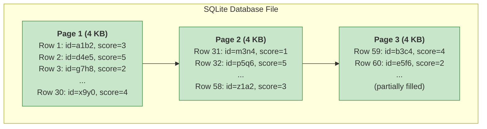
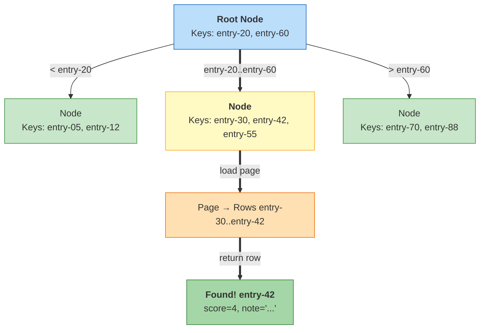
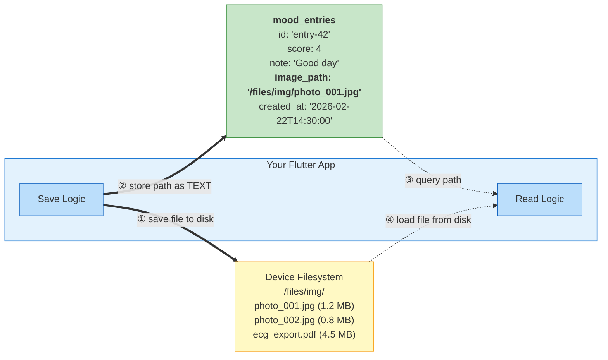
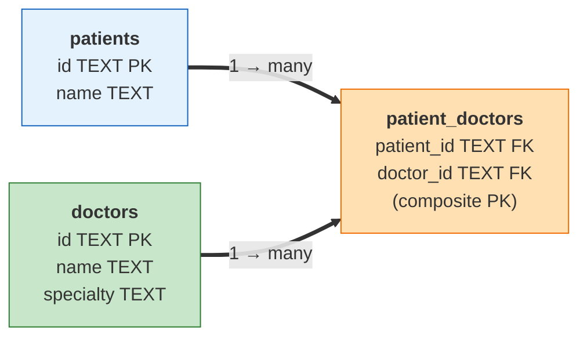
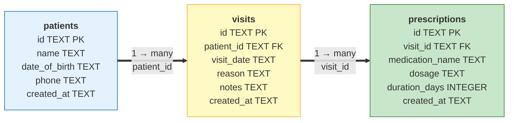
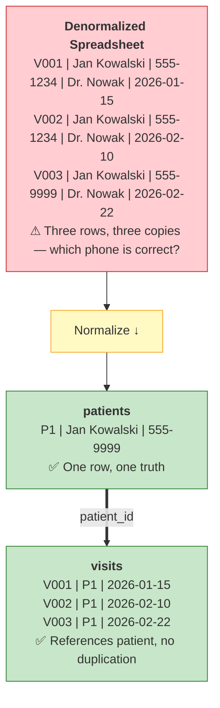
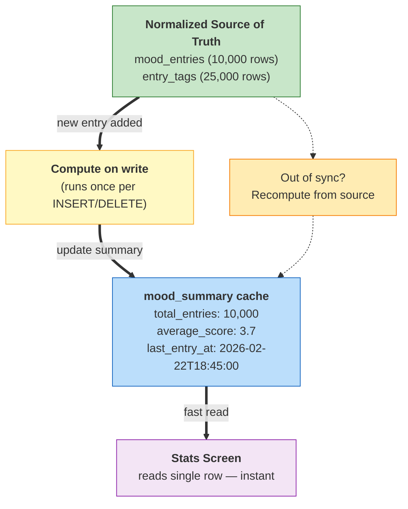
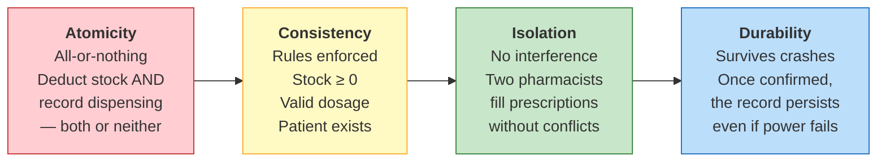
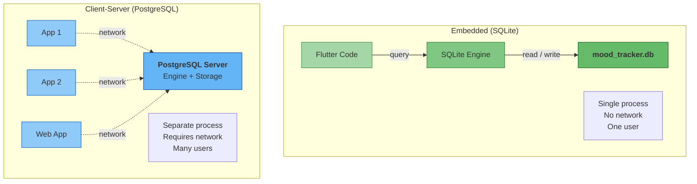

# Database Fundamentals: A Supplementary Guide

**Course:** Multiplatform Mobile Software Engineering in Practice
**Format:** Self-paced reading (supplement to Lecture Notes and Lab)

> This guide goes deeper than the lecture. The lecture taught you *what SQL is* and
> *how to use CRUD operations*. This guide explains *how databases actually work
> under the hood*, *how to design a good schema*, and *what engineering trade-offs
> shape real-world database decisions*. Read it before or after the lab -- it will
> build your intuition about databases as engineering systems.

---

## Table of Contents

1. [How Your Phone Actually Stores Database Data](#1-how-your-phone-actually-stores-database-data)
2. [Storing Different Kinds of Data](#2-storing-different-kinds-of-data)
3. [The File Storage Pattern](#3-the-file-storage-pattern-when-data-doesnt-belong-in-the-database)
4. [Designing Your Database: From Real World to Tables](#4-designing-your-database-from-real-world-to-tables)
5. [Normalization: Why Repeating Data Is Dangerous](#5-normalization-why-repeating-data-is-dangerous)
6. [When to Break the Rules: Denormalization for Mobile](#6-when-to-break-the-rules-denormalization-for-mobile)
7. [Design Constraints and Architectural Trade-offs](#7-design-constraints-and-architectural-trade-offs)
8. [Practical Engineering Checklist](#8-practical-engineering-checklist)

---

## 1. How Your Phone Actually Stores Database Data

When you call `db.insert('mood_entries', entry.toMap())` in your Flutter app, what physically happens on the device? Understanding this helps you predict performance and avoid surprises.

### The Bookshelf Analogy

Imagine a bookshelf filled with binders. Each binder holds exactly one **page** of paper -- 4,096 bytes (4 KB). That is the fundamental unit of storage in SQLite. The database never reads or writes a single row; it always reads or writes an entire page.



Your `mood_entries` table is spread across these pages. Each page holds as many rows as will fit. A single mood entry -- an id (TEXT), a score (INTEGER), a note (TEXT), and a created_at (TEXT) -- might take around 100-200 bytes depending on the note length. So a single 4 KB page can hold roughly 20-40 mood entries.

When SQLite needs to read a specific entry, it loads the entire page containing that entry into memory. When it needs to write a new entry, it loads the page, modifies it in memory, and writes the entire page back to disk.

### Why This Matters

If your `mood_entries` table has 500 rows spread across 15 pages, querying all of them means reading 15 pages from disk. That is fast -- about 60 KB of I/O. But if you stored 2 GB of medical images as BLOBs in the same database, the file would be hundreds of thousands of pages, and even simple queries would slow down because SQLite has to navigate through a much larger file.

### B-tree Indexes: The Book Index Analogy

When you run `SELECT * FROM mood_entries WHERE id = 'entry-42'`, how does SQLite find that specific row without scanning every page? It uses a **B-tree index** -- a data structure that works exactly like the index at the back of a textbook.

Without an index, SQLite must perform a **full table scan**: read every page, examine every row, check if `id = 'entry-42'`. With 10,000 entries, that means reading hundreds of pages.

With an index (and the primary key column automatically has one), SQLite maintains a sorted tree structure. It can jump directly to the right page in 3-4 steps, regardless of table size. Think of it this way: finding "pharmacology" in a 1,000-page textbook takes seconds with the index at the back, but minutes if you flip through every page.



> Only 3 steps to find any row among thousands — no scanning needed.

This is why:

- `WHERE id = 'entry-42'` is fast -- it uses the primary key index
- `WHERE score >= 4` on a non-indexed column is slower -- SQLite must scan every row
- `WHERE note LIKE '%tired%'` is always slow -- no index can help with substring searches in the middle of a string

### What Happens When You INSERT 10,000 Mood Entries

Let's say your app is used in a clinical study, and a patient logs mood entries three times a day for ten years. That is roughly 10,000 entries. Here is what happens to the SQLite file:

1. The database file starts small (a few KB for the schema and initial pages)
2. Each INSERT adds a row to the current page. When a page fills up, SQLite allocates a new page, and the file grows by 4 KB
3. At ~30 entries per page, 10,000 entries need ~330 pages = ~1.3 MB
4. The B-tree index grows alongside the data, adding maybe 10-20% overhead
5. Total file size: roughly 1.5 MB. Completely manageable on any phone

This is why SQLite is excellent for structured data. Even large datasets stay compact because rows are tightly packed into pages and indexed efficiently.

---

## 2. Storing Different Kinds of Data

The lecture introduced SQLite's five storage classes (TEXT, INTEGER, REAL, BLOB, NULL). Let's look at how each one actually works and what trade-offs they carry.

### Integers and Booleans

SQLite stores integers in a variable-length format: small numbers take fewer bytes than large ones. The value `1` takes 1 byte; `1000000` takes 3 bytes; a 64-bit number takes up to 8 bytes. This is efficient -- most of your mood scores (1-5) take just 1 byte each.

Booleans do not exist as a separate type in SQLite. You store them as `INTEGER`: `0` for false, `1` for true. In Dart, you convert manually:

```dart
// Writing a boolean to SQLite
'is_favorite': isFavorite ? 1 : 0,

// Reading a boolean from SQLite
isFavorite: map['is_favorite'] == 1,
```

This is equivalent to how C represents booleans -- there is no `bool` type in C89, just `int` with 0 and non-zero.

### Strings (TEXT)

Text values are stored as UTF-8 encoded bytes, prefixed with their length. The string `"Woke up tired"` takes 13 bytes for the characters plus a few bytes of overhead. Strings are stored inline in the row, directly on the page alongside other columns.

Short strings (a mood note of a few sentences) are very efficient. Longer strings (a full therapy session transcript at 10 KB) still work, but they consume more page space, meaning fewer rows fit per page.

### NULLs

NULL is essentially free. SQLite uses a flag in the row header to indicate that a column has no value. No additional bytes are consumed. This is why nullable columns like `note TEXT` cost nothing when the user does not enter a note -- the row is smaller, not bigger.

### Dates and Times

SQLite has no native date or time type. You have two options:

| Approach | Storage | Example Value | Pros | Cons |
|----------|---------|---------------|------|------|
| ISO 8601 TEXT | `TEXT` | `"2026-02-22T14:30:00"` | Human-readable, sorts correctly as text, standard format | Takes ~20 bytes per value |
| Unix timestamp | `INTEGER` | `1740231000` | Compact (4-8 bytes), fast arithmetic | Not human-readable, timezone-ambiguous |

The lecture and lab use ISO 8601 TEXT with `DateTime.toIso8601String()` and `DateTime.parse()`. This is the recommended approach for most apps because:

- ISO 8601 strings sort correctly in alphabetical order (which is why `ORDER BY created_at DESC` works)
- They are immediately readable when you inspect the database with DB Browser
- The storage overhead (~20 bytes) is negligible for most applications

Use Unix timestamps when you need to perform arithmetic on dates (e.g., "find entries within the last 7 days") and every byte of storage matters. For your course projects, stick with ISO 8601.

### BLOBs (Binary Large Objects)

A BLOB stores raw binary data directly in the row. A small thumbnail image (5 KB), a short audio clip (50 KB), or a binary sensor reading can be stored this way.

The problem is scale. A BLOB sits inline in the page, just like any other column. A 1 MB image consumes 256 pages all by itself. If you store 100 such images, your database file grows by 256 MB, and every query against that table becomes slower because SQLite must navigate around all those large BLOBs.

**Rule of thumb:** BLOBs under ~100 KB are fine. Anything larger should be stored as a file on disk, with the file path saved in the database. The next section explains this pattern in detail.

### Mapping to Dart Types

| SQLite Type | Dart Type | Conversion |
|-------------|-----------|------------|
| `INTEGER` | `int` | Direct |
| `INTEGER` (boolean) | `bool` | `value == 1` / `value ? 1 : 0` |
| `REAL` | `double` | Direct |
| `TEXT` | `String` | Direct |
| `TEXT` (date) | `DateTime` | `DateTime.parse()` / `.toIso8601String()` |
| `BLOB` | `Uint8List` | Direct |
| `NULL` | `null` | Direct |

---

## 3. The File Storage Pattern: When Data Doesn't Belong in the Database

### The Rule of Thumb

If a piece of data is larger than ~100 KB, store the **file on disk** and keep the **file path in the database**.

### Why This Matters

Large BLOBs cause three problems:

1. **Bloated database file.** 200 patient profile photos at 500 KB each = 100 MB added to your SQLite file. The database was designed for structured rows, not media storage.
2. **Slower queries.** Every query against a table with large BLOBs must navigate around them, even if the query does not select the BLOB column. The pages are bigger, more I/O is needed.
3. **Backup and migration pain.** Exporting, backing up, or migrating a 500 MB database file is slow. A 5 MB database file plus separate image files is much easier to manage.

### The Pattern



Here is what this looks like in Dart:

```dart
import 'dart:io';
import 'package:path_provider/path_provider.dart';
import 'package:path/path.dart' as p;

// 1. Save the image file to the app's documents directory
Future<String> saveImage(Uint8List imageBytes, String filename) async {
  final dir = await getApplicationDocumentsDirectory();
  final filePath = p.join(dir.path, 'images', filename);
  await Directory(p.dirname(filePath)).create(recursive: true);
  await File(filePath).writeAsBytes(imageBytes);
  return filePath;
}

// 2. Store the file path in the database
await db.insert('mood_entries', {
  'id': entryId,
  'score': 4,
  'note': 'Good day at the clinic',
  'image_path': '/data/user/0/com.example.app/files/images/photo_001.jpg',
  'created_at': DateTime.now().toIso8601String(),
});

// 3. Retrieve and display
final maps = await db.query('mood_entries', where: 'id = ?', whereArgs: [entryId]);
final imagePath = maps.first['image_path'] as String?;
if (imagePath != null) {
  final imageFile = File(imagePath);
  if (await imageFile.exists()) {
    // Display the image
  }
}
```

### Healthcare Examples

This pattern is essential in healthcare, where data often includes large binary files:

- **DICOM medical images** (CT scans, MRIs): A single CT scan can be hundreds of megabytes. Store the scan file on disk (or a remote PACS server); keep the file reference, patient ID, and metadata in the database.
- **ECG waveform recordings:** A 24-hour Holter monitor recording exported as a PDF might be 10-50 MB. Store the file; keep the path.
- **Patient profile photos:** A high-resolution photo might be 2-5 MB. Store on disk; keep the path.
- **Audio recordings** (therapy sessions, symptom descriptions): Even a short recording at decent quality is several MB. Store on disk; keep the path.

### The Edge Cases: Orphaned Files and Broken References

This pattern introduces two failure modes you must handle:

**Orphaned files:** You delete the database row but forget to delete the file. The image sits on disk forever, consuming storage, with no database record pointing to it. Over time, orphaned files accumulate.

```dart
// WRONG: deletes the row but leaves the file
await db.delete('mood_entries', where: 'id = ?', whereArgs: [id]);

// RIGHT: delete the file first, then the row
final maps = await db.query('mood_entries', where: 'id = ?', whereArgs: [id]);
if (maps.isNotEmpty) {
  final path = maps.first['image_path'] as String?;
  if (path != null) {
    final file = File(path);
    if (await file.exists()) await file.delete();
  }
}
await db.delete('mood_entries', where: 'id = ?', whereArgs: [id]);
```

**Broken references:** The file is deleted (by the OS, by the user clearing app cache, or by a bug) but the database row still points to it. When you try to load the image, the file does not exist. Always check `file.exists()` before loading.

---

## 4. Designing Your Database: From Real World to Tables

The lecture showed you the `mood_entries` table. But how do you decide what tables to create when you start a new project? This section teaches you the thought process.

### Start from Entities

Ask yourself: **"What 'things' does my app track?"** Each distinct thing typically becomes a table.

For the Mood Tracker, the answer is simple: mood entries. One table. But what happens when the app grows?

- Users want to **tag** entries (anxious, tired, energetic) → a `tags` table
- A therapist wants to **add notes** to entries → a `therapist_notes` table
- The app tracks **medications** alongside mood → a `medications` table
- Each user has a **profile** → a `users` table

Each of these "things" is an **entity**, and each entity gets its own table.

### Primary Keys: Every Table Needs One

A primary key uniquely identifies each row. No two rows can share the same primary key value. You have two common choices:

| Approach | Example | Pros | Cons |
|----------|---------|------|------|
| Auto-increment INTEGER | `1, 2, 3, 4, ...` | Simple, compact, easy to read | Unsafe for offline sync (two devices might generate the same ID) |
| UUID (TEXT) | `"a1b2c3d4-..."` | Globally unique, safe for offline sync | Larger (36 bytes vs 4-8 bytes), harder to read |

The lab uses UUIDs (`const Uuid().v4()`) because they are safe for offline scenarios. Two devices can create entries independently, and when they sync later, there are no ID collisions. For a server-only app where the database assigns IDs centrally, auto-increment is simpler.

### Foreign Keys: How Tables Reference Each Other

When two entities are related, you connect them using a **foreign key** -- a column in one table that references the primary key of another table.

```sql
-- Patients table
CREATE TABLE patients (
  id TEXT PRIMARY KEY,
  name TEXT NOT NULL,
  date_of_birth TEXT
);

-- Vital signs reference a patient
CREATE TABLE vital_signs (
  id TEXT PRIMARY KEY,
  patient_id TEXT NOT NULL,        -- foreign key → patients.id
  heart_rate INTEGER,
  systolic_bp INTEGER,
  diastolic_bp INTEGER,
  recorded_at TEXT NOT NULL
);
```

The `patient_id` column in `vital_signs` must contain a value that exists in `patients.id`. This ensures every vital sign reading belongs to a real patient. You cannot accidentally create a reading for a patient who does not exist (if you enable foreign key enforcement).

### One-to-Many and Many-to-Many Relationships

**One-to-many:** One patient has many vital sign readings. One mood entry has many tags. The "many" side holds the foreign key.

```
patients (1) ──── (many) vital_signs
   id                     patient_id → patients.id
```

**Many-to-many:** A patient can see many doctors. A doctor can see many patients. You need a **junction table** (also called a bridge table) to model this:

```sql
CREATE TABLE patients (
  id TEXT PRIMARY KEY,
  name TEXT NOT NULL
);

CREATE TABLE doctors (
  id TEXT PRIMARY KEY,
  name TEXT NOT NULL,
  specialty TEXT
);

-- Junction table: links patients to doctors
CREATE TABLE patient_doctors (
  patient_id TEXT NOT NULL,
  doctor_id TEXT NOT NULL,
  PRIMARY KEY (patient_id, doctor_id)
);
```

Each row in `patient_doctors` represents one relationship: "this patient sees this doctor." The combination of `patient_id` and `doctor_id` forms a **composite primary key** -- no duplicate pairs allowed.



### Schema Design Walkthrough: A Small Clinic Database

Let's build a database step by step for a small clinic app:

**Step 1: Identify entities.** Patients, visits, prescriptions.

**Step 2: Define each table.**

```sql
CREATE TABLE patients (
  id TEXT PRIMARY KEY,
  name TEXT NOT NULL,
  date_of_birth TEXT,
  phone TEXT,
  created_at TEXT NOT NULL
);

CREATE TABLE visits (
  id TEXT PRIMARY KEY,
  patient_id TEXT NOT NULL,       -- who was seen
  visit_date TEXT NOT NULL,       -- when
  reason TEXT,                    -- why they came in
  notes TEXT,                     -- doctor's notes
  created_at TEXT NOT NULL
);

CREATE TABLE prescriptions (
  id TEXT PRIMARY KEY,
  visit_id TEXT NOT NULL,         -- which visit this prescription came from
  medication_name TEXT NOT NULL,
  dosage TEXT NOT NULL,           -- e.g., "500mg twice daily"
  duration_days INTEGER,
  created_at TEXT NOT NULL
);
```

**Step 3: Trace the relationships.**



A patient has many visits. Each visit can produce multiple prescriptions. To find all prescriptions for patient "Jan Kowalski", you would join across all three tables.

---

## 5. Normalization: Why Repeating Data Is Dangerous

### The Spreadsheet Horror



Imagine a hospital stores visit data in a single Excel spreadsheet:

| visit_id | patient_name | patient_phone | patient_address | doctor_name | visit_date | diagnosis |
|----------|-------------|---------------|-----------------|-------------|------------|-----------|
| V001 | Jan Kowalski | 555-1234 | ul. Czarnowiejska 30 | Dr. Nowak | 2026-01-15 | Hypertension |
| V002 | Jan Kowalski | 555-1234 | ul. Czarnowiejska 30 | Dr. Nowak | 2026-02-10 | Hypertension |
| V003 | Jan Kowalski | 555-9999 | ul. Łojasiewicza 6 | Dr. Nowak | 2026-02-22 | Hypertension |

Do you see the problem? Jan Kowalski moved and changed his phone number, but only the latest row was updated. Now the database has three different versions of his contact information. Which one is correct? This is called an **update anomaly**, and it is the core problem that normalization solves.

### First Normal Form (1NF): No Lists in a Single Cell

**The smell:** A column contains a comma-separated list.

```
| id | score | tags              | created_at |
|----|-------|-------------------|------------|
| e1 | 3     | anxious,tired     | 2026-02-22 |
| e2 | 5     | happy,energetic   | 2026-02-22 |
```

The `tags` column contains multiple values. To find all entries tagged "anxious", you would need `WHERE tags LIKE '%anxious%'`, which is slow, cannot use an index, and would incorrectly match a tag called "not-anxious".

**The fix:** Create a separate table for tags.

```sql
CREATE TABLE mood_entries (
  id TEXT PRIMARY KEY,
  score INTEGER NOT NULL,
  created_at TEXT NOT NULL
);

CREATE TABLE entry_tags (
  entry_id TEXT NOT NULL,
  tag TEXT NOT NULL,
  PRIMARY KEY (entry_id, tag)
);
```

Now each tag is its own row. Finding entries tagged "anxious" is a clean, indexable query: `SELECT entry_id FROM entry_tags WHERE tag = 'anxious'`.

### Second Normal Form (2NF): Every Column Depends on the Whole Key

**The smell:** In a table with a composite primary key, some columns depend on only part of the key.

Consider a table tracking which doctors treated which patients and when:

```
| doctor_id | patient_id | visit_date | doctor_name  | doctor_specialty |
|-----------|-----------|------------|--------------|------------------|
| D1        | P1        | 2026-02-22 | Dr. Nowak    | Cardiology       |
| D1        | P2        | 2026-02-22 | Dr. Nowak    | Cardiology       |
```

The primary key is `(doctor_id, patient_id, visit_date)`. But `doctor_name` and `doctor_specialty` depend only on `doctor_id`, not on the full key. If Dr. Nowak changes specialty, you must update every row.

**The fix:** Move doctor information to its own table. The visit table only references `doctor_id`.

### Third Normal Form (3NF): No Column Depends on Another Non-Key Column

**The smell:** A non-key column determines another non-key column.

```
| patient_id | city    | zip_code |
|-----------|---------|----------|
| P1        | Kraków  | 30-059   |
| P2        | Kraków  | 30-059   |
```

`zip_code` determines `city` (in most countries). If the postal system reassigns a zip code to a different city name, you must update every row with that zip code.

**The fix:** Store only `zip_code` in the patient table. Look up the city from a separate `zip_codes` table (or derive it at query time).

### Recognizing Design Smells

You do not need to memorize formal definitions. Instead, watch for these patterns -- they almost always indicate a normalization problem:

| Smell | What It Means | Fix |
|-------|---------------|-----|
| Same value repeated across many rows | Update anomaly risk | Move to a separate table |
| Comma-separated values in a column | Violates 1NF | Create a junction table |
| Columns that only depend on part of the key | Violates 2NF | Split into separate tables |
| One non-key column determines another | Violates 3NF | Extract to its own table |

---

## 6. When to Break the Rules: Denormalization for Mobile

Normalization is the gold standard for data integrity. But mobile apps operate under constraints that sometimes make strict normalization impractical.

### Mobile Is Read-Heavy

A typical health app reads data far more often than it writes. A patient opens the stats screen 10 times for every mood entry they log. If computing the stats requires joining three tables and aggregating hundreds of rows, that computation runs 10 times. On a mobile device, that is noticeable.

### sqflite and JOINs

SQLite itself handles JOINs efficiently. But the sqflite Dart package encourages simple queries through its `db.query()` method, which operates on a single table. To join tables, you must use `db.rawQuery()` with a hand-written SQL string. This is not a technical limitation -- it works fine -- but it pushes developers toward simpler, single-table designs.

### Strategic Denormalization

Instead of computing aggregates every time, you can pre-compute and cache them:

```sql
-- A summary table that caches computed statistics
CREATE TABLE mood_summary (
  id TEXT PRIMARY KEY,
  total_entries INTEGER NOT NULL DEFAULT 0,
  average_score REAL,
  last_entry_at TEXT,
  updated_at TEXT NOT NULL
);
```

When the stats screen opens, read from `mood_summary` -- a single row, no computation needed. When a mood entry is added or deleted, update the summary row.



### The Compromise

The pragmatic approach for mobile:

1. **Normalize your core data tables** (mood_entries, patients, vital_signs). These are your source of truth. Correctness matters here.
2. **Denormalize for read-heavy views** (summary statistics, dashboard data, cached computations). These are derived data. Speed matters here.
3. **Know which is which.** If your summary table ever gets out of sync, you can always recompute it from the normalized source. The reverse is not true -- if your only copy of the data is denormalized, you cannot un-duplicate it.

---

## 7. Design Constraints and Architectural Trade-offs

### ACID: The Hospital Pharmacy Analogy

Every reliable database guarantees four properties, collectively called ACID. Here is an analogy: think of filling a prescription at a hospital pharmacy.

**Atomicity (All-or-nothing).** When a pharmacist fills a prescription, the system must both deduct the medication from inventory AND record that the patient received it. If only one step happens -- inventory is deducted but the patient record is not updated, or vice versa -- the system is in an inconsistent state. SQLite guarantees that a transaction either completes fully or has no effect. There is no halfway.

**Consistency (Rules enforced).** The pharmacy has rules: stock cannot go negative, controlled substances require specific documentation, dosages must be within safe limits. The database enforces its own rules: a PRIMARY KEY must be unique, a NOT NULL column cannot be empty, a foreign key must reference an existing row. If an operation would violate any rule, the entire transaction is rejected.

**Isolation (Concurrent access is safe).** Two pharmacists filling prescriptions simultaneously should not interfere with each other. If both try to deduct from the same medication stock at the same moment, the database ensures the operations are serialized -- one goes first, then the other. No race conditions. SQLite uses file-level locking for this.

**Durability (Survives crashes).** Once the pharmacist confirms the prescription is filled, that record must survive even if the power goes out a millisecond later. SQLite achieves this by flushing data to disk before confirming a transaction is complete. If the app crashes mid-write, the partially written transaction is rolled back on the next open.



### Schema Rigidity vs Flexibility

SQL databases force you to declare your structure upfront: these are the tables, these are the columns, these are the types. This rigidity is a feature, not a bug. It means the database rejects malformed data -- you cannot accidentally store a string in an integer column (well, SQLite is lenient about this, but other databases are strict).

NoSQL databases (like Hive, Isar, or MongoDB) let you store freeform JSON or objects. No schema declaration needed. This is flexible, but it means the database cannot protect you from bad data. You trade safety for agility.

For health apps, where data correctness has clinical consequences, schema rigidity is usually worth the upfront cost.

### Embedded vs Client-Server Databases

| Property | SQLite (embedded) | PostgreSQL/MySQL (client-server) |
|----------|-------------------|----------------------------------|
| Runs where? | Inside your app process | Separate server process |
| Users | Single user (one app) | Multiple users concurrently |
| Network | No network needed | Requires network connection |
| Setup | Zero configuration | Server installation and management |
| Scaling | One device | Thousands of clients |
| Best for | Mobile apps, desktop apps, IoT | Web backends, enterprise systems |



SQLite is the right choice for mobile. Your app is the only user, the data lives on the device, and no network is needed. When you build the backend in Week 8, you might encounter PostgreSQL -- that is the right choice for a server that many clients connect to simultaneously.

### Indexes: Speed vs Space

An index is a separate data structure that makes lookups fast. Think of it as adding a detailed index to a textbook -- searching for a topic becomes instant, but the book itself gets thicker.

```sql
-- Without this index, filtering by score scans every row
CREATE INDEX idx_mood_entries_score ON mood_entries(score);

-- Now this query is fast:
SELECT * FROM mood_entries WHERE score >= 4;
```

The trade-offs:

| | Without Index | With Index |
|---|---|---|
| **Read speed** | Slow (full scan) | Fast (index lookup) |
| **Write speed** | Fast (just insert the row) | Slower (update the index too) |
| **Storage** | Minimal | Extra space for the index |

**When to add an index:** Only for columns you frequently filter or sort by. The primary key is automatically indexed. For the `mood_entries` table, `created_at` is a good candidate (you always sort by it). `score` might be worth indexing if you filter by it often. `note` is not worth indexing -- you rarely query by note content, and text indexes are expensive.

### Storage Budget on Mobile

SQLite files count against your app's storage usage. Users notice when an app consumes gigabytes. Some guidelines:

- 10 MB of structured mood entries = ~100,000 rows. Perfectly fine.
- 100 MB = you are probably storing BLOBs that should be files. Review your schema.
- 1 GB+ = something is wrong. No mobile app should have a database this large unless it is specifically a media-heavy application with a deliberate strategy.

Monitor your database file size during development. On Android, you can check with `adb shell ls -la /data/data/com.example.app/databases/`.

### Migration Cost

Every schema change requires a migration script (as discussed in the lecture). The cost is proportional to complexity:

- **Adding a column** (`ALTER TABLE mood_entries ADD COLUMN tags TEXT`): Easy and safe. The new column is NULL for existing rows.
- **Renaming a column**: SQLite added `ALTER TABLE RENAME COLUMN` in version 3.25.0 (2018). Available on most modern devices.
- **Changing a column type or removing a column**: Requires creating a new table, copying data over, and dropping the old one. Error-prone and slow for large tables.
- **Adding a table**: Easy. No existing data is affected.

The takeaway: **keep your schema as simple as possible.** Every table and column you add today is a column you might need to migrate later. Add what you need, nothing more. You can always add columns later; removing them is painful.

---

## 8. Practical Engineering Checklist

Reference this checklist when designing your project's database. It distills the principles from this guide into actionable rules.

### Schema Design

- [ ] **One table per real-world entity.** Patients, mood entries, medications, vital signs -- each gets its own table. Do not mix different entities in one table.
- [ ] **Every table has a primary key.** Use UUID (TEXT) for offline-safe apps; auto-increment INTEGER for server-managed IDs.
- [ ] **Use snake_case for table and column names.** `mood_entries`, `created_at`, `patient_id`. Not `moodEntries`, `createdAt`, `patientID`. SQL convention is snake_case, and consistency with your SQL examples matters.
- [ ] **Store dates as ISO 8601 TEXT.** `"2026-02-22T14:30:00"`. Sorts correctly, human-readable, standard format.
- [ ] **Store booleans as INTEGER** (0 or 1). Convert in your Dart `toMap()` / `fromMap()` methods.

### Storage Strategy

- [ ] **Files on disk, paths in the database.** Anything over ~100 KB (images, PDFs, audio) goes to the filesystem via `path_provider`. The database stores only the file path as TEXT.
- [ ] **Handle orphaned files and broken references.** Delete the file when you delete the row. Check `file.exists()` before loading.

### Performance

- [ ] **Add indexes only for columns you filter or sort by.** Primary keys are indexed automatically. Add indexes for `created_at` if you sort by date, or for `patient_id` if you filter by patient. Do not index every column.
- [ ] **Denormalize only for read-heavy views.** Cache summary statistics in a separate table if the stats screen is slow. Keep your source-of-truth tables normalized.

### Maintenance

- [ ] **Plan your first migration before shipping v1.** Use `openDatabase(version: 1, ...)` from day one. When you add features, increment the version and write an `onUpgrade` callback.
- [ ] **Keep the schema as simple as possible.** You can always add columns, tables, and indexes later. Removing them is painful and risky. Start minimal.
- [ ] **Always include `created_at`.** Every table should record when each row was created. It costs almost nothing in storage and is invaluable for debugging, auditing, and clinical data integrity.

---

## Further Reading

- **SQLite file format (how pages and B-trees work):** [https://www.sqlite.org/fileformat2.html](https://www.sqlite.org/fileformat2.html)
- **SQLite query planner (how indexes are used):** [https://www.sqlite.org/queryplanner.html](https://www.sqlite.org/queryplanner.html)
- **Database normalization (Wikipedia, formal definitions):** [https://en.wikipedia.org/wiki/Database_normalization](https://en.wikipedia.org/wiki/Database_normalization)
- **path_provider package:** [https://pub.dev/packages/path_provider](https://pub.dev/packages/path_provider)
- **sqflite package:** [https://pub.dev/packages/sqflite](https://pub.dev/packages/sqflite)
