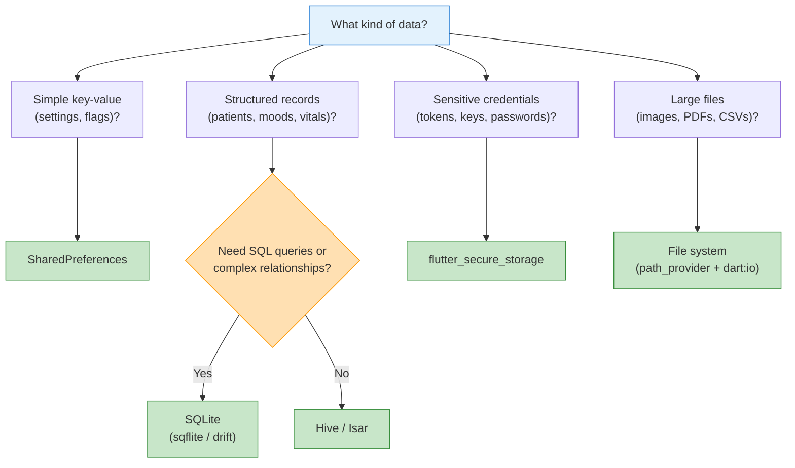
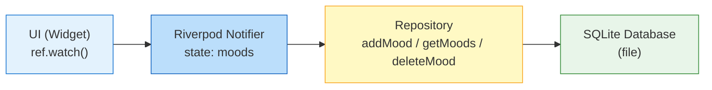
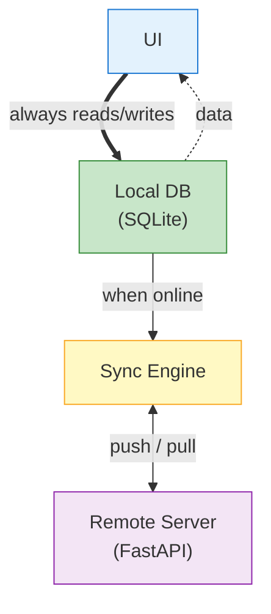
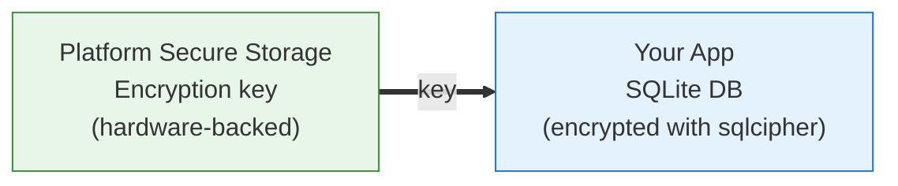

# Week 7 Lecture: SharedPreferences, SQLite, Offline-First & Health Data

**Course:** Multiplatform Mobile Software Engineering in Practice
**Duration:** ~2 hours (including Q&A)

---

## Table of Contents

1. [Why Local Data Matters](#1-why-local-data-matters-10-min) (10 min)
2. [Local Storage Options in Flutter](#2-local-storage-options-in-flutter-15-min) (15 min)
3. [What Is a Database and How Does SQL Work?](#3-what-is-a-database-and-how-does-sql-work-25-min) (25 min)
4. [SQLite in Flutter](#4-sqlite-in-flutter-12-min) (12 min)
5. [Offline-First Architecture](#5-offline-first-architecture-12-min) (12 min)
6. [Health Data Considerations](#6-health-data-considerations-13-min) (13 min)
7. [Data Migration Strategies](#7-data-migration-strategies-3-min) (3 min)
8. [Key Takeaways](#8-key-takeaways-5-min) (5 min)

---

## 1. Why Local Data Matters (10 min)

### The Problem You Already Experienced

Your Mood Tracker app from Week 6 lost all data when you restarted it. Every mood entry, every note, every score -- gone the moment the app closed. For a demo or prototype, that is fine. For a real health app, that is a critical failure.

Think about it from a patient's perspective. Imagine someone managing a chronic condition -- depression, diabetes, hypertension. They log their mood or blood sugar every morning. They depend on that data to see trends, to share with their doctor, to feel in control. If the app loses their data because they received a phone call or stepped into an elevator, they will uninstall the app and never come back.

### Five Reasons to Store Data Locally

**1. Persistence.** Data must survive app restarts, device reboots, and even OS updates. A blood pressure reading logged at 7 AM should still be there at 7 PM, next week, and next year.

**2. Performance.** Reading from a local database takes milliseconds. Reading from a remote server takes hundreds of milliseconds at best, seconds at worst. For an app that a patient opens multiple times a day, that speed difference matters.

**3. Offline access.** Healthcare happens in places where internet connectivity is unreliable: ambulances racing between hospitals, rural clinics with spotty satellite links, basement imaging rooms surrounded by concrete and metal. A patient logging their blood pressure should not lose their data because they were in an elevator without signal.

**4. Privacy.** Some data should never leave the device unless explicitly shared. A patient's mental health journal is deeply personal. Local storage gives users control over where their data lives.

**5. Caching.** Even when you have a backend server, caching data locally reduces server load, saves bandwidth, and makes the app feel faster. Fetching the same 200 mood entries from the server every time the user opens the app is wasteful when the data has not changed.

### The Core Principle

Local storage is not a nice-to-have feature. It is infrastructure. Every mobile health app needs it. The question is not *whether* to store data locally, but *which technology* to use for each type of data.

---

## 2. Local Storage Options in Flutter (15 min)

Flutter gives you several options for local storage. Each one fits a different use case. Choosing the wrong tool leads to security vulnerabilities, performance problems, or unnecessary complexity.

### SharedPreferences: The Post-it Note

**What it is:** A simple key-value store backed by NSUserDefaults on iOS and SharedPreferences on Android.

**Use cases:**
- User settings (dark mode on/off, preferred language)
- Simple flags (has the user completed onboarding? Is this the first launch?)
- Last sync timestamp
- Theme preference

**What it is NOT for:**
- Large datasets (it loads the entire file into memory)
- Structured data that needs querying
- Sensitive data (it is stored as plain text on the device)

**Analogy:** SharedPreferences is like Post-it notes stuck to your fridge. Quick to write, quick to read, always visible. But you would not organize your entire medical record on Post-it notes.

```dart
// Writing a value
final prefs = await SharedPreferences.getInstance();
await prefs.setBool('onboarding_complete', true);
await prefs.setString('last_sync', DateTime.now().toIso8601String());

// Reading a value
final onboardingDone = prefs.getBool('onboarding_complete') ?? false;
final lastSync = prefs.getString('last_sync');
```

Simple, straightforward, and limited by design.

### SQLite: The Filing Cabinet

**What it is:** A full relational database that runs inside your app. No server needed -- the entire database is a single file on the device.

**Use cases:**
- Structured data that needs querying (mood entries, patient records, medication schedules)
- Large datasets (thousands or millions of rows)
- Complex relationships between data (a patient has many entries, each entry has tags)
- Data that needs to be sorted, filtered, and aggregated

**Analogy:** SQLite is like a well-organized filing cabinet with labeled folders, dividers, and an index. It takes more effort to set up than a Post-it note, but once it is in place, you can find anything quickly.

In Flutter, you access SQLite through one of two packages:

- **sqflite** -- a direct SQL interface. You write raw SQL strings. Simple, widely used, battle-tested.
- **drift** (formerly moor) -- a type-safe, code-generated wrapper around SQLite. You define tables in Dart code, and drift generates the SQL for you. Compile-time query validation. Reactive streams that update your UI when data changes (pairs perfectly with Riverpod).

We will focus on sqflite because it is simpler to learn, and you practiced it in the lab. Know that drift exists for when you want stronger type safety in production projects.

### Hive, Isar, and Other NoSQL Alternatives

Hive and Isar are Dart-native NoSQL databases -- key-value stores with more features than SharedPreferences but without SQL. They let you store Dart objects directly (with code generation) and offer basic querying and indexing. Hive is fast and simple but development has slowed; Isar is newer and more actively maintained. Both have smaller ecosystems compared to SQLite, which has been in production since 2000. For most projects in this course, SQLite will be the right choice, but these alternatives are worth knowing about.

### Secure Storage: The Safe

**What it is:** Encrypted key-value storage backed by the platform's hardware security module -- Keychain on iOS, Keystore on Android.

**Use cases:**
- Authentication tokens (JWT tokens, API keys)
- Encryption keys
- Passwords and PINs
- Any credential that grants access to sensitive data

**Critical rule:** NEVER store authentication tokens in SharedPreferences. SharedPreferences is plain text. Anyone with physical access to the device -- or any app that gains file system access through a vulnerability -- can read them.

```dart
// flutter_secure_storage example
final storage = FlutterSecureStorage();

// Write (encrypted automatically)
await storage.write(key: 'auth_token', value: 'eyJhbGciOiJIUzI1...');

// Read (decrypted automatically)
final token = await storage.read(key: 'auth_token');

// Delete
await storage.delete(key: 'auth_token');
```

The encryption is hardware-backed. On iOS, the Keychain is protected by the Secure Enclave. On Android, the Keystore uses hardware-backed keys when available. This means even if the device is jailbroken or rooted, the data is significantly harder to extract.

### File System: The Document Drawer

For large binary files -- downloaded PDFs, exported CSVs, cached images -- use direct file I/O with `dart:io` and the `path_provider` package. This is not a database; it is simply reading and writing files to the device's filesystem. Use it for data that does not need querying or indexing.

```dart
final directory = await getApplicationDocumentsDirectory();
final file = File('${directory.path}/exported_moods.csv');
await file.writeAsString(csvContent);
```

### Comparison Table

| Feature | SharedPreferences | SQLite | Hive/Isar | Secure Storage | File System |
|---------|-------------------|--------|-----------|----------------|-------------|
| Data type | Key-value pairs | Relational tables | Key-value / objects | Key-value pairs | Raw files |
| Querying | By key only | Full SQL | Basic queries | By key only | N/A |
| Encryption | None | Optional (sqlcipher) | Optional | Built-in (HW) | Manual |
| Performance | Fast (small data) | Fast (any size) | Very fast | Slower | Varies |
| Best for | Settings, flags | Structured records | Object storage | Credentials | Documents |
| Capacity | Kilobytes | Gigabytes | Gigabytes | Kilobytes | Gigabytes |

### The Decision Tree

When deciding which storage to use, walk through this tree:



---

## 3. What Is a Database and How Does SQL Work? (25 min)

Most of your projects will use SQLite. Before we look at how to use it in Flutter, you need to understand what a database actually is and how SQL works. This is foundational knowledge that applies far beyond mobile apps -- every backend, every data pipeline, every analytics tool you will encounter in your career uses databases.

### 3.1 Why Not Just Use Files or Variables?

You already know how to store data in Python dictionaries, Dart Maps, and JSON files. So why do we need databases at all?

Think of data storage as a spectrum with three levels:

**Level 1: Variables (in-memory).** A Dart `List<MoodEntry>` or a Python `list[dict]` lives in RAM. It is fast to access but vanishes the instant your app closes or the device restarts. This is what your Mood Tracker does right now -- and it is why you lose all entries on restart.

**Level 2: Files (JSON, CSV, plain text).** You could serialize your mood entries to a JSON file using `dart:io` and reload them on startup. This solves persistence, but creates new problems:

- **No efficient querying.** To find all moods with score >= 4, you must load the entire file into memory and filter in Dart. With thousands of entries, this is slow and wasteful.
- **No crash safety.** If the app crashes or the phone dies mid-write, the file may be partially written and corrupted. You lose not just the new entry, but potentially all your data.
- **No concurrent access.** If two parts of your app try to write at the same time, one write can overwrite the other.

**Level 3: Databases.** A database gives you all three: persistence (data survives restarts), querying (find specific records without loading everything), and safety (transactions ensure data is saved completely or not at all).

> **Healthcare hook:** If a patient's blood pressure reading is stored in a variable, it
> vanishes when the app closes. If stored in a JSON file and the phone dies mid-write,
> the file may be corrupted -- and every reading in it could be lost. A database ensures
> each reading is saved completely or not at all. This guarantee is called a
> **transaction**, and it is fundamental to any system that handles clinical data.

### 3.2 The Relational Model: Tables, Rows, Columns

A relational database organizes data into **tables**. If you have ever used a spreadsheet, the concept is familiar:

- A **table** is like a sheet in a spreadsheet (e.g., "mood_entries")
- A **row** is a single record (one mood entry)
- A **column** is a field (score, note, created_at)
- A **primary key** uniquely identifies each row -- like a student ID number that no two students share

Here is what the `mood_entries` table looks like:

| id | score | note | created_at |
|----|-------|------|------------|
| a1b2c3 | 3 | Woke up tired | 2026-02-22T07:30:00 |
| d4e5f6 | 5 | Great morning run | 2026-02-22T08:15:00 |
| g7h8i9 | 2 | Anxiety before exam | 2026-02-22T14:00:00 |
| j1k2l3 | 4 | | 2026-02-22T18:45:00 |

This should look familiar. In Python, you might represent this as:

```python
mood_entries = [
    {"id": "a1b2c3", "score": 3, "note": "Woke up tired", "created_at": "2026-02-22T07:30:00"},
    {"id": "d4e5f6", "score": 5, "note": "Great morning run", "created_at": "2026-02-22T08:15:00"},
]
```

In Dart, the equivalent would be a `List<Map<String, dynamic>>`. In C, you would use an array of `struct`s. A database table is a more powerful version of these structures: it is stored on disk with efficient indexing, supports querying with SQL, and guarantees data integrity through transactions.

### 3.3 Data Types in SQLite

SQLite uses five **storage classes** (think of them as data types):

| SQLite Type | What It Stores | Dart Equivalent |
|-------------|----------------|-----------------|
| TEXT | Strings | `String` |
| INTEGER | Whole numbers, booleans (0/1) | `int`, `bool` |
| REAL | Floating-point numbers | `double` |
| BLOB | Raw binary data | `Uint8List` |
| NULL | No value | `null` |

**Important:** SQLite has no native date/time type. Dates are stored as TEXT in ISO 8601 format (e.g., `"2026-02-22T14:30:00"`). In Dart, you convert with `DateTime.toIso8601String()` and parse back with `DateTime.parse()`. This is a common source of confusion -- remember it for the lab.

### 3.4 SQL: A Declarative Language

SQL (Structured Query Language) works differently from Python or Dart. In imperative languages, you tell the computer *how* to do something step by step. In SQL, you tell the computer *what* you want, and it figures out how to get it.

Compare these two approaches to finding happy moods (score >= 4):

**Python (imperative):**

```python
happy_moods = []
for entry in mood_entries:
    if entry["score"] >= 4:
        happy_moods.append(entry)
```

**SQL (declarative):**

```sql
SELECT * FROM mood_entries WHERE score >= 4;
```

SQL reads almost like English. It was designed in the 1970s at IBM specifically to be readable by non-programmers. You describe the result you want, and the database engine optimizes the execution.

### 3.5 CRUD Operations with Healthcare Examples

CRUD stands for **C**reate, **R**ead, **U**pdate, **D**elete -- the four fundamental database operations. Let's walk through each one.

**CREATE TABLE** -- Define the structure of your data:

```sql
-- The mood_entries table (you will use this in the lab)
CREATE TABLE mood_entries (
  id TEXT PRIMARY KEY,
  score INTEGER NOT NULL,
  note TEXT,
  created_at TEXT NOT NULL
);

-- A richer healthcare example
CREATE TABLE vital_signs (
  id TEXT PRIMARY KEY,
  patient_id TEXT NOT NULL,
  heart_rate INTEGER,
  systolic_bp INTEGER,
  diastolic_bp INTEGER,
  temperature REAL,
  recorded_at TEXT NOT NULL
);
```

This is like defining a class in Dart or a `struct` in C, except you are defining the columns that every row in the table will have.

**INSERT** -- Add new rows:

```sql
-- Add a mood entry
INSERT INTO mood_entries (id, score, note, created_at)
VALUES ('abc-123', 4, 'Feeling good today', '2026-02-22T10:30:00');

-- Add a vital signs reading
INSERT INTO vital_signs (id, patient_id, heart_rate, systolic_bp, diastolic_bp, temperature, recorded_at)
VALUES ('vs-001', 'patient-42', 72, 120, 80, 36.6, '2026-02-22T08:00:00');
```

**SELECT** -- Query data (the most versatile operation):

```sql
-- Get all mood entries, newest first
SELECT * FROM mood_entries ORDER BY created_at DESC;

-- Filter: only happy moods
SELECT * FROM mood_entries WHERE score >= 4;

-- Count entries per score
SELECT score, COUNT(*) as count FROM mood_entries GROUP BY score;

-- Average mood score
SELECT AVG(score) as average_score FROM mood_entries;

-- Clinical query: find elevated blood pressure readings
SELECT * FROM vital_signs WHERE systolic_bp > 140;
```

**UPDATE** -- Modify existing data:

```sql
UPDATE mood_entries SET score = 5, note = 'Actually, great day!'
WHERE id = 'abc-123';
```

> **Warning:** Always include a `WHERE` clause with `UPDATE`. Without it,
> `UPDATE mood_entries SET score = 5` would change *every row* in the table to score 5.
> The same applies to `DELETE`.

**DELETE** -- Remove data:

```sql
DELETE FROM mood_entries WHERE id = 'abc-123';
```

### 3.6 SQL Clause Reference

Here is a quick reference for the SQL clauses you will use most often:

| Clause | Purpose | Example |
|--------|---------|---------|
| `WHERE` | Filter rows | `WHERE score >= 4` |
| `ORDER BY` | Sort results | `ORDER BY created_at DESC` |
| `GROUP BY` | Group rows for aggregation | `GROUP BY score` |
| `COUNT(*)` | Count rows | `SELECT COUNT(*) FROM mood_entries` |
| `AVG(col)` | Average value | `SELECT AVG(score) FROM mood_entries` |
| `MAX(col)` / `MIN(col)` | Largest / smallest value | `SELECT MAX(score) FROM mood_entries` |
| `LIMIT` | Return only N rows | `LIMIT 10` |

---

## 4. SQLite in Flutter (12 min)

Now that you understand SQL and relational databases, let's see how to use SQLite inside a Flutter app.

### 4.1 Why SQLite for Mobile

SQLite is an **embedded** relational database. Unlike PostgreSQL or MySQL, there is no separate server process. The database engine runs inside your app, and the entire database is stored as a **single file** on the device's file system.

SQLite is everywhere -- built into every iPhone, every Android phone, every Mac, every web browser. It is estimated to be the most widely deployed database engine in the world, with trillions of databases in active use. For mobile apps, it is ideal: no server configuration, zero-latency local queries, ACID-compliant transactions (safe even if the app crashes mid-write), and it has been in production since 2000.

### 4.2 sqflite vs drift: Two Ways to Use SQLite in Flutter

**sqflite** gives you a direct SQL interface. You write SQL strings, and sqflite executes them:

```dart
// sqflite: raw SQL
final maps = await db.query('mood_entries', where: 'score >= ?', whereArgs: [4]);
```

This is what you used in the lab. It is simple and explicit. But SQL strings are not checked at compile time -- a typo in a column name only shows up when the app runs.

**drift** takes a different approach. You define tables in Dart code, and drift generates type-safe queries:

```dart
// drift: type-safe, code-generated
class MoodEntries extends Table {
  TextColumn get id => text()();
  IntColumn get score => integer()();
  TextColumn get note => text().nullable()();
  DateTimeColumn get createdAt => dateTime()();
}

// Usage: compile-time checked
final happyMoods = await (select(moodEntries)..where((m) => m.score.isBiggerOrEqualValue(4))).get();
```

With drift, if you misspell a column name, the compiler catches it. If you try to compare a text column with an integer, the compiler catches it. This is safer for production apps.

drift also gives you **reactive streams** -- queries that automatically re-emit results when the underlying data changes. This pairs perfectly with Riverpod's state management model.

For this course, sqflite is sufficient. But if you continue building health apps professionally, drift is worth learning.

### 4.3 The Repository Pattern

In the lab, you implemented the repository pattern. Let's examine *why* it exists and *why* it matters so much for health apps.

The repository pattern places a clean abstraction layer between your business logic and your data source:



The key insight: **your Riverpod notifier talks to the repository, not directly to the database.** The notifier calls `repository.addMood(entry)`. It does not know or care whether the repository saves that entry to SQLite, sends it to a REST API, writes it to a CSV file, or does all three.

This matters in healthcare for a very practical reason. During development, you use a local SQLite database. In a clinical trial deployment, you might need to sync data with a FHIR server. In a hospital integration, you might need to write to an HL7 interface. The repository pattern lets you swap the data source without changing a single line of UI code or business logic.

It also makes testing easy. In your unit tests, you can replace the real repository with a mock that returns pre-defined data. No database setup, no cleanup, no flaky tests.

### The Optimistic Update Pattern

You also practiced another important pattern in the lab: **optimistic updates**. When a user adds a mood entry, the app:

1. Updates the in-memory state immediately (the UI refreshes instantly)
2. Writes to the database in the background

```dart
void addMood(int score, String? note) {
  final entry = MoodEntry(/* ... */);
  state = [entry, ...state];     // Step 1: UI updates immediately
  _repository.addMood(entry);    // Step 2: Database write happens async
}
```

Why not wait for the database write to complete before updating the UI? Because SQLite writes take a few milliseconds, and making the user wait -- even for a few milliseconds -- creates a perceptible lag. In a health app where patients log entries multiple times a day, that lag accumulates into a frustrating experience.

The risk of optimistic updates is that the database write could fail. In practice, local SQLite writes almost never fail (unlike network requests). If they do fail, it usually means the device is out of storage, which is a bigger problem that requires its own handling.

---

## 5. Offline-First Architecture (12 min)

### Two Philosophies

There are two fundamentally different ways to build a mobile app that talks to a server:

**Online-first (most apps):** The app fetches data from the server, displays it, and caches a copy locally. If the network is unavailable, the app shows cached data or an error message.

```
User action --> Network request --> Server responds --> Update local cache --> Show data
                     |
                     +-- Network unavailable? Show error or stale cache.
```

**Offline-first (health apps):** The app reads and writes data locally. When a network connection is available, the app syncs changes to the server in the background. The user never waits for the network.

```
User action --> Write to local DB --> Show data immediately
                     |
                     +-- When online --> Sync to server in background
```

The key difference: in an online-first app, the network is the primary data source. In an offline-first app, the local database is the primary data source.

### Why Offline-First Matters in Healthcare

Offline-first is not just a nice architecture pattern. In healthcare, it can be a patient safety requirement:

**Ambulances have intermittent connectivity.** A paramedic logging vital signs while racing to the hospital cannot wait for a server response. The data must be captured locally and synced later.

**Rural clinics may have slow or unreliable internet.** In many developing countries, community health workers use mobile apps to track vaccinations, maternal health, and disease outbreaks. These workers often operate in areas with no cellular coverage. The app must work completely offline for days or weeks, then sync when the worker returns to a facility with connectivity.

**Hospital infrastructure blocks signals.** Basements, MRI rooms, and Faraday-caged areas in hospitals have no cellular or Wi-Fi coverage. A clinician documenting observations in these areas needs an app that works without connectivity.

**Patient safety requires the app to always work.** If a nurse is administering medication based on data in the app, the app MUST display that data. "Network error -- please try again" is not acceptable when a patient's medication dose depends on it.

### The Architecture

Here is how offline-first works in practice:



> User never waits for the network. Data syncs in the background whenever a
> connection is available.

**The UI always talks to the local database.** Every read and every write goes to SQLite first. The user experience is identical whether the device is online or offline.

**The sync engine handles background synchronization.** When the device has a network connection, the sync engine:
1. Pushes local changes to the server
2. Pulls remote changes to the local database
3. Handles any conflicts

### The Sync Challenge: Conflicts

Offline-first architecture introduces a hard problem: **conflict resolution.** When the same record is modified in two places while offline, the system must decide which version wins. Common strategies include last-write-wins, field-level merging, and manual resolution -- each with trade-offs between simplicity and data safety.

For this course, you do not need to implement sync. A simple "push local changes, pull remote changes" approach is sufficient for your projects. But be aware that sync is one of the hardest problems in distributed systems, and healthcare makes it even harder because data accuracy has clinical consequences.

### What You Built in the Lab Is the Foundation

The architecture you implemented in the lab -- UI talks to Riverpod, Riverpod talks to a Repository, Repository talks to SQLite -- is the first half of an offline-first system. You have the local storage layer. In Week 8, you will add networking. If you were to combine both with a sync engine, you would have a complete offline-first architecture.

---

## 6. Health Data Considerations (13 min)

### Health Data Is Not Like Other Data

When you build a photo-sharing app and lose a user's photo, it is annoying. When you build a health app and lose a patient's data, it can affect clinical decisions. Health data has properties that demand extra care:

**It is highly sensitive.** Diagnoses, medications, mental health notes, genetic information -- this data can affect someone's employment, insurance, and personal relationships if exposed.

**It is legally protected.** The European Union's GDPR (General Data Protection Regulation) and the United States' HIPAA (Health Insurance Portability and Accountability Act) impose strict requirements on how health data is collected, stored, processed, and shared. Violations carry significant fines -- up to 20 million euros under GDPR.

**It must be accurate.** Clinical decisions depend on it. If a database corruption changes a medication dosage from 5mg to 50mg, the consequences are life-threatening.

**It must be available.** Emergencies do not wait for servers. A patient's allergy information must be accessible even when the hospital's network is down.

### Data Classification

Not all health data has the same sensitivity level. Understanding the classification helps you choose the right storage and protection strategy:

**Personally Identifiable Information (PII):**
- Name, date of birth, address, phone number, email
- Enough to identify a specific person
- Protected under GDPR and similar regulations worldwide

**Protected Health Information (PHI):**
- PII combined with health conditions, treatments, test results, provider names
- "Jan Kowalski has depression" is PHI. "A 25-year-old patient has depression" is not (unless the demographics are specific enough to identify the person).
- Protected under HIPAA (US), GDPR (EU), and other health-specific regulations

**De-identified data:**
- PII stripped from health records
- Safe to use for research and analytics
- Must follow specific de-identification standards (HIPAA defines 18 identifiers that must be removed)

For your course projects, most of you are building apps that handle at least PII and possibly PHI. Even though these are student projects, building with proper data handling habits now will serve you well in professional work.

### Local Storage Security

SQLite, by default, does **not** encrypt the database file. Anyone with physical access to the device -- or any app that exploits a file system vulnerability -- can open the database file and read its contents directly.

For a health app, this is not acceptable.

**Encryption at rest:** Use sqlcipher (an encrypted variant of SQLite) to encrypt the entire database file. The data is unreadable without the encryption key, even if the file is extracted from the device.

**Key management:** Store the encryption key in secure storage (Keychain on iOS, Keystore on Android), NEVER in SharedPreferences or hardcoded in the source code. The key should be protected by the device's hardware security module.



Even if the phone is stolen, the data should be unreadable without the encryption key, which is protected by the device's biometrics or PIN.

### The Cost of Getting It Wrong

This is not theoretical. Data breaches in healthcare have exposed tens of millions of patient records -- often because local data on stolen devices was not encrypted. In the European Union, the GDPR has resulted in significant fines for healthcare organizations that failed to protect patient data. Local data encryption is not optional -- it is a regulatory requirement and an ethical obligation.

### Data Minimization

GDPR introduces a powerful principle: **data minimization**. Only collect and store data that you actually need for the stated purpose of your app.

Your mood tracker needs to store mood scores, timestamps, and optional notes. It does **not** need the patient's home address, social security number, or date of birth (unless there is a specific clinical reason). Every additional piece of data you store increases your liability and the potential impact of a breach.

Ask yourself for every data field: "Does my app need this to function? If not, don't collect it."

### Audit Logging

In a clinical app, you need to know **who** accessed or modified data and **when**. This is both a GDPR requirement and a basic clinical safety practice.

At a minimum, every record in your database should include:

- `created_at` -- when the record was first created
- `updated_at` -- when it was last modified

For production health apps, you might also track:

- Who created or modified the record
- What the previous values were before modification
- Why the modification was made

In your SQLite tables, always include `created_at` and `updated_at` timestamps. It costs almost nothing in storage and provides invaluable audit information.

---

## 7. Data Migration Strategies (3 min)

### The Inevitability of Schema Change

Your first database schema will not be your last. As your app evolves, you will need to add new columns, rename columns, add new tables, or change column types. The problem: when a user updates your app, they already have a database file with the old schema. The new code expects the new schema. If you just try to run, the app crashes.

### Database Migrations

A **migration** is a script that transforms the database from one schema version to another without losing data. SQLite (and sqflite) use a version number to track which migrations have been applied:

```dart
final db = await openDatabase(
  path,
  version: 2,  // Current schema version
  onCreate: (db, version) {
    // Fresh install: create the latest schema directly
    db.execute('CREATE TABLE mood_entries (id TEXT PRIMARY KEY, score INTEGER, ...)');
  },
  onUpgrade: (db, oldVersion, newVersion) {
    // Existing user updating from an older version
    if (oldVersion < 2) {
      db.execute('ALTER TABLE mood_entries ADD COLUMN tags TEXT');
    }
  },
);
```

**How it works:**
1. On fresh install: `onCreate` runs, creating the latest schema (version 2)
2. On update from version 1 to 2: `onUpgrade` runs, applying only the necessary changes
3. If the database is already version 2: neither callback runs

Plan for migrations from day one. Your schema **will** change. Always increment the version number when you change the schema, keep migrations cumulative (a user skipping from v1 to v3 must have all intermediate migrations run in order), and test every migration with real data before releasing.

---

## 8. Key Takeaways (5 min)

1. **Local data persistence is essential for health apps** -- data must survive restarts, work offline, and remain available when connectivity is unreliable. A patient's data is too important to exist only in memory.

2. **Choose the right storage for each type of data** -- SharedPreferences for settings and flags, SQLite for structured records that need querying, flutter_secure_storage for credentials and encryption keys, and the file system for large binary files.

3. **A database gives you persistence, querying, and transaction safety** -- three things that variables and files cannot provide together. SQL is a declarative language designed to be readable; CRUD operations (Create, Read, Update, Delete) cover everything you need for your projects.

4. **The Repository Pattern abstracts your data layer** -- your Riverpod notifier talks to a repository, not directly to the database. This makes your code testable, your storage swappable, and your architecture clean.

5. **Offline-first architecture ensures your app works without internet** -- critical in healthcare settings where connectivity is unreliable. The UI always reads from and writes to the local database. Sync happens in the background when a connection is available.

6. **Health data requires encryption at rest, data minimization, and audit logging** -- SQLite does not encrypt by default. Use sqlcipher for encrypted databases and store encryption keys in secure storage. Only collect data you need. Always include timestamps.

7. **Plan for database migrations from day one** -- your schema will change as your app evolves. Use the `onUpgrade` callback to apply schema changes incrementally without losing user data.

!!! tip "Reference: Database Fundamentals Supplement"
    For deeper coverage of B-tree indexes, normalization (1NF through 3NF), ACID properties, and schema design patterns — all with healthcare examples — see the [Database Fundamentals](DATABASE_FUNDAMENTALS.md) supplement. It is highly recommended reading if you want to design your team project's database well.

---

## Further Reading

If you want to go deeper on any topic covered today:

- **sqflite package:** [https://pub.dev/packages/sqflite](https://pub.dev/packages/sqflite)
- **drift (type-safe SQLite for Dart/Flutter):** [https://drift.simonbinder.eu/](https://drift.simonbinder.eu/)
- **SharedPreferences:** [https://pub.dev/packages/shared_preferences](https://pub.dev/packages/shared_preferences)
- **flutter_secure_storage:** [https://pub.dev/packages/flutter_secure_storage](https://pub.dev/packages/flutter_secure_storage)
- **Offline-first design principles:** [https://offlinefirst.org/](https://offlinefirst.org/)
- **GDPR for developers:** [https://gdpr.eu/](https://gdpr.eu/)
- **SQLite official documentation:** [https://www.sqlite.org/docs.html](https://www.sqlite.org/docs.html)
- **Flutter cookbook -- Persist data with SQLite:** [https://docs.flutter.dev/cookbook/persistence/sqlite](https://docs.flutter.dev/cookbook/persistence/sqlite)
