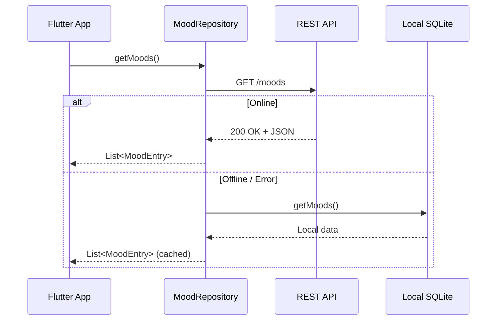
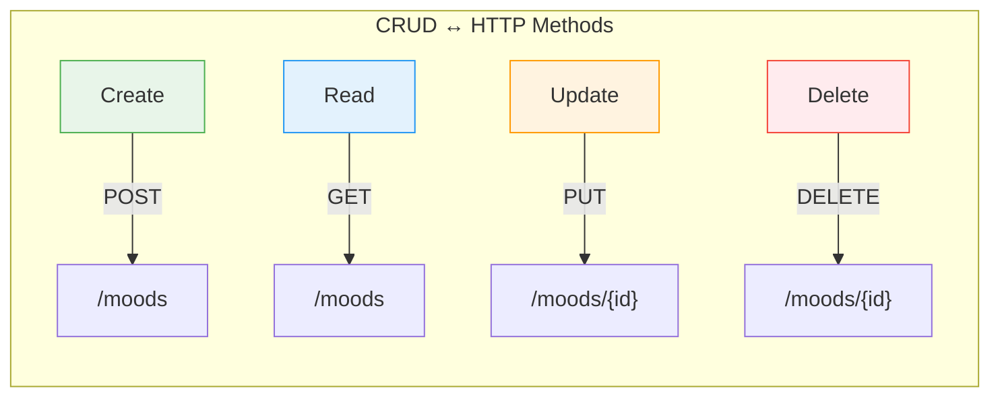
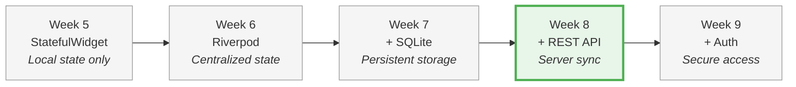

# Week 8 Lab: Networking & API Integration

<div class="lab-meta" markdown>
| | |
|---|---|
| **Course** | Mobile Apps for Healthcare |
| **Duration** | ~2 hours |
| **Prerequisites** | Week 7 Local Data (working Mood Tracker with SQLite persistence) |
</div>

<div class="grid cards" markdown>

- :material-target:{ .lg .middle } **Learning Objectives**

    ---

    - Connect your app to a ==REST API== with proper JSON serialization
    - Implement an ==offline-first strategy== with local fallback
    - Handle network errors gracefully with user-facing feedback
    - Authenticate API requests using ==Bearer tokens==

- :material-clock-outline:{ .lg .middle } **Time Estimate**

    ---

    | Section | Duration |
    |---------|----------|
    | Part 1: API server setup | ~15 min |
    | Part 2: JSON serialization | ~15 min |
    | Part 3: API client (GET/POST) | ~25 min |
    | Part 4: Mood API service | ~20 min |
    | Part 5: Error handling | ~15 min |
    | Part 6: Online/offline strategy | ~20 min |
    | Part 7: Self-check & reflection | ~10 min |

</div>

!!! abstract "What you already know"
    **From Week 7:** Your mood entries persist in SQLite — the app works offline and data survives restarts. **The limitation:** Data is ==trapped on one device==. A user who logs moods on their phone can't see them on their tablet. **This week's upgrade:** Connect to a REST API so data lives on a server, with your SQLite database as an offline fallback. The repository pattern from Week 7 makes this almost seamless.

!!! example "Think of it like... DoorDash"
    A REST API is like **DoorDash** — your app (you) sends an order (HTTP request) to the server (restaurant). GET = "what's on the menu?", POST = "I'll have this", DELETE = "cancel my order". The status code is the delivery notification.

---

## Prerequisites

Before you begin, make sure you have the following ready:

- **Flutter SDK** installed and on your PATH. Verify by running:
  ```bash
  flutter doctor
  ```
  All checks should pass (or show only minor warnings unrelated to your target platform).
- **An IDE** with Flutter support (VS Code recommended, or Android Studio).
- **A running device** -- emulator, simulator, or physical device.
- **The mood-tracker-api server running locally.** See the "API Server Setup" section below, then verify:
  ```bash
  curl http://localhost:8000/health
  ```
  You should receive a JSON response like `{"status": "healthy"}`.
- **The starter project** loaded in your IDE. Download it from the course materials:
  ```
  week-08-networking-api/lab/starter/mood_tracker/
  ```
  Copy the entire `mood_tracker` folder to your local machine, open it in your IDE, and run:
  ```bash
  cd mood_tracker
  flutter pub get
  flutter run
  ```
  Verify the app builds and launches before starting the exercises.

!!! tip "Pro tip"
    If the starter project does not compile, check that `http` appears in `pubspec.yaml` and that `flutter pub get` completed without errors. Also make sure the API server is running on `localhost:8000`. Ask the instructor for help if needed.

---

## About the Starter Project

You are continuing to develop the **Mood Tracker** app from Weeks 6--7. The starter project is the completed Week 7 app (with SQLite persistence) plus several new stub files and TODOs. It already provides:

- A `MoodEntry` model with `id`, `score`, `note`, and `createdAt` fields
- SQLite persistence via `DatabaseHelper` (fully working from Week 7)
- Riverpod state management from Week 6
- Four screens: Home, Add Mood, Mood Detail, and Statistics

Your job in this lab is to connect the app to a remote REST API by completing ==7 TODOs across 4 files==. The local SQLite database remains as an offline fallback.

### Project structure

| File | Purpose |
|------|---------|
| `lib/config.dart` | API base URL + temporary auth token (provided) |
| `lib/models/mood_entry.dart` | TODO 1: JSON serialization (toJson/fromJson) |
| `lib/services/api_client.dart` | TODOs 2--3, 6: HTTP client with error handling |
| `lib/services/mood_api_service.dart` | TODOs 4--5: Mood endpoint calls |
| `lib/data/mood_repository.dart` | TODO 7: API + offline fallback |
| `lib/data/database_helper.dart` | SQLite from Week 7 (no changes needed) |
| `lib/providers/` | State management — will need updates (see Part 6) |
| `lib/screens/` | UI screens (no changes needed) |

---

> **Healthcare Context: Why Networking Matters in mHealth**
>
> In real mobile health applications, networking is what turns a local tool into a ==clinical-grade system==. Consider:
>
> - **Remote patient monitoring** requires that health data collected on a phone or wearable is synced to a server where clinicians can review it in real time.
> - **Clinical trial data** must be collected on participant devices and transmitted reliably to central databases for analysis. Missing data points can compromise an entire study.
> - **Network failures are common on mobile** -- patients may be in areas with poor connectivity, in hospital basements, or on airplanes. An offline fallback is not a nice-to-have, it is ==essential for data integrity==.
> - **Server-side storage** enables research analysis, clinical dashboards, and cross-device access -- capabilities that a local-only app cannot provide.
>
> The patterns you learn today -- HTTP communication, JSON serialization, and online/offline strategies -- are the same patterns used in production mHealth systems and FDA-regulated apps.
>
> For a deeper look at the regulatory landscape, see the [mHealth Regulations Overview](../../resources/MHEALTH_REGULATIONS.md) in the course resources.

---

## API Server Setup

!!! abstract "TL;DR"
    Start the FastAPI server locally, register a test user with `curl`, get a ==Bearer token==, and paste it into `lib/config.dart`. Two terminals needed: one for the server, one for Flutter.

The Mood Tracker API is a FastAPI (Python) backend that you will connect your Flutter app to. Follow these steps to get it running on your local machine.

!!! info "Two terminals needed"
    From this point on, you will need **two terminal windows** open simultaneously: one running the API server and one for your Flutter app (or for `curl` testing). The server must stay running while you work.

### Clone or copy the API server

The API server code is provided in the course materials at `mood-tracker-api/`. Copy it to a convenient location on your machine.

### Set up the Python virtual environment

=== "macOS / Linux"

    ```bash
    cd mood-tracker-api
    python3 -m venv venv
    source venv/bin/activate
    ```

=== "Windows (Git Bash)"

    ```bash
    cd mood-tracker-api
    python -m venv venv
    source venv/Scripts/activate
    ```

### Install dependencies and start the server

```bash
pip install -r requirements.txt
uvicorn app.main:app --reload
```

> **Note:** The command is `uvicorn app.main:app` (not `uvicorn main:app` like in Week 2). This is because the API server uses a package structure with `app/main.py` instead of a single `main.py` file.

You should see:

```
INFO:     Uvicorn running on http://127.0.0.1:8000 (Press CTRL+C to quit)
```

### Verify the server is running

Open a **second terminal** and run:

```bash
curl http://localhost:8000/health
```

You should receive `{"status":"healthy"}`. If so, the API is ready. Leave the server terminal running.

Press ++ctrl+c++ to stop the mock server.

!!! tip "Connecting from different devices"
    - **iOS Simulator / desktop:** use `http://127.0.0.1:8000`
    - **Android Emulator:** use `http://10.0.2.2:8000` (this is how the emulator accesses your machine's localhost)
    - **Physical device:** use your computer's LAN IP (e.g., `http://192.168.1.42:8000`) and start the server with `--host 0.0.0.0`

---

## Part 1: Connecting to the API Server (~15 min)

!!! abstract "TL;DR"
    Register a test user via `curl`, login to get a ==JWT token==, and paste it into `config.dart`. This hardcoded token is temporary — Week 9 replaces it with proper authentication.

!!! tip "Remember from Week 2?"
    You used `curl -X POST` to send data to a REST API. Today you'll do the same thing from Dart using the `http` package — the ==HTTP verbs== (GET, POST, DELETE) and headers are identical.

This part is a warm-up exercise that does not involve any TODOs. You will register a test user on the API server and obtain an authentication token. This connects back to the `curl` skills you practiced in Week 2.

### 1.1 Why a hardcoded token?

The `mood-tracker-api` requires a ==Bearer token== for all authenticated endpoints. Proper authentication (login flows, token refresh, secure storage) is a significant topic that you will cover in **Week 9**. For now, you will use a temporary hardcoded token so you can focus on networking fundamentals without the complexity of auth.

### 1.2 Register a test user

Open a terminal and register a test user on the API:

=== "macOS / Linux / Git Bash"

    ```bash
    # Register a test user
    curl -X POST http://localhost:8000/auth/register \
      -H "Content-Type: application/json" \
      -d '{"email": "student@test.com", "username": "student", "password": "test123"}'
    ```

=== "Windows (PowerShell)"

    ```powershell
    # Register a test user
    curl -X POST http://localhost:8000/auth/register `
      -H "Content-Type: application/json" `
      -d '{"email": "student@test.com", "username": "student", "password": "test123"}'
    ```

You should receive a JSON response confirming the user was created. If you get an error that the email already exists, that is fine -- proceed to the next step.

### 1.3 Login and get a token

=== "macOS / Linux / Git Bash"

    ```bash
    # Login and get token
    curl -X POST http://localhost:8000/auth/login \
      -H "Content-Type: application/x-www-form-urlencoded" \
      -d "username=student@test.com&password=test123"
    ```

=== "Windows (PowerShell)"

    ```powershell
    # Login and get token
    curl -X POST http://localhost:8000/auth/login `
      -H "Content-Type: application/x-www-form-urlencoded" `
      -d "username=student@test.com&password=test123"
    ```

The response will contain an `access_token` field. Copy the token value (the long string, without the quotes).

### 1.4 Paste the token into config.dart

Open `lib/config.dart`. You will see a placeholder for `tempAuthToken`. Replace the placeholder string with the token you just copied:

```dart
const String tempAuthToken = 'paste-your-token-here';
```

Verify that `apiBaseUrl` is set to `http://localhost:8000` (or whatever address your API server is running on). The file should look like this:

```dart
// lib/config.dart
const String apiBaseUrl = 'http://localhost:8000';  // or http://10.0.2.2:8000 for Android emulator
const String tempAuthToken = 'paste-your-token-here';
```

> **Important:** This hardcoded token approach is ==temporary and insecure==. Never ship an app with hardcoded credentials. In Week 9 you will replace this with proper JWT authentication -- login screen, secure token storage, and automatic refresh.

~~Hardcoding tokens is fine for production~~ — never. Hardcoded tokens in source code end up in git history, APK decompilation, and crash logs. This is a lab shortcut only. Week 9 replaces it with ==secure token storage==.

---

### Self-Check: Part 1

- [ ] You can reach the API server with `curl http://localhost:8000/health`.
- [ ] You have registered a test user and obtained an access token.
- [ ] The token is pasted into `lib/config.dart`.
- [ ] You understand why the token is hardcoded for now and that this will be replaced in Week 9.

!!! success "Checkpoint: Part 1 complete"
    Your API server is running, you have a valid auth token, and `config.dart` is configured. The Flutter app can now authenticate with the server.

---

## Part 2: JSON Serialization (~15 min)

!!! abstract "TL;DR"
    ==`toJson()` converts Dart → JSON map==, `fromJson()` converts JSON map → Dart. Same pattern as Week 7's `toMap()`/`fromMap()`, different target.

!!! note "From `toMap()` to `toJson()` — same pattern, different target"
    In Week 7 you implemented `toMap()` and `fromMap()` to convert Dart objects to/from `Map<String, dynamic>` for SQLite. This week you will implement `toJson()` and `fromJson()` — the ==exact same pattern==, but serializing for JSON (API communication) instead of SQLite column maps. If you understood `toMap()`/`fromMap()`, you already know how `toJson()`/`fromJson()` works.

Before your app can send and receive data over the network, your model class needs to know how to convert itself to and from JSON.

### 2.1 TODO 1: Implement toJson() and fromJson()

Open `lib/models/mood_entry.dart`. Find the `TODO 1` comment block.

You need to implement two methods:

1. **`Map<String, dynamic> toJson()`** -- Converts a `MoodEntry` instance into a JSON-compatible map.
2. **`factory MoodEntry.fromJson(Map<String, dynamic> json)`** -- Creates a `MoodEntry` from a JSON map received from the API.

??? tip "Solution"

    ```dart
    Map<String, dynamic> toJson() { // (1)!
      return {
        'id': id,
        'score': score,
        'note': note,
        'created_at': createdAt.toIso8601String(), // (2)!
      };
    }
    ```

    1. Converts this Dart `MoodEntry` object into a `Map<String, dynamic>` — the format required for JSON serialization before sending data to the API.
    2. `DateTime` objects cannot be directly represented in JSON. `toIso8601String()` converts the date to a standardized string format (e.g., `"2026-02-26T14:30:00.000"`) that the API expects.

    ```dart
    factory MoodEntry.fromJson(Map<String, dynamic> json) { // (1)!
      return MoodEntry(
        id: json['id'] as String,
        score: json['score'] as int,
        note: json['note'] as String?,
        createdAt: DateTime.parse(json['created_at'] as String), // (2)!
      );
    }
    ```

    1. A factory constructor that parses a JSON map (from the API response) into a strongly-typed `MoodEntry` Dart object. This is the inverse of `toJson()`.
    2. The API returns dates as ISO 8601 strings (e.g., `"2026-02-26T14:30:00Z"`). `DateTime.parse()` converts that string back into a Dart `DateTime` object so you can work with it programmatically.

    **Key insight:** The field names in JSON (`created_at` with an underscore) may differ from the Dart property names (`createdAt` in camelCase). This is common when the API uses a different naming convention. The `toJson()` and `fromJson()` methods handle this translation.

??? warning "Common mistake: JSON field name mismatch"
    ```dart
    // WRONG — Dart field name doesn't match API field name
    'createdAt': createdAt.toIso8601String(),

    // CORRECT — use the API's snake_case convention
    'created_at': createdAt.toIso8601String(),
    ```
    REST APIs typically use ==`snake_case`== for JSON keys, while Dart uses `camelCase`. Your `toJson()` must output the API's expected keys, and `fromJson()` must read them. A single typo here causes silent data loss — the field is simply `null`.

~~You need a code generation library for JSON serialization~~ — for small models (< 10 fields), hand-written `toJson()`/`fromJson()` is simpler and easier to debug. Libraries like `json_serializable` and `freezed` pay off when you have dozens of models, not 2-3.

---

### Self-Check: Part 2

- [ ] `toJson()` returns a `Map<String, dynamic>` with keys matching the API contract.
- [ ] `fromJson()` is a factory constructor that parses each field from the JSON map.
- [ ] You handle the `created_at` / `createdAt` naming difference correctly.
- [ ] `DateTime` is serialized as an ISO 8601 string and parsed back with `DateTime.parse()`.

??? question "Scenario: toJson vs toMap"
    What's the difference between `toJson()` (Week 8) and `toMap()` (Week 7)?

    ??? success "Answer"
        Functionally, they're almost identical — both convert a Dart object to `Map<String, dynamic>`. The difference is the ==target==: `toMap()` produces keys matching SQLite column names, while `toJson()` produces keys matching API field names. In many apps, these are the same and you can use a single method.

!!! success "Checkpoint: Part 2 complete"
    Your `MoodEntry` can now serialize to/from JSON for API communication. Combined with Week 7's `toMap()`/`fromMap()`, your model speaks both ==SQLite and REST==.

---

### API Request Lifecycle

The following diagram shows how data flows through the app when fetching mood entries. The repository tries the API first and falls back to the local database if the network is unavailable.



### CRUD and HTTP Methods

Before building the API client, review how standard CRUD operations map to HTTP methods in a REST API:



---

## Part 3: Building the API Client (~25 min)

!!! abstract "TL;DR"
    Build a ==reusable API client== — a single class that constructs URLs, attaches `Authorization` and `Content-Type` headers, makes HTTP calls, and checks status codes. GET retrieves data, POST sends data.

The API client is a reusable class that handles the low-level details of making HTTP requests -- constructing URLs, attaching headers, and checking response status codes.

### 3.1 TODO 2: Implement the GET method

Open `lib/services/api_client.dart`. Find the `TODO 2` comment block.

Implement the `get(String endpoint)` method:

1. **Construct the full URL** by combining `apiBaseUrl` from `config.dart` with the endpoint.
2. **Add headers** including the authorization token.
3. **Make the HTTP call** using `http.get()`.
4. **Check the status code** and return the response body.

??? tip "Solution"

    ```dart
    final url = Uri.parse('$baseUrl$endpoint'); // (1)!

    final headers = {
      'Content-Type': 'application/json',
      'Authorization': 'Bearer $token', // (2)!
    };

    final response = await http.get(url, headers: headers);

    if (response.statusCode == 200) {
      return response.body; // (3)!
    } else {
      throw Exception('GET $endpoint failed: ${response.statusCode}');
    }
    ```

    1. `baseUrl` holds the API server address (e.g., `http://localhost:8000`). All endpoints are relative paths appended to this base, so `/moods` becomes `http://localhost:8000/moods`.
    2. The ==Bearer token authentication== pattern: the word `Bearer` followed by a space and the token string. The server extracts this token to identify which user is making the request.
    3. `response.body` is the raw HTTP response as a `String`. Callers will use `jsonDecode(response.body)` to parse this string into a Dart `Map` or `List` for further processing.

!!! warning "Common mistake"
    Always check the ==HTTP status code== before parsing the response body.
    A `404` or `500` response still has a body — but it's an error message,
    not your data. Parsing it as valid JSON will crash or corrupt your app.

### 3.2 TODO 3: Implement the POST method

Find the `TODO 3` comment block in the same file.

Implement the `post(String endpoint, Map<String, dynamic> body)` method:

1. **Construct the URL and headers** (same as GET).
2. **Make the HTTP call** using `http.post()` with `jsonEncode(body)`.
3. **Check the status code** (typically 200 or 201 for successful creation) and return the response body.

??? tip "Solution"

    ```dart
    final url = Uri.parse('$baseUrl$endpoint');

    final headers = {
      'Content-Type': 'application/json', // (1)!
      'Authorization': 'Bearer $token',
    };

    final response = await http.post(
      url,
      headers: headers,
      body: jsonEncode(body), // (2)!
    );

    if (response.statusCode == 200 || response.statusCode == 201) {
      return response.body;
    } else {
      throw Exception('POST $endpoint failed: ${response.statusCode}');
    }
    ```

    1. The `Content-Type: application/json` header tells the server that the request body is formatted as JSON. Without this header, the server may reject the request or try to parse the body as a different format (e.g., form data).
    2. `jsonEncode(body)` converts the Dart `Map<String, dynamic>` into a JSON string (e.g., `{"score": 4, "note": "Feeling good"}`) that can be transmitted over HTTP as the request body.

    ==Always set Content-Type to application/json when sending JSON request bodies.==

??? warning "Common mistake: Forgetting Content-Type header"
    ```dart
    // WRONG — server doesn't know the body is JSON
    final response = await http.post(url, body: jsonEncode(data));

    // CORRECT — tell the server what you're sending
    final response = await http.post(
      url,
      headers: {'Content-Type': 'application/json'},
      body: jsonEncode(data),
    );
    ```
    Without `Content-Type: application/json`, many servers treat the body as plain text or form data and return a ==400 Bad Request or 422 Unprocessable Entity== error. Always set this header for JSON requests.

---

### Self-Check: Part 3

- [ ] The `get()` method constructs a full URL, attaches headers, and returns the response body.
- [ ] The `post()` method encodes the body as JSON using `jsonEncode()`.
- [ ] Both methods check the response status code and throw exceptions for non-success codes.
- [ ] Both methods include `Content-Type` and `Authorization` headers.

!!! success "Checkpoint: Part 3 complete"
    Your API client can send ==GET and POST requests== with proper headers
    and authentication. This reusable client handles all the HTTP
    plumbing so your service layer stays clean.

??? protip "Pro tip: Testable HTTP clients"
    The `http` package's `Client` class can be ==mocked in tests==, unlike
    top-level `get()` and `post()` functions. Inject a `Client` instance
    into your API client's constructor for easy unit testing.

---

## Part 4: Implementing the Mood API Service (~20 min)

!!! abstract "TL;DR"
    The API service translates between ==HTTP responses and Dart objects==. It calls the API client for raw HTTP, then uses `fromJson()` to parse responses into `MoodEntry` objects.

The API service sits between the API client and the rest of the app. It knows the specific endpoints and how to translate between JSON and domain objects.

### 4.1 TODO 4: Implement getMoods()

Open `lib/services/mood_api_service.dart`. Find the `TODO 4` comment block.

Implement the `getMoods()` method that fetches all mood entries from the server:

1. **Call the API client** to GET the `/moods` endpoint.
2. **Decode the JSON** response into a list.
3. **Map each JSON object** to a `MoodEntry` using your `fromJson()` factory.

??? tip "Solution"

    ```dart
    final responseBody = await apiClient.get('/moods');
    final List<dynamic> jsonList = jsonDecode(responseBody);
    return jsonList.map((json) => MoodEntry.fromJson(json)).toList();
    ```

### 4.2 TODO 5: Implement createMood() and deleteMood()

Find the `TODO 5` comment block in the same file.

1. **`createMood(int score, String? note)`** -- POST to `/moods`.
2. **`deleteMood(String id)`** -- DELETE `/moods/{id}`. This follows the same pattern as GET but uses the `delete()` method on the API client.

??? tip "Solution"

    ```dart
    // createMood
    final responseBody = await apiClient.post('/moods', {
      'score': score,
      'note': note,
    });
    return MoodEntry.fromJson(jsonDecode(responseBody));
    ```

    ```dart
    // deleteMood
    await apiClient.delete('/moods/$id'); // (1)!
    ```

    1. RESTful URL pattern: `/moods/{id}` targets a ==specific resource== by its unique identifier. `GET /moods` returns all moods, but `DELETE /moods/abc-123` deletes only the mood with ID `abc-123`. This convention applies to all single-resource operations (GET one, PUT/update, DELETE).

    **Note:** The `delete()` method on the API client is provided for you. You only need to call it with the correct endpoint path.

!!! note "Additional HTTP methods"
    The `ApiClient` class also includes pre-built `put()` and `delete()` methods that follow the same pattern as `get()` and `post()`. You will use `delete()` in TODO 5. The `put()` method is available for update operations — you will use it in Week 9 or your team project.

~~Every API call needs its own HTTP client~~ — the `ApiClient` class handles all HTTP methods with shared headers and error handling. The service layer only needs to know ==which endpoint to call and what shape the data takes==.

---

### Self-Check: Part 4

- [ ] `getMoods()` fetches JSON from `/moods`, decodes it, and returns a `List<MoodEntry>`.
- [ ] `createMood()` POSTs to `/moods` with score and note, and returns the created `MoodEntry`.
- [ ] `deleteMood()` sends a DELETE request to `/moods/{id}`.
- [ ] You understand the flow: API client handles HTTP, API service handles domain logic.

!!! success "Checkpoint: Part 4 complete"
    Your API service translates between HTTP and Dart objects. The ==separation of concerns== is clean: API client handles raw HTTP, API service handles domain-specific endpoints, and the repository (next part) handles the online/offline decision.

---

## Part 5: Network Error Handling (~15 min)

!!! abstract "TL;DR"
    Wrap HTTP calls in `try-catch`. Catch ==`SocketException`== for no-network situations specifically — it triggers the offline fallback. Catch general exceptions for everything else.

Network requests can fail for many reasons -- the server could be down, the user could lose connectivity, or the request could time out. Robust error handling is essential, especially in healthcare apps where ==silent data loss is unacceptable==.

~~If the API is down, the app should crash~~ — in healthcare, "server unreachable" is Tuesday. Your app must degrade gracefully with cached local data.

~~Network errors are rare and can be ignored~~ — on mobile, network errors are the norm, not the exception. Patients use apps in elevators, subways, rural clinics, and airplanes. Your error handling code runs ==more often than you think==.

### 5.1 TODO 6: Add error handling to the API client

Open `lib/services/api_client.dart`. Find the `TODO 6` comment block.

Wrap the HTTP calls in your `get()` and `post()` methods with try-catch blocks. You need to handle:

1. **`SocketException`** -- Thrown when there is no network connection (e.g., airplane mode, server unreachable). Import it from `dart:io`.
2. **General exceptions** -- Any other unexpected error during the HTTP call.
3. **Non-success status codes** -- Already handled by your status code check, but make sure it is inside the try block.

Apply the same pattern to the `post()` method.

??? tip "Solution"

    ```dart
    try {
      final response = await http.get(url, headers: headers);
      if (response.statusCode == 200) {
        return response.body;
      } else {
        throw Exception('GET $endpoint failed: ${response.statusCode}');
      }
    } on SocketException {
      throw Exception('No internet connection. Please check your network.');
    } catch (e) {
      throw Exception('Network error: $e');
    }
    ```

    **Healthcare consideration:** In a production mHealth app, you would also implement retry logic, request timeouts, and detailed error logging. For a clinical trial app, you might ==queue failed requests== and retry them when connectivity is restored to ensure no data is lost.

---

### Self-Check: Part 5

- [ ] Both `get()` and `post()` methods are wrapped in try-catch blocks.
- [ ] `SocketException` is caught separately with a user-friendly message.
- [ ] `dart:io` is imported for `SocketException`.
- [ ] You understand why different error types need different handling.

!!! success "Checkpoint: Part 5 complete"
    Your API client now handles network failures gracefully. ==`SocketException`== triggers the offline fallback path, while other errors surface meaningful messages for debugging.

??? challenge "Stretch Goal: Add retry logic"
    Add a retry mechanism to your API client: if a request fails with a 5xx error, wait 2 seconds and try once more before falling back to SQLite.

    *Hint:* Use `Future.delayed(Duration(seconds: 2))` before the retry attempt.

---

!!! example "Real-world mHealth: Telemedicine API patterns"
    Telehealth apps like Teladoc and Amwell use this exact architecture. A patient records blood pressure readings on their phone, which syncs to the server via REST API. The physician's dashboard polls the same API to display trends. Critical design decisions mirror this lab: **What happens when the patient's phone is offline during a reading?** (offline fallback to local storage) **What if the server is down during sync?** (retry queue with exponential backoff) **How are readings authenticated?** (Bearer tokens — Week 9). Your `MoodRepository` with online-first fallback is the ==foundation of every clinical data sync system==.

## Part 6: Online/Offline Strategy (~20 min)

!!! abstract "TL;DR"
    ==Online-first with local fallback:== try the server, if it fails, use SQLite. Best of both worlds. The repository pattern from Week 7 makes this a clean `try/catch` swap.

=== "Before: Local-Only Repository (Week 7)"

    ```dart
    class MoodRepository {
      final DatabaseHelper _db;

      Future<List<MoodEntry>> getAllMoods() async {
        return await _db.getMoods();  // SQLite only
      }

      Future<void> addMood(MoodEntry entry) async {
        await _db.insertMood(entry);  // Local only
      }
    }
    ```

=== "After: Online-First with Fallback (Week 8)"

    ```dart
    class MoodRepository {
      final ApiClient _api;
      final DatabaseHelper _db;

      Future<List<MoodEntry>> getAllMoods() async {
        try {
          final moods = await _api.getMoods();  // Try server
          await _db.cacheAll(moods);            // Update cache
          return moods;
        } catch (e) {
          return await _db.getMoods();           // Fallback
        }
      }
    }
    ```

This is where everything comes together. The mood repository will try the API first and fall back to the local SQLite database if the network is unavailable.

==Online-first strategy: try the network first, fall back to local data on failure.==

### 6.1 TODO 7: Update the mood repository

Open `lib/data/mood_repository.dart`. Find the `TODO 7` comment block.

Update the repository methods to follow this pattern:

1. **Try the API first.**
2. **If the API call succeeds**, optionally sync the data to the local database.
3. **If the API call fails** (e.g., network error), fall back to the local SQLite database.

Implement `getMoods()`, `addMood(int score, String? note)`, and `deleteMood()`. Apply the same try-API-then-fallback pattern to all three methods.

> **Note:** In Week 7, the repository's `addMood()` took a `MoodEntry` object. This week, it changes to take `score` and `note` separately and ==returns the created `MoodEntry`==. This is because the API server assigns the `id` and `created_at` timestamp — we send only the user's input and get back the complete entry.

??? tip "Solution"

    For `getMoods()`:

    ```dart
    Future<List<MoodEntry>> getMoods() async {
      try { // (1)!
        // Try API first
        final moods = await moodApiService.getMoods();
        return moods;
      } catch (e) {
        // Fall back to local database
        print('API unavailable, using local data: $e');
        return await databaseHelper.getMoods(); // (2)!
      }
    }
    ```

    1. The `try/catch` implements the ==online-first strategy==: attempt the network call first, and only if it throws an exception (no connectivity, server error, timeout), execute the fallback path in `catch`.
    2. **Graceful degradation** in action: when the API is unreachable, the app seamlessly falls back to locally cached data from SQLite. The user may see slightly stale data, but the app remains fully functional instead of showing an error screen.

    For `addMood(int score, String? note)`:

    ```dart
    Future<MoodEntry> addMood(int score, String? note) async {
      try {
        // Try API first
        final entry = await moodApiService.createMood(score, note);
        // Also save locally for offline access
        await databaseHelper.insertMood(entry);
        return entry;
      } catch (e) {
        // Fall back to local-only
        print('API unavailable, saving locally: $e');
        final entry = MoodEntry(
          id: uuid.v4(),
          score: score,
          note: note,
          createdAt: DateTime.now(),
        );
        await databaseHelper.insertMood(entry);
        return entry;
      }
    }
    ```

    Apply the same pattern to `deleteMood()` -- try the API, then delete locally regardless.

    **Key insight:** This "try API, fall back to local" pattern is sometimes called an ==online-first strategy==. The API is the source of truth when available, but the app remains functional offline. In a production app, you would add synchronization logic to push locally-created entries to the server when connectivity returns.

??? warning "Common mistake: Swallowing errors silently"
    ```dart
    // WRONG — hiding the error completely
    try {
      return await _api.getMoods();
    } catch (e) {
      return await _db.getMoods();  // User has no idea they're offline
    }

    // BETTER — log the error and notify the user
    try {
      return await _api.getMoods();
    } catch (e) {
      debugPrint('API failed, using local data: $e');
      // Consider setting an "offline mode" flag in your state
      return await _db.getMoods();
    }
    ```
    Silently falling back to local data can confuse users — they might edit ==stale data== thinking it's current. In production, show a subtle "offline mode" indicator so users know they're seeing cached data.

!!! warning "Breaking change: MoodNotifier.addMood()"
    Your Week 6 `addMood(int score, String? note)` created a `MoodEntry` locally with a generated `id` and `DateTime.now()`. Now that the API assigns `id` and `created_at`, the method must change:

    1. Make `addMood` async: `Future<void> addMood(int score, String? note) async`
    2. Call the repository instead of creating locally: `final entry = await _repository.addMood(score, note);`
    3. Add the API-returned entry to state: `state = [...state, entry];`
    4. Update `AddMoodScreen._submitMood()` to `await` the notifier call

    The same applies to `deleteMood()` — it should call the repository and only remove from state on success.

??? question "Scenario: Error handling strategies"
    What are the trade-offs between online-first, offline-first, and online-only strategies?

    ??? success "Answer"
        - **Online-first** (this lab): Simple to implement, always has latest data when connected, degrades gracefully offline. Risk: stale local data.
        - **Offline-first**: Best UX — app always works instantly. Complex: requires sync logic and ==conflict resolution==.
        - **Online-only**: Simplest code, no sync issues. Worst UX: app is useless without internet.
        - **Healthcare consideration**: For critical patient data, offline-first is often required — a nurse can't wait for Wi-Fi to record vitals.

??? question "Scenario: The missing ID"
    A telehealth patient submits a symptom report. The POST succeeds (201) but the response JSON is missing the `id` field. What does your `fromJson()` do? What *should* it do?

    ??? success "Answer"
        If `fromJson()` accesses `json['id']` directly, it returns `null`, which may crash downstream code that expects a non-null `String`. It *should* either throw a descriptive `FormatException` ("Missing required field: id") or use a fallback like `json['id'] ?? const Uuid().v4()`. In healthcare apps, ==silent data corruption is worse than a visible error== — fail loudly so the bug gets fixed.

??? question "Scenario: Conflict resolution"
    A patient logs a mood entry while offline (saved to SQLite with a local UUID). Later, they go online and the app syncs the entry to the server, which assigns a *different* ID. Now the local and remote entries have different IDs for the same data. How do you handle this?

    ??? success "Answer"
        This is the classic ==sync conflict== problem. Common solutions: (1) Use the server's ID as the source of truth — after a successful POST, update the local SQLite entry's ID to match the server's response. (2) Add a `syncStatus` column to your local table (`pending`, `synced`, `conflict`) to track which entries need syncing. (3) Use UUIDs generated client-side and have the server accept them (this is what our app does). Production sync systems like CouchDB and Firebase use vector clocks or last-write-wins strategies.

---

### Self-Check: Part 6

- [ ] `getMoods()` tries the API first and falls back to `databaseHelper.getMoods()`.
- [ ] `addMood()` tries the API first, saves to local DB on success, and creates a local-only entry on failure.
- [ ] `deleteMood()` tries the API first and deletes locally regardless.
- [ ] You understand the trade-offs of the online-first strategy.

!!! success "Checkpoint: Part 6 complete"
    The ==online-first fallback strategy== is working — your app tries the
    API first and gracefully falls back to local SQLite when offline.
    Your users will never see a blank screen just because the network
    is down.

---

## Applying This to Your Team Project

Your team project will connect to a real API. Plan your integration:

- **Map your endpoints:** List every API endpoint your app needs (GET, POST, PUT, DELETE).
- **Offline strategy:** Will your app use online-first (like this lab), offline-first, or online-only? The choice depends on your use case.
- **Error handling:** What happens when the server is unreachable? What feedback does the user see?

!!! question "Discussion: API contract"
    Review your team's backend API documentation. For each endpoint, write the Dart method signature that will call it. Does your `MoodEntry`-equivalent model need `toJson()`/`fromJson()` methods?

## Part 7: Self-Check and Summary (~10 min)

### 7.1 End-to-end verification

Walk through this complete flow to verify everything works:

1. Make sure the API server is running (`curl http://localhost:8000/health`).
2. Launch the app. The home screen should load mood entries from the API (or local DB if the server was used previously).
3. Tap the **+** button. Set a score, type a note, and tap **Save Entry**.
4. Verify the new entry appears on the home screen.
5. Check the API server directly -- the entry should exist on the server:
   ```bash
   curl -H "Authorization: Bearer YOUR_TOKEN" http://localhost:8000/moods
   ```
6. Stop the API server (++ctrl+c++ in the server terminal).
7. Try adding another mood entry. It should succeed using the ==local SQLite fallback==.
8. Restart the API server. The app should resume using the API on the next request.

If all 8 steps work correctly, you have completed the lab.

### 7.2 Summary

| TODO | File | What you did |
|------|------|-------------|
| 1 | `models/mood_entry.dart` | Implemented `toJson()` and `factory MoodEntry.fromJson()` for API serialization |
| 2 | `services/api_client.dart` | Implemented `get()` -- construct URL, attach headers, call `http.get()`, check status |
| 3 | `services/api_client.dart` | Implemented `post()` -- `http.post()` with `jsonEncode(body)` and JSON headers |
| 4 | `services/mood_api_service.dart` | Implemented `getMoods()` -- GET `/moods`, decode JSON, map to `List<MoodEntry>` |
| 5 | `services/mood_api_service.dart` | Implemented `createMood()` (POST `/moods`) and `deleteMood()` (DELETE `/moods/{id}`) |
| 6 | `services/api_client.dart` | Added try-catch error handling with `SocketException` for network failures |
| 7 | `data/mood_repository.dart` | Updated methods to try API first with local SQLite as offline fallback |

### 7.3 Key concepts learned

| Concept | Key Takeaway |
|---------|--------------|
| HTTP methods | GET retrieves data, POST creates data, DELETE removes data — the standard CRUD verbs of REST APIs |
| JSON serialization | `toJson()` converts Dart objects to maps; `fromJson()` factory constructors parse maps back into objects |
| URI construction | Combine a base URL with an endpoint path using `Uri.parse()` to build request URLs |
| Headers | `Content-Type` tells the server the body format; `Authorization: Bearer` identifies the user |
| `http` package | Flutter's standard package for making HTTP requests -- `http.get()`, `http.post()`, `http.delete()` |
| Error handling | Catch `SocketException` for connectivity issues; check status codes for server errors |
| Online/offline strategy | Try the API first, fall back to local storage -- keeps the app functional without connectivity |
| Service layer | Separates HTTP mechanics (API client) from domain logic (API service) for cleaner architecture |
| Bearer tokens | A string sent in the Authorization header to prove the caller's identity (proper auth in Week 9) |

---

### Where You Are: Course Architecture Journey



## What Comes Next

In **Week 9**, you will replace the hardcoded token with proper ==JWT authentication==:

- A login screen where users enter their credentials.
- Secure token storage using `flutter_secure_storage`.
- Automatic token refresh when the access token expires.
- Protected routes that redirect unauthenticated users to the login screen.

The networking foundation you built today -- the API client, service layer, and error handling -- will remain at the core of the app throughout.

!!! info "Grading"
    For detailed sprint review rubrics and grading criteria, see the [Project Grading Guide](../../resources/PROJECT_GRADING.md).

---

## Troubleshooting

??? question "`SocketException: Connection refused` when the app tries to reach the API"
    The API server is not running or the URL is wrong. Check: (1) The server terminal shows `Uvicorn running on http://127.0.0.1:8000`. (2) `lib/config.dart` has the correct URL. (3) If using an **Android emulator**, the URL must be `http://10.0.2.2:8000` (not `localhost`). (4) If using a **physical device**, use your computer's LAN IP and start the server with `--host 0.0.0.0`.

??? question "API returns `401 Unauthorized`"
    Your auth token is missing or expired. Check `lib/config.dart` — the `tempAuthToken` must be a valid token obtained from the `/auth/login` endpoint. Tokens expire after ==30 minutes== by default. Get a new one by running the login curl command again.

??? question "`FormatException: Unexpected character` when decoding JSON"
    The API response is not valid JSON. Common causes: (1) The server returned an HTML error page instead of JSON. (2) The response body is empty. Add `print(response.body)` before `jsonDecode()` to see what the server actually returned.

??? question "Mood entries save to the server but don't appear in the app"
    Check that `getMoods()` in your API service correctly decodes the JSON list and maps each item to a `MoodEntry` using `fromJson()`. Also verify the API returns entries for your user (try `curl -H "Authorization: Bearer $TOKEN" http://localhost:8000/moods`).

??? question "The app works with the server but crashes when offline"
    Your repository's try-catch is not catching the right exceptions. Make sure the `catch` block in `getMoods()` catches ==all exceptions== (`catch (e)`), not just specific types. The fallback should call `databaseHelper.getMoods()`.

??? question "Android emulator can't reach `localhost`"
    Android emulators run in a VM that has its own network stack. `localhost` inside the emulator refers to the ==emulator itself==, not your computer. Use `http://10.0.2.2:8000` instead — this is the emulator's alias for the host machine's localhost. Update `lib/config.dart` accordingly.

---

## Quick Quiz

<quiz>
Which HTTP method is used to create a new resource on the server?

- [ ] GET
- [x] POST
- [ ] PUT
- [ ] DELETE
</quiz>

<quiz>
What does a 404 status code mean?

- [ ] The server crashed
- [ ] Authentication required
- [x] The requested resource was not found
- [ ] The request was successful
</quiz>

<quiz>
Why does the API client catch `SocketException` separately?

- [ ] It's a Dart requirement
- [ ] SocketException means the data is corrupted
- [x] It specifically indicates no network connectivity, triggering the offline fallback
- [ ] It's needed for JSON parsing
</quiz>

<quiz>
What is the "online-first" pattern?

- [ ] The app only works with internet
- [ ] The app ignores the local database
- [x] Try the server first; if it fails, fall back to the local database
- [ ] Cache everything locally and never use the server
</quiz>

<quiz>
Which header authenticates API requests with a token?

- [ ] `Content-Type: application/json`
- [x] `Authorization: Bearer <token>`
- [ ] `Accept: application/json`
- [ ] `X-API-Key: <token>`
</quiz>

<quiz>
What does `jsonEncode()` do?

- [ ] Parses a JSON string into a Dart Map
- [x] Converts a Dart Map into a JSON string for HTTP transmission
- [ ] Validates that a string contains valid JSON
- [ ] Encrypts data for secure transmission
</quiz>

<quiz>
A POST request returns status code 201. What does this mean?

- [ ] The request failed
- [ ] The resource was not found
- [x] The resource was successfully created
- [ ] The server requires authentication
</quiz>

---

!!! question "End-of-Lab Reflection"
    Take 2 minutes to reflect on today's work:

    1. **What was the hardest concept today?** (JSON serialization? HTTP methods? Error handling? Offline fallback?)
    2. **What would happen if your team app had no offline fallback?** Think about your users' context — hospital Wi-Fi, rural areas, airplane mode.
    3. **For your team project:** List 3 API endpoints your app will need (method + path + purpose).

    Write your answers in your lab notebook or discuss with your neighbor.

---

## Further Reading

- [http package on pub.dev](https://pub.dev/packages/http)
- [Flutter networking cookbook](https://docs.flutter.dev/cookbook/networking)
- [REST API design best practices](https://restfulapi.net/)
- [JSON serialization in Dart](https://docs.flutter.dev/data-and-backend/serialization/json)
- [HTTP status codes reference](https://developer.mozilla.org/en-US/docs/Web/HTTP/Status)
