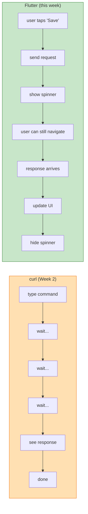
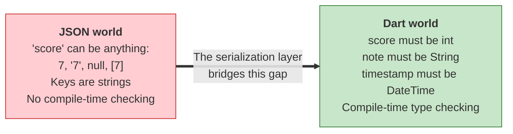
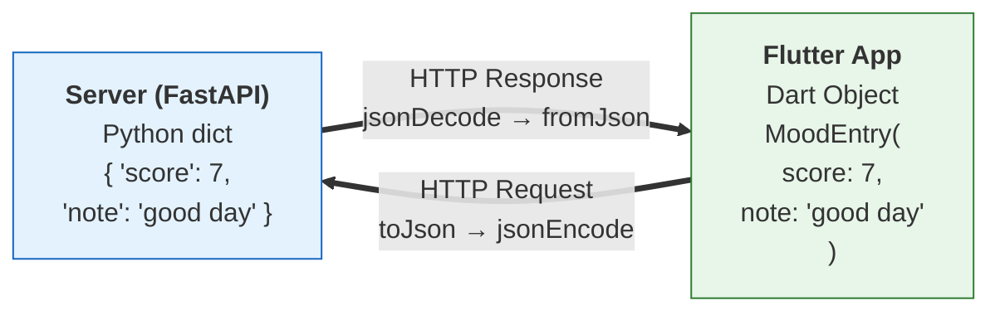
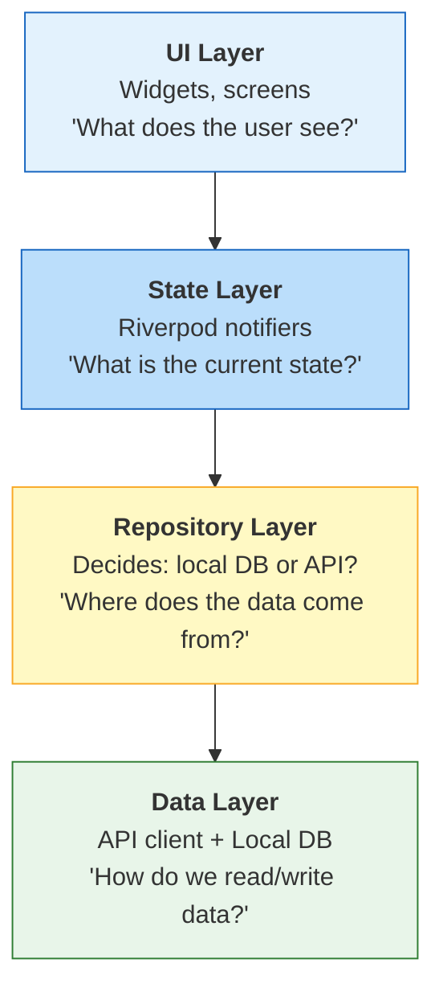
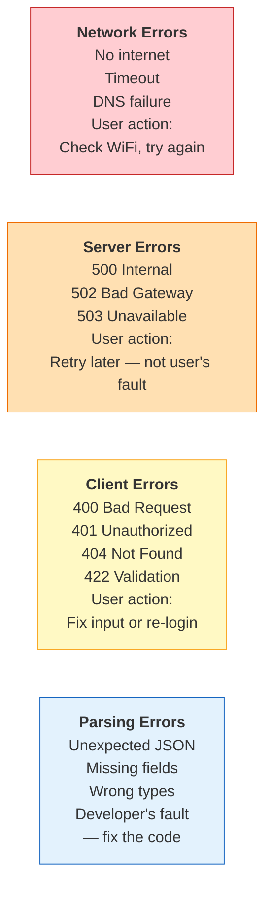
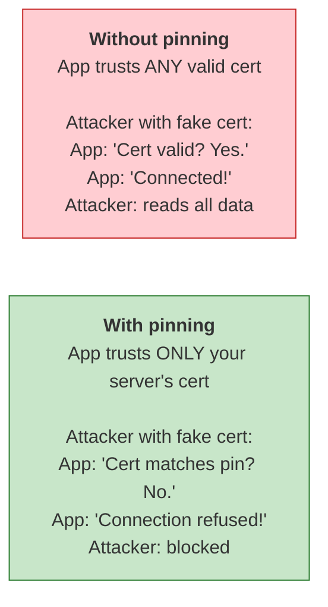

# Week 8 Lecture: HTTP in Flutter, JSON Serialization & GDPR

**Course:** Multiplatform Mobile Software Engineering in Practice
**Duration:** ~2 hours (including Q&A)

---

## Table of Contents

1. [HTTP in Mobile Apps -- Different from curl](#1-http-in-mobile-apps-different-from-curl-15-min) (15 min)
2. [JSON Serialization in Dart](#2-json-serialization-in-dart-20-min) (20 min)
3. [API Client Architecture](#3-api-client-architecture-15-min) (15 min)
4. [Error Handling and Resilience](#4-error-handling-and-resilience-15-min) (15 min)
5. [GDPR and Health Data Privacy](#5-gdpr-and-health-data-privacy-20-min) (20 min)
6. [Data Transmission Security](#6-data-transmission-security-10-min) (10 min)
7. [Key Takeaways](#7-key-takeaways-5-min) (5 min)

---

## 1. HTTP in Mobile Apps -- Different from curl (15 min)

### From curl to Flutter

In Week 2, you tested your API with curl. That was a synchronous, linear experience -- you typed a command, waited for the response, and the terminal printed the result. You could not do anything else while you waited, and you did not care, because the terminal is a single-purpose tool.

A mobile app is completely different.

When a user taps a button to submit their mood entry, the app needs to send data to the server. But the network request might take 200 milliseconds or 30 seconds, depending on connection quality. If the app freezes for 30 seconds while waiting for a response, the user will think it has crashed. On Android, the system will literally offer to kill the app.

This is why HTTP in mobile apps must be **asynchronous**. The app sends the request, continues running (showing a loading indicator, accepting other taps), and handles the response when it eventually arrives.



### Dart's async/await

Dart makes asynchronous programming readable with `async` and `await`. If you have used Python's `asyncio` or JavaScript's `async/await`, this will look familiar:

```dart
// This does NOT block the UI
Future<List<MoodEntry>> fetchMoods() async {
  final response = await http.get(Uri.parse('$baseUrl/moods'));
  // Code after await runs when the response arrives
  final List<dynamic> data = jsonDecode(response.body);
  return data.map((json) => MoodEntry.fromJson(json)).toList();
}
```

The `await` keyword tells Dart: "Pause this function, go do other things (like rendering the UI), and come back when the response is ready." The rest of the app keeps running.

### Flutter HTTP Packages

Flutter offers two main HTTP packages:

**The `http` package** -- straightforward and minimal:
- Simple GET, POST, PUT, DELETE requests
- Sufficient for most course projects
- You write the error handling yourself

**The `dio` package** -- batteries included:
- Interceptors (add auth headers to every request automatically)
- Retry logic (retry failed requests with exponential backoff)
- Request cancellation (cancel pending requests when the user navigates away)
- File upload/download with progress tracking
- Form data handling

For this course, the `http` package is sufficient. If your project grows in complexity, `dio` is a natural upgrade path. The concepts are the same -- only the API surface differs.

### Mobile-Specific Challenges

When you tested with curl in Week 2, you were on a reliable wired or Wi-Fi connection. Mobile apps face a much harsher environment:

- **Slow or unreliable connections:** A user on the subway might have 50kbps bandwidth with 2-second latency
- **Connection drops mid-request:** The user walks into an elevator, and the POST request to save their mood entry never reaches the server
- **App goes to background:** The user switches to another app while a request is in flight -- does it complete? Does the callback fire?
- **Battery impact:** Every network call wakes up the radio, which is one of the most power-hungry components on a phone
- **Data costs:** Users on metered connections in some countries pay per megabyte -- sending unnecessary data is literally costing them money

None of these problems exist when you run `curl` on your laptop. All of them exist when your app runs on a phone in someone's pocket.

### Healthcare Connection

A telemedicine app that freezes while uploading patient data is not just annoying -- it could delay critical care. A nurse entering vitals at a patient's bedside should not have to wait for a spinner while the server responds. The app should accept the data immediately, store it locally, and sync when possible. Network resilience in healthcare is a **patient safety concern**, not just a user experience preference.

---

## 2. JSON Serialization in Dart (20 min)

### The Type Gap

JSON is the standard data format for API communication. Your FastAPI backend from Week 2 sends and receives JSON. Your Flutter app needs to convert between JSON and Dart objects. This sounds simple, but it is a surprisingly rich source of bugs.

The core problem: **JSON is untyped, and Dart is typed.**

When you call `jsonDecode(response.body)`, you get a `Map<String, dynamic>`. That `dynamic` means "anything" -- an int, a String, a null, a nested Map. Dart's type system cannot help you if you write `json['scor']` instead of `json['score']`. The typo compiles fine and crashes at runtime.



### Manual Serialization

The most direct approach is writing `fromJson` and `toJson` methods by hand:

```dart
class MoodEntry {
  final int id;
  final int score;
  final String note;
  final DateTime timestamp;

  MoodEntry({
    required this.id,
    required this.score,
    required this.note,
    required this.timestamp,
  });

  factory MoodEntry.fromJson(Map<String, dynamic> json) => MoodEntry(
    id: json['id'] as int,
    score: json['score'] as int,
    note: json['note'] as String,
    timestamp: DateTime.parse(json['timestamp'] as String),
  );

  Map<String, dynamic> toJson() => {
    'id': id,
    'score': score,
    'note': note,
    'timestamp': timestamp.toIso8601String(),
  };
}
```

This works. For a model with four fields, it is manageable. But consider what happens when you have 15 models with 10 fields each, some of them nested. That is 150 field mappings, each one a potential typo. Every time the API changes a field name, you need to find and update the string manually.

### Code Generation with json_serializable

The `json_serializable` package generates the `fromJson` and `toJson` methods for you. You annotate your class, and the build runner writes the boilerplate:

```dart
import 'package:json_annotation/json_annotation.dart';

part 'mood_entry.g.dart';  // Generated file

@JsonSerializable()
class MoodEntry {
  final int id;
  final int score;
  final String note;
  final DateTime timestamp;

  MoodEntry({
    required this.id,
    required this.score,
    required this.note,
    required this.timestamp,
  });

  factory MoodEntry.fromJson(Map<String, dynamic> json) =>
      _$MoodEntryFromJson(json);

  Map<String, dynamic> toJson() => _$MoodEntryToJson(this);
}
```

Run `flutter pub run build_runner build`, and the `.g.dart` file is generated with all the mapping code. If the JSON structure changes and you update your Dart class, regenerating catches any mismatches at compile time.

### The freezed Package

For even more power, the `freezed` package generates immutable data classes with JSON serialization, `copyWith`, equality operators, and `toString` -- all from a single annotation. Think of it as Kotlin data classes or Python dataclasses, but for Dart:

```dart
@freezed
class MoodEntry with _$MoodEntry {
  const factory MoodEntry({
    required int id,
    required int score,
    required String note,
    required DateTime timestamp,
  }) = _MoodEntry;

  factory MoodEntry.fromJson(Map<String, dynamic> json) =>
      _$MoodEntryFromJson(json);
}
```

This gives you `fromJson`, `toJson`, `copyWith`, `==`, `hashCode`, and `toString` -- all generated.

### Which Approach for Your Project?

| Project Size | Models | Recommended Approach |
|---|---|---|
| Small (course project) | 3--5 models | Manual `fromJson`/`toJson` |
| Medium | 5--15 models | `json_serializable` |
| Large (production app) | 15+ models | `freezed` |

For your course project, manual serialization is perfectly fine. You have a small number of models, and writing the mapping by hand helps you understand what is happening under the hood.

### The Full Serialization Flow

Here is how data flows between your FastAPI backend and your Flutter app:



Two transformations on each side: between the wire format (JSON string) and the language's native data structure. On the Python side, FastAPI handles this automatically. On the Dart side, you need to handle it yourself -- that is what `fromJson` and `toJson` are for.

### Healthcare Connection

FHIR (Fast Healthcare Interoperability Resources) is the dominant standard for healthcare data exchange, and it uses JSON extensively. A single FHIR Patient resource has dozens of fields -- name, address, telecom, identifier, contact, communication, and more, many of them nested. Manual serialization for FHIR would be a nightmare. In the real world, healthcare Flutter apps use code generation and dedicated FHIR packages. Understanding the serialization fundamentals now prepares you for that reality.

---

## 3. API Client Architecture (15 min)

### The Problem with Scattered HTTP Calls

Imagine you have network calls sprinkled throughout your widget code:

```dart
// In MoodListScreen
final response = await http.get(
  Uri.parse('http://localhost:8000/moods'),
  headers: {'Authorization': 'Bearer $token'},
);

// In MoodDetailScreen
final response = await http.get(
  Uri.parse('http://localhost:8000/moods/$id'),
  headers: {'Authorization': 'Bearer $token'},
);

// In AddMoodScreen
final response = await http.post(
  Uri.parse('http://localhost:8000/moods'),
  headers: {
    'Authorization': 'Bearer $token',
    'Content-Type': 'application/json',
  },
  body: jsonEncode(entry.toJson()),
);
```

What is wrong with this? The base URL is hardcoded in three places. The authorization header is duplicated. If the API version changes from `/moods` to `/v2/moods`, you need to find and update every call. If you want to add logging or error handling, you need to add it everywhere.

### The API Client Pattern

Instead, create a dedicated class that encapsulates all API communication:

```dart
class MoodApiClient {
  final String baseUrl;
  final http.Client _client;

  MoodApiClient({required this.baseUrl, http.Client? client})
      : _client = client ?? http.Client();

  Future<List<MoodEntry>> getMoods() async {
    final response = await _client.get(Uri.parse('$baseUrl/moods'));
    _checkResponse(response);
    final List<dynamic> data = jsonDecode(response.body);
    return data.map((json) => MoodEntry.fromJson(json)).toList();
  }

  Future<MoodEntry> createMood(MoodEntry entry) async {
    final response = await _client.post(
      Uri.parse('$baseUrl/moods'),
      headers: {'Content-Type': 'application/json'},
      body: jsonEncode(entry.toJson()),
    );
    _checkResponse(response);
    return MoodEntry.fromJson(jsonDecode(response.body));
  }

  void _checkResponse(http.Response response) {
    if (response.statusCode >= 400) {
      throw ApiException(response.statusCode, response.body);
    }
  }
}
```

**Benefits:**
- **Single source of truth** for base URL, headers, and auth tokens
- **Easy to mock** for testing -- inject a mock `http.Client` in the constructor
- **Consistent error handling** in `_checkResponse`
- **Easy to swap** -- point to a different backend by changing one URL

### The Layered Architecture

Your app should have clear layers of responsibility. Here is how everything you have built so far fits together:



Your Riverpod notifier from Week 6 currently has hardcoded data or simple in-memory lists. In Sprint 2, you replace that data source with a repository that can talk to both SQLite (Week 7) and your API (this week). The beauty of this architecture is that the UI layer does not know or care where the data comes from. It just calls `ref.watch(moodProvider)` and renders whatever state it gets.

### The Repository Pattern

A repository sits between your state management and your data sources. It decides whether to fetch data from the local database, the remote API, or both:

```dart
class MoodRepository {
  final MoodApiClient _api;
  final MoodLocalDatabase _db;

  MoodRepository(this._api, this._db);

  Future<List<MoodEntry>> getMoods() async {
    try {
      // Try the API first
      final moods = await _api.getMoods();
      // Cache locally
      await _db.saveAll(moods);
      return moods;
    } catch (e) {
      // API failed -- fall back to local cache
      return _db.getAll();
    }
  }
}
```

This pattern gives you offline support almost for free. The API is the source of truth when available, and the local database is the fallback.

---

## 4. Error Handling and Resilience (15 min)

### Network Errors Are Expected, Not Exceptional

In desktop software, a failed network request might be rare -- a bug worth investigating. In mobile apps, failed network requests are a **normal part of operation**. Users walk through tunnels, ride elevators, enter buildings with poor signal. Your app must handle this gracefully.

Think of it this way: if your app only works with a perfect internet connection, it does not work on a phone. It works on a laptop that happens to have a phone-shaped screen.

### Categories of Errors

Not all errors are equal. The appropriate response depends on the type:



Each category demands a different response:

- **Network errors:** Show "No internet connection. Your data is saved locally." Offer a retry button.
- **Server errors (5xx):** Show "Our servers are having trouble. Please try again in a moment." Retry automatically with backoff.
- **Client errors (4xx):** These usually indicate a bug in the app or invalid user input. A 401 means the session expired -- redirect to login. A 422 means validation failed -- show the specific field errors.
- **Parsing errors:** These are bugs. The API returned something your code did not expect. Log it for debugging, show a generic error to the user.

### Retry with Exponential Backoff

When a request fails due to a transient error (timeout, 503), retrying immediately often makes things worse -- if the server is overloaded, flooding it with retries makes the overload worse. Instead, use exponential backoff:

```
Attempt 1: wait 1 second, then retry
Attempt 2: wait 2 seconds, then retry
Attempt 3: wait 4 seconds, then retry
Attempt 4: wait 8 seconds, then retry
Attempt 5: give up, show error to user
```

Each retry waits twice as long as the previous one. This gives the server time to recover. Adding a small random "jitter" prevents all clients from retrying at exactly the same time (the "thundering herd" problem).

### User Communication

The error message your user sees determines whether they trust your app or uninstall it.

**Bad error messages:**
- "Error: null"
- "Exception: SocketException: OS Error: Connection refused"
- "Something went wrong"
- "Error 500"

**Good error messages:**
- "No internet connection. Your mood entry has been saved locally and will sync when you're back online."
- "Unable to reach the server. Please try again in a moment."
- "Your session has expired. Please log in again."
- "The mood score must be between 1 and 10."

The worst error message in a health app is "Something went wrong." The best one tells the user what happened, whether their data is safe, and what they can do about it.

### Healthcare Connection

In an emergency department, a clinician pulling up a patient's medication history cannot afford to see "Loading..." for 30 seconds. If the server is slow, the app should show cached data immediately and update in the background when the response arrives. Designing for network failure is not a luxury in healthcare -- it directly impacts the speed of care delivery.

---

## 5. GDPR and Health Data Privacy (20 min)

### Why This Section Is Not Optional

You are building health apps that collect personal data. This section covers the legal framework that governs what you can and cannot do with that data. Violating these rules is not just unethical -- it carries fines of up to 20 million EUR or 4% of global annual revenue, whichever is higher.

"But I'm a student, not a company." True. For your course project, there are no real legal consequences. But the habits you form now will carry into your career. When you join a health tech company and are asked to implement a data collection feature, you need to know the rules.

### What Is GDPR?

The **General Data Protection Regulation** (GDPR) is a European Union regulation that took effect in May 2018. It governs how personal data of EU residents is collected, stored, processed, and shared.

Key facts:
- Applies to all EU residents' data, **regardless of where the company is based** -- a US company processing EU citizens' data must comply
- Replaced the earlier Data Protection Directive (1995), which was not designed for the smartphone era
- Inspired similar regulations worldwide: Brazil's LGPD, California's CCPA, India's DPDP Act

### The Seven Principles

GDPR is built on seven core principles. These are not suggestions -- they are legal requirements:

1. **Lawfulness, fairness, and transparency:** Tell users what you collect and why. No hidden data collection.
2. **Purpose limitation:** Only collect data for the purpose you stated. If you said you collect mood scores to show trends, you cannot later sell that data to advertisers.
3. **Data minimization:** Only collect what you actually need. If your app tracks mood, you do not need the user's home address.
4. **Accuracy:** Keep data correct and up to date. Provide ways for users to correct their data.
5. **Storage limitation:** Do not keep data longer than necessary. Define a retention period and stick to it.
6. **Integrity and confidentiality:** Protect data from unauthorized access, loss, or destruction.
7. **Accountability:** You must be able to **demonstrate** compliance -- not just claim it.

### User Rights Under GDPR

GDPR gives users powerful rights over their personal data:

- **Right to access:** Users can request a copy of all data you hold about them. You must provide it within 30 days.
- **Right to rectification:** Users can request corrections to inaccurate data.
- **Right to erasure** ("right to be forgotten"): Users can request that you delete all their data. You must comply unless you have a legal obligation to retain it.
- **Right to data portability:** Users can request their data in a machine-readable format (JSON, CSV) so they can take it to another service.
- **Right to restrict processing:** Users can ask you to stop processing their data while they dispute its accuracy.
- **Right to object:** Users can opt out of certain types of data processing, such as profiling or marketing.

### What This Means for Your App

If you were building a production health app, you would need:

| GDPR Requirement | Implementation |
|---|---|
| Privacy policy | Clear explanation of what data is collected and why |
| Explicit consent | Opt-in checkbox (not pre-checked) before data collection |
| Data export | API endpoint that returns all user data as JSON or CSV |
| Data deletion | API endpoint and UI button to delete account and all data |
| Encryption in transit | HTTPS for all API communication |
| Encryption at rest | Encrypted local database |
| Breach notification | Notify authorities within 72 hours of a data breach |

For your course project, you do not need all of these. But implementing a "delete my data" button and a "download my data" export feature would be excellent additions that demonstrate you understand the principles.

### Health Data Gets Extra Protection

Under GDPR Article 9, health data is classified as **"special category data"** alongside biometric data, genetic data, racial/ethnic origin, and religious beliefs. Special category data receives stricter protections:

- Processing is **prohibited by default** unless a specific exception applies
- Explicit consent is required -- not just "I agree to terms and conditions," but informed, specific, freely given consent
- Additional legal bases may be needed (e.g., healthcare provision, public health interest)
- Higher scrutiny from data protection authorities

Your mood tracking app collects health data. A mood score, combined with timestamps and notes, reveals information about a person's mental health. This is unambiguously special category data under GDPR.

### Healthcare Connection

Consider a mental health app that stores therapy session notes, mood logs, and medication reminders. A data breach exposing this information could result in:
- Discrimination in employment or insurance
- Social stigma
- Damage to personal relationships
- Psychological harm from the breach itself

This is why GDPR classifies health data as special category. The potential for harm from exposure is significantly higher than, say, a leak of someone's shopping preferences.

!!! tip "Reference: mHealth Regulations Quick Guide"
    For a comprehensive comparison of GDPR, HIPAA, EU MDR, and FDA requirements — including how they apply to your team project — see the [mHealth Regulations Guide](../../resources/MHEALTH_REGULATIONS.md). It contains practical implementation advice and template sentences for your project proposals and presentations.

---

## 6. Data Transmission Security (10 min)

### HTTPS Is Mandatory

Every API call your app makes must use HTTPS. No exceptions. HTTP (without the S) sends data as plaintext -- anyone on the same Wi-Fi network can read it. HTTPS encrypts the connection so that only your app and the server can read the data.

In development, you might use `http://localhost:8000` because your dev server runs locally without TLS. That is fine for development. In production, it must be HTTPS.

Both Android and iOS enforce this by default:
- **Android:** Cleartext (non-HTTPS) traffic is blocked by default since Android 9. You need explicit configuration to allow it (only for development).
- **iOS:** App Transport Security (ATS) blocks non-HTTPS connections by default. Again, exceptions are only for development.

### Certificate Pinning

HTTPS protects against eavesdropping, but there is a subtler attack: **man-in-the-middle (MITM)**. An attacker could present a fake certificate that your phone trusts (perhaps by compromising a certificate authority). Certificate pinning solves this:



Certificate pinning is essential for high-security applications -- banking, healthcare, government. For your course project, HTTPS is sufficient. But know that pinning exists for when the stakes are higher.

### Never Hardcode Secrets

API keys, tokens, and credentials must **never** appear in your source code:

- They will end up in your git history, even if you delete them later
- Anyone who decompiles your APK can extract hardcoded strings
- A single leaked API key can compromise your entire backend

Instead, use environment variables or build-time configuration:

```dart
// BAD -- never do this
const apiKey = 'sk-1234567890abcdef';

// GOOD -- read from environment at build time
const apiKey = String.fromEnvironment('API_KEY');
```

For your course project, the risk is low because your API is not public. But forming this habit now prevents expensive mistakes later. Companies have been breached because developers committed API keys to public GitHub repositories.

### Logging Discipline

During development, it is tempting to log request and response bodies for debugging:

```dart
// Helpful for debugging, dangerous in production
print('Request body: ${jsonEncode(entry.toJson())}');
print('Response: ${response.body}');
```

This is fine during development. But in production, logging patient data to the console creates a compliance violation. Log files may be stored unencrypted, backed up to third-party services, or accessible to support staff who should not see patient data.

Rule of thumb: **Log metadata (status codes, request durations, error types), never log payload data in production.**

---

## 7. Key Takeaways (5 min)

1. **HTTP in mobile apps is async and unreliable** -- design for network failures from the start. The user's connection will drop, the server will be slow, and your app must handle this gracefully.

2. **JSON serialization bridges the gap between untyped JSON and typed Dart objects** -- manual `fromJson`/`toJson` works for small projects; use code generation (`json_serializable`, `freezed`) as your project grows.

3. **An API client class centralizes network logic**, making it testable, maintainable, and easy to swap. Do not scatter HTTP calls across your widgets.

4. **Error handling is not optional** -- distinguish between network errors, server errors, client errors, and parsing errors. Communicate clearly with users about what happened and what they can do.

5. **GDPR gives users control over their health data** -- consent, access, deletion, and portability are legal requirements, not nice-to-have features. Health data receives extra protection under Article 9.

6. **Always use HTTPS, never hardcode secrets, and never log sensitive data** -- these are baseline security practices, not advanced techniques.

---

## Further Reading

If you want to go deeper on any topic covered today:

- **http package:** [pub.dev/packages/http](https://pub.dev/packages/http)
- **dio package:** [pub.dev/packages/dio](https://pub.dev/packages/dio)
- **json_serializable:** [pub.dev/packages/json_serializable](https://pub.dev/packages/json_serializable)
- **freezed:** [pub.dev/packages/freezed](https://pub.dev/packages/freezed)
- **GDPR official text:** [gdpr-info.eu](https://gdpr-info.eu/)
- **GDPR for developers:** [gdpr.eu](https://gdpr.eu/)
- **FHIR specification:** [hl7.org/fhir](https://www.hl7.org/fhir/)
- **Flutter networking cookbook:** [docs.flutter.dev/cookbook/networking](https://docs.flutter.dev/cookbook/networking)
