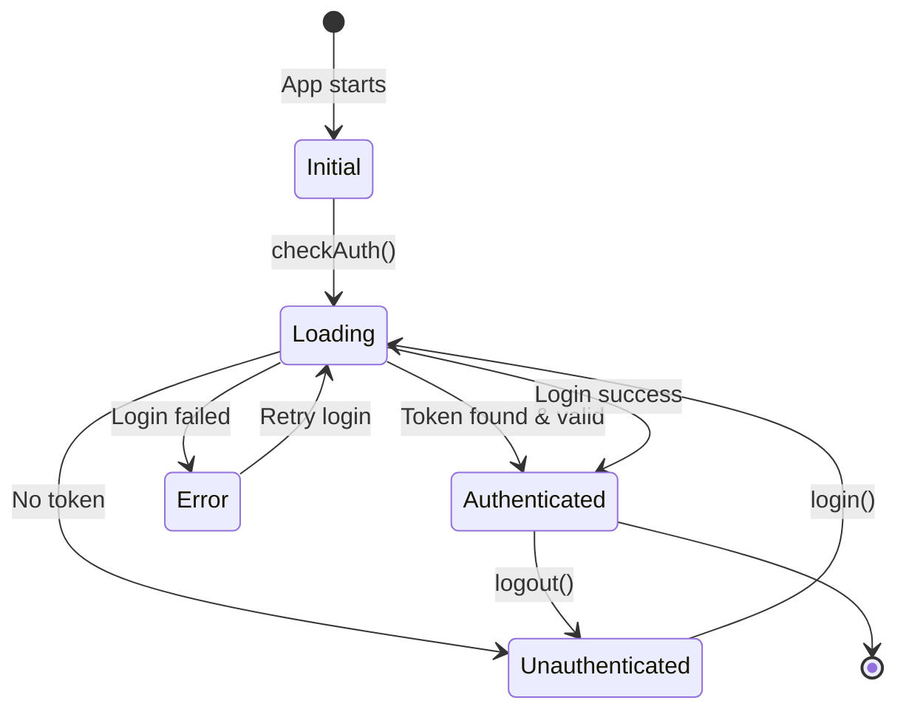
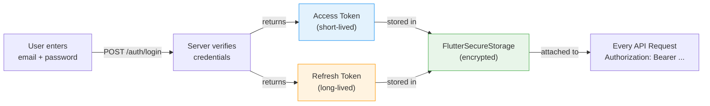
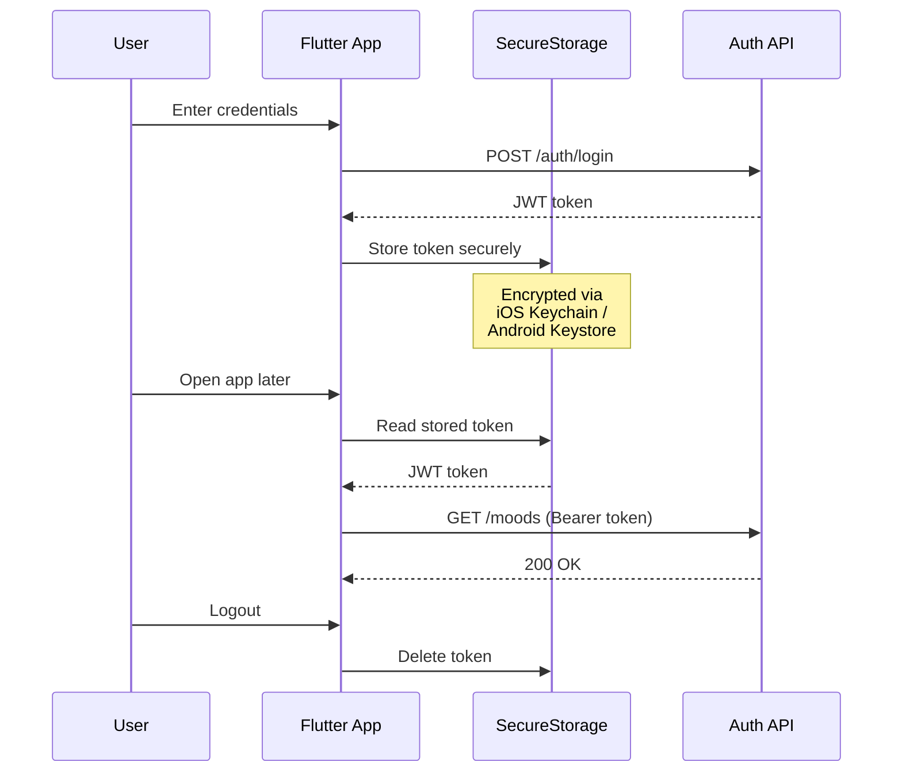
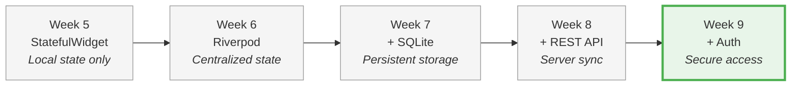

# Week 9 Lab: Authentication & Security

<div class="lab-meta" markdown>
| | |
|---|---|
| **Course** | Mobile Apps for Healthcare |
| **Duration** | ~2 hours |
| **Prerequisites** | Week 8 Networking & API (working Mood Tracker with API integration) |
</div>

<div class="grid cards" markdown>

- :material-target:{ .lg .middle } **Learning Objectives**

    ---

    - Secure user credentials with ==platform-level encryption==
    - Implement login and registration flows against a real API
    - Build a ==state machine== that drives navigation based on auth status
    - Protect app routes so only authenticated users access sensitive screens

- :material-clock-outline:{ .lg .middle } **Time Estimate**

    ---

    | Section | Duration |
    |---------|----------|
    | Part 1: Understanding auth | ~10 min |
    | Part 2: Secure token storage | ~15 min |
    | Part 3: Login & register services | ~20 min |
    | Part 4: Auth state machine | ~15 min |
    | Part 5: Dynamic token injection | ~10 min |
    | Part 6: Connecting UI to auth | ~15 min |
    | Part 7: Route guarding | ~15 min |
    | Part 8: Self-check & reflection | ~10 min |

</div>

!!! abstract "What you already know"
    **From Week 8:** Your app connects to a REST API with GET, POST, and DELETE methods, falling back to local SQLite when offline. **The security gap:** Anyone who knows the API URL can access all data — there's ==no identity verification==. **This week's upgrade:** Add authentication so each user has their own account, tokens are stored securely on-device, and the API only returns data belonging to the authenticated user.

!!! example "Think of it like... a festival wristband"
    JWT tokens are like a **wristband at a festival** — you show your ID once (login), get a wristband (token), and flash it at every stage (API request) without re-showing your ID. `FlutterSecureStorage` is the zipped pocket where you keep it safe.

---

## Prerequisites

Before you begin, make sure you have the following ready:

- **Flutter SDK** installed and on your PATH. Verify by running:
  ```bash
  flutter doctor
  ```
  All checks should pass (or show only minor warnings unrelated to your target platform).
- **An IDE** with Flutter support (VS Code recommended, or Android Studio).
- **A running device** -- emulator, simulator, or physical device.
- **The mood-tracker-api server running** on your machine (same setup as Week 8). Verify by running:
  ```bash
  curl http://localhost:8000/health
  ```
  You should receive `{"status":"healthy"}`. If the server is not running, follow the API Server Setup instructions from the [Week 8 lab](../../week-08-networking-api/lab/README.md#api-server-setup).
- **The starter project** loaded in your IDE. Download it from the course materials:
  ```
  week-09-authentication/lab/starter/mood_tracker/
  ```
  Copy the entire `mood_tracker` folder to your local machine, open it in your IDE, and run:
  ```bash
  cd mood_tracker
  flutter pub get
  flutter run
  ```
  Verify the app builds and launches before starting the exercises.

!!! tip "Pro tip"
    If the starter project does not compile, check that `flutter_secure_storage` and `http` appear in `pubspec.yaml` and that `flutter pub get` completed without errors. Ask the instructor for help if needed.

---

## About the Starter Project

You are continuing to develop the **Mood Tracker** app from Weeks 6--8. The starter project already provides:

- Full Riverpod state management from Week 6
- SQLite local persistence from Week 7
- API networking with `ApiClient` from Week 8
- Login and Register screen UI (pre-built, but ==not wired up==)
- An `AuthService` class with TODO scaffolds
- An `AuthNotifier` state machine (commented out)

The app currently sends API requests with a hardcoded token from `config.dart`. Your job in this lab is to replace that with proper **authentication** by completing ==7 TODOs across 5 files==.

### Project structure

| File | Purpose |
|------|---------|
| `lib/services/auth_service.dart` | TODOs 1--3: Secure storage, login, register |
| `lib/providers/auth_provider.dart` | TODO 4: Auth state machine |
| `lib/services/api_client.dart` | TODO 5: Dynamic token injection |
| `lib/screens/login_screen.dart` | TODO 6: Wiring login UI |
| `lib/main.dart` | TODO 7: Route guarding based on auth state |
| `lib/screens/register_screen.dart` | TODO (bonus): Wire register UI |
| `lib/config.dart` | API base URL and temp token (to be replaced) |

---

> **Healthcare Context: Why Authentication Matters in mHealth**
>
> In mobile health applications, authentication is not just a convenience feature -- it is a ==regulatory requirement==. Consider:
>
> - **HIPAA compliance** requires that patient health data is accessible only to authorized users. An unauthenticated app that exposes mood, vitals, or medication data violates basic security requirements.
> - **Patient data protection** -- mood entries, even when anonymized, are sensitive health information. A stolen access token grants full access to a patient's data.
> - **Plaintext token storage is dangerous.** `SharedPreferences` stores data in unencrypted XML (Android) or plist (iOS) files. Anyone with physical device access or a backup extraction tool can read them. `FlutterSecureStorage` uses the ==OS keychain== (iOS) or EncryptedSharedPreferences (Android) -- data is encrypted at rest.
> - **Session management** -- real mHealth apps use short-lived access tokens and refresh tokens so that a compromised token has a limited window of exploitation.
>
> The patterns you learn today -- encrypted storage, JWT-based auth, and state-driven route guarding -- are the same patterns used in production health apps that handle real patient data.
>
> For a deeper look at HIPAA, GDPR, and medical device regulations, see the [mHealth Regulations Overview](../../resources/MHEALTH_REGULATIONS.md) in the course resources.

---

### Authentication Flow Overview

The following state diagram shows the complete authentication lifecycle your app will implement. Every screen the user sees is ==driven by this state machine==:



---

## Part 1: Understanding Auth in Mobile Apps (~10 min)

!!! abstract "TL;DR"
    User logs in → server returns a ==JWT== (access token + refresh token) → app stores them in ==encrypted storage== → every API request sends the token in the `Authorization` header. A state machine (`initial → loading → authenticated/unauthenticated`) drives which screen the user sees.

!!! tip "Remember from Week 8?"
    You hardcoded a Bearer token in `config.dart`. Today you'll replace that shortcut with real authentication — login screen, JWT from the server, and ==secure token storage== that persists across app restarts.

### 1.1 How JWT authentication works

JSON Web Tokens (JWT) are the standard for API authentication in modern mobile apps. The flow is:

1. **User submits credentials** (email + password) to the server.
2. **Server verifies** the credentials and returns two tokens:
   - **Access token** -- short-lived (minutes to hours), sent with every API request.
   - **Refresh token** -- long-lived (days to weeks), used to get a new access token when the old one expires.
3. **App stores tokens securely** on the device.
4. **Every API request** includes the access token in the `Authorization: Bearer <token>` header.
5. **When the access token expires**, the app uses the refresh token to get a new one (without asking the user to log in again).



### 1.2 Why FlutterSecureStorage?

| Storage | Encryption | Use case |
|---------|-----------|----------|
| `SharedPreferences` | ==None (plaintext)== | Non-sensitive settings (theme preference, onboarding flag) |
| `FlutterSecureStorage` | ==OS keychain / EncryptedSharedPreferences== | Secrets (auth tokens, API keys, PII) |

~~Storing tokens in `SharedPreferences` is fine~~ — it's not. SharedPreferences is ==plaintext==. On a rooted Android device, anyone can read it. `FlutterSecureStorage` encrypts at rest using the OS keychain.

~~JWTs are encrypted, so storage doesn't matter~~ — JWTs are ==signed, not encrypted==. Anyone can decode a JWT and read the payload (try it at [jwt.io](https://jwt.io/)). The signature only prevents tampering, not reading. Secure storage protects the token from being stolen.

On Android, `SharedPreferences` writes to an XML file at `/data/data/<package>/shared_prefs/`. On a rooted device, this file is trivially readable. `FlutterSecureStorage` uses Android's `EncryptedSharedPreferences` with AES-256 encryption, backed by the hardware keystore.

On iOS, `FlutterSecureStorage` writes to the Keychain, which is encrypted by the Secure Enclave and only accessible to your app's sandbox.

### 1.3 The auth state machine

Your app's authentication state follows a clear ==state machine== with four states:

| State | What the user sees | When |
|-------|-------------------|------|
| `initial` | Loading spinner | App just launched, checking for stored token |
| `loading` | Loading spinner | Login/register in progress |
| `authenticated` | Home screen | Valid token exists |
| `unauthenticated` | Login screen | No token or login failed |

---

### Self-Check: Part 1

- [ ] You can explain the difference between an access token and a refresh token.
- [ ] You know why `SharedPreferences` is unsuitable for storing auth tokens.
- [ ] You can name the four states in the auth state machine.

!!! success "Checkpoint: Part 1 complete"
    You understand JWT authentication, why ==encrypted storage== is mandatory for health data, and how the auth state machine drives your app's navigation. Now let's implement it.

---

## Part 2: Secure Token Storage (~15 min)

!!! abstract "TL;DR"
    Implement 4 methods on `AuthService`: ==`saveTokens`==, `getAccessToken`, `getRefreshToken`, ==`deleteTokens`==. All use `FlutterSecureStorage` — data is encrypted at rest via the OS keychain.

!!! warning "Common mistake"
    Never store JWT tokens in `SharedPreferences` — it's ==plaintext on
    disk==. On a rooted/jailbroken device, anyone can read it. Always use
    `FlutterSecureStorage` which encrypts at rest using the OS keychain.

Open `lib/services/auth_service.dart`. This file contains the `AuthService` class with `FlutterSecureStorage` already initialized.

==Never store tokens in SharedPreferences -- use FlutterSecureStorage for platform-level encryption==

### 2.1 TODO 1: Implement secure token storage methods

Find the `TODO 1` comment block. Your task is to uncomment and complete four methods:

1. **`saveTokens(String accessToken, String refreshToken)`** -- Write both tokens to secure storage.
2. **`getAccessToken()`** -- Read and return the access token (may be `null` if not stored).
3. **`getRefreshToken()`** -- Read and return the refresh token (may be `null`).
4. **`deleteTokens()`** -- Remove both tokens (used during logout).

??? tip "Solution"

    ```dart
    // 1. saveTokens
    await _storage.write(key: _accessTokenKey, value: accessToken); // (1)!
    await _storage.write(key: _refreshTokenKey, value: refreshToken);

    // 2. getAccessToken
    return await _storage.read(key: _accessTokenKey);

    // 3. getRefreshToken
    return await _storage.read(key: _refreshTokenKey);

    // 4. deleteTokens
    await _storage.delete(key: _accessTokenKey); // (2)!
    await _storage.delete(key: _refreshTokenKey);
    ```

    1. `_storage` is a `FlutterSecureStorage` instance -- data written with `write()` is ==encrypted at rest== using the iOS Keychain or Android EncryptedSharedPreferences (AES-256 backed by the hardware keystore). Each entry is a simple key-value pair.
    2. Removes the token from encrypted storage on logout. This ensures that a stolen or lost device cannot reuse a stale session -- the token is gone, not just "forgotten."

    **Key insight:** All `FlutterSecureStorage` operations are `async` because they interact with platform-specific encrypted storage. The `_accessTokenKey` and `_refreshTokenKey` constants are already defined at the top of the class.

??? warning "Common mistake: Storing tokens in SharedPreferences"
    ```dart
    // WRONG — SharedPreferences is NOT encrypted
    final prefs = await SharedPreferences.getInstance();
    prefs.setString('token', token);  // Readable by anyone with device access!

    // CORRECT — FlutterSecureStorage uses platform encryption
    final storage = FlutterSecureStorage();
    await storage.write(key: 'token', value: token);  // Encrypted!
    ```
    `SharedPreferences` stores data as plain text in an XML file on Android and a plist on iOS. Anyone with physical access to the device (or a backup) can read it. `FlutterSecureStorage` uses the iOS Keychain (hardware-backed) and Android EncryptedSharedPreferences (AES-256). For healthcare apps handling PHI, this isn't optional — it's a ==HIPAA requirement==.

---

### Self-Check: Part 2

- [ ] Your four methods compile without errors.
- [ ] `saveTokens` writes both tokens, `deleteTokens` deletes both tokens.
- [ ] All methods are `async` and return `Future`.

!!! example "Real-world mHealth: HIPAA-compliant token management"
    In clinical apps like MyChart (Epic) or Patient Portal, authentication tokens are treated as PHI access keys. HIPAA's Technical Safeguards (§164.312) require: (1) **Unique user identification** — each clinician has their own credentials, (2) **Automatic logoff** — tokens expire after 15-30 minutes of inactivity, (3) **Encryption** — tokens stored in the device's secure enclave (exactly what `FlutterSecureStorage` does), and (4) **Audit controls** — every API call with the token is logged server-side. Your `AuthService` class implements requirements 1 and 3. Production apps add token refresh and idle timeout for requirement 2.

??? protip "Pro tip: Biometric unlock"
    `FlutterSecureStorage` can be configured to require ==biometric
    authentication== (Face ID / fingerprint) before reading stored tokens
    on supported devices — adding an extra layer of security for
    sensitive health data.

!!! success "Checkpoint: Part 2 complete"
    You have a working `AuthService` with ==secure token storage==. Login
    credentials never touch `SharedPreferences` — they're encrypted via
    platform keychain.

---

## Part 3: Login & Register Services (~20 min)

!!! abstract "TL;DR"
    `login()` sends ==form-encoded== data to `/auth/login` (OAuth2 spec), stores the returned JWT tokens. `register()` sends ==JSON== to `/auth/register`. Different encoding formats because login follows OAuth2, registration is a custom endpoint.

Stay in `lib/services/auth_service.dart`. Now you will implement the two API calls for authentication.

### 3.1 TODO 2: Implement login()

Find the `TODO 2` comment block. Implement the `login()` method that:

1. Sends a **POST** request to `/auth/login` with ==form-encoded== data.
2. Parses the JSON response to extract `access_token` and `refresh_token`.
3. Stores both tokens using `saveTokens()`.
4. Throws an `AuthException` on failure. (This class is already defined for you at the top of `auth_service.dart`.)

??? tip "Solution"

    ```dart
    Future<void> login(String email, String password) async {
      final url = Uri.parse('$apiBaseUrl/auth/login');
      final response = await http.post(
        url,
        headers: {'Content-Type': 'application/x-www-form-urlencoded'}, // (1)!
        body: { // (2)!
          'username': email,  // OAuth2 convention: email goes in 'username'
          'password': password,
        },
      );
      if (response.statusCode == 200) {
        final data = jsonDecode(response.body);
        await saveTokens(
          data['access_token'] as String, // (3)!
          data['refresh_token'] as String,
        );
      } else if (response.statusCode == 401) {
        throw AuthException('Incorrect email or password.');
      } else {
        throw AuthException('Login failed. Please try again.');
      }
    }
    ```

    1. The login endpoint requires `application/x-www-form-urlencoded` because it follows the ==OAuth2 password grant== specification (RFC 6749). This differs from most other API calls which use `application/json`.
    2. The body is a ==form-encoded== map, not JSON. OAuth2 mandates this format for token endpoints. Note the `'username'` key -- OAuth2 uses this field name even when the value is an email address.
    3. Parses the JWT access token and refresh token from the server's JSON response. These tokens are then stored in encrypted storage for use in subsequent API requests.

    **Important detail:** The login endpoint uses **form-encoded** data (`application/x-www-form-urlencoded`), not JSON. This is because the API follows the OAuth2 password grant specification, which mandates form encoding. Notice that the email is sent in the `'username'` field -- this is also an OAuth2 convention.

??? warning "Common mistake: Using JSON for OAuth2 login"
    ```dart
    // WRONG — OAuth2 password grant requires form encoding
    headers: {'Content-Type': 'application/json'},
    body: jsonEncode({'username': email, 'password': password}),

    // CORRECT — form-encoded as per RFC 6749
    headers: {'Content-Type': 'application/x-www-form-urlencoded'},
    body: 'username=$email&password=$password',
    ```
    The OAuth2 password grant specification (RFC 6749 Section 4.3) mandates ==`application/x-www-form-urlencoded`== for token requests. Sending JSON to an OAuth2 endpoint typically results in a 422 Unprocessable Entity. Registration endpoints (custom, not OAuth2) can use JSON.

### 3.2 TODO 3: Implement register()

Find the `TODO 3` comment block. Implement the `register()` method that:

1. Sends a **POST** request to `/auth/register` with ==JSON== data.
2. Returns successfully on `201` status.
3. Parses and throws the server's error message on `400` status.

??? tip "Solution"

    ```dart
    Future<void> register(String email, String username, String password) async {
      final url = Uri.parse('$apiBaseUrl/auth/register');
      final response = await http.post(
        url,
        headers: {'Content-Type': 'application/json'},
        body: jsonEncode({ // (1)!
          'email': email,
          'username': username,
          'password': password,
        }),
      );
      if (response.statusCode == 201) {
        return; // Registration successful, user can now login
      } else if (response.statusCode == 400) {
        final data = jsonDecode(response.body);
        throw AuthException(data['detail'] as String);
      } else {
        throw AuthException('Registration failed. Please try again.');
      }
    }
    ```

    1. Registration uses standard ==JSON encoding== (`application/json`), unlike login which uses form encoding. Registration is a custom endpoint, not bound by the OAuth2 spec, so it follows the more common REST convention.

    **Why does login use form-encoded but register uses JSON?** Login follows the OAuth2 token endpoint specification, which requires `application/x-www-form-urlencoded`. Registration is a custom endpoint that uses JSON, the more common format for REST APIs. This distinction is common in real-world APIs.

    **Notice:** Registration does NOT automatically log the user in. It only creates the account. The user (or the app) must call `login()` separately afterward. This separation of concerns is a common pattern.

~~Login and register should use the same encoding~~ — they serve different protocols. Login follows the ==OAuth2 spec== (form-encoded, RFC 6749). Registration is a custom endpoint (JSON, REST convention). Mixing them up causes 422 errors.

---

### Self-Check: Part 3

- [ ] `login()` sends form-encoded data with `'username'` field (not `'email'`).
- [ ] `login()` stores both tokens on success.
- [ ] `register()` sends JSON data.
- [ ] `register()` throws `AuthException` with the server's error message on `400`.
- [ ] Both methods handle error status codes.

??? question "Scenario: Why form-encoded for login?"
    Why does the login endpoint use `application/x-www-form-urlencoded` instead of JSON?

    ??? success "Answer"
        The login endpoint follows the ==OAuth2 password grant== specification (RFC 6749), which requires form-encoded bodies. This is an industry standard -- most auth servers (including FastAPI's built-in OAuth2) expect this format. Registration, being a custom endpoint, uses standard JSON.

!!! success "Checkpoint: Part 3 complete"
    The login form sends credentials to the API, receives a JWT, and
    stores it securely. The ==auth flow works end-to-end== for a single
    session.

---

## Part 4: Auth State Management (~15 min)

!!! abstract "TL;DR"
    `AuthNotifier` is a ==state machine== with four states: `initial → loading → authenticated/unauthenticated`. Every method sets `loading` first, then transitions based on success/failure. The `authProvider` exposes this state to the entire widget tree.

Open `lib/providers/auth_provider.dart`. This file defines the `AuthState` enum and has a scaffold for the `AuthNotifier`.

### 4.1 TODO 4: Implement AuthNotifier

Find the `TODO 4` comment block. Uncomment and complete the `AuthNotifier` class, then **uncomment the `authProvider`** definition below the class.

??? tip "Solution"

    ```dart
    class AuthNotifier extends StateNotifier<AuthState> {
      final AuthService _authService;

      AuthNotifier(this._authService) : super(AuthState.initial);

      Future<void> checkAuth() async {
        final token = await _authService.getAccessToken(); // (1)!
        if (token != null) { // (2)!
          state = AuthState.authenticated;
        } else {
          state = AuthState.unauthenticated;
        }
      }

      Future<void> login(String email, String password) async {
        state = AuthState.loading; // (3)!
        try {
          await _authService.login(email, password); // (4)!
          state = AuthState.authenticated; // (5)!
        } on AuthException {
          state = AuthState.unauthenticated;
          rethrow; // (6)!
        }
      }

      Future<void> register(String email, String username, String password) async {
        state = AuthState.loading;
        try {
          await _authService.register(email, username, password);
          // After registration, automatically log in
          await _authService.login(email, password);
          state = AuthState.authenticated;
        } on AuthException {
          state = AuthState.unauthenticated;
          rethrow;
        }
      }

      Future<void> logout() async {
        await _authService.deleteTokens();
        state = AuthState.unauthenticated;
      }
    }
    ```

    1. Checks for an existing session on app start by reading the stored token from encrypted storage. If the user previously logged in and the token persists, we can ==restore their session== without asking for credentials again.
    2. If a token exists, the user is sent to the home screen (`authenticated`); otherwise they see the login screen (`unauthenticated`). This single check drives the entire auto-login experience.
    3. Sets the loading state **before** the async operation begins, so the UI can show a ==spinner or disable the login button== while the network request is in flight.
    4. Delegates the actual HTTP call and token storage to `AuthService`, keeping the notifier focused on **state transitions** rather than networking details. This separation makes both classes independently testable.
    5. On success, transitions to `authenticated` -- this single state change triggers the route guard in `MoodTrackerApp` to swap the login screen for the home screen automatically.
    6. Propagates the `AuthException` to the UI layer (e.g., `LoginScreen`) so it can display the error message in a SnackBar, while the notifier still handles the state transition back to `unauthenticated`.

    Then uncomment the `authProvider` definition:

    ```dart
    final authProvider = StateNotifierProvider<AuthNotifier, AuthState>((ref) {
      return AuthNotifier(ref.read(authServiceProvider));
    });
    ```

    **Key insight -- the state machine pattern:**

    - Every method sets `state = AuthState.loading` before starting async work.
    - On success, state transitions to `authenticated`.
    - On failure, state transitions to `unauthenticated` and the exception is rethrown for the UI to display.
    - `rethrow` is critical: it lets the calling code (the login screen) catch the `AuthException` and show the error message in a SnackBar, while the notifier still handles the state transition.

    **Why `register()` calls `login()` after registration:** This is a UX choice. After a successful registration, the user is ==automatically logged in== rather than being sent back to the login screen.

??? warning "Common mistake: Not handling all auth states in the UI"
    ```dart
    // WRONG — only checking authenticated
    if (authState == AuthState.authenticated) {
      return HomeScreen();
    }
    return LoginScreen();  // Covers loading, error, AND unauthenticated

    // CORRECT — handle each state explicitly
    return switch (authState) {
      AuthState.initial => SplashScreen(),
      AuthState.loading => LoadingIndicator(),
      AuthState.authenticated => HomeScreen(),
      AuthState.unauthenticated => LoginScreen(),
      AuthState.error(message: var msg) => LoginScreen(error: msg),
    };
    ```
    Collapsing multiple states into a catch-all causes UX issues: users see a login screen during initial token check (should be splash), and error messages are lost. Dart 3's ==exhaustive switch== forces you to handle every case.

~~A boolean `isLoggedIn` is enough for auth state~~ — a boolean can't represent "checking stored token" (splash screen), "login in progress" (spinner), or "login failed" (error message). The state machine makes each case ==explicit and exhaustive==.

---

### Self-Check: Part 4

- [ ] `AuthNotifier` extends `StateNotifier<AuthState>`.
- [ ] The constructor starts in `AuthState.initial`.
- [ ] `checkAuth()` reads the stored token and transitions to `authenticated` or `unauthenticated`.
- [ ] `login()` and `register()` set `loading` state, then transition to `authenticated` on success or `unauthenticated` on failure.
- [ ] `logout()` deletes tokens and transitions to `unauthenticated`.
- [ ] The `authProvider` definition is uncommented.

??? question "Scenario: Why a state machine?"
    Why model authentication as a state machine (`initial -> loading -> authenticated/error`) instead of just a boolean `isLoggedIn`?

    ??? success "Answer"
        A boolean can't represent intermediate states. With just `isLoggedIn = false`, the UI can't distinguish between "never checked" (show splash), "checking token" (show spinner), "login failed" (show error), and "not logged in" (show login form). The state machine makes each case ==explicit== and the UI code becomes a simple switch on the current state.

!!! success "Checkpoint: Part 4 complete"
    The auth state machine is working — `AuthNotifier` manages login,
    logout, and session restoration with ==clean state transitions==. The
    entire app's navigation will be driven by these states.

---

## Part 5: Dynamic Token Injection (~10 min)

!!! abstract "TL;DR"
    Replace the ==hardcoded `_headers` getter== with an async `_getHeaders()` method that reads the real token from `FlutterSecureStorage`. Update all 4 HTTP methods to `await` it.

!!! warning "Common mistake"
    Don't assume your stored token is still valid. JWTs expire — if you
    blindly send an expired token, the API returns ==`401 Unauthorized`==.
    Check expiry before each call and refresh proactively.

Open `lib/services/api_client.dart`. This file currently uses a hardcoded `tempAuthToken` from `config.dart`.

### 5.1 TODO 5: Replace _headers with _getHeaders()

Find the `TODO 5` comments. You need to make two changes:

**Step 1 -- Replace the getter with an async method** that reads the token from secure storage instead of using the hardcoded value.

**Step 2 -- Update all HTTP methods** (`get`, `post`, `delete`, `put`) to use the new async method instead of the synchronous `_headers` getter.

??? tip "Solution"

    Replace the `_headers` getter:

    ```dart
    // Before (hardcoded):
    Map<String, String> get _headers => {
          'Content-Type': 'application/json',
          'Authorization': 'Bearer $tempAuthToken',
        };

    // After (dynamic):
    Future<Map<String, String>> _getHeaders() async {
      final token = await _authService.getAccessToken();
      return {
        'Content-Type': 'application/json',
        if (token != null) 'Authorization': 'Bearer $token',
      };
    }
    ```

    Update each HTTP method call:

    ```dart
    // Before:
    final response = await http.get(url, headers: _headers);

    // After:
    final headers = await _getHeaders();
    final response = await http.get(url, headers: headers);
    ```

    **Key insight:** The `if (token != null)` inside the map literal is a ==Dart collection-if==. If no token is stored (user not logged in), the `Authorization` header is simply omitted. This prevents sending `Bearer null` to the server.

    **Why async?** `FlutterSecureStorage.read()` is an async operation because it interacts with the platform's encrypted storage. This means `_headers` cannot be a synchronous getter anymore -- it must become an async method. Every call site must `await` it.

---

### Self-Check: Part 5

- [ ] The hardcoded `_headers` getter is replaced with `_getHeaders()` async method.
- [ ] All four HTTP methods (`get`, `post`, `delete`, `put`) now use `await _getHeaders()`.
- [ ] The `Authorization` header is only included when a token exists.
- [ ] The `tempAuthToken` from `config.dart` is no longer referenced in this file.

??? question "Scenario: Expired token mid-session"
    A patient's JWT expires mid-session while they're writing a long symptom note. What happens when they tap "Save"? Design the UX: does the app silently refresh the token, show a re-login dialog, or lose the note?

    ??? success "Answer"
        The ideal UX: (1) The API client detects the 401 response. (2) It attempts a ==silent token refresh== using a stored refresh token. (3) If refresh succeeds, it retries the original POST automatically — the patient never notices. (4) If refresh fails, the app saves the note locally (draft), shows a non-blocking re-login dialog, and re-sends after successful login. **Never lose user data** — that's the cardinal rule of mHealth UX.

!!! success "Checkpoint: Part 5 complete"
    API requests now use ==dynamically injected tokens== from secure storage instead of the hardcoded test token. The `tempAuthToken` in `config.dart` is no longer used.

---

### Token Lifecycle

The following diagram shows how a JWT token flows through the system -- from login to storage to reuse to logout:



---

=== "Before: Hardcoded Token (Week 8)"

    ```dart
    class ApiClient {
      final String baseUrl;
      final String token = 'hardcoded-test-token';

      Future<String> get(String endpoint) async {
        final response = await http.get(
          Uri.parse('$baseUrl$endpoint'),
          headers: {'Authorization': 'Bearer $token'},
        );
        return response.body;
      }
    }
    ```

=== "After: Dynamic Auth (Week 9)"

    ```dart
    class ApiClient {
      final String baseUrl;
      final AuthService _authService;

      Future<String> get(String endpoint) async {
        final token = await _authService.getToken();
        if (token == null) throw UnauthorizedException();

        final response = await http.get(
          Uri.parse('$baseUrl$endpoint'),
          headers: {'Authorization': 'Bearer $token'},
        );
        if (response.statusCode == 401) {
          await _authService.deleteToken();
          throw SessionExpiredException();
        }
        return response.body;
      }
    }
    ```

---

## Part 6: Connecting UI to Auth (~15 min)

!!! abstract "TL;DR"
    Wire the login button to `authProvider`: validate the form, call `ref.read(authProvider.notifier).login()`, catch `AuthException` for SnackBar errors, and ==always check `mounted`== before `setState` after async calls.

Open `lib/screens/login_screen.dart`. The login form UI is already built. You need to wire the submit button to the auth provider.

### 6.1 TODO 6: Implement the _login() method

Find the `TODO 6` comments. Make these changes:

**Step 1 -- Add the missing import** at the top of the file for `auth_provider.dart` and `auth_service.dart`.

**Step 2 -- Replace the placeholder `_login()` method** with one that validates the form, calls the auth provider, handles `AuthException` errors with a SnackBar, and uses `mounted` checks.

==Always check `mounted` before calling `setState` or navigating after an async operation==

??? tip "Solution"

    Add imports:

    ```dart
    import '../providers/auth_provider.dart';
    import '../services/auth_service.dart';
    ```

    Replace the `_login()` method:

    ```dart
    Future<void> _login() async {
      if (!_formKey.currentState!.validate()) return;

      setState(() => _isLoading = true);
      try {
        await ref.read(authProvider.notifier).login( // (1)!
              _emailController.text.trim(),
              _passwordController.text,
            );
      } on AuthException catch (e) {
        if (mounted) { // (2)!
          ScaffoldMessenger.of(context).showSnackBar(
            SnackBar(content: Text(e.message)),
          );
        }
      } finally {
        if (mounted) setState(() => _isLoading = false);
      }
    }
    ```

    1. `ref.read()` (not `ref.watch()`) is used because this is a ==one-time action== inside a callback. `ref.watch()` is for continuous subscriptions in `build()` methods; `ref.read()` fires once and does not set up a listener.
    2. The `mounted` check prevents calling `setState()` or accessing `context` on a widget that has already been disposed. After an `await`, the widget may no longer be in the tree if the user navigated away.

    **Why the `mounted` check?** The `login()` call is asynchronous. While awaiting the network response, the user might navigate away (e.g., press the back button), which would dispose the widget. Calling `setState()` or `ScaffoldMessenger.of(context)` on a disposed widget throws an error. The `mounted` property is `true` only when the widget is still in the tree.

    **Why `ref.read()` and not `ref.watch()`?** The login button tap is a one-time action, not a continuous subscription. We use `ref.read()` in event handlers and `ref.watch()` in `build()` methods -- the same rule from Week 6.

??? warning "Common mistake: setState after dispose"
    ```dart
    // WRONG — may crash if user navigates away during login
    await ref.read(authProvider.notifier).login(email, password);
    setState(() => _isLoading = false);  // Widget might be disposed!

    // CORRECT — check mounted first
    await ref.read(authProvider.notifier).login(email, password);
    if (mounted) {
      setState(() => _isLoading = false);
    }
    ```
    If the user presses back or the `AuthGate` navigates away while `login()` is running, the widget gets disposed. Calling `setState` on a disposed widget throws: =="`setState() called after dispose()`"==. The `mounted` check prevents this.

### 6.2 Bonus: Wire the RegisterScreen

The register screen at `lib/screens/register_screen.dart` has a similar `_register()` method with a TODO comment. If you have time, wire it up the same way:

1. Add `import '../providers/auth_provider.dart';` and `import '../services/auth_service.dart';`.
2. Replace the placeholder SnackBar in `_register()` with:
   ```dart
   await ref.read(authProvider.notifier).register(
     _emailController.text.trim(),
     _usernameController.text.trim(),
     _passwordController.text,
   );
   ```
3. Change the `catch` block to catch `AuthException` specifically.

---

### Self-Check: Part 6

- [ ] The `_login()` method validates the form before calling the provider.
- [ ] Loading state is set to `true` before the async call and `false` in `finally`.
- [ ] `AuthException` is caught and displayed in a SnackBar.
- [ ] `mounted` checks are used before `setState()` and `ScaffoldMessenger`.

!!! success "Checkpoint: Part 6 complete"
    The login screen is wired to the auth provider. Users can log in with
    real credentials, see ==loading feedback==, and get meaningful error
    messages on failure.

---

## Part 7: Route Guarding & Auto-Login (~15 min)

!!! abstract "TL;DR"
    Change `MoodTrackerApp` to a `ConsumerWidget` that ==watches `authProvider`==. Use a Dart 3 switch expression to show `LoginScreen`, `HomeScreen`, or a loading spinner based on auth state. Add `_AuthCheckScreen` to trigger `checkAuth()` on startup.

Open `lib/main.dart`. Currently, the app always shows `HomeScreen`. You need to make it show the correct screen based on the auth state.

### 7.1 TODO 7: Implement auth-based routing

Find the `TODO 7` comments. Make these changes:

**Step 1 -- Add imports** for `auth_provider.dart` and `login_screen.dart`.

**Step 2 -- Change `MoodTrackerApp` from `StatelessWidget` to `ConsumerWidget`** so it can watch the auth state and switch between screens.

**Step 3 -- Add the `_AuthCheckScreen` widget** below `MoodTrackerApp` to trigger `checkAuth()` on app startup.

??? tip "Solution"

    Add imports:

    ```dart
    import 'providers/auth_provider.dart';
    import 'screens/login_screen.dart';
    ```

    Change `MoodTrackerApp` to `ConsumerWidget`:

    ```dart
    class MoodTrackerApp extends ConsumerWidget {
      const MoodTrackerApp({super.key});

      @override
      Widget build(BuildContext context, WidgetRef ref) {
        final authState = ref.watch(authProvider);

        return MaterialApp(
          title: 'Mood Tracker',
          debugShowCheckedModeBanner: false,
          theme: ThemeData(
            colorScheme: ColorScheme.fromSeed(
              seedColor: Colors.teal,
              brightness: Brightness.light,
            ),
            useMaterial3: true,
          ),
          home: switch (authState) { // (1)!
            AuthState.authenticated => const HomeScreen(),
            AuthState.unauthenticated => const LoginScreen(),
            AuthState.loading => const Scaffold(
                body: Center(child: CircularProgressIndicator()),
              ),
            AuthState.initial => const _AuthCheckScreen(),
          },
        );
      }
    }
    ```

    1. Dart 3 ==switch expression== provides exhaustive pattern matching -- the compiler ensures every `AuthState` variant is handled, so adding a new state later causes a compile error rather than a silent bug.

    Add the `_AuthCheckScreen` widget:

    ```dart
    class _AuthCheckScreen extends ConsumerStatefulWidget {
      const _AuthCheckScreen();

      @override
      ConsumerState<_AuthCheckScreen> createState() => _AuthCheckScreenState();
    }

    class _AuthCheckScreenState extends ConsumerState<_AuthCheckScreen> {
      @override
      void initState() {
        super.initState();
        Future.microtask(() => ref.read(authProvider.notifier).checkAuth()); // (1)!
      }

      @override
      Widget build(BuildContext context) {
        return const Scaffold(
          body: Center(child: CircularProgressIndicator()),
        );
      }
    }
    ```

    1. `Future.microtask()` defers the `checkAuth()` call to the next microtask, after the current build completes. Calling it synchronously inside `initState()` would modify provider state during the build phase, triggering a framework error.

    **How this works:**

    1. The app starts with `AuthState.initial`, which shows `_AuthCheckScreen`.
    2. `_AuthCheckScreen.initState()` calls `checkAuth()`, which reads the stored token.
    3. If a token exists, state transitions to `authenticated` and `MoodTrackerApp` rebuilds to show `HomeScreen`.
    4. If no token exists, state transitions to `unauthenticated` and `MoodTrackerApp` rebuilds to show `LoginScreen`.
    5. After a successful login, state transitions to `authenticated` and the app ==automatically switches== to `HomeScreen`.

~~Route guards require a navigation library~~ — you don't need `go_router` or `auto_route` for basic auth routing. A ==switch expression on auth state== in the root widget handles login/home/splash transitions cleanly. Add a routing library when you need deep linking or complex navigation stacks.

---

### Self-Check: Part 7

- [ ] `MoodTrackerApp` is a `ConsumerWidget` that watches `authProvider`.
- [ ] The app shows a loading indicator during `initial` and `loading` states.
- [ ] The app shows `LoginScreen` when unauthenticated.
- [ ] The app shows `HomeScreen` when authenticated.
- [ ] `_AuthCheckScreen` calls `checkAuth()` on startup to restore the session.

??? question "Scenario: Why Future.microtask?"
    Why do we wrap `checkAuth()` in `Future.microtask()` instead of calling it directly in `build()`?

    ??? success "Answer"
        Flutter's `build()` method must be ==synchronous and side-effect-free==. Calling `checkAuth()` directly would modify provider state during the build phase, which triggers a rebuild during a rebuild -- causing a framework error. `Future.microtask()` defers the call to the next microtask, after the current build completes.

??? challenge "Stretch Goal: Remember me"
    Add a "remember me" checkbox to the login screen. If unchecked, clear the stored token when the app is closed (use `WidgetsBindingObserver` to detect app lifecycle).

    *Hint:* Override `didChangeAppLifecycleState()` and check for `AppLifecycleState.detached`.

!!! success "Checkpoint: Part 7 complete"
    Route guarding is active — unauthenticated users see the login
    screen, authenticated users see the home screen, and the app
    ==auto-restores sessions== on startup. The full auth flow works
    end-to-end.

---

## Part 7.5: Add a Logout Button (~5 min)

Your `AuthNotifier` has a `logout()` method, but there is no UI to trigger it. Add a logout button to the home screen's app bar so you can test the full auth flow.

Open `lib/screens/home_screen.dart` and add an `IconButton` to the `AppBar`'s `actions` list:

```dart
AppBar(
  title: const Text('Mood Tracker'),
  actions: [
    // ... existing icons ...
    IconButton(
      icon: const Icon(Icons.logout),
      tooltip: 'Log out',
      onPressed: () {
        ref.read(authProvider.notifier).logout();
      },
    ),
  ],
),
```

Make sure to import `auth_provider.dart` at the top of the file. After logging out, the app should automatically show the login screen (because the auth state transitions to `unauthenticated` and the route guard in `main.dart` responds).

---

## Applying This to Your Team Project

Authentication is a ==cross-cutting concern== that affects every API call:

- **Does your app need authentication?** If it stores any personal health data — yes.
- **Token management:** Adapt the `AuthService` pattern for your API's auth flow.
- **Protected routes:** Use the same `AuthState`-based routing pattern to guard screens that require login.

!!! question "Discussion: Security audit"
    Review your team app's current code. Is any sensitive data stored in plain text? Are API tokens hardcoded? Make a list of security improvements needed before your next sprint review.

---

### Where You Are: Course Architecture Journey



---

## Part 8: Self-Check and Summary (~10 min)

### 8.1 End-to-end verification

Walk through this complete flow to verify everything works:

1. Launch the app. You should see a loading indicator, then the ==login screen== (since no token is stored).
2. **Register a test user** using curl (or via the register screen if you completed the bonus in Part 6):
    ```bash
    curl -X POST http://localhost:8000/auth/register \
      -H "Content-Type: application/json" \
      -d '{"email": "test@test.com", "username": "testuser", "password": "test123"}'
    ```
3. **Log in** on the login screen with the credentials you just registered.
4. You should see the ==home screen== after a successful login.
5. Close and reopen the app. You should be **automatically logged in** (the stored token is detected).
6. Add a mood entry to verify the API works with the real token.
7. Tap the **logout** icon in the app bar. You should be taken back to the ==login screen==.
8. Log in again with your credentials. You should see the home screen.

If all 8 steps work correctly, you have completed the lab.

### 8.2 Summary

| TODO | File | What you did |
|------|------|-------------|
| 1 | `services/auth_service.dart` | Implemented `saveTokens`, `getAccessToken`, `getRefreshToken`, `deleteTokens` using `FlutterSecureStorage` |
| 2 | `services/auth_service.dart` | Implemented `login()` -- POST form-encoded to `/auth/login`, parse token response, store tokens |
| 3 | `services/auth_service.dart` | Implemented `register()` -- POST JSON to `/auth/register`, handle 400 errors |
| 4 | `providers/auth_provider.dart` | Implemented `AuthNotifier` state machine with `checkAuth`, `login`, `register`, `logout` |
| 5 | `services/api_client.dart` | Replaced hardcoded `_headers` with async `_getHeaders()` that reads the real token |
| 6 | `screens/login_screen.dart` | Implemented `_login()` with form validation, provider call, error SnackBar, and `mounted` checks |
| 7 | `main.dart` | Implemented auth-based route guarding with `ConsumerWidget` and `_AuthCheckScreen` |

### 8.3 Key concepts learned

| Concept | Key Takeaway |
|---------|--------------|
| `FlutterSecureStorage` | Uses OS-level encryption (Keychain / EncryptedSharedPreferences) for sensitive data like tokens |
| JWT auth flow | Client sends credentials, server returns access + refresh tokens, client stores and sends them with every request |
| OAuth2 form encoding | Login endpoints following OAuth2 spec use `application/x-www-form-urlencoded`, not JSON |
| State machine pattern | Auth state transitions (`initial → loading → authenticated/unauthenticated`) drive which screen is shown |
| `mounted` check | Always check `mounted` before calling `setState()` or accessing `context` after an `await` |
| Route guarding | Watch auth state in a root `ConsumerWidget` and conditionally render screens |
| `Future.microtask()` | Safe way to trigger provider state changes during widget initialization |

!!! info "Grading"
    For detailed sprint review rubrics and grading criteria, see the [Project Grading Guide](../../resources/PROJECT_GRADING.md).

---

## What Comes Next

In the following weeks, you will extend this Mood Tracker app:

- **Week 10:** Sprint Review #2, testing workshop -- unit tests, widget tests, and integration tests for your project.

The authentication foundation you built today ensures that every API request is properly authorized and that ==patient data is protected==.

---

## Troubleshooting

??? question "`MissingPluginException` with `flutter_secure_storage`"
    This native plugin requires a full restart (not hot reload). Stop the app, run `flutter clean && flutter pub get`, then `flutter run`. On Android, you may also need to set the minimum SDK version to 18+ in `android/app/build.gradle`.

??? question "Login succeeds in curl but fails in the app"
    Check that: (1) Your `login()` method uses ==`application/x-www-form-urlencoded`== (not JSON) for the content type. (2) The email is sent in the `'username'` field (OAuth2 convention). (3) The `apiBaseUrl` in `config.dart` matches the server address. For Android emulator, use `http://10.0.2.2:8000`.

??? question "App shows login screen even after successful login"
    Check that `saveTokens()` is called after a successful login response and that `authProvider` transitions to `AuthState.authenticated`. Add `print()` statements in `AuthNotifier.login()` to trace the state transitions.

??? question "`setState() called after dispose()` error"
    You are calling `setState()` after the widget has been removed from the tree. This happens when an async operation (like `login()`) completes after the user navigated away. Add ==`if (mounted)`== checks before every `setState()` and `ScaffoldMessenger.of(context)` call.

??? question "Auto-login doesn't work after restarting the app"
    Check that: (1) `_AuthCheckScreen.initState()` calls `checkAuth()` via `Future.microtask()`. (2) `checkAuth()` reads the token from `FlutterSecureStorage` and sets the state to `authenticated` if found. (3) The `switch (authState)` in `MoodTrackerApp` includes a case for `AuthState.initial` that shows the check screen.

??? question "Android emulator shows `CERTIFICATE_VERIFY_FAILED`"
    The emulator doesn't trust your machine's local certificates. For development, you can temporarily disable certificate verification (==never in production==): add `HttpOverrides.global = _DevHttpOverrides();` in `main()`. Better: use `http://` (not `https://`) for your local development server.

---

## Quick Quiz

<quiz>
What are the three parts of a JWT token?

- [ ] Username, password, expiry
- [x] Header, payload, signature
- [ ] Token, refresh token, session ID
- [ ] Public key, private key, hash
</quiz>

<quiz>
Why is `FlutterSecureStorage` better than `SharedPreferences` for tokens?

- [ ] It's faster to read and write
- [ ] It supports larger data sizes
- [x] It encrypts data at rest using the OS keychain (Keystore/Keychain)
- [ ] It automatically refreshes expired tokens
</quiz>

<quiz>
What state does `AuthNotifier` start in?

- [x] Initial (checking for stored token)
- [ ] Authenticated
- [ ] Unauthenticated
- [ ] Error
</quiz>

<quiz>
What does the route guard (AuthGate) do?

- [ ] Encrypts all network traffic
- [ ] Validates JWT signatures on the client
- [x] Routes users to login or home screen based on authentication state
- [ ] Stores the auth token securely
</quiz>

<quiz>
How is the Bearer token sent with API requests?

- [ ] As a query parameter: `?token=abc`
- [ ] In the request body as JSON
- [x] In the `Authorization` header: `Bearer <token>`
- [ ] As a cookie
</quiz>

<quiz>
Why must you check `mounted` before calling `setState()` after an `await`?

- [ ] Flutter requires it for all `setState()` calls
- [ ] It improves performance
- [x] The widget may have been disposed during the async operation, and calling setState on a disposed widget crashes
- [ ] It prevents duplicate state updates
</quiz>

<quiz>
What encoding does the OAuth2 login endpoint require?

- [ ] `application/json`
- [x] `application/x-www-form-urlencoded`
- [ ] `multipart/form-data`
- [ ] `text/plain`
</quiz>

---

!!! question "End-of-Lab Reflection"
    Take 2 minutes to reflect on today's work:

    1. **What was the hardest concept today?** (Secure storage? State machine? OAuth2 form encoding? AuthGate routing?)
    2. **What would happen if your app stored tokens in SharedPreferences?** Think about the security implications for patient data.
    3. **For your team project:** Does your app need authentication? If it handles any personal health data, the answer is yes. List 3 security improvements your team should make before the next sprint review.

    Write your answers in your lab notebook or discuss with your neighbor.

---

## Further Reading

- [FlutterSecureStorage package on pub.dev](https://pub.dev/packages/flutter_secure_storage)
- [JWT.io -- JSON Web Token introduction](https://jwt.io/introduction)
- [OAuth2 Resource Owner Password Credentials Grant](https://datatracker.ietf.org/doc/html/rfc6749#section-4.3)
- [Flutter Riverpod documentation](https://riverpod.dev/)
- [HIPAA Security Rule -- Technical Safeguards](https://www.hhs.gov/hipaa/for-professionals/security/laws-regulations/index.html)
- [OWASP Mobile Security -- Authentication](https://owasp.org/www-project-mobile-top-10/)
